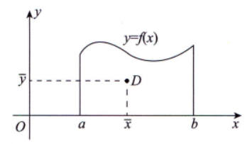
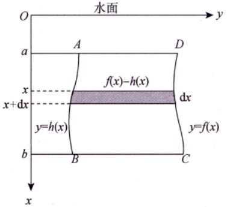

## 第四章 不定积分

### 不定积分的概念与性质

#### 核心概念

1. **原函数**：在区间$I$上，若可导函数$F(x)$满足$F'(x)=f(x)$或$dF(x)=f(x)dx$（对任一$x\in I$），则$F(x)$是$f(x)$（或$f(x)dx$）在区间$I$上的一个原函数。
2. **原函数存在定理**：
	1. 区间$I$上的连续函数一定存在原函数。
	2. <mark style="background:#d3f8b6">若 $f(x)$ 在区间 $I$ 上存在第一类间断点，则 $f(x)$ 在区间 $I$ 上不存在原函数</mark>
3. **原函数的性质**：
   - 若$f(x)$有一个原函数，则其有无限多个原函数；
   - 同一函数的任意两个原函数相差一个常数。
4. **不定积分**：区间$I$上，$f(x)$的带有任意常数项的原函数称为$f(x)$（或$f(x)dx$）的不定积分，记作$\int f(x)dx$。若$F(x)$是$f(x)$的一个原函数，则$\int f(x)dx=F(x)+C$（$C$为任意常数）。
5. **关键记号**：$\int$为积分号，$f(x)$为被积函数，$f(x)dx$为被积表达式，$x$为积分变量。

#### 微分与积分的关系（互逆运算）

1. $\frac{d}{dx}\left[\int f(x)dx\right]=f(x)$或$d\left[\int f(x)dx\right]=f(x)dx$；
2. $\int F'(x)dx=F(x)+C$或$\int dF(x)=F(x)+C$​。

> [!important]
>
> 注意：
> $$
> \colorbox{yellow}{$\int f(x)dx=\int_a^x f(t)dt + C$}\quad (积分下限a为被积区间上的任意一个常数)
> $$
> 

#### 基本积分表（必记）

1. $\int kdx=kx+C$（$k$是常数）；
2. $\int x^\mu dx=\frac{x^{\mu+1}}{\mu+1}+C$（$\mu\neq-1$）；
3. $\int \frac{dx}{x}=\ln|x|+C$；
4. $\int \frac{dx}{1+x^2}=\arctan x+C$；
5. $\int \frac{dx}{\sqrt{1-x^2}}=\arcsin x+C$；
6. $\int \cos xdx=\sin x+C$；
7. $\int \sin xdx=-\cos x+C$；
8. $\int \sec^2 xdx=\tan x+C$；
9. $\int \csc^2 xdx=-\cot x+C$；
10. $\int \sec x\tan xdx=\sec x+C$；
11. $\int \csc x\cot xdx=-\csc x+C$；
12. $\int e^xdx=e^x+C$；
13. $\int a^xdx=\frac{a^x}{\ln a}+C$。

#### 不定积分的性质

1. 若$f(x)$、$g(x)$的原函数存在，则$\int[f(x)+g(x)]dx=\int f(x)dx+\int g(x)dx$（可推广到有限个函数）；
2. 若$f(x)$的原函数存在，$k$为非零常数，则$\int kf(x)dx=k\int f(x)dx$。

### 换元积分

#### 第一类换元

**定理1**  若 $\int f(u)\mathrm{d}u=F(u)+C$则
$$
\int f[\varphi(x)]\varphi'(x)\mathrm{d}x=\int f[\varphi(x)]\mathrm{d}\varphi(x)=F[\varphi(x)]+C
$$

#### 第二类换元

**定理2**   设 $x=\varphi(t)$ 是单调的、可导的函数，并且 $\varphi'(t)\neq0$
$$
\int f[\varphi(t)]\varphi'(t)\mathrm{d}t=F(t)+C,
$$

则
$$
\int f(x)\mathrm{d}x=\int f[\varphi(t)]\varphi'(t)\mathrm{d}t=F(t)+C=F[\varphi^{-1}(x)]+C,
$$

#### 积分表

14. $\boldsymbol{\int \tan x\,\text{d}x = -\ln|\cos x| + C}$

$
\begin{align*}
\int \tan x\,\text{d}x &= \int \frac{\sin x}{\cos x}\,\text{d}x \\
&\stackrel{u=\cos x}{=} \int \frac{-1}{u}\,\text{d}u \\
&= -\ln|u| + C \\
&= -\ln|\cos x| + C
\end{align*}
$

---

15. $\boldsymbol{\int \cot x\,\text{d}x = \ln|\sin x| + C}$

$
\begin{align*}
\int \cot x\,\text{d}x &= \int \frac{\cos x}{\sin x}\,\text{d}x \\
&\stackrel{u=\sin x}{=} \int \frac{1}{u}\,\text{d}u \\
&= \ln|u| + C \\
&= \ln|\sin x| + C
\end{align*}
$

---

16. $\boldsymbol{\int \sec x\,\text{d}x = \ln|\sec x + \tan x| + C}$

$
\begin{align*}
\int \sec x\,\text{d}x &= \int \frac{\sec x(\sec x + \tan x)}{\sec x + \tan x}\,\text{d}x \\
&\stackrel{u=\sec x + \tan x}{=} \int \frac{1}{u}\,\text{d}u \\
&= \ln|u| + C \\
&= \ln|\sec x + \tan x| + C
\end{align*}
$​

$\begin{align*}
\int \sec x \, dx &= \int \frac{1}{\cos x} \, dx \\
&= \int \frac{1}{\cos^2\frac{x}{2} - \sin^2\frac{x}{2}} \, dx \\
&= \int \frac{1}{(1 - \tan^2\frac{x}{2})\cos^2\frac{x}{2}} \, dx \\
&= \int \frac{\sec^2\frac{x}{2}}{1 - \tan^2\frac{x}{2}} \, dx\\&\stackrel{u=\frac{x}{2}}{=}\int \frac{2}{1 - u^2} \, du \\
&= \int \left( \frac{1}{1 + u} + \frac{1}{1 - u} \right) du \\
&= \ln|1 + u| - \ln|1 - u| + C \\
&= \ln\left| \frac{1 + u}{1 - u} \right| + C \\
&= \ln\left| \frac{1 + \tan\frac{x}{2}}{1 - \tan\frac{x}{2}} \right| + C \\
&= \ln\left| \tan\left( \frac{x}{2} + \frac{\pi}{4} \right) \right| + C\end{align*}$

---

17. $\boldsymbol{\int \csc x\,\text{d}x = -\ln|\csc x + \cot x| + C}$

$$
\begin{align*}
\int \csc x\,\text{d}x &= \int \frac{\csc x(\csc x + \cot x)}{\csc x + \cot x}\,\text{d}x \\
&\stackrel{u=\csc x + \cot x}{=} \int \frac{-1}{u}\,\text{d}u \\
&= -\ln|u| + C \\
&= -\ln|\csc x + \cot x| + C
\end{align*}
$$

$$
\begin{align*}
\int \csc x\,\text{d}x &=\int \frac{1}{sin\,x}\text{d}x \\&= \int \frac{1}{2sin\frac{x}{2}cos\frac{x}{2}}\,\text{d}x \\&=\int\frac{1}{2tan\frac{x}{2}(cos\frac{x}{2})^2}\,\text{d}x\\&=\int \frac{sec^2(\frac{x}{2})}{2tan\frac{x}{2}}\text{d}x\\
&\stackrel{u=\frac{x}{2}}{=} \int \frac{sec^2u}{tanu}\,\text{d}u \\
&= \int\frac{\text{d}(tanu)}{tanu} \\
&= \ln|tanu| + C\\&=\ln\left|tan\frac{x}{2}\right|+C\\ \end{align*}
$$

---

18. $\boldsymbol{\int \frac{\text{d}x}{a^2 + x^2} = \frac{1}{a}\arctan\frac{x}{a} + C}$

$$
\begin{align*}
\int \frac{\text{d}x}{a^2 + x^2} &= \frac{1}{a^2}\int \frac{\text{d}x}{1 + \left(\frac{x}{a}\right)^2} \\
&\stackrel{u=\frac{x}{a}}{=} \frac{1}{a}\int \frac{\text{d}u}{1 + u^2} \\
&= \frac{1}{a}\arctan u + C \\
&= \frac{1}{a}\arctan\frac{x}{a} + C
\end{align*}
$$

---

19. $\boldsymbol{\int \frac{\text{d}x}{x^2 - a^2} = \frac{1}{2a}\ln\left|\frac{x - a}{x + a}\right| + C}$

$$
\begin{align*}
\int \frac{\text{d}x}{x^2 - a^2} &= \frac{1}{2a}\int \left(\frac{1}{x - a} - \frac{1}{x + a}\right)\text{d}x \\
&= \frac{1}{2a}\left(\ln|x - a| - \ln|x + a|\right) + C \\
&= \frac{1}{2a}\ln\left|\frac{x - a}{x + a}\right| + C
\end{align*}
$$

---

20. $\boldsymbol{\int \frac{\text{d}x}{\sqrt{a^2 - x^2}} = \arcsin\frac{x}{a} + C}$

$$
\begin{align*}
\int \frac{\text{d}x}{\sqrt{a^2 - x^2}} &= \frac{1}{a}\int \frac{\text{d}x}{\sqrt{1 - \left(\frac{x}{a}\right)^2}} \\
&\stackrel{u=\frac{x}{a}}{=} \int \frac{\text{d}u}{\sqrt{1 - u^2}} \\
&= \arcsin u + C \\
&= \arcsin\frac{x}{a} + C
\end{align*}
$$

---

21. $\boldsymbol{\int \frac{\text{d}x}{\sqrt{x^2 + a^2}} = \ln\left(x + \sqrt{x^2 + a^2}\right) + C}$

$$
\begin{align*}
\int \frac{\text{d}x}{\sqrt{x^2 + a^2}} &\stackrel{x=a\tan t}{=} \int \frac{a\sec^2 t}{a\sec t}\,\text{d}t \\
&= \int \sec t\,\text{d}t \\
&= \ln|\sec t + \tan t| + C \\
&= \ln\left(x + \sqrt{x^2 + a^2}\right) + C
\end{align*}
$$

---

22. $\boldsymbol{\int \frac{\text{d}x}{\sqrt{x^2 - a^2}} = \ln\left|x + \sqrt{x^2 - a^2}\right| + C}$

$$
\begin{align*}
\int \frac{\text{d}x}{\sqrt{x^2 - a^2}} &\stackrel{x=a\sec t}{=} \int \frac{a\sec t\tan t}{a\tan t}\,\text{d}t \\
&= \int \sec t\,\text{d}t \\
&= \ln|\sec t + \tan t| + C \\
&= \ln\left|x + \sqrt{x^2 - a^2}\right| + C
\end{align*}
$$

---

### 分部积分法

设 $u(x),v(x)$ 有连续一阶导数，则
$$
\boxed{\int u\mathrm{d}v = uv - \int v\mathrm{d}u}
$$

> [!note]
>
> 1. 适用场景
>    - 适用两类不同函数相乘的积分。
>
> 2. 典型适用积分类型
>
>    - 幂函数与指数函数相乘：$\int x^n e^x \mathrm{d}x$
>
>    - 幂函数与三角函数相乘：$\int x^n \sin x \mathrm{d}x$、$\int x^n \cos x \mathrm{d}x$
>
>    - 幂函数与对数函数/反三角函数相乘：$\int x^n \ln x \mathrm{d}x$、$\int x^n \arctan x \mathrm{d}x$、$\int x^n \arcsin x \mathrm{d}x$
>
>    - 指数函数与三角函数相乘：$\int e^x \sin x \mathrm{d}x$、$\int e^x \cos x \mathrm{d}x$
>
>
> 3. 选择$u$的优先级：**反三角函数** > **对数函数** > **幂函数** > **指数函数** > **三角函数**

#### 原函数

如果函数 $F(x)$ 的导数恰好是 $f(x)$，也就是：

$$
F'(x) = f(x)
$$
那么我们就称 $F(x)$ 是 $f(x)$ 的一个**原函数**；那么便有 $F(x)=\int f(x)dx$
>[!important] 分段函数的原函数
>1. 若分段函数在 分段点连续，则该分段函数存在原函数：
>	1. 计算每段的不定积分，注意加常数
>	2. 根据“可导函数必连续”，使用一个段的常数 $C_1$ 表示另一个段的常数 $C_2$
>2. 若分段函数在分段点不连续，则该分段函数不存在原函数

### 有理函数的积分

#### 核心概念

1. **有理函数定义**：两个无公因式多项式的商$\frac{P(x)}{Q(x)}$，分两类：
   - 真分式：分子次数 < 分母次数
   - 假分式：分子次数 ≥ 分母次数
2. 假分式化简：通过多项式除法，化为“多项式 + 真分式”（例：$\frac{2x^4+x^2+3}{x^2+1}=2x^2-1+\frac{4}{x^2+1}$）

#### 真分式的积分步骤

1. **分母因式分解**：分解为无公因式的多项式乘积，最终形式为$(x-a)^k$或$(x^2+px+q)^l$（$p^2-4q<0$）
2. **拆分为部分分式**：
   - 对应$(x-a)^k$：$\frac{A_1}{x-a}+\frac{A_2}{(x-a)^2}+\dots+\frac{A_k}{(x-a)^k}$
   - 对应$(x^2+px+q)^l$：$\frac{B_1x+C_1}{x^2+px+q}+\dots+\frac{B_lx+C_l}{(x^2+px+q)^l}$
3. **确定待定系数**：通分后比较两端同次幂系数，解方程组
4. **逐项积分**：多项式积分直接计算，两类分式积分参考基本公式

#### 可化为有理函数的积分

##### 三角函数有理式积分

- 万能代换：设$u=\tan\frac{x}{2}$（$-\pi<x<\pi$），则：
  - $\sin x=\frac{2u}{1+u^2}$，$\cos x=\frac{1-u^2}{1+u^2}$，$dx=\frac{2}{1+u^2}du$
- 代入后化为有理函数积分，适用于所有三角函数有理式

##### 含根式的积分

- 单根式$\sqrt[n]{ax+b}$：设$u=\sqrt[n]{ax+b}$，则$x=\frac{u^n-b}{a}$，$dx=n u^{n-1}\cdot\frac{1}{a}du$
- 多根式（如$\sqrt{x}$与$\sqrt[3]{x}$）：设$x=u^k$（$k$为各根指数的最小公倍数）
- 分式根式$\sqrt[n]{\frac{ax+b}{cx+d}}$：设$u=\sqrt[n]{\frac{ax+b}{cx+d}}$，转化为有理函数

>[!example]- **例题：**
>
> (1).$
> \int \frac{dx}{\sqrt[3]{(x+1)^2(x-1)^4}}
>$
> 
>**步骤** 1：整理被积函数
> 
>先把分母的根式拆成幂次形式：
> $$
> \sqrt[3]{(x+1)^2(x-1)^4} = (x+1)^{\frac{2}{3}} (x-1)^{\frac{4}{3}}
> $$
> 
> $$
> = (x+1)^{\frac{2}{3}} (x-1)^{\frac{2}{3}} \cdot (x-1)^{\frac{2}{3}}
> $$
> 
> $
> = \left[(x+1)(x-1)\right]^{\frac{2}{3}} \cdot (x-1)^{\frac{2}{3}}
> $
> $
> = \left(\frac{x-1}{x+1}\right)^{\frac{2}{3}} \cdot (x+1)^2
> $
> 因此
> $
> \frac{1}{\sqrt[3]{(x+1)^2(x-1)^4}} = \frac{1}{(x+1)^2} \left(\frac{x+1}{x-1}\right)^{\frac{2}{3}}
> $
>
> **步骤** 2：换元
>
> 令 $t = \frac{x-1}{x+1}$，则
> $
> dt = \frac{(x+1) - (x-1)}{(x+1)^2} dx = \frac{2}{(x+1)^2} dx
> $
> $
> \frac{dx}{(x+1)^2} = \frac{1}{2} dt
> $
> 且 $\frac{x+1}{x-1} = \frac{1}{t}$，代入积分式：
> $
> \int \left(\frac{1}{t}\right)^{\frac{2}{3}} \cdot \frac{1}{2} dt = \frac{1}{2} \int t^{-\frac{2}{3}} dt
> $
>
> **步骤** 3：积分
>
> $
> \frac{1}{2} \cdot \frac{t^{\frac{1}{3}}}{\frac{1}{3}} + C = \frac{3}{2} t^{\frac{1}{3}} + C
> $
>
> **步骤** 4：回代
>
> $
> t = \frac{x-1}{x+1}
> $
> $
> \int \frac{dx}{\sqrt[3]{(x+1)^2(x-1)^4}} = \frac{3}{2} \sqrt[3]{\frac{x-1}{x+1}} + C
> $
>
> ---
>
> (2).$
> \int \frac{dx}{2\sin x - \cos x + 5}
> $
>
> ---
>
> **步骤** 1：万能代换
>
> 令 $ t = \tan\frac{x}{2} $，则
> $
> \sin x = \frac{2t}{1+t^2},\quad \cos x = \frac{1-t^2}{1+t^2},\quad dx = \frac{2dt}{1+t^2}
> $
> 代入积分式：
> $
> \int \frac{\frac{2dt}{1+t^2}}{2\cdot\frac{2t}{1+t^2} - \frac{1-t^2}{1+t^2} + 5}
> $
>
> **步骤** 2：化简被积函数
>
> $
> 2\cdot\frac{2t}{1+t^2} - \frac{1-t^2}{1+t^2} + 5 = \frac{4t - (1-t^2) + 5(1+t^2)}{1+t^2}
> $
> $
> = \frac{4t - 1 + t^2 + 5 + 5t^2}{1+t^2} = \frac{6t^2 + 4t + 4}{1+t^2}
> $
> $
> \int \frac{\frac{2dt}{1+t^2}}{\frac{6t^2 + 4t + 4}{1+t^2}} = \int \frac{2dt}{6t^2 + 4t + 4} = \int \frac{dt}{3t^2 + 2t + 2}
> $
>
> **步骤** 3：配方
>
> $
> 3t^2 + 2t + 2 = 3\left(t^2 + \frac{2}{3}t\right) + 2 = 3\left[\left(t+\frac{1}{3}\right)^2 + \frac{5}{9}\right]
> $
> $
> = 3\left(t+\frac{1}{3}\right)^2 + \frac{5}{3}
> $
> $
> \int \frac{dt}{3\left(t+\frac{1}{3}\right)^2 + \frac{5}{3}} = \frac{1}{3}\int \frac{dt}{\left(t+\frac{1}{3}\right)^2 + \left(\frac{\sqrt{5}}{3}\right)^2}
> $
>
> **步骤** 4：标准积分
>
> $
> \int \frac{du}{u^2+a^2} = \frac{1}{a}\arctan\left(\frac{u}{a}\right) + C
> $
> 令 $ u = t+\frac{1}{3},\; a = \frac{\sqrt{5}}{3} $，则
> $
> \frac{1}{3}\cdot \frac{3}{\sqrt{5}} \arctan\left(\frac{3t+1}{\sqrt{5}}\right) + C = \frac{1}{\sqrt{5}} \arctan\left(\frac{3t+1}{\sqrt{5}}\right) + C
> $
>
> **步骤** 5：回代
>
> $
> t = \tan\frac{x}{2}
> $
> $
> \int \frac{dx}{2\sin x - \cos x + 5} = \frac{1}{\sqrt{5}} \arctan\left(\frac{3\tan\frac{x}{2}+1}{\sqrt{5}}\right) + C
> $
>
> ---
>
> （10）$\displaystyle \int \sqrt{\frac{a+x}{a-x}}\,dx\;(a>0)$
>
> 先化简被积函数：
> $
> \sqrt{\frac{a+x}{a-x}}=\frac{a+x}{\sqrt{a^2-x^2}}
> $
> 拆分为两项积分：
> $
> \int \frac{a}{\sqrt{a^2-x^2}}dx+\int \frac{x}{\sqrt{a^2-x^2}}dx
> $
>
> - 第一项：$\displaystyle \int \frac{a}{\sqrt{a^2-x^2}}dx=a\arcsin\frac{x}{a}+C_1$
> - 第二项：令 $u=a^2-x^2$，$du=-2x\,dx$，则
>   $
>   \int \frac{x}{\sqrt{a^2-x^2}}dx=-\frac12\int u^{-1/2}du=-\sqrt{a^2-x^2}+C_2
>   $
>   合并得：
>   $
>   \boldsymbol{a\arcsin\frac{x}{a}-\sqrt{a^2-x^2}+C}
>   $
>
> ---
>
> （15）$\displaystyle \int \frac{dx}{x^2\sqrt{x^2-1}}$
>
> 令 $x=\sec t$，$dx=\sec t\tan t\,dt$，$\sqrt{x^2-1}=\tan t$，则
> $
> \int \frac{\sec t\tan t}{\sec^2 t\tan t}dt=\int \cos t\,dt=\sin t+C
> $
> 由 $x=\sec t$ 得 $\cos t=\dfrac1x$，$\sin t=\dfrac{\sqrt{x^2-1}}{x}$，故
> $
> \boldsymbol{\frac{\sqrt{x^2-1}}{x}+C}
> $
>
> ---
>
> （17）$\displaystyle \int \frac{dx}{x^4\sqrt{1+x^2}}$
>
> 令 $x=\tan t$，$dx=\sec^2 t\,dt$，$\sqrt{1+x^2}=\sec t$，则
> $
> \int \frac{\sec^2 t}{\tan^4 t\sec t}dt=\int \frac{\cos^3 t}{\sin^4 t}dt
> $
> 令 $u=\sin t$，$du=\cos t\,dt$，则
> $
> \int \frac{1-u^2}{u^4}du=-\frac{1}{3u^3}+\frac{1}{u}+C
> $
> 由 $x=\tan t$ 得 $u=\dfrac{x}{\sqrt{1+x^2}}$，代入化简得：
> $
> \boldsymbol{\frac{(1+x^2)^{3/2}}{3x^3}-\frac{\sqrt{1+x^2}}{x}+C}
> $
>
> ---
>
> （20）$\displaystyle \int \frac{\sin^2 x}{\cos^3 x}dx$
>
> 先变形：
> $
> \frac{\sin^2 x}{\cos^3 x}=\frac{1-\cos^2 x}{\cos^3 x}=\sec^3 x-\sec x
> $
> 利用积分公式：
> $
> \int \sec^3 x\,dx=\frac12(\sec x\tan x+\ln|\sec x+\tan x|)
> $
> $
> \int \sec x\,dx=\ln|\sec x+\tan x|
> $
> 合并得：
> $
> \boldsymbol{\frac12\sec x\tan x-\frac12\ln|\sec x+\tan x|+C}
> $
>
> ---
>
> （23）$\displaystyle \int \frac{x^3}{(1+x^8)^2}dx$
>
> 令 $u=x^4$，$du=4x^3\,dx$，则
> $
> \int \frac{x^3}{(1+x^8)^2}dx=\frac14\int \frac{du}{(1+u^2)^2}
> $
> 再令 $u=\tan t$，$du=\sec^2 t\,dt$，则
> $
> \frac14\int \cos^2 t\,dt=\frac18\left(t+\frac12\sin2t\right)+C
> $
> 回代 $u=\tan t$ 与 $u=x^4$，得：
> $
> \boldsymbol{\frac18\arctan(x^4)+\frac{x^4}{8(1+x^8)}+C}
> $
>
> ---
>
> （27）$\displaystyle \int \frac{x+\sin x}{1+\cos x}dx$
>
> 拆分为两项：
> $
> \int \frac{x}{1+\cos x}dx+\int \frac{\sin x}{1+\cos x}dx
> $
>
> - 第二项：令 $u=1+\cos x$，$du=-\sin x\,dx$，则
>   $
>   \int \frac{\sin x}{1+\cos x}dx=-\ln|1+\cos x|+C_1
>   $
> - 第一项：用半角公式 $1+\cos x=2\cos^2\frac{x}{2}$，得
>   $
>   \int \frac{x}{2\cos^2\frac{x}{2}}dx=\frac12\int x\sec^2\frac{x}{2}dx
>   $
>   分部积分后得：
>   $
>   x\tan\frac{x}{2}+2\ln\left|\cos\frac{x}{2}\right|+C_2
>   $
>   合并化简得：
>   $
>   \boldsymbol{x\tan\frac{x}{2}-\ln|1+\cos x|+C}
>   $
>
> ---
>
> (31).$
> \int \frac{e^{3x}+e^x}{e^{4x}-e^{2x}+1}dx
> $
>
> 1.  **换元**
>     设 $t = e^x$，则 $dt = e^x dx$，$dx = \frac{dt}{t}$。
>      代入积分：
>      $
>      \int \frac{t^3 + t}{t^4 - t^2 + 1} \cdot \frac{dt}{t}
>      $
>      化简：
>      $
>      \int \frac{t^2 + 1}{t^4 - t^2 + 1} dt
>      $
>
> 2.  **分式变形**
>     分子分母同除以 $t^2$：
>      $
>      \int \frac{1 + \frac{1}{t^2}}{t^2 - 1 + \frac{1}{t^2}} dt
>      $
>      注意到：
>      $
>      t^2 + \frac{1}{t^2} = \left(t - \frac{1}{t}\right)^2 + 2
>      $
>      因此：
>      $
>      t^2 - 1 + \frac{1}{t^2} = \left(t - \frac{1}{t}\right)^2 + 1
>      $
>
> 3.  **再次换元**
>     令 $u = t - \frac{1}{t}$，则 $du = \left(1 + \frac{1}{t^2}\right) dt$。
>      积分化为：
>      $
>      \int \frac{du}{u^2 + 1}
>      $
>
> 4.  **积分与回代**
>     $
>      \int \frac{du}{u^2 + 1} = \arctan u + C
>      $
>      回代 $u = t - \frac{1}{t}$ 和 $t = e^x$：
>      $
>      \arctan\left(e^x - e^{-x}\right) + C
>      $

## 第五章 定积分

### 定积分的概念与性质

#### 定积分的基本定义

1. **定义表述**：

   设函数$f(x)$在$[a, b]$上有界，插入分点$a = x_0 < x_1 < \dots < x_n = b$，将$[a, b]$分为$n$个小区间，其长度为$\Delta x_i = x_i - x_{i-1}$，在每个小区间取$\xi_i$，作和式$S = \sum_{i=1}^n f(\xi_i)\Delta x_i$。若$\lambda = \max\{\Delta x_1, \dots, \Delta x_n\} \to 0$时，$S$的极限存在且与分法、$\xi_i$取法无关，则称该极限为$f(x)$在$[a, b]$上的定积分，记作$\int_a^b f(x)dx = \lim_{\lambda \to 0} \sum_{i=1}^n f(\xi_i)\Delta x_i$。

2. **核心要素**：

   被积函数$f(x)$、被积表达式$f(x)dx$、积分变量$x$（与记法无关，如$\int_a^b f(x)dx = \int_a^b f(t)dt$）、积分上下限$a, b$、积分区间$[a, b]$。

3. **可积条件/定积分存在的充分条件**：
   - 连续函数在区间上可积；
   - 有界且仅有有限个间断点(无穷间断点除外)的函数在区间上可积；
   - <mark style="background:#d3f8b6">只有有限个第一类间断点</mark>的函数在区间上可积。
3. **可积条件的必要条件**
	- <mark style="background:#d3f8b6">若 $\int_a^bf(x)$ 存在，则 $f(x)$ 在 \[a,b\] 上有界</mark>

> [!important]
>
> **定积分在极限中的应用**
>
> 当$n \to \infty$ 时，若求和式中出现形如$\boxed{\frac{i + c}{n}}$（c 为常数）的项，在极限过程中可近似为$\boxed{\frac{i}{n}}$，且对应的积分区间为 [0,1]，即：
> $$
> \colorbox{yellow}{$\lim_{n \to \infty} \sum_{i=1}^n f\left(\boxed{\frac{i + c}{n}}\right) \cdot \frac{1}{n} = \int_0^1 f(x) \, dx$}
> $$

#### 定积分的几何意义

- 当$f(x) \geq 0$时，$\int_a^b f(x)dx$表示曲边梯形的面积；
- 当$f(x) \leq 0$时，$\int_a^b f(x)dx$表示曲边梯形面积的负值；
- 当$f(x)$正负交替时，$\int_a^b f(x)dx$表示$x$轴上方图形面积与下方图形面积的差值。

#### 定积分的性质

1. **补充规定**：$\boxed{\int_a^a f(x)dx = 0}$；$\boxed{\int_a^b f(x)dx = -\int_b^a f(x)dx}$。

2. **线性性质**：$\boxed{\int_a^b [\alpha f(x) + \beta g(x)]dx = \alpha \int_a^b f(x)dx + \beta \int_a^b g(x)dx}$（$\alpha, \beta$为常数），可推广到有限个函数的线性组合。

3. **区间可加性**：不论$a, b, c$位置如何，$\boxed{\int_a^b f(x)dx = \int_a^c f(x)dx + \int_c^b f(x)dx}$。

4. **特殊函数积分**：若$f(x) \equiv 1$，则$\int_a^b 1dx = b - a$。

5. **不等式性质**：

   - 保号性：若$f(x) \geq 0$（$a < b$），则$\int_a^b f(x)dx \geq 0$；
   - 保号性：若$f(x) \leq g(x)$（$a < b$），则$\int_a^b f(x)dx \leq \int_a^b g(x)dx$；
   - 推论1：$\boxed{\left|\int_a^b f(x)dx\right| \leq \int_a^b |f(x)|dx}$（$a < b$​）。
   - 推论2：$\boxed{\left| \int_a^b f(x)g(x) \, dx \right| \leq \int_a^b |f(x)||g(x)| \, dx \leq M \int_a^b |f(x)| \, dx}$($g(x)$在$[a,b]$上连续，且$M$为$|g(x)|$在$[a,b]$上最大值)

6. **估值不等式**：设$m, M$为$f(x)$在$[a, b]$上的最小值和最大值（$a < b$），则$\boxed{m(b - a) \leq \int_a^b f(x)dx \leq M(b - a)}$。

7. **积分中值定理**：若$f(x)$在$[a, b]$上连续，则存在$\xi \in [a, b]$，使得$\boxed{\int_a^b f(x)dx = f(\xi)(b - a)}$。其中$f(\xi) = \frac{1}{b - a}\int_a^b f(x)dx$，称为$f(x)$在$[a, b]$​上的平均值。

   **广义积分中值定理**：若$f(x)$在$[a, b]$上连续，且$g(x)$在$[a,b]$上**不变号**，则存在$\xi \in [a, b]$，使得$\boxed{\int_a^bf(x)g(x)dx=f(\xi)\int_a^bg(x)dx}$

> [!caution]
>
> #### 等式
>
> 1. 分部积分：$\begin{aligned} f(x), \, f'(x), \, f''(x) &\implies \int_{a}^{b} f(x) \, dx \\ &= \left. x f(x) \right|_{a}^{b} - \int_{a}^{b} x f'(x) \, dx \\ &= \left. x f(x) \right|_{a}^{b} - \frac{1}{2} \int_{a}^{b} f'(x) \, d(x^2) \\ &= \left. x f(x) \right|_{a}^{b} - \frac{1}{2} \left. x^2 f'(x) \right|_{a}^{b} + \frac{1}{2} \int_{a}^{b} x^2 f''(x) \, dx \end{aligned}$
> 2. $f(a)-f(b)=\begin{cases}f'(\xi)(a-b)\quad \text{拉格朗日中值定理，其中}\;\xi\;\text{介于}a,b\text{之间}\\\int_a^bf'(x)dx\end{cases}$​
> 3. 泰勒展开：$\int_a^bf(x)dx=\int_a^b\left[f(x_0)+f'(x_0)(x-x_0)+\frac{f''(x_0)}{2!}(x-x_0)^2+\dots+\frac{f^{(n)}(x_0)}{n!}(x-x_0)^n\right]dx$​
> 4. 变上限函数求导：$(\int_x^{x+a}f(t)dt)'=f(x+a)-f(x)$.
>
> #### 不等式
>
> 1. 分部积分与三角不等式：$\left|\int_a^b u\,dv\right|=\left|uv|_a^b-\int_a^b v\,du\right|\leq\left|uv|_a^b\right|+\left|\int_a^b u\,dv\right|\leq\left|uv|_a^b\right|+\int_a^b \left|u\right|\,dv$​
>
> 2. $\left|\int_a^bf(x)dx\right|\leq\int_a^b\left|f(x)\right|dx$​
>
> 3. 区间可加与三角不等式：
>
$\left|\int_a^b f(x)\,dx\right|\le\left|\int_a^t f(x)\,dx+\int_t^b f(x)\,dx\right|\le\left|\int_a^t f(x)\,dx\right|+\left|\int_t^b f(x)\,dx\right|$.
>
> 4. 泰勒展开与三角不等式：$\left|f(x)\right|=\left|f(x_0)+f'(x_0)(x-x_0)+\frac{f''(\xi)}{2!}(x-x_0)^2\right|\leq\left|f(x_0)\right|+\left|f'(x_0)(x-x_0)\right|+\left|\frac{f''(\xi)}{2!}(x-x_0)^2\right|$​
>

### 微积分基本公式

#### 积分上限的函数及其导数

设 $f(x)$ 在 $[a,b]$ 上连续，**积分上限的函数**：$$\Phi(x)=\int_{a}^{x} f(t)\,\text{d}t \quad x\in[a,b]$$

**定理**1

设 $f(x)$ 在 $[a,b]$ 上连续，则 $\int_{a}^{x} f(t)\,\text{d}t$ 在 $[a,b]$上满足
$$
\boxed{\left(\int_{a}^{x} f(t)\,\text{d}t\right)' = f(x).}
$$
**一般的**：若 $\varphi(x),\psi(x)$ 可导，$f(x)$ 连续，则
$$
\boxed{\frac{d}{dx}\int_{\psi(x)}^{\varphi(x)} f(t)\,\text{d}t
= f\big(\varphi(x)\big)\varphi'(x) - f\big(\psi(x)\big)\psi'(x)}
$$

>[!note] **[证]**
> 根据积分中值定理，$x\in(a,b)$​，
> $$
> \begin{align*}
> \frac{\Phi(x+\Delta x)-\Phi(x)}{\Delta x}
>  &= \frac{\int_{a}^{x+\Delta x} f(t)\,\text{d}t - \int_{a}^{x} f(t)\,\text{d}t}{\Delta x} \\
>  &= \frac{\Delta x \cdot f(\xi)}{\Delta x} = f(\xi)
>  \end{align*}
> $$
> 

**定理**2

设 f(x) 在 \[a,b\] 上<mark style="background:#d3f8b6">连续</mark>，则 $\int_{a}^{x} f(t)\,\text{d}t$ 是 f(x) 在 \[a,b\]上的一个原函数.

>[!important] 变上限积分函数的性质
>1. 连续性：若 f(x) 在 \[a,b\] 上可积，则 $\int_a^xf(t)dt$ 连续
>2. 可导性：若 f(x) 在 \[a,b\] 上除点 $x_0\in(a,b)$ 外均连续，则在点 $x = x_0$ 处 
>	1. $f(x)$ 在 $x_0$ 连续 -> $F(x)=\int_a^xf(t)dt$ 可导，且 $F'(x_0)=f(x_0)$
>	2. $x_0$ 为 f(x) 的可去间断点 -> $F(x)=\int_a^xf(t)dt$ 可导，且 $F(x_0)=\lim_{x\to x_0}f(x)$
>	3. $x_0$ 为 f(x) 的跳跃间断点 -> $F(x)=\int_a^xf(x)dt$ 连续但不可导，且 $F'_{-}(x_0)=f(x_0^-),F'_{+}(x_0)=f(x_0^+)$

#### 牛顿—莱布尼兹公式

**定理**3（**Newton-Leibniz**公式）

设 F(x) 为连续函数 f(x) 在 \[a,b\] 上的一个原函数，则

$\int_{a}^{b} f(x)\,\text{d}x = F(b) - F(a)$

>[!note] 
>$$
>\begin{align*}
> \int_{a}^{b} f(x)\,\text{d}x = \underbrace{\int_{a}^{b} f(x)\,\text{d}x = f(\xi)(b-a)}_{\text{积分中值定理}} = \underbrace{F'(\xi)(b-a) = F(b) - F(a)}_{\text{微分中值定理}}
> \newline\text{整体关系：牛顿--莱布尼茨公式}
> \end{align*}
>$$

### 定积分的换元法和分部积分法

#### 定积分换元法

- **核心公式**：若$f(x)$在$[a,b]$连续，$x=\varphi(t)$满足$\varphi(\alpha)=a$、$\varphi(\beta)=b$，且$\varphi(t)$在$[\alpha,\beta]$（或$[\beta,\alpha]$）有连续导数，值域含$[a,b]$，则$$\colorbox{yellow}{$\int_{a}^{b} f(x)dx = \int_{\alpha}^{\beta} f[\varphi(t)]\varphi'(t)dt$}$$。
- **反向应用**：令$t=\varphi(x)$，则$\int_{a}^{b} f[\varphi(x)]\varphi'(x)dx = \int_{\varphi(a)}^{\varphi(b)} f(t)dt$，可简化被积函数。
- **核心作用**：处理含根号、三角函数、复合函数的积分，或利用奇偶性、周期性简化计算。

#### 定积分分部积分法

- **核心公式**：$$\colorbox{yellow}{$\int_{a}^{b} udv = [uv]_{a}^{b} - \int_{a}^{b} vdu$}$$（或$\int_{a}^{b} uv'dx = [uv]_{a}^{b} - \int_{a}^{b} vu'dx$）。
- **核心作用**：处理反三角函数、对数函数与多项式、指数函数的乘积类积分，或推导递推公式。

#### 常用结论（简化计算）

- **奇偶性**：若$f(x)$在$[-a,a]$连续，偶函数则$$\colorbox{yellow}{$\int_{-a}^{a} f(x)dx = 2\int_{0}^{a} f(x)dx$}$$奇函数则积分值为$\colorbox{yellow}{0}$。[奇零偶倍]

- **三角函数对称性质**：$$\colorbox{yellow}{$\int_{0}^{\frac{\pi}{2}} f(\sin x)dx = \int_{0}^{\frac{\pi}{2}} f(\cos x)dx$}$$$$\colorbox{yellow}{$\int_{0}^{\pi} xf(\sin x)dx = \frac{\pi}{2}\int_{0}^{\pi} f(\sin x)dx$}$$。

- **周期性**：周期为$T$的连续函数，$$\colorbox{yellow}{$\int_{a}^{a+T} f(x)dx = \int_{0}^{T} f(x)dx$}$$$$\colorbox{yellow}{$\int_{0}^{nT} f(x)dx = n\int_{0}^{T} f(x)dx$}$$（$n\in N$）。

- **点火公式**（Wallis公式）

  设 $$\colorbox{yellow}{$I_n = \int_{0}^{\frac{\pi}{2}} \sin^n x dx = \int_{0}^{\frac{\pi}{2}} \cos^n x dx$}$$核心公式如下：

  - 当 $n=2m$（$m\in N^+$，正偶数）：
    $\boxed{I_{2m} = \frac{2m-1}{2m} \cdot \frac{2m-3}{2m-2} \cdot \cdots \cdot \frac{3}{4} \cdot \frac{1}{2} \cdot \boxed{\frac{\pi}{2}}}$
  - 当 $n=2m+1$（$m\in N^+$，大于1的正奇数）：
    $\boxed{I_{2m+1} = \frac{2m}{2m+1} \cdot \frac{2m-2}{2m-1} \cdot \cdots \cdot \frac{4}{5} \cdot \frac{2}{3}}$

+ **区间再现**
	+ 一般地，<mark style="background:#40a9ff">$\int_a^bf(x)dx\xlongequal{x=a+b-t}\int_a^bf(a+b-t)dt$</mark>

### 反常积分

#### 反常积分的定义

反常积分是定积分的推广，分为无穷限的反常积分和无界函数的反常积分（瑕积分）两类。
#### 反常积分的敛散性
^bdf43b
##### 无穷区间上的反常积分

**定理**1 比较审敛法 

设 $f(x),g(x)$ 在 $[a,+\infty]$ 上连续，且$0\le f(x)\le g(x)$，则

- 当 $\int_a^{+\infty}g(x)dx$ 收敛时，$\int_a^{+\infty}f(x)dx$ 收敛。
- 当 $\int_a^{+\infty}f(x)dx$ 发散时，$\int_a^{+\infty}g(x)dx$ 发散。

**定理**2 比较审敛法的极限形式

设 $f(x),g(x)$ 在 $[a,+\infty)$ 上非负连续，且 $\lim\limits_{x \to +\infty} \frac{f(x)}{g(x)} = \lambda$（有限或无穷），则

1.  当 $\lambda \neq 0$ 时，$\int_{a}^{+\infty} f(x)\mathrm{d}x$ 与 $\int_{a}^{+\infty} g(x)\mathrm{d}x$ 同敛散。
2.  当 $\lambda = 0$ 时，若 $\int_{a}^{+\infty} g(x)\mathrm{d}x$ 收敛，则 $\int_{a}^{+\infty} f(x)\mathrm{d}x$ 也收敛。
3.  当 $\lambda = +\infty$ 时，若 $\int_{a}^{+\infty} g(x)\mathrm{d}x$ 发散，则 $\int_{a}^{+\infty} f(x)\mathrm{d}x$ 也发散。

**常用结论**：
$$
\boxed{\int_{a}^{+\infty} \frac{1}{x^p}\mathrm{d}x
\begin{cases}
p > 1, & \text{收敛}, \\
p \leqslant 1, & \text{发散},
\end{cases}} \quad (a > 0).
$$

##### 瑕积分的反常积分

**定理 1（比较判别法）**

设 $f(x),g(x)$ 在 $(a,b]$ 上连续，且 $0 \leqslant f(x) \leqslant g(x)$，$x=a$ 为 $f(x)$ 和 $g(x)$ 的瑕点，则

1.  当 $\int_{a}^{b} g(x)\mathrm{d}x$ 收敛时，$\int_{a}^{b} f(x)\mathrm{d}x$ 收敛。
2.  当 $\int_{a}^{b} f(x)\mathrm{d}x$ 发散时，$\int_{a}^{b} g(x)\mathrm{d}x$ 发散。

**定理 2（比较判别法的极限形式）**

设 $f(x),g(x)$ 在 $(a,b]$ 上非负连续，且 $\lim\limits_{x \to a^+} \frac{f(x)}{g(x)} = \lambda$（有限或无穷），则

1.  当 $\lambda \neq 0$ 时，$\int_{a}^{b} f(x)\mathrm{d}x$ 与 $\int_{a}^{b} g(x)\mathrm{d}x$ 同敛散。
2.  当 $\lambda = 0$ 时，若 $\int_{a}^{b} g(x)\mathrm{d}x$ 收敛，则 $\int_{a}^{b} f(x)\mathrm{d}x$ 也收敛。
3.  当 $\lambda = +\infty$ 时，若 $\int_{a}^{b} g(x)\mathrm{d}x$ 发散，则 $\int_{a}^{b} f(x)\mathrm{d}x$ 也发散。

**常用结论**：
$$
\boxed{\int_{a}^{b} \frac{1}{(x-a)^p}\mathrm{d}x
\begin{cases}
p < 1, & \text{收敛}, \\
p \geqslant 1, & \text{发散}.
\end{cases}}
$$
$$
\boxed{\int_{a}^{b} \frac{1}{(b-x)^p}\mathrm{d}x
\begin{cases}
p < 1, & \text{收敛}, \\
p \geqslant 1, & \text{发散}.
\end{cases}}
$$

>[!important] 含有 lnx 的反常积分敛散性
>形如 $\boxed{\int_a^{+\infty}\frac{1}{x^r\;(lnx)^q}}\;(a>0)$
>1. 当 r>1 时，无论 q 取何值，积分收敛
>2. 当 r=1 时，需要 q>1，此时积分收敛
>3. 当 r<1 时，积分发散

### 定积分的应用

#### 平面图形的面积

按边界方程的表示方式分类：

1. 直角坐标方程
   $\int_a^b f(x)dx$

2. 参数方程
$\begin{cases}x=\varphi(t)\\y=\psi(t)\end{cases}$ $\overset{代入}{\rightarrow}$ $\int_a^by(x)dx$

3. 极坐标方程
   $\frac{1}{2}\int_{\alpha}^{\beta}\rho^2(\theta)d\theta$​

#### 平面图像的质心/形心

设平面区域 $D = \{(x,y)|0 \le y \le f(x), a \le x \le b\}$，$y = f(x)$ 在 $[a,b]$ 上连续，如下图所示。现推导 $D$ 的形心坐标 $\bar{x}, \bar{y}$ 的计算公式：
$$
\boxed{\bar{x} = \frac{\iint\limits_D x \, d\sigma}{\iint\limits_D d\sigma}}
= \frac{\int_a^b \, dx \int_0^{f(x)} x \, dy}{\int_a^b \, dx \int_0^{f(x)} dy}
= \frac{\int_a^b x f(x) \, dx}{\int_a^b f(x) \, dx};
$$

$$
\boxed{\bar{y} = \frac{\iint\limits_D y \, d\sigma}{\iint\limits_D d\sigma}}
= \frac{\int_a^b \, dx \int_0^{f(x)} y \, dy}{\int_a^b \, dx \int_0^{f(x)} dy}
= \frac{\frac{1}{2} \int_a^b f^2(x) \, dx}{\int_a^b f(x) \, dx}.
$$

#### 旋转体的体积

曲线 $y=f(x)$

1. 绕$x$轴旋转

   $V_x=\pi\int_a^bf^2(x)dx$

   **圆盘法（切片法）**

   - 把旋转体想象成无数个垂直于 $x$ 轴的薄圆盘堆叠而成。
   - 每个圆盘的半径就是曲线的纵坐标 $f(x)$，厚度是 $dx$.
   - 单个圆盘的体积近似为 $\pi\left[f(x)\right]^2dx$.
   - 把这些薄圆盘的体积在 $\left[a,b\right]$ 上积分，就得到整个旋转体的体积。

2. 绕$y$轴旋转

   $V_y=2\pi\int_a^bxf(x)dx$

   **圆柱壳法（壳层法）**

   - 把旋转体想象成无数个同轴圆柱薄壳套在一起。
   - 每个薄壳的高度是 $f(x)$，半径是$x$，厚度是$dx$。
   - 单个薄壳的体积近似为 $2\pi\cdot\text{半径}\cdot\text{高度}\cdot\text{厚度}=2\pi xf(x)dx$。
   - 把这些薄壳的体积在 $\left[a,b\right]$​ 上积分，就得到整个旋转体的体积。

曲线 $r=\rho(\theta)$

1. 绕极轴/$x$轴旋转
   $$\colorbox{yellow}{$V_x=\int_{\alpha}^{\beta}\frac{2\pi}{3}\rho^3(\theta)\sin(\theta)d\theta$}$$
2. 绕$\theta=\frac{\pi}{2}$/$y$轴旋转
   $$\colorbox{yellow}{$V_y=\int_{\alpha}^{\beta}\frac{2\pi}{3}\rho^3(\theta)\cos(\theta)d\theta$}$$

#### 旋转体的侧面积

##### 直角坐标形式（最常用）

设曲线为 $y = f(x)\ (a \le x \le b)$ 或 $x = g(y)\ (c \le y \le d)$

1. 绕 $x$ 轴旋转

$$
\colorbox{yellow}{$S_x = 2\pi \int_{a}^{b} |y| \cdot ds = 2\pi \int_{a}^{b} |f(x)| \cdot \sqrt{1 + [f'(x)]^2} dx$}
$$

$|y|$ 表示点到 $x$ 轴的距离（极径非负，加绝对值避免符号错误）。

2. 绕 $y$ 轴旋转

**法 1：以 $x$ 为积分变量（直接法，推荐）**
$$
\colorbox{yellow}{$S_y = 2\pi \int_{a}^{b} |x| \cdot ds = 2\pi \int_{a}^{b} |x| \cdot \sqrt{1 + [f'(x)]^2} dx$}
$$

**法 2：以 $y$ 为积分变量（反函数法）**
$$
S_y = 2\pi \int_{c}^{d} |x| \cdot ds = 2\pi \int_{c}^{d} |g(y)| \cdot \sqrt{1 + [g'(y)]^2} dy
$$

##### 参数方程形式（曲线由参数方程表示时用）

设曲线的参数方程为
$$
\begin{cases}
x = \varphi(t) \\
y = \psi(t)
\end{cases}
\quad (\alpha \le t \le \beta),
$$
其中 $\varphi'(t)$、$\psi'(t)$ 连续可导。

1. 绕 $x$ 轴旋转

$$
\colorbox{yellow}{$S_x = 2\pi \int_{\alpha}^{\beta} |\psi(t)| \cdot \sqrt{[\varphi'(t)]^2 + [\psi'(t)]^2} dt$}
$$

  2. 绕 $y$ 轴旋转

$$
\colorbox{yellow}{$S_y = 2\pi \int_{\alpha}^{\beta} |\varphi(t)| \cdot \sqrt{[\varphi'(t)]^2 + [\psi'(t)]^2} dt$}
$$

##### 极坐标形式（曲线由极坐标表示时用，无单独公式，转参数方程）

设曲线的极坐标方程为 $\rho = \rho(\theta)\ (\theta_1 \le \theta \le \theta_2)$，先转化为极坐标下的参数方程（以 $\theta$ 为参数）：
$$
\colorbox{yellow}{$
\begin{cases}
x = \rho(\theta)\cos\theta \\
y = \rho(\theta)\sin\theta
\end{cases}
\quad (\theta_1 \le \theta \le \theta_2)$}
$$
再将上述参数方程代入参数方程的侧面积公式计算即可。

#### 平行截面面积已知的立体的体积

$V=\int_a^bS(x)dx$

#### 平面曲线的弧长

弧微分：$\boldsymbol{d s=\sqrt{(\mathrm{d} x)^{2}+(\mathrm{d} y)^{2}}}$
**注意**：求弧长时积分上下限必须上大下小

1) $C:y=y(x),\ a \leq x \leq b$.
   $s=\int_{a}^{b} \sqrt{1+y^{\prime 2}} d x$

2) $C:\begin{cases}x=x(t)\\y=y(t)\end{cases},\ \alpha \leq t \leq \beta$.
   $s=\int_{\alpha}^{\beta} \sqrt{x^{\prime 2}+y^{\prime 2}} d t$

3) $C:\rho=\rho(\theta),\ \alpha \leq \theta \leq \beta$.
   $s=\int_{\alpha}^{\beta} \sqrt{\rho^{2}+\rho^{\prime 2}} d \theta$

#### 静水压力

注：静水压力在某点处是处处相等的。

垂直浸没在水中的平板 $ABCD$（见下图）的一侧受到的水压力为
$$
\colorbox{yellow}{$P = \rho g \int_{a}^{b} x\left[f(x)-h(x)\right]\mathrm{d}x$},
$$
其中 $\rho$ 为水的密度，$g$ 为重力加速度。

压力微元 $\mathrm{d}P = \rho g x\left[f(x)-h(x)\right]\mathrm{d}x$，即图中矩形条所受到的压力。$x$ 表示水深，$f(x)-h(x)$ 是矩形条的宽度，$\mathrm{d}x$ 是矩形条的高度。

>[!important] 从 二重积分 的角度解释
>1. 平面区域面积：$S=\iint_D\ 1\ d\sigma$
>2. 旋转体的体积：<mark style="background:#40a9ff">$V=2\pi\iint_Dr(x,y)d\sigma$</mark>,其中 $r(x,y)$ 表示 $(x,y)$ 到直线$L$的距离，$r(x,y)=\frac{|Ax+By+C|}{\sqrt{A^2+B^2}}$
>3. 旋转体的侧面积：$S=2\pi\int_a^by\sqrt{1+y'^2}dx$
>4. 弧长公式：$ds = \sqrt{(dx)^2+(dy)^2},s=\int_a^b\sqrt{1+y'^2}dx$
>5. 静水压力：$F=\rho g\iint_Dh(y)dy$

## 第八章 二重积分

$$\iint_{(\sigma)} f(x,y) \, d\sigma$$

### 二重积分的计算

#### 利用直角坐标计算二重积分
##### （1）$X$ 型区域：
$$(\sigma) = \{(x,y) \mid a \leq x \leq b,\, y_1(x) \leq y \leq y_2(x)\}$$
截面面积：$S(x) = \int_{y_1(x)}^{y_2(x)} f(x,y) \, dy.$

截面面积已知的体积：$V = \int_{a}^{b} S(x) \, dx= \int_{a}^{b} \left[ \int_{y_1(x)}^{y_2(x)} f(x,y) \, dy \right] dx$

$$\colorbox{yellow}{$\iint_{(\sigma)} f(x,y) \, d\sigma = \int_{a}^{b} \left[ \int_{y_1(x)}^{y_2(x)} f(x,y) \, dy \right] dx$}$$

称为累次积分，或称二次积分

$$\int_{a}^{b} dx \int_{y_1(x)}^{y_2(x)} f(x,y) \, dy.$$

##### （2）$Y$ 型区域：
$$(\sigma) = \{(x,y) \mid x_1(y) \leq x \leq x_2(y),\, c \leq y \leq d\}$$
$$\iint_{(\sigma)} f(x,y) \, d\sigma = \int_{c}^{d} \left[ \int_{x_1(y)}^{x_2(y)} f(x,y) \, dx \right] dy = \int_{c}^{d} dy \int_{x_1(y)}^{x_2(y)} f(x,y) \, dx.$$

#### 利用极坐标计算二重积分
直角坐标与极坐标的联系：$x = \rho\cos\theta,\; y = \rho\sin\theta \quad (0 \leq \rho < +\infty,\, 0 \leq \theta \leq 2\pi)$

$$\colorbox{lightblue}{$f(x,y) = f(\rho\cos\theta,\,\rho\sin\theta)$}$$

面积微元：$$\Delta\sigma = \frac{1}{2}\left[ (\rho+\Delta\rho)^2 \Delta\theta - \rho^2 \Delta\theta \right] = \rho\Delta\rho\Delta\theta + \frac{1}{2}(\Delta\rho)^2 \Delta\theta.\boldsymbol{\rightarrow}\Delta\sigma \approx \rho\Delta\rho\Delta\theta.$$
微分变量：$$\colorbox{lightblue}{$d\sigma = \rho \, d\rho d\theta$}.$$
$$\colorbox{yellow}{$\iint_{(\sigma)} f(x,y) \, d\sigma = \iint_{(\sigma)} f(\rho\cos\theta,\,\rho\sin\theta) \colorbox{red}{$\rho$} \, d\rho d\theta$}.$$

#### 坐标变换
若存在变换 $x = x(u,v)$，$y = y(u,v)$，将 $xy$ 平面上的区域 $D$ 映射到 $uv$ 平面上的区域 $D'$，则：

$$
\iint_D f(x,y) \, dxdy = \iint_{D'} f\big(x(u,v), y(u,v)\big) \cdot \colorbox{yellow}{$\left| \frac{\partial(x,y)}{\partial(u,v)} \right|$} du dv
$$

其中 雅可比行列式 $J$ 定义为：

$$
J = \frac{\partial(x,y)}{\partial(u,v)}
= \begin{vmatrix}
\dfrac{\partial x}{\partial u} & \dfrac{\partial x}{\partial v} \\[4pt]
\dfrac{\partial y}{\partial u} & \dfrac{\partial y}{\partial v}
\end{vmatrix}
= \frac{\partial x}{\partial u}\frac{\partial y}{\partial v} - \frac{\partial x}{\partial v}\frac{\partial y}{\partial u}
$$
**注意**：公式中一定要加 **绝对值**∣J∣，因为面积伸缩比不能为负。
​
> [!important]
>
> **二重积分求导**：
>
> **前提**：
>
> 目标函数为外层 $t$ 变限、内层 $x$ 变限的二重积分：
>
> $$
> F(t) = \int_{a(t)}^{b(t)} \left[ \int_{\varphi(x)}^{\psi(x)} f(x + y) \, dy \right] dx
> $$
>
> - $x$ 的上下限：$a(t), b(t)$ 仅与 $t$ 有关；
> - $y$ 的上下限：$\varphi(x), \psi(x)$ 仅与 $x$ 有关；
> - 被积函数：仅以 $x + y$ 为整体（如 $e^{x+y}, \sqrt{x + y}, \cos(x + y)$ 等，可记为 $f(x + y)$​）；
> - 已将积分次序设置为最简形式或唯一可行形式。
>
> **求导方法**：
>
> **方法一**：
>
> **步骤 1：定义内层函数（不展开积分）**
>
> 设 $H(x) = \int_{\varphi(x)}^{\psi(x)} f(x + y) \, dy$，则 $F(t) = \int_{a(t)}^{b(t)} H(x) \, dx$。
>
> **步骤 2：套用变限积分莱布尼茨公式**
> $$
> F'(t) = H(b(t)) \cdot b'(t) - H(a(t)) \cdot a'(t)
> $$
>
> **步骤 3：代入函数值**
>
> $H(x)$ 是关于 $x$ 的函数，求 $H(b(t))$ 时，需将 $H(x)$ 中所有自变量 $x$ **全部替换为** $b(t)$（包括被积函数里的 $x$ 和积分上下限里的 $x$）：
>
> $$
> H(b(t)) = \int_{\varphi(b(t))}^{\psi(b(t))} f(b(t) + y) \, dy
> $$
>
> 同理 $H(a(t)) = \int_{\varphi(a(t))}^{\psi(a(t))} f(a(t) + y) \, dy$。
>
> **方法二**：
>
> 先对内层进行变量代换 $u=x+y$，消去 $x+y$ 整体，转换成 外层为对 $x$、内层为对 $u$ 的二重积分，即 外层为 关于 $t$ 的变上限函数、内层为 关于 $x$​ 的变上限函数的求导问题
>
> 
>
> 最终一阶导函数计算公式：
> $$
> F'(t) = b'(t) \int_{\varphi(b(t))}^{\psi(b(t))} f(b(t) + y) \, dy - a'(t) \int_{\varphi(a(t))}^{\psi(a(t))} f(a(t) + y) \, dy
> $$
> 

### 二重积分的性质

**性质1（求区域面积）**
$$
\iint_D 1 \cdot \mathrm{d}\sigma = \iint_D \mathrm{d}\sigma = A
$$
其中$A$为$D$的面积。

>[!important] 特殊的被积函数
>1. 若$f(x,y) = x$，则 $\iint_D\;f(x,y)\;dxdy=\overline{x}_{D}\;\times \;S_{D}$
>2. 若$f(x,y) = y$，则 $\iint_D\;f(x,y)\;dxdy=\overline{y}_{D}\;\times\;S_{D}$
>
>若被积区域有显著的对称性，
>1. 关于 y = b 对称，则有 $\overline{y}_D = b$
>2. 关于 x = a 对称，则有 $\overline{x}_D = a$
>3. 关于 (c,d) 对称，则有 $(c,d)=(\overline{x},\overline{y})$ 

**性质2（可积函数必有界）**
当$f(x,y)$在有界闭区域$D$上可积时，$f(x,y)$在$D$上必有界。

**性质3（积分的线性性质）**
设$k_1,k_2$为常数，则
$$
\iint_D \left[k_1f(x,y) \pm k_2g(x,y)\right]\mathrm{d}\sigma = k_1\iint_D f(x,y)\mathrm{d}\sigma \pm k_2\iint_D g(x,y)\mathrm{d}\sigma
$$
和的积分 = 积分的和。

**性质4（积分的可加性）**
设$f(x,y)$在有界闭区域$D$上可积，且$D_1 \cup D_2 = D$，$D_1 \cap D_2 = \varnothing$，则
$$
\iint_D f(x,y)\mathrm{d}\sigma = \iint_{D_1} f(x,y)\mathrm{d}\sigma + \iint_{D_2} f(x,y)\mathrm{d}\sigma
$$

<mark style="background:#40a9ff">**性质5（积分的保号性）**</mark>
当$f(x,y),g(x,y)$在有界闭区域$D$上可积时，若在$D$上有
$$
f(x,y) \le g(x,y)
$$
则有
$$
\iint_D f(x,y)\mathrm{d}\sigma \le \iint_D g(x,y)\mathrm{d}\sigma
$$
保持原有的不等关系。

特殊地，有
$$
\left|\iint_D f(x,y)\mathrm{d}\sigma\right| \le \iint_D |f(x,y)|\mathrm{d}\sigma
$$

**性质6（二重积分的估值定理）**
设$M,m$分别是$f(x,y)$在有界闭区域$D$上的最大值和最小值，$A$为$D$的面积，则有
$$
mA \le \iint_D f(x,y)\mathrm{d}\sigma \le MA
$$
即$m \le f(x,y) \le M$。

<mark style="background:#40a9ff">**性质7（二重积分的中值定理）**</mark>
设函数$f(x,y)$在有界闭区域$D$上连续，$A$为$D$的面积，则在$D$上至少存在一点$(\xi,\eta)$，使得
$$
\colorbox{yellow}{$\iint_D f(x,y)\mathrm{d}\sigma = f(\xi,\eta)A$}
$$
对应一元函数：$\int_a^b f(x)\mathrm{d}x = f(\xi)(b-a), \ \xi \in (a,b)$。

**对称性**：

一、**普通对称性（坐标轴/原点对称）**

普通对称性核心：**需同时满足积分区域对称、被积函数具备奇偶性，二者缺一不可**：

1. **区域$D$关于$y=0$（$x$轴）对称**

前提：若点$(x,y) \in D$，则必有$(x,-y) \in D$

$$\iint_D f(x,y)\mathrm{d}\sigma = \begin{cases} 0, & f(x,y) \text{ 关于} \ y \ \text{为奇函数，即} \ f(x,-y) = -f(x,y) \\ 2\iint_{D_1} f(x,y)\mathrm{d}\sigma, & f(x,y) \text{ 关于} \ y \ \text{为偶函数，即} \ f(x,-y) = f(x,y) \end{cases}$$

其中$D_1$为区域$D$在$y \ge 0$（或$y \le 0$）的半区域，取其一即可。

2. **区域$D$关于$x=0$（$y$轴）对称**

前提：若点$(x,y) \in D$，则必有$(-x,y) \in D$

$$\iint_D f(x,y)\mathrm{d}\sigma = \begin{cases} 0, & f(x,y) \text{ 关于} \ x \ \text{为奇函数，即} \ f(-x,y) = -f(x,y) \\ 2\iint_{D_2} f(x,y)\mathrm{d}\sigma, & f(x,y) \text{ 关于} \ x \ \text{为偶函数，即} \ f(-x,y) = f(x,y) \end{cases}$$

其中$D_2$为区域$D$在$x \ge 0$（或$x \le 0$）的半区域，取其一即可。

3. **区域$D$关于原点$(0,0)$对称**

前提：若点$(x,y) \in D$，则必有$(-x,-y) \in D$

$$\iint_D f(x,y)\mathrm{d}\sigma = \begin{cases} 0, & f(x,y) \text{ 关于} \ x,y \ \text{为奇函数，即} \ f(-x,-y) = -f(x,y) \\ 2\iint_{D_3} f(x,y)\mathrm{d}\sigma, & f(x,y) \text{ 关于} \ x,y \ \text{为偶函数，即} \ f(-x,-y) = f(x,y) \end{cases}$$

其中$D_3$为区域$D$在$x \ge 0$（或$x \le 0$）的半区域，取其一即可。

---
二、**轮换对称性（$y=x$/$y=-x$对称）**

1. **区域$D$关于$y=x$对称（核心轮换对称）**

前提：**将$x$与$y$对调后，区域$D$完全不变，即若点$(x,y) \in D$，则$(y,x) \in D$**

核心结论：

$$\iint_D f(x,y)\mathrm{d}\sigma = \iint_D f(y,x)\mathrm{d}\sigma, \quad \mathrm{d}\sigma = \mathrm{d}x\mathrm{d}y = \mathrm{d}y\mathrm{d}x$$

关键说明：**该性质仅要求积分区域$D$关于$y=x$对称，对被积函数$f(x,y)$无任何奇偶性或自对称限制**，无需满足$f(x,y)=f(y,x)$；适用场景为单积分式计算复杂，但$f(x,y)+f(y,x)$形式简便时，可借此简化运算。

2. **区域$D$关于$y=-x$对称**

前提：若点$(x,y) \in D$，则必有$(-y,-x) \in D$

核心结论：

$$\iint_D f(x,y)\mathrm{d}\sigma = \iint_D f(-y,-x)\mathrm{d}\sigma$$

特殊推论：若满足$f(x,y) = -f(-y,-x)$，则积分值直接为$0$。

---

