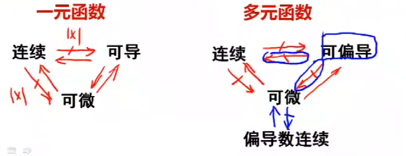

## 第六章 微分方程

数二明确不考查**伯努利方程**

### 一阶线性微分方程

#### **可分离变量的微分方程**

- 形式：$y′=f(x)g(y)$ 或 $P(x)dx+Q(y)dy=0$
- 要求：熟练分离变量后积分，注意**常数 $C$ 的写法**（如 $ln∣y∣=ln∣x∣+C$ 需整理为 $y=Cx$），特解需代入初始条件定 $C$。

#### **齐次微分方程**

- 形式：$y′=f(\frac{y}{x})$
- 要求：令$$\boxed{u=\frac{y}{x}\;(y=ux，y′=u+x\frac{du}{dx})}$$，转化为**可分离变量方程**求解，还原 $u$ 为 $xy$​ 即可。

#### **一阶线性非齐次微分方程**
- 标准形式：$$y′+P(x)y=Q(x)$$（**必须先化为标准型**）
- 要求：熟记**通解公式** $$\boxed{y=e^\colorbox{yellow}{$−\int P(x)dx$}(∫Q(x)e^\colorbox{yellow}{$\int P(x)dx$}dx+C)}$$，会计算**不定积分**（数二积分要求高，注意积分公式、换元法的使用）；
- 特殊情况：$Q(x)=0$​ 时为**一阶线性齐次微分方程**，直接分离变量求解即可。

> [!important]
> $$
> \colorbox{yellow}{$y = e^{-\int_a^x P(t)dt}\left( \int_a^x Q(s)e^{\int_a^s P(t)dt}ds + C \right)$}
> $$
> 

#### **可降阶的一阶相关类型**（衔接二阶）

- 形式：$y^{(n)}=f(x)$（最基础）、$y′′=f(y,y′)$（少考，仅作衔接）
- 要求：
  - $y^{(n)}=f(x)$直接 **$n$次积分** 求解，每次积分都要加常数（$C_1,C_2,...$​），特解代入初始条件定常数。
  - $y′′=f(y,y′)$ **换元降阶**：令 $p=y′$，则 $\boxed{y′′=p\frac{dp}{dy}}$，将原方程转化为关于 $p$ 和 $y$ 的一阶微分方程来求解。

> [!example]- **例题：**
>
> （1）$\frac{dy}{dx}=(x+y)^2$
>
> **解法：换元法**
> 令 $u = x + y$，则 $\frac{du}{dx} = 1 + \frac{dy}{dx}$。
> 代入原方程得：
> $
> \frac{du}{dx} - 1 = u^2 \quad \Rightarrow \quad \frac{du}{dx} = u^2 + 1
> $
> 这是可分离变量方程，分离变量并积分：
> $
> \int \frac{1}{u^2+1} du = \int dx
> $
> $
> \arctan u = x + C
> $
> 代回 $u = x + y$，得通解：
> $
> \arctan(x + y) = x + C \quad \Rightarrow \quad y = \tan(x + C) - x
> $
>
> ---
>
> （3）$xy'+y=y(\ln x+\ln y)$
>
> **解法：变形为齐次型**
> 原方程左边可写为 $(xy)'$，右边整理为 $y\ln(xy)$，方程化为：
> $
> (xy)' = y\ln(xy)
> $
> 令 $u = xy$，则 $y = \frac{u}{x}$，$\frac{du}{dx} = y + x y'$，代入得：
> $
> \frac{du}{dx} = \frac{u}{x} \ln u
> $
> 分离变量并积分：
> $
> \int \frac{1}{u \ln u} du = \int \frac{1}{x} dx
> $
> $
> \ln|\ln u| = \ln|x| + C_1
> $
> $
> \ln u = C x \quad (C = \pm e^{C_1})
> $
> 代回 $u = xy$，得通解：
> $
> \ln(xy) = C x \quad \Rightarrow \quad xy = e^{C x}
> $

### 常系数齐次线性微分方程

考研数学二仅要求掌握**二阶常系数齐次线性微分方程**，不要求高阶（三阶及以上），是高频考点，常与二阶非齐次方程结合出大题。

#### 标准形式
$\boxed{y'' + py' + qy = 0}$
其中 $p, q$ 为常数。

#### 核心解法：特征方程法
- **步骤1**：写出对应的特征方程
$\boxed{r^2 + pr + q = 0}$
- **步骤2**：求解特征根 $r_1, r_2$，并根据根的类型写出通解

| 特征根的情况                            | 通解形式                                                   |
| --------------------------------------- | ---------------------------------------------------------- |
| 两个不相等的实根 $r_1 \neq r_2$       | $Y = C_1 e^{r_1 x} + C_2 e^{r_2 x}$                      |
| 两个相等的实根 $r_1 = r_2 = r$        | $Y = (C_1 + C_2 x) e^{r x}$                              |
| 一对共轭复根 $r = \alpha \pm \beta i$ | $Y = e^{\alpha x} (C_1 \cos \beta x + C_2 \sin \beta x)$ |

^00752d

### 常系数非齐次线性微分方程

二阶常系数非齐次线性微分方程：$$\boxed{y'' + py' + qy = \boxed{f(x)}}$$
#### 特解的形式：
1. **$f(x)=e^{\lambda x}P_m(x)$**
令 $$\colorbox{yellow}{$y^* = x^k Q_m(x)e^{\lambda x}$}\quad \lambda 是特征方程 \;r^2+pr+q=0的k重根$$
2. **$f(x)=e^{\alpha x}\left[P_l(x)\cos\beta x+Q_n(x)\sin\beta x\right]$**
令 $$\colorbox{yellow}{$y^* = x^k e^{\alpha x}\left[R_m^{(1)}(x)\cos\beta x+R_m^{(2)}(x)\sin\beta x\right].\quad 其中m=\max\{l,n\}$}$$ ,$\alpha+i\beta$ 是特征方程 $r^2+pr+q=0$的 $k$ 重根.

#### 解的结构
非齐次线性微分方程的解由两部分组成：
1. 对应的齐次线性微分方程的通解
2. 非齐次线性微分方程的特解

若 $y_1(x), y_2(x), y_3(x)$ 是某二阶非齐次线性微分方程的互不相等的特解，便有：
1. $y_2(x) - y_1(x)$ 与 $y_3(x) - y_1(x)$ 均为对应齐次方程 $y'' + p(x)y' + q(x)y = 0$ 的解。
2. 若 $y_2 - y_1$ 与 $y_3 - y_1$ 线性无关（即 $\dfrac{y_2 - y_1}{y_3 - y_1} \neq$ 常数），则该非齐次方程的通解为：
$$
\boxed{y = y_1 + C_1(y_2 - y_1) + C_2(y_3 - y_1)}
$$
等价地，可写为系数和为 $1$ 的对称形式：
$$
\boxed{y = C_1 y_1 + C_2 y_2 + C_3 y_3,\quad \text{其中 } C_1 + C_2 + C_3 = 1}
$$
（$C_1, C_2$ 为任意常数，二阶方程的通解包含两个任意常数。）
3. 若 $y_2 - y_1$ 与 $y_3 - y_1$ 线性相关（即存在常数 $k \neq 0$，使得 $y_3 - y_1 = k(y_2 - y_1)$，从而 $y_3 = (1 - k)y_1 + k y_2$），则仅凭这三个特解无法确定该方程的通解

## 第七章 多元函数的微分学

### 多元函数的极限与连续性
1. **多元函数的极限**
    - 二重极限（以二元为例）：
    
      设$P_0$是定义域$D$的聚点，若对任意$\varepsilon>0$，存在$\delta>0$，当$P\in D\cap\stackrel{\circ}{U}(P_0,\delta)$时，$|f(P)-A|<\varepsilon$，则$\lim\limits_{P\to P_0}f(P)=A$。
    
    - 关键性质：极限存在要求$P$以任意方式趋于$P_0$时函数均趋于同一值；若沿不同路径趋于不同值，则极限不存在。
    
    - 运算：与一元函数极限运算法则类似（和、差、积、商、复合等）。
    
2. **多元函数的连续性**
   
    - 定义：若$\lim\limits_{(x,y)\to(x_0,y_0)}f(x,y)=f(x_0,y_0)$，则函数在$(x_0,y_0)$处连续；区域$D$上每点连续则称函数在$D$上连续。
    - 间断点：不满足连续性定义的点，可能是极限不存在或函数值不匹配。
    - 重要结论：多元初等函数在其定义区域内连续；有界闭区域上的连续多元函数具有有界性、最大值最小值定理、介值定理、一致连续性定理。

### 偏导数与高阶偏导数

1. **偏导数的定义与计算**
    - 定义：二元函数$z=f(x,y)$在$(x_0,y_0)$处对$x$的偏导数为$$\colorbox{yellow}{$\lim\limits_{\Delta x\to0}\frac{f(x_0+\Delta x,y_0)-f(x_0,y_0)}{\Delta x}$，记为$\frac{\partial z}{\partial x}\big|_{(x_0,y_0)}$}$$等；对$y$的偏导数类似。
    - 计算方法：固定其他自变量，对目标自变量按一元函数微分法求导，三元及以上函数同理。
    - 几何意义：二元函数对$x$的偏导数表示曲面被$y=y_0$截得的曲线在该点对$x$轴的切线斜率，对$y$的偏导数类似。
    - 注意：偏导数存在不保证函数连续。
2. **高阶偏导数**
    - 定义：二阶及以上偏导数统称高阶偏导数，含混合偏导数（如$\frac{\partial^2 z}{\partial x\partial y}$）。
    - 重要定理：若二阶混合偏导数在区域$D$内连续，则其与求导次序无关,即$z_{xy}=z_{yx}$​

> [!important]
> 1. \[易忘点\]：求偏导时，对哪个变量求导，就只把它当变量，其他全部暂时看成常数
>    1. $f''_{xx}(x_0,y_0)$:
> 	   - 确定$y=y_0$，得到$f(x,y_0)$;
> 	   - 然后对$f(x,y_0)$求二阶导得到$f''_{xx}(x,y_0)$，最后代入 $x=x_0$
>    1. $f''_{xy}(x_0,y_0)$:
> 	   - 先对 x 求偏导，得到 $f'_{x}(x,y)$，将 $x=x_0$ 代入得到 $f'_{x}(x_0,y)$
> 	   - 然后对 $f'_{x}(x_0,y)$ 求 y 的偏导，得到 $f''_{xy}(x_0,y)$，最后代入 $y=y_0$
> 2. $\lim_\limits{x\to x_0}f'_x(x,y_0)$与$\lim_\limits{x\to x_0,y\to y_0}f'_x(x,y)$
>    1. 数值上是相等的，均等于$f'_x(x_0,y_0)$
>    2. 含义上是完全不同的：后者为所有路径的极限均相等，前者为特例

### 全微分

#### 全微分的定义

**定义（全微分）** 
设 $z = f(x,y)$ 在点 $(x,y)$ 的某邻域 $U(x,y)$ 内有定义. 如果
$$
\begin{align*}
\Delta z &= f(x+\Delta x,y+\Delta y)-f(x,y) \\
&= A\Delta x + B\Delta y + o(\rho)
\end{align*}
$$
则称函数 $f(x,y)$ 在点 $(x,y)$ 处**可微**.
$$
dz = Adx + Bdy
$$
**定理1（必要条件）** 如果函数 $z = f(x,y)$ 在点 $(x,y)$ 处可微，则该函数在点 $(x,y)$ 的偏导数 $\frac{\partial z}{\partial x}$ 与 $\frac{\partial z}{\partial y}$ 必定存在, 且
$$
\colorbox{yellow}{$
dz = \frac{\partial z}{\partial x}\Delta x + \frac{\partial z}{\partial y}\Delta y$}
$$

> [!important]
>
> #### 用定义判定可微性
>
> a) $f_x(x_0,y_0)$ 与 $f_y(x_0,y_0)$ 是否都存在？
>
> b)$$\colorbox{yellow}{$\lim\limits_{(\Delta x,\Delta y)\to(0,0)} \frac{\Delta z-\left[f_x(x_0,y_0)\Delta x + f_y(x_0,y_0)\Delta y\right]}{\sqrt{(\Delta x)^2+(\Delta y)^2}}$}$$是否为零？

^d7b0d7

**定理2（充分条件）** 如果函数 $z = f(x,y)$ 的偏导数 $\frac{\partial z}{\partial x}, \frac{\partial z}{\partial y}$ 在点 $(x_0,y_0)$​ 连续, 则函数在该点可微.

> [!caution] 多元函数与一元函数的区别
>
> 
>
> **可偏导$\displaystyle{\nrightarrow}$可微**: \[偏导仅仅是沿着 x轴/y轴 正方向的方向导数\]
>
> > [!note]-  
> >
> > $f(x,y)=\begin{cases}\frac{xy}{x^2+y^2}&x^2+y^2\ne0\\0&x^2+y^2=0 \end{cases}$，在$(0,0)$处的偏导与可微性  
> >
> > ##### 步骤1：函数在$(0,0)$处**可偏导**
> >
> > 根据偏导数定义：
> >
> > - 对$x$的偏导数：
> >
> > $$
> > f_x(0,0)=\lim_{\Delta x \to 0}\frac{f(\Delta x,0)-f(0,0)}{\Delta x}=\lim_{\Delta x \to 0}\frac{0-0}{\Delta x}=0
> > $$
> >
> > - 对$y$的偏导数：
> >
> > $$
> > f_y(0,0)=\lim_{\Delta y \to 0}\frac{f(0,\Delta y)-f(0,0)}{\Delta y}=\lim_{\Delta y \to 0}\frac{0-0}{\Delta y}=0
> > $$
> >
> > 因此$f(x,y)$在$(0,0)$处的两个偏导数都存在。
> >
> >
> > ##### 步骤2：函数在$(0,0)$处**不可微**
> >
> > 可微的定义是：若$\Delta z = f(0+\Delta x,0+\Delta y)-f(0,0)$可表示为
> > $$
> > \Delta z = f_x(0,0)\Delta x + f_y(0,0)\Delta y + o(\rho)
> > $$
> > 其中$\rho=\sqrt{(\Delta x)^2+(\Delta y)^2}$，且$\lim_{\rho \to 0}\frac{o(\rho)}{\rho}=0$。
> >
> > 代入$f(x,y)$计算$\Delta z$：
> > $$
> > \Delta z = \frac{\Delta x \cdot \Delta y}{(\Delta x)^2+(\Delta y)^2} - 0 = \frac{\Delta x \Delta y}{(\Delta x)^2+(\Delta y)^2}
> > $$
> > 而$f_x(0,0)\Delta x + f_y(0,0)\Delta y = 0$，因此需验证：
> > $$
> > \lim_{\rho \to 0}\frac{\Delta z - 0}{\rho} = \lim_{(\Delta x,\Delta y) \to (0,0)} \frac{\Delta x \Delta y}{[(\Delta x)^2+(\Delta y)^2]^{3/2}}
> > $$
> >
> > 取路径$\Delta y = \Delta x$，则上式变为：
> > $$
> > \lim_{\Delta x \to 0}\frac{(\Delta x)^2}{(2(\Delta x)^2)^{3/2}} = \lim_{\Delta x \to 0}\frac{1}{2\sqrt{2}|\Delta x|} \to \infty
> > $$
> > 不满足“$\frac{o(\rho)}{\rho} \to 0$”的要求，故$f(x,y)$在$(0,0)$处不可微。
> >
> >
> > ##### 结论
> >
> > 该函数在$(0,0)$处**可偏导但不可微**，因此“可偏导不一定可微”。
>
> **可偏导$\nrightarrow$连续**：
>
> > [!note]-
> >
> > 偏导数只反映了函数在坐标轴方向上的变化率，即使两个偏导数都存在，也只能说明函数在 $x$ 和 $y$ 轴方向上的变化是存在的，但无法保证函数在其他方向上的变化是连续的。
> >
> > $f(x,y)=\begin{cases}\frac{xy}{x^2+y^2}&x^2+y^2\ne0\\0&x^2+y^2=0 \end{cases}$，在点$(0,0)$的偏导与连续性：
> >
> > ##### 步骤1：函数在$(0,0)$​处**可偏导**
> >
> > 同上，略
> >
> > ##### 步骤2：函数在$(0,0)$处**不连续**
> >
> > 不防设 $y=kx$，当$x\rightarrow0$时，同时满足$y\rightarrow0$.则
> >
> > $\lim\limits_{(x,y)\rightarrow(0,0)}\frac{xy}{x^2+y^2}=\lim\limits_{x\rightarrow0}\frac{kx^2}{x^2+k^2x^2}=\frac{k}{1+k^2}$
> >
> > 表明当$(x,y)\rightarrow(0,0)$时，$\lim f(x,y)$ 的值与$k$的取值有关，即极限不存在，故$f(x,y)$在$(0,0)$​不连续
>
> **可偏导 无法保证 极限存在，但可以保证 沿着 $y$ 轴或 $x$ 轴 的极限存在**

^b05ab2

### 多元函数复合函数微分法

**定理** 设 $u=u(x,y)$，$v=v(x,y)$ 在点 $(x,y)$ 处有对 $x$ 及对 $y$ 的偏导数，函数 $z=f(u,v)$ 在对应点 $(u,v)$ 处有连续偏
导数，则 $z=f[u(x,y),v(x,y)]$ 在点 $(x,y)$ 处的两个偏导数存在，且有
$$
\colorbox{yellow}{$
\frac{\partial z}{\partial x} = \frac{\partial z}{\partial u} \frac{\partial u}{\partial x} + \frac{\partial z}{\partial v} \frac{\partial v}{\partial x},
\qquad
\frac{\partial z}{\partial y} = \frac{\partial z}{\partial u} \frac{\partial u}{\partial y} + \frac{\partial z}{\partial v} \frac{\partial v}{\partial y}
$}
$$

#### 全微分形式的不变性

设函数 $z=f(u,v)$，$u=u(x,y)$ 及 $v=v(x,y)$ 都有连续的一阶偏导数，则复合函数 $z=f[u(x,y),v(x,y)]$ 的全微分

$$
\colorbox{yellow}{$
\mathrm{d} z = \frac{\partial z}{\partial x} \mathrm{d} x + \frac{\partial z}{\partial y} \mathrm{d} y = \frac{\partial z}{\partial u} \mathrm{d} u + \frac{\partial z}{\partial v} \mathrm{d} v.
$}
$$

$$
\frac{\partial z}{\partial x} = \frac{\partial z}{\partial u} \frac{\partial u}{\partial x} + \frac{\partial z}{\partial v} \frac{\partial v}{\partial x},
\qquad
\frac{\partial z}{\partial y} = \frac{\partial z}{\partial u} \frac{\partial u}{\partial y} + \frac{\partial z}{\partial v} \frac{\partial v}{\partial y}
$$

### 隐函数的求导公式

#### 一个方程的情形

**隐函数存在定理** 1

如果函数 $F(x,y)$ 满足：
$$
\begin{cases}
(1)\ F(x_0,y_0)=0; \\
(2)\ \text{在点}\ (x_0,y_0)\ \text{的某邻域中有连续的偏导数}; \\
(3)\ F_y(x_0,y_0)\neq0;
\end{cases}
$$
则方程 $F(x,y)=0$ 在点 $(x_0,y_0)$ 的某一邻域中唯一确定了一个具有连续导数的函数 $y=f(x)$，它满足$y_0=f(x_0)$ 及 $F[x,f(x)]\equiv 0$，并且
$$
\colorbox{yellow}{$\frac{dy}{dx}=-\frac{F_x}{F_y}$}.
$$
**隐函数存在定理** 2

若 $F(x,y,z)$ 在点 $P(x_0,y_0,z_0)$ 的某一邻域内有连续偏导数，且 $F(x_0,y_0,z_0)=0$，$F_z'(x_0,y_0,z_0)\neq 0$。则方程$F(x,y,z)=0$ 在点 $(x_0,y_0,z_0)$ 的某邻域可唯一确定一个有连续偏导数的函数 $z=z(x,y)$，并有
$$
\colorbox{yellow}{$
\frac{\partial z}{\partial x}=-\frac{F_x'}{F_z'},\quad
\frac{\partial z}{\partial y}=-\frac{F_y'}{F_z'}
$}
$$

### 多元函数的极值

#### 二元函数的无条件极值
**定义**

设函数$z=f(x,y)$在点$(x_0,y_0)$的某邻域内有定义，若对该邻域内异于$(x_0,y_0)$的任意点$(x,y)$，都有$f(x,y)<f(x_0,y_0)$（或$f(x,y)>f(x_0,y_0)$），则称$f(x_0,y_0)$为函数的**极大值**（或**极小值**），点$(x_0,y_0)$为**极大值点**（或**极小值点**）。
极值是**局部性质**，与最值（全局性质）不同。

##### 解题步骤
**步骤**1：求一阶偏导数，找**驻点**（极值可疑点）

驻点：满足$$\colorbox{yellow}{$\boldsymbol{f_x'(x,y)=0}$}$$且$$\colorbox{yellow}{$\boldsymbol{f_y'(x,y)=0}$}$$的点$(x_0,y_0)$。
**注**：极值点一定是驻点（可微函数），但驻点不一定是极值点，需进一步判断。

**步骤**2：求二阶偏导数，计算**判别式**

记：
$A=f_{xx}''(x_0,y_0)$，$B=f_{xy}''(x_0,y_0)$，$C=f_{yy}''(x_0,y_0)$
判别式：$$\colorbox{yellow}{$\boldsymbol{\Delta=AC-B^2}$}$$
**步骤**3：根据判别式符号判断驻点是否为极值点

| 判别式符号        | 结论                                               |
| ----------------- | -------------------------------------------------- |
| $\Delta>0$且$A<0$ | $(x_0,y_0)$是**极大值点**，$f(x_0,y_0)$为极大值    |
| $\Delta>0$且$A>0$ | $(x_0,y_0)$是**极小值点**，$f(x_0,y_0)$为极小值    |
| $\Delta<0$        | $(x_0,y_0)$**不是极值点**                          |
| $\Delta=0$        | 判别法失效，需用定义判断（数二**极少考**，可忽略） |

^2be2a3

> [!caution]
>
> 1. 注意：对于连续的二元函数，在指定有界闭区域一定有最大值和最小值(类比“在闭区间上连续的一元函数一定有最大值最小值”)
> 2. 重要结论：在区域$D$中$f(x,y)$为常数$\iff \quad f'_x\equiv f'_y\equiv0 \iff \quad df(x,y)\equiv 0$

#### 二元函数的条件极值（拉格朗日乘数法）

**定义**

求函数$z=f(x,y)$（**目标函数**）在约束条件$\boldsymbol{\varphi(x,y)=0}$下的极值，称为条件极值。
数二**必考**，常与无条件极值结合出解答题，约束条件仅考**一个**的情况（$\varphi(x,y)=0$），不考多个约束条件。

##### 解题方法：拉格朗日乘数法
**步骤**1：构造**拉格朗日函数**
$$\colorbox{yellow}{$\boldsymbol{L(x,y,\lambda)=f(x,y)+\lambda\varphi(x,y)}$}$$
其中$\lambda$为**拉格朗日乘数**（待定常数），将条件极值转化为三元函数$L(x,y,\lambda)$的无条件极值。

**步骤**2：求拉格朗日函数的驻点

对$x,y,\lambda$分别求一阶偏导并令其为0，解方程组：
$$
\colorbox{lightblue}{$\begin{cases}L_x'=f_x'(x,y)+\lambda\varphi_x'(x,y)=0\\L_y'=f_y'(x,y)+\lambda\varphi_y'(x,y)=0\\L_\lambda'=\varphi(x,y)=0\end{cases}$}
$$
解得的$(x_0,y_0)$即为**条件极值的可疑点**。

**步骤**3：判断并求极值

**无需严格证明**可疑点是否为极值点，只需根据**题意**判断（如实际问题/题目标明有极值，则可疑点即为极值点），直接代入目标函数计算极值即可。

#### 解题模板

##### 模板1：无条件极值
**例**：求$f(x,y)$的极值
解：
1. 求一阶偏导数：$f_x'=\dots$，$f_y'=\dots$；
2. 令$\begin{cases}f_x'=0\\f_y'=0\end{cases}$，解得驻点为$(x_1,y_1),(x_2,y_2),\dots$；
3. 求二阶偏导数：$f_{xx}''=\dots$，$f_{xy}''=\dots$，$f_{yy}''=\dots$；
4. 对驻点$(x_0,y_0)$，计算$A=f_{xx}''(x_0,y_0)$，$B=f_{xy}''(x_0,y_0)$，$C=f_{yy}''(x_0,y_0)$，$\Delta=B^2-AC$；
5. 若$\Delta<0$且$A>0$，则$f(x_0,y_0)$为极小值；若$\Delta<0$且$A<0$，则$f(x_0,y_0)$为极大值；若$\Delta>0$，非极值。

##### 模板2：条件极值（拉格朗日乘数法）
**例**：求$f(x,y)$在$\varphi(x,y)=0$下的极值
解：
1. 构造拉格朗日函数：$L(x,y,\lambda)=f(x,y)+\lambda\varphi(x,y)$；
2. 求偏导并令其为0：
    $$\begin{cases}L_x'=f_x'+\lambda\varphi_x'=0\\L_y'=f_y'+\lambda\varphi_y'=0\\L_\lambda'=\varphi(x,y)=0\end{cases}$$
3. 解方程组得$x=x_0,y=y_0$，则$f(x_0,y_0)$为所求极值。

---

# 附录

## 三角函数常用公式

### 和差化积公式

$$
\colorbox{yellow}{$
\begin{align*}
\sin\alpha + \sin\beta &= 2\sin\frac{\alpha+\beta}{2}\cos\frac{\alpha-\beta}{2} \\
\sin\alpha - \sin\beta &= 2\cos\frac{\alpha+\beta}{2}\sin\frac{\alpha-\beta}{2} \\
\cos\alpha + \cos\beta &= 2\cos\frac{\alpha+\beta}{2}\cos\frac{\alpha-\beta}{2} \\
\cos\alpha - \cos\beta &= -2\sin\frac{\alpha+\beta}{2}\sin\frac{\alpha-\beta}{2}
\end{align*}
$}
$$
**记忆口诀**：

- 和差化积同名函数，正弦异名（$\sin+\cos$），余弦同名（$\cos+\cos/\cos-\cos$）；
- 负号只在 $\cos\alpha-\cos\beta$ 出现。

### 积化和差公式

$$
\colorbox{yellow}{$
\begin{align*}
\sin\alpha\cos\beta &= \frac{1}{2}\left[\sin(\alpha+\beta)+\sin(\alpha-\beta)\right] \\
\cos\alpha\sin\beta &= \frac{1}{2}\left[\sin(\alpha+\beta)-\sin(\alpha-\beta)\right] \\
\cos\alpha\cos\beta &= \frac{1}{2}\left[\cos(\alpha+\beta)+\cos(\alpha-\beta)\right] \\
\sin\alpha\sin\beta &= -\frac{1}{2}\left[\cos(\alpha+\beta)-\cos(\alpha-\beta)\right]
\end{align*}
$}
$$

### 同角三角函数基本关系

1.  **平方关系**
    $$
    \sin^2\alpha + \cos^2\alpha = 1; \quad 1+\tan^2\alpha = \sec^2\alpha; \quad 1+\cot^2\alpha = \csc^2\alpha
    $$

2.  **商数关系**
    $$
    \tan\alpha = \frac{\sin\alpha}{\cos\alpha}; \quad \cot\alpha = \frac{\cos\alpha}{\sin\alpha}
    $$

3.  **倒数关系**
    $$
    \tan\alpha\cot\alpha = 1; \quad \sin\alpha\csc\alpha = 1; \quad \cos\alpha\sec\alpha = 1
    $$

### 和角与差角公式

$$
\begin{align*}
\sin(\alpha\pm\beta) &= \sin\alpha\cos\beta \pm \cos\alpha\sin\beta \\
\cos(\alpha\pm\beta) &= \cos\alpha\cos\beta \mp \sin\alpha\sin\beta \\
\tan(\alpha\pm\beta) &= \frac{\tan\alpha \pm \tan\beta}{1 \mp \tan\alpha\tan\beta}
\end{align*}
$$

### 倍角与半角公式

#### 倍角公式

$$
\begin{align*}
\sin2\alpha &= 2\sin\alpha\cos\alpha \\
\cos2\alpha &= \cos^2\alpha-\sin^2\alpha = 2\cos^2\alpha-1 = 1-2\sin^2\alpha \\
\tan2\alpha &= \frac{2\tan\alpha}{1-\tan^2\alpha}
\end{align*}
$$

**推论（降幂公式）**：
$$
\sin^2\alpha = \frac{1-\cos2\alpha}{2}; \quad \cos^2\alpha = \frac{1+\cos2\alpha}{2}
$$

#### 半角公式（开方时符号由 $\frac{\alpha}{2}$ 所在象限决定）

$$
\begin{align*}
\sin\frac{\alpha}{2} &= \pm\sqrt{\frac{1-\cos\alpha}{2}} \\
\cos\frac{\alpha}{2} &= \pm\sqrt{\frac{1+\cos\alpha}{2}} \\
\tan\frac{\alpha}{2} &= \pm\sqrt{\frac{1-\cos\alpha}{1+\cos\alpha}} = \frac{\sin\alpha}{1+\cos\alpha} = \frac{1-\cos\alpha}{\sin\alpha}
\end{align*}
$$

#### 辅助角公式

将 $a\sin\alpha + b\cos\alpha$ 合并为单一三角函数，常用于求最值、化简极限。
$$
a\sin\alpha + b\cos\alpha = \sqrt{a^2+b^2}\sin(\alpha+\varphi)
$$
其中 $\tan\varphi = \frac{b}{a}$，$\varphi$ 的象限由 $a,b$ 的符号决定。

## 常用不等式

### 基础代数不等式

#### 均值不等式

**适用对象**：非负实数 $a_1,a_2,\dots,a_n\ge0$
**公式**
$$
\frac{a_1+a_2+\dots+a_n}{n}\ge\sqrt[n]{a_1a_2\cdots a_n}
$$
**等号条件**：$a_1=a_2=\dots=a_n$
**特例（二元）**：
$$
\frac{a+b}{2}\ge\sqrt{ab}\quad(a,b\ge0)
$$
**用途**：求乘积/和的最值、不等式放缩。

#### 柯西不等式

**代数形式**
$$
\left(\sum_{i=1}^n a_i b_i\right)^2\le\left(\sum_{i=1}^n a_i^2\right)\left(\sum_{i=1}^n b_i^2\right)
$$
**等号条件**：$\exists k\in\mathbb{R}$，使得 $a_i=kb_i\ (\forall i)$
**向量形式**：
$$
(\vec{a}\cdot\vec{b})^2\le|\vec{a}|^2|\vec{b}|^2
$$
**用途**：处理平方和与乘积和的不等式证明、积分不等式推导。

### 分析类不等式（微积分常用）

#### 1.  绝对值不等式

**基本形式**
$$
||a|-|b||\le|a\pm b|\le|a|+|b|
$$
**三角不等式推广**
$$
|a_1+a_2+\dots+a_n|\le|a_1|+|a_2|+\dots+|a_n|
$$
**用途**：极限、级数收敛性证明中的放缩。

#### 伯努利不等式

**公式**
$$
(1+x)^n\ge1+nx\quad(x>-1,\;n\in\mathbb{N_+})
$$
**等号条件**：$x=0$ 或 $n=1$
**推广（实数幂）**：
$$
(1+x)^\alpha\ge1+\alpha x\quad(x>-1,\;\alpha\ge1或\alpha\le0)
$$
**用途**：幂函数的不等式放缩、极限证明。

### 常用放缩不等式

1.  $\displaystyle\sin x\le x\le\tan x\quad\left(0<x<\frac{\pi}{2}\right)$
2.  $\displaystyle e^x\ge x+1\quad(\forall x\in\mathbb{R})$，等号当且仅当 $x=0$
3.  $\displaystyle\ln(1+x)\le x\quad(x>-1)$，等号当且仅当 $x=0$
4.  $\displaystyle\frac{x}{1+x}<\ln(1+x)<x\quad(x>0)$
