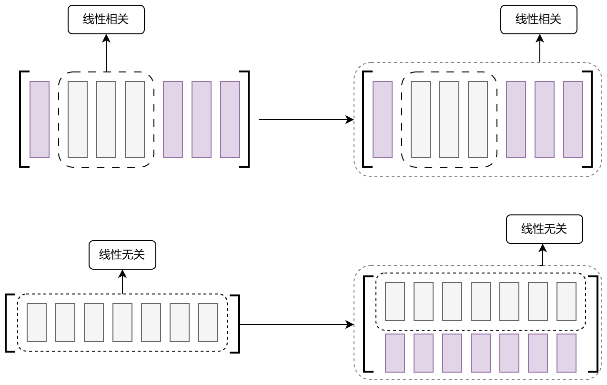

## 第二章 矩阵

### 矩阵的运算

**矩阵的乘法：**

1. $\boldsymbol{A} \cdot \boldsymbol{B} \neq \boldsymbol{B} \cdot \boldsymbol{A}$  矩阵一般不满足交换律
2. $\boldsymbol{A}\cdot \boldsymbol{B} = \boldsymbol{A}\cdot\boldsymbol{C} \nRightarrow \boldsymbol{B} = \boldsymbol{C}$
3. $\boldsymbol{A}\cdot\boldsymbol{B} = \boldsymbol{0} \nRightarrow \boldsymbol{A} \; or \;\boldsymbol{B} = \boldsymbol{0}$

> [!caution]
>
> 设 $A-m\times n,B-n\times s$,若 $A \cdot B = 0$
>
> 1. 方程的解：$B$ 的**列向量**是 齐次方程 $A\cdot x = 0$ 的解
> 2. 矩阵的秩：$r(A)+r(B) \le n$

**矩阵的转置：**

1. $(A^T)^T = A$
2. $$\colorbox{yellow}{$(A\cdot B)^T = B^T\cdot A^T$}$$​
3. $\boxed{(A+B)^T=A^T+B^T}$ （易忘）

**特殊矩阵：**

1. 单位矩阵 $E$​
2. 对称矩阵 $A=A^T$
3. 对角矩阵 $\Lambda$

> [!note]
>
> 1. $\Lambda_1\cdot \Lambda_2 = \Lambda_2 \cdot \Lambda_1$ 对角矩阵满足交换律
> 2. $\Lambda^{n} = \begin{bmatrix} a_1^n &&\\ &a_2^n & \\ &&a_3^n \end{bmatrix}\;\text{(以三阶对角矩阵为例)}$​
> 3. $\Lambda^{-1}=\begin{bmatrix} a_1 &&\\&a_2&\\&&a_3 \end{bmatrix}^{-1} = \begin{bmatrix} \frac{1}{a_1}&&\\&\frac{1}{a_2}\\&&\frac{1}{a_3} \end{bmatrix}$

### 可逆矩阵与伴随矩阵(只适用于方阵)

#### 可逆矩阵

**定义** 

对于 $n$ 阶矩阵 $A$ ,如果 $\exists\ n$ 阶矩阵$B$,使 $$AB=BA=E$$ 则称矩阵 $A$ 是可逆的,称 $B$ 是 $A$​​​ 的逆矩阵.

**可逆矩阵存在的充要条件**：

1. <mark style="background:#40a9ff">$A$的行列式$|A| \neq 0$（$A$为非奇异矩阵）</mark>； 
2. $A$的秩$r(A) = n$（$A$为满秩矩阵）； 
3. 齐次线性方程组$Ax = 0$**仅有零解**； 
4. 对任意$n$维**非零**列向量$\boldsymbol{b}$，非齐次线性方程组$Ax = \boldsymbol{b}$有唯一解；
5. $A$可表示为若干初等矩阵的乘积；
6. $A$的特征值均不为$0$​。  

> [!important]
>
> **定理** 若矩阵$A$是可逆的，那么$A$的逆矩阵是**唯一**的，记作$A^{-1}$​。
>
> **推论** $A,B$是$n$阶矩阵，如$AB=E$，则$A^{-1}=B$​。
>
> > [!caution]- 必须强调“方阵”
> >
> > 注意：两个 "长方形" 矩阵相乘也可以得到单位矩阵，如下：
> >
> > $$ \begin{bmatrix} 1 & 0 & -1 \\ 0 & 1 & 0 \end{bmatrix} \begin{bmatrix} 1 & 2 \\ 0 & 1 \\ 0 & 2 \end{bmatrix} = \begin{bmatrix} 1 & 0 \\ 0 & 1 \end{bmatrix} $$
>

> [!important] **逆矩阵的性质** 
>
> 1. 若$A$可逆，则$A^{-1}$也可逆，且$\boxed{(A^{-1})^{-1}=A}$ 
> 2. 若$A$可逆，且$k \neq 0$，则$kA$可逆，且$\boxed{(kA)^{-1}=\frac{1}{k}A^{-1}}$ 
> 3. 若$A,B$均可逆，则$AB$也可逆，且$\boxed{(AB)^{-1}=B^{-1}A^{-1}}$
> 
> - 推广：$\boxed{(ABC)^{-1}=C^{-1}B^{-1}A^{-1}}$，$\boxed{(A^n)^{-1}=(A^{-1})^n}$ 
> 
> 4. 若$A$可逆，则$A^T$也可逆，且$\boxed{(A^T)^{-1}=(A^{-1})^T}$​
>
> > - 对于"可逆"：$(A+B)^{-1}\ne A^{-1}+B^{-1}$
> > - 对于"转置"：$(A+B)^T=A^T+B^T$​
> 
> 5.分块对角（或反对角）矩阵的逆矩阵：
>  $$\colorbox{yellow}{$\begin{bmatrix} A & O \\ O & B \end{bmatrix}^{-1} = \begin{bmatrix} A^{-1} & O \\ O & B^{-1} \end{bmatrix}$}$$ 
> 
>  $$\colorbox{yellow}{$\begin{bmatrix} O & A \\ B & O \end{bmatrix}^{-1} = \begin{bmatrix} O & B^{-1} \\ A^{-1} & O \end{bmatrix}$}$$

#### 伴随矩阵
设$A$为$n$阶矩阵，其伴随矩阵$A^*$的定义为：

$$A^* = \begin{bmatrix} A_{11} & A_{21} & \cdots & A_{n1} \\ A_{12} & A_{22} & \cdots & A_{n2} \\ \vdots & \vdots & & \vdots \\ A_{1n} & A_{2n} & \cdots & A_{nn} \end{bmatrix}$$ **注意：代数余子式的排列顺序**

其中，$A_{ij}$是矩阵$A$中元素$a_{ij}$的**代数余子式**（即去掉第$i$行第$j$列后剩余子式乘以$(-1)^{i+j}$的结果）。 

伴随矩阵的核心用途是结合行列式计算逆矩阵：当$A$可逆（$|A| \neq 0$）时，$A^{-1} = \frac{1}{|A|}A^*$。

> [!important] **性质**
>
> （设$A$为$n$阶矩阵） 
>
> 1. 核心运算关系： $AA^* = A^*A = |A|E$ 
> 2. 数乘的伴随： $$\boxed{(kA)^* = k^{n-1}A^*}$$ 
> 3. 转置的伴随： $$\boxed{(A^*)^T = (A^T)^*}$$  穿脱原则
> 4. 伴随矩阵的行列式： $$\boxed{|A^*| = |A|^{n-1}}$$ 
> 5. 伴随的伴随： $$\boxed{(A^*)^* = |A|^{n-2}A}$$ 
> 6. 伴随的逆（$A$可逆时）： $$\boxed{(A^*)^{-1} = (A^{-1})^* = \frac{1}{|A|}A}$$ 
> 7. 伴随矩阵的秩： $$\colorbox{yellow}{$r(A^*) = \begin{cases} n & r(A) = n \\ 1 & r(A) = n-1 \\ 0 & r(A) < n-1 \end{cases}$}$$
>
> 特别地，
>
> - 二阶矩阵 $A=\begin{pmatrix}a&b\\c&d \end{pmatrix}$ 的伴随矩阵 $A^*=\begin{pmatrix}d&-b\\-c&a\end{pmatrix}$​ [主对调，副取反]
> - 二阶矩阵的伴随的伴随是其本身
>

### 初等变换与初等矩阵

#### 矩阵的初等变换

1. 用非$0$常数$k$乘$A$某行/列的每个元素                            **倍乘** 

2. 互换$A$中两行/列元素的位置                                  **互换** 

3. 把$A$中某行/列所有元素的$k$倍加到另一行/列对应的元素上            **倍加**

#### 初等矩阵

**定义** **单位矩阵**经**一次初等变换**所得到的矩阵称为初等矩阵

> [!caution] **左行右列**
>
> 1. 初等矩阵 $P$ **左乘**矩阵 $A$ ,其乘积 $PA$ 就是矩阵 $A$ 作一次与 $P$​ 同样的**行变换**
>
> 2. 初等矩阵 $P$ **右乘**矩阵 $A$ ,其乘积 $AP$ 就是矩阵 $A$ 作一次与 $P$ 同样的**列变换**

**初等矩阵与可逆矩阵** 初等矩阵均可逆,且其逆是同一类型的初等矩阵.

> [!note] 初等矩阵的可逆矩阵
>
> 1. **倍加变换**的初等矩阵的可逆矩阵 **倍数变相反数**
>
> 例如：$\begin{bmatrix} 1&0&0\\2&1&0\\0&0&1 \end{bmatrix}\cdot \begin{bmatrix} 1&0&0\\-2&1&0\\0&0&1 \end{bmatrix}=\begin{bmatrix} 1&0&0\\0&1&0\\0&0&1 \end{bmatrix}$​
>
> 2. **互换变化**的初等矩阵的可逆矩阵 **原封不动**
>
> 例如：$\begin{bmatrix} 1&0&0\\0&0&1\\0&1&0 \end{bmatrix}\cdot\begin{bmatrix} 1&0&0\\0&0&1\\0&1&0 \end{bmatrix}=\begin{bmatrix} 1&0&0\\0&1&0\\0&0&1 \end{bmatrix}$​
>
> 3. **倍乘变换**的初等矩阵的可逆矩阵 即**对角矩阵**的可逆矩阵，**取倒数**
>
> 例如：$\begin{bmatrix} 1&0&0\\0&2&0\\0&0&1 \end{bmatrix}^{-1}=\begin{bmatrix} 1&0&0\\0&\frac{1}{2}&0\\0&0&1 \end{bmatrix}$

#### 矩阵等价

矩阵$A$经有限次初等变换(行变换、列变换)得到矩阵$B$,就称矩阵$A$和$B$等价,记$A\cong B$，即存在可逆矩阵 $P、Q$ 使得 $PAQ=B$​

> [!caution] 等价方阵的行列式的关系
> 注意：方阵等价可能会改变行列式的符号，即若方阵$A$与$B$等价，有$|A|=-|B|$或$|A|=|B|$

**定理**  矩阵$A,B$都是$m×n$矩阵 $$\boxed{A、B等价 \iff r(A)=r(B)}$$​
> [!caution] **矩阵等价与初等变换**
>
> - 普通等价：**行 + 列变换**
> - 行满秩等价：**只行变换**
> - 列满秩等价：**只列变换**
> - 可逆方阵等价：**行、列变换都能单独用（两种都成立）**

### 分块矩阵

#### 分块矩阵的运算

1. 加法：$\begin{bmatrix} A_{1} & A_{2}\\ A_{3} & A_{4}\end{bmatrix} +\begin{bmatrix} B_{1} & B_{2}\\ B_{3} & B_{4}\end{bmatrix} =\begin{bmatrix} A_{1}+B_{1} & A_{2}+B_{2}\\ A_{3}+B_{3} & A_{4}+B_{4}\end{bmatrix}$ 

2. 乘法：$\begin{bmatrix} A & B\\ C & D\end{bmatrix} \begin{bmatrix} X & Y\\ Z & W\end{bmatrix} =\begin{bmatrix} AX+BZ & AY+B W\\ CX+DZ & CY+D W\end{bmatrix}$
3. 转置：$\begin{bmatrix} A & B \\ C & D \end{bmatrix}^{\text{T}} = \begin{bmatrix} A^{\text{T}} & C^{\text{T}} \\ B^{\text{T}} & D^{\text{T}} \end{bmatrix}$ 
4. 阶乘：$\begin{bmatrix} A & O \\ O & B \end{bmatrix}^{n} = \begin{bmatrix} A^{n} & O \\ O & B^{n} \end{bmatrix}$​
5. 可逆矩阵：$\begin{bmatrix} A & O \\ O & B \end{bmatrix}^{-1} = \begin{bmatrix} A^{-1} & O \\ O & B^{-1} \end{bmatrix}$；$\begin{bmatrix} O & A \\ B & O \end{bmatrix}^{-1} = \begin{bmatrix} O & B^{-1} \\ A^{-1} & O \end{bmatrix}$

#### 分块矩阵的变换
1. 用非 $0$ 常数 $k$ 乘或 **可逆矩阵** 乘分块矩阵 $A$ 某行/列的每个元素      **倍乘** 
2. 互换$A$中两行/列元素的位置                                     **互换** 
3. 把$A$中某行/列所有元素乘 $k$ 倍或**乘某矩阵**(没有强调是可逆矩阵，即任意矩阵)加到另一行/列对应的元素上     **倍加**

> [!caution] 从线性方程组的角度解读矩阵的乘法
> 已知三阶矩阵 $A,B,C$ 满足 $A\cdot B = C$,且矩阵$A,C$已知,欲求解矩阵 $B$
>
> 依据分块思想可得，
> $$
> A\cdot\begin{bmatrix} \beta_1&\beta_2&\beta_3 \end{bmatrix} = \begin{bmatrix} \alpha_1&\alpha_2&\alpha_3 \end{bmatrix}
> $$
> 即，
> $$
> \begin{cases}
> A\cdot\beta_1=\alpha_1\\A\cdot\beta_2=\alpha_2\\A\cdot\beta_3=\alpha_3
> \end{cases}
> $$
> 等价求解非齐次对应方程组的解，
> $$
> \begin{cases}
> \beta_1\text{是方程组}\;\;A\cdot x=\alpha_1\;\;\text{的解}\\
> \beta_2\text{是方程组}\;\;A\cdot y=\alpha_2\;\;\text{的解}\\
> \beta_3\text{是方程组}\;\;A\cdot z=\alpha_3\;\;\text{的解}
> \end{cases}
> $$
> 特别地，当矩阵 $C$ 为**零矩阵**时，$\beta_1,\beta_2,\beta_3$ 是齐次方程组 $A\cdot x=0$ 的解。

### 方阵的行列式的性质

1. $|A^T|=|A|$ 
2. <mark style="background:#fff88f">$|kA|=k^n|A|$​</mark>
3. $|AB|=|A|\cdot|B|$, 特别地,$|A^2|=|A|^2$ 
4. $|A^*|=|A|^{n-1}$​
5. $|A^{-1}|=\frac{1}{|A|}$​
6. $\begin{vmatrix} A & O \\ * & B \end{vmatrix}=\begin{vmatrix} A & * \\ O & B \end{vmatrix}=|A|\cdot|B|$,$\begin{vmatrix} O & A \\ B & * \end{vmatrix}=\begin{vmatrix} * & A \\ B & O \end{vmatrix}=(-1)^{mn}|A|\cdot|B|$​
7. 若$A \sim B$（表示矩阵$A$与$B$相似），则：   
   - $|A|=|B|$（相似矩阵的行列式相等）   
   - $|A + kE|=|B + kE|$（相似矩阵的特征多项式相同，因此对于任意常数$k$，$A + kE$与$B + kE$的行列式相等）

一般情况下，矩阵和的行列式不等于行列式的和，即： $|A+B| \neq |A| + |B|$

## 第三章 向量

### 向量的概念 向量组的概念

$n$ 个数 $a_1,a_2,\dots,a_n$ 构成的**有序数组**称为 $n$**维向量**。

$$
\begin{pmatrix}
a_1 \\
a_2 \\
\vdots \\
a_n
\end{pmatrix}
\quad \text{或} \quad (a_1,a_2,\dots,a_n)^T
$$
称为**列向量**；

$$
(a_1,a_2,\dots,a_n)
$$
称为**行向量**.

其中，$a_i$ 称为向量的第 $i$ 个**分量** $(i=1,2,\dots,n)$；

如果向量的所有分量都是 $0$，就称其为**零向量**，记作 $\boldsymbol{0}=(0,0,\dots,0)^T$.

### 线性表出与线性相关

#### 线性表出

**定义**

$\boldsymbol{\alpha}_1,\boldsymbol{\alpha}_2,\dots,\boldsymbol{\alpha}_s$ 是 $n$ 维向量，$k_1,k_2,\dots,k_s$ 是实数,称
$$
k_1\boldsymbol{\alpha}_1 + k_2\boldsymbol{\alpha}_2 + \dots + k_s\boldsymbol{\alpha}_s
$$
是向量 $\boldsymbol{\alpha}_1,\boldsymbol{\alpha}_2,\dots,\boldsymbol{\alpha}_s$ 的**线性组合**.

若向量$\boldsymbol{\beta}$可以表示为
$$
k_1\boldsymbol{\alpha}_1 + k_2\boldsymbol{\alpha}_2 + \dots + k_s\boldsymbol{\alpha}_s = \boldsymbol{\beta}
$$
其中$k_1,k_2,\dots,k_s$是实数，则称向量$\boldsymbol{\beta}$可由$\boldsymbol{\alpha}_1,\boldsymbol{\alpha}_2,\dots,\boldsymbol{\alpha}_s$**线性表出（示）**，或称向量$\boldsymbol{\beta}$是$\boldsymbol{\alpha}_1,\boldsymbol{\alpha}_2,\dots,\boldsymbol{\alpha}_s$​的**线性组合**.

#### 线性相关

**定义**
对 $m$ 个 $n$ 维向量 $\boldsymbol{\alpha}_1,\boldsymbol{\alpha}_2,\dots,\boldsymbol{\alpha}_m$，如果存在**不全为 $0$** 的实数 $k_1,k_2,\dots,k_m$，使得
$$
k_1\boldsymbol{\alpha}_1 + k_2\boldsymbol{\alpha}_2 + \dots + k_m\boldsymbol{\alpha}_m = \boldsymbol{0}
$$
成立，则称向量组 $\boldsymbol{\alpha}_1,\boldsymbol{\alpha}_2,\dots,\boldsymbol{\alpha}_m$​ **线性相关**，否则称其**线性无关**。

> [!tip] 特殊的向量组
>
> 1. 若向量组 $\boldsymbol{\alpha}_1,\boldsymbol{\alpha}_2,\dots,\boldsymbol{\alpha}_m$​ 中**含有零向量**，则该向量组必**线性相关**。
>
>    **说明:**
>
>    不妨设 $\boldsymbol{\alpha}_i = \boldsymbol{0}$（$1 \le i \le m$）,取一组实数 $k_1,k_2,\dots,k_m$，其中令 $k_i = 1$，其余 $k_j = 0$（$j \neq i$），则这组数**不全为 0**，且满足
>    $$
>    k_1\boldsymbol{\alpha}_1 + k_2\boldsymbol{\alpha}_2 + \dots + k_m\boldsymbol{\alpha}_m
>    = 1 \cdot \boldsymbol{0} + 0 \cdot \boldsymbol{\alpha}_1 + \dots + 0 \cdot \boldsymbol{\alpha}_m
>    = \boldsymbol{0}.
>    $$
>    根据向量组线性相关的定义，该向量组 $\boldsymbol{\alpha}_1,\boldsymbol{\alpha}_2,\dots,\boldsymbol{\alpha}_m$ 线性相关。
>
> 2. 若向量组存在 $\boldsymbol{\alpha_1,\alpha_2}$ 成比例,即$\boldsymbol{\alpha_1}=k\cdot\boldsymbol{\alpha_2}\quad(k\ne 0)$​,则该向量组**线性相关**.
>    $$
>    \boldsymbol{\alpha_1}+(\text{-}k)\boldsymbol{\alpha_2}=\boldsymbol{0}
>    $$
>
>
> 3. 对 $n$ 维向量组 $α_1,α_2,\dots,α_s$，若 **向量个数 $s$ > 向量维度 $n$**，则该向量组一定线性相关。[即未知数个数大于方程个数，则对应的齐次方程组必有非零解]

> [!important]
>
> **定理**1 
>
> 向量组$\boldsymbol{\alpha}_1,\boldsymbol{\alpha}_2,\dots,\boldsymbol{\alpha}_m$**线性相关**
>
> $\iff$ 存在**不全为0**的一组实数$k_1,k_2,\dots,k_m$，使得 $k_1\boldsymbol{\alpha}_1 + k_2\boldsymbol{\alpha}_2 + \dots + k_m\boldsymbol{\alpha}_m =[\boldsymbol{\alpha}_1\;\boldsymbol{\alpha}_2\;\dots\;\boldsymbol{\alpha}_m] \begin{pmatrix} k_1 \\ k_2 \\ \vdots \\ k_m \end{pmatrix}= \boldsymbol{0}$
>
> $\iff$ 齐次方程组 $[\boldsymbol{\alpha}_1\;\boldsymbol{\alpha}_2\;\dots\;\boldsymbol{\alpha}_m]\cdot \boldsymbol{x}=\boldsymbol{0}$ 有非 $\boldsymbol{0}$ 解
>
> $\iff$ $r(\boldsymbol{\alpha}_1,\boldsymbol{\alpha}_2,\dots,\boldsymbol{\alpha}_m)\textless m$
>
> >[!note]- 等价命题：
> >
> > 向量组$\boldsymbol{\alpha}_1,\boldsymbol{\alpha}_2,\dots,\boldsymbol{\alpha}_m$线性无相关
> >
> > $\iff$ 只有**全为0**的一组实数$k_1,k_2,\dots,k_m$，使得$$ k_1\boldsymbol{\alpha}_1 + k_2\boldsymbol{\alpha}_2 + \dots + k_m\boldsymbol{\alpha}_m =[\boldsymbol{\alpha}_1\;\boldsymbol{\alpha}_2\;\dots\;\boldsymbol{\alpha}_m] \begin{pmatrix} k_1 \\ k_2 \\ \vdots \\ k_m \end{pmatrix}= \boldsymbol{0} $$
> >
> > $\iff$ 齐次方程组 $[\boldsymbol{\alpha}_1\;\boldsymbol{\alpha}_2\;\dots\;\boldsymbol{\alpha}_m]\cdot x=\boldsymbol{0}$ 只有 $\boldsymbol{0}$ 解
> >
> > $\iff$ $r(\boldsymbol{\alpha}_1,\boldsymbol{\alpha}_2,\dots,\boldsymbol{\alpha}_m)=m$
>
> 
>
> **定理**2
>
> 如果 $n$ 维向量 $\boldsymbol{\alpha}_1, \boldsymbol{\alpha}_2, \dots, \boldsymbol{\alpha}_s$ 线性**无关**，$\boldsymbol{\alpha}_1, \boldsymbol{\alpha}_2, \dots, \boldsymbol{\alpha}_s, \boldsymbol{\beta}$ 线性**相关**，则向量 $\boldsymbol{\beta}$ 可由 $\boldsymbol{\alpha}_1, \boldsymbol{\alpha}_2, \dots, \boldsymbol{\alpha}_s$ **线性表出**，且**表示法唯一**。
>
> >[!proof]- **证明：**
> >
> > 由于 $\boldsymbol{\alpha_1,\alpha_2,\dots,\alpha_s,\beta}$ 线性相关，则存在不全为 $0$ 的实数 $k_1,k_2,\dots,k_s,k$ ，使得 
> > $$
> > k_1\boldsymbol{\alpha_1}+k_2\boldsymbol{\alpha_2}+\dots+k_s\boldsymbol{\alpha_s}+k\boldsymbol{\beta}=0
> > $$
> > (1)向量 $\boldsymbol{\beta}$ 是否可以由 $\boldsymbol{\alpha_1,\alpha_2,\dots,\alpha_s}$ 线性表出
> >
> > (**反证法**)不防设 $k=0$ ,那么 $k_1,k_2,\dots,k_s$ 仍然是不全为 $0$ 的实数，则
> > $$
> > k_1\boldsymbol{\alpha_1}+k_2\boldsymbol{\alpha_2}+\dots+k_s\boldsymbol{\alpha_s}=0
> > $$
> > 与条件 $\boldsymbol{\alpha_1,\alpha_2,\dots\alpha_s}$ 线性无关矛盾，故 $k\ne0$，那么经变换可得
> > $$
> > \boldsymbol{\beta}=\text{-}\frac{k_1\boldsymbol{\alpha_1}}{k}\text{-}\frac{k_2\boldsymbol{\alpha_2}}{k}\text{-}\dots\text{-}\frac{k_s\boldsymbol{\alpha_s}}{k}
> > $$
> > 即，$\boldsymbol{\beta}$ 可以由 $\boldsymbol{\alpha_1,\alpha_2,\dots,\alpha_s}$ 线性表出.
> >
> > (2)向量组 $\boldsymbol{\alpha_1,\alpha_2,\dots,\alpha_s}$ 对向量 $\boldsymbol{\beta}$ 的线性表出的表示法是否唯一
> >
> > (**反证法**)不防设存在两组不完全相同的实数 $x_1,x_2,\dots,x_s$ 与 $y_1,y_2,\dots,y_s$ 满足
> > $$
> > \begin{cases}
> > \boldsymbol{\beta}=x_1\boldsymbol{\alpha_1}+x_2\boldsymbol{\alpha_2}+\dots+x_s\boldsymbol{\alpha_s}&\text{①}\\
> > \boldsymbol{\beta}=y_1\boldsymbol{\alpha_1}+y_2\boldsymbol{\alpha_2}+\dots+y_s\boldsymbol{\alpha_s}&\text{②}\\
> > \end{cases}
> > $$
> > ①-② 可得，
> > $$
> > (x_1-y_1)\boldsymbol{\alpha_1}+(x_2-y_2)\boldsymbol{\alpha_2}+\dots+(x_s-y_s)\boldsymbol{\alpha_s}=0
> > $$
> > 由于 $x_1,x_2,\dots,x_s$ 与 $y_1,y_2,\dots,y_s$ 不完全相等，
> >
> > 即 $x_1-y_1,x_2-y_2,\dots,x_s-y_s$ 是一组不完全为 $0$ 的实数，与条件 $\boldsymbol{\alpha_1,\alpha_2,\dots,\alpha_s}$​ 线性无关矛盾，
> >
> > 故向量组 $\boldsymbol{\alpha_1,\alpha_2,\dots,\alpha_s}$ 对向量 $\boldsymbol{\beta}$ 的线性表出的表示法唯一.
>
> **推论**
>
> 如果 $n$ 维向量 $\boldsymbol{\alpha}_1, \boldsymbol{\alpha}_2, \dots, \boldsymbol{\alpha}_s$ 线性**无关**，且 $\boldsymbol{\beta}=k_1\boldsymbol{\alpha}_1+k_2 \boldsymbol{\alpha}_2+ \dots+k_s \boldsymbol{\alpha}_s$，其中 $k_1,k_2,\dots,k_s$全不为0，则从$\alpha_1,\alpha_2,\dots,\alpha_s,\beta$ 中任选 $t\,(t\le s)$ 个向量，选出的向量总是无关的。 
>
> 
>
> **定理**3
>
> 向量$\beta$可由向量组$\alpha_1,\alpha_2,\dots,\alpha_s$线性表出
>
> $\iff$ 非齐次方程组 $\begin{bmatrix}\alpha_1\alpha_2,\dots,\alpha_s\end{bmatrix}\begin{bmatrix}x_1\\x_2\\\vdots\\x_s\end{bmatrix}=\alpha_1x_x+\alpha_2x_2+\dots+\alpha_sx_s=\beta$ 有解
>
> $\iff$ $r(\alpha_1,\alpha_2,\dots,\alpha_s)=r(\alpha_1,\alpha_2,\dots,\alpha_s,\beta)$.  [$\beta$的加入并没有改变向量组$\alpha_1,\alpha_2,\dots,\alpha_s$ 的"有效信息"]
>
> >[!note]- 等价命题：
> >
> > 向量$\beta$不可由向量组$\alpha_1,\alpha_2,\dots,\alpha_s$线性表出
> >
> > $\iff$ 非齐次方程组 $\begin{bmatrix}\alpha_1\alpha_2,\dots,\alpha_s\end{bmatrix}\begin{bmatrix}x_1\\x_2\\\vdots\\x_s\end{bmatrix}=\alpha_1x_x+\alpha_2x_2+\dots+\alpha_sx_s=\beta$ 无解
> >
> > $\iff$ $r(\alpha_1,\alpha_2,\dots,\alpha_s)\ne r(\alpha_1,\alpha_2,\dots,\alpha_s,\beta)$.
>
> 
>
> **定理**4
>
> 向量组 $\boldsymbol{\alpha}_1, \boldsymbol{\alpha}_2, \dots, \boldsymbol{\alpha}_s \ (s \ge 2)$ 线性相关，则存在某个 $\boldsymbol{\alpha}_i$ 可由其余的向量线性表出。
>
> 
>
> **定理**5
>
> 若存在**部分组** $\boldsymbol{\alpha}_{i_1}, \boldsymbol{\alpha}_{i_2}, \dots, \boldsymbol{\alpha}_{i_r}$ **线性相关**，则**整体向量组** $\boldsymbol{\alpha}_1, \boldsymbol{\alpha}_2, \dots, \boldsymbol{\alpha}_s$ 必**线性相关**。
>
> - 逆否命题：若**整体向量组 $\boldsymbol{\alpha}_1, \boldsymbol{\alpha}_2, \dots, \boldsymbol{\alpha}_s$ 线性无关**，则对任意**部分组 $\boldsymbol{\alpha}_{i_1}, \boldsymbol{\alpha}_{i_2}, \dots, \boldsymbol{\alpha}_{i_r}$ 必线性无关**。
>
> **[局部相关$\rightarrow$整体相关，整体无关$\rightarrow$局部无关]**
>
> 
>
> **定理**6
>
> 若向量组 $\boldsymbol{\alpha}_1, \boldsymbol{\alpha}_2, \dots, \boldsymbol{\alpha}_s$ 线性无关，则其延伸组 $\widetilde{\boldsymbol{\alpha}}_1, \widetilde{\boldsymbol{\alpha}}_2, \dots, \widetilde{\boldsymbol{\alpha}}_s$ 必线性无关。
>
> - 逆否命题：若向量组的延伸组 $\widetilde{\boldsymbol{\alpha}}_1, \widetilde{\boldsymbol{\alpha}}_2, \dots, \widetilde{\boldsymbol{\alpha}}_s$ 线性相关，则原向量组 $\boldsymbol{\alpha}_1, \boldsymbol{\alpha}_2, \dots, \boldsymbol{\alpha}_s$ 必线性相关。
>
> **[原来无关，延长必无关；原来相关，缩短必相关]**
>
> 
>
> 
>
> **定理**7
>
> 向量组 $\boldsymbol{\alpha_1,\alpha_2,\dots,\alpha_s}$ 可以线性表出 $\boldsymbol{\beta_1,\beta_2,\dots,\beta_t}$，且$t>s$，则 $\boldsymbol{\beta_1,\beta_2,\dots,\beta_t}$ 线性相关[以少表多，多的相关]
>
> > **说明：**$\beta_1,\beta_2,\dots,\beta_t$ 在 $\alpha_1,\alpha_2,\dots,\alpha_s$ 张成的空间内，则在同一空间内的 $\beta_1,\beta_2,\dots,\beta_t$ 线性相关.
>
> 等价命题：向量组 $\boldsymbol{\beta_1,\beta_2,\dots,\beta_t}$ 可由向量组 $\boldsymbol{\alpha_1,\alpha_2,\dots,\alpha_s}$ 线性表出，且 $\boldsymbol{\beta_1,\beta_2,\dots,\beta_t}$ 线性无关，则 $t\le s$.[高维空间能表示低维空间，低维空间不能表示高维空间]

### 向量组的秩·矩阵的秩

#### 极大线性无关组

**定义**

在向量组 $\boldsymbol{\alpha}_1, \boldsymbol{\alpha}_2, \dots, \boldsymbol{\alpha}_s$ 中，若存在 $r$ 个向量$\boldsymbol{\alpha}_{i_1}, \boldsymbol{\alpha}_{i_2}, \dots, \boldsymbol{\alpha}_{i_r}$ 线性无关，再添加任一向量 $\boldsymbol{\alpha}_j \ (j=1,2,\dots,s)$，向量组$\boldsymbol{\alpha}_{i_1}, \boldsymbol{\alpha}_{i_2}, \dots, \boldsymbol{\alpha}_{i_r}, \boldsymbol{\alpha}_j$ 就线性相关，则称 $\boldsymbol{\alpha}_{i_1}, \boldsymbol{\alpha}_{i_2}, \dots, \boldsymbol{\alpha}_{i_r}$ 是向量组 $\boldsymbol{\alpha}_1, \boldsymbol{\alpha}_2, \dots, \boldsymbol{\alpha}_s$ 的一个**极大线性无关组**。

\[线性无关，再添加就相关]

#### 等价向量组

设两个向量组: (I) $\alpha_1,\alpha_2,\dots,\alpha_s$, (II) $\beta_1,\beta_2,\dots,\beta_t$. 

- 若 (I) 中每个向量 $\alpha_i(i=1,2,\dots,s)$ 均可由 (II) 中向量线性表示, 则称向量组 (I) 可由向量组 (II) 线性表示; 

- 若向量组 (I), (II) 可以相互线性表示, 则称向量组 (I) 与向量组 (II) 是等价向量组, 记作 (I) $\cong$ (II).

向量组等价充要条件: 

① $r(\alpha_1,\alpha_2,\dots,\alpha_s)=r(\beta_1,\beta_2,\dots,\beta_t)$, 且可单方向表示. 
② $r(\alpha_1,\alpha_2,\dots,\alpha_s)=r(\beta_1,\beta_2,\dots,\beta_t)=r(\alpha_1,\alpha_2,\dots,\alpha_s,\beta_1,\beta_2,\dots,\beta_t)$

> 若向量组(I)可线性表出向量组(II)，便有 $r(\alpha_1,\alpha_2,\dots,\alpha_s)=r(\alpha_1,\alpha_2,\dots,\alpha_s,\beta_1,\beta_2,\dots,\beta_t)$
>
> > 说明：由于向量组(I)可线性表出(II)，则向量组(II)的加入并没有增添"有效信息"

> [!important] **矩阵等价与向量组等价**
>
> 1. 矩阵等价：要求等价的矩阵必须是"同型矩阵"
>
> 2. 向量组等价：仅要求等价的向量组分量相等即可，并且向量的数量不做要求
>
> 3. 设 向量组$(I):\alpha_1,\alpha_2,\dots,\alpha_s$与$(II):\beta_1,\beta_2,\dots,\beta_s$，矩阵$A=\begin{bmatrix}\alpha_1,\alpha_2\dots,\alpha_s\end{bmatrix}$与$B=\begin{bmatrix}\beta_1,\beta_2,\dots,\beta_s\end{bmatrix}$，便有
>    $$
>    I,II等价\rightarrow A,B等价\\
>    A,B等价\nrightarrow I,II等价
>    $$
>    即，向量组对应的矩阵等价是向量组等价的必要条件
>

>[!note]
>若 $AB=C$
>
> 1. 列向量的角度
>    1. $AB$的列向量可由$A$的列向量线性表出
>    2. $r(AB)\le r(A)$
>    3. $r(A,AB)=r(A)$
>    4. $B$的每一列$b_i$均为非齐次方程$Ax=c_i$​​的解
>    5. 若$|B|\ne0$，即等价于$A$作初等列变换，则$AB$的列向量与$A$的列向量等价 （与(a)相比更强）
> 2. 行向量的角度
>    1. $AB$的行向量可由$B$的行向量线性表出
>    2. $r(AB)\le r(B)$
>    3. $r\begin{pmatrix}AB\\B\end{pmatrix}=r(B)$
>    4. 若$|A|\ne0$，即等价于$B$作初等行变换，则$AB$的行向量与$B$的行向量等价 （与(a)相比更强）
> 3. 特别的，$AB=O$
>    1. 若$|A|\ne0$，即作初等行变换，则$B$的行向量线性相关
>    2. 若$|B|\ne0$，即作初等列变换，则$A$的列向量线性相关
>    3. $B$的每一列均为$Ax=O$​的解

#### 向量组的秩

向量组 $\boldsymbol{\alpha}_1, \boldsymbol{\alpha}_2, \dots, \boldsymbol{\alpha}_s$ 的**极大线性无关组中向量的个数** $r$ 称为向量组的秩，记为
$$
r(\boldsymbol{\alpha}_1, \boldsymbol{\alpha}_2, \dots, \boldsymbol{\alpha}_s) = r
$$

> [!important] **定理**
>
> 设向量组 $\alpha_1,\alpha_2,\dots,\alpha_s$ 及 $\beta_1,\beta_2,\dots,\beta_t$. 若任一 $\beta_i(i=1,2,\dots,t)$ 均可由 $\alpha_1,\alpha_2,\dots,\alpha_s$ 线性表示, 则
> $$
> \colorbox{yellow}{$r(\beta_1,\beta_2,\dots,\beta_t)\le r(\alpha_1,\alpha_2,\dots,\alpha_s)$}\\
> \colorbox{yellow}{$r(\alpha_1,\alpha_2,\dots,\alpha_s,\beta_1,\beta_2,\dots,\beta_t)=r(\alpha_1,\alpha_2,\dots,\alpha_s)$}
> $$

#### 矩阵的秩

**定义** 设 $A$ 为 $m \times n$ 矩阵，若**存在一个** $r$ 阶子式 $D \neq 0$，且**所有** $r+1$ 阶子式（如存在）全为 $0$，则称矩阵 $A$ 的秩为 $r$，记作 $r(A)=r$​。

> 若矩阵$A$中存在一个$r$阶子式$D\ne0$，便有$r(A)\ge r$  （题中的隐含条件）
>
> 同样的，若矩阵$A$中存在两个列/行向量不成比例，必有$r(A)\ge 2$ 

并规定**零矩阵的秩为 0**。

> [!important]
>
> **定理**1
>
> **经初等变换矩阵的秩不变**
>
> **定理**2
>
> $r(A) = A$ 的列秩 $= A$​ 的行秩
>
> (矩阵$A$的行向量组与列向量组是等价向量组)
>
> **矩阵的秩的 性质**
>
> 1.  $0 \le r(A_{m \times n}) \le \min(m,n)$
>
> 2.   $r(A^T) = r(A) = r(AA^T)=r(A^TA)$
>
> 3.   $r(A+B) \le r(A) + r(B)$
>
> 5.  $r(kA) = r(A),\ k \neq 0$
>
> 6.  $r(AB) \le \min(r(A),r(B))$
> 
> 7. ​ $r(A+B) \le r(\left[A,B\right])\le r(A)+r(B)$
>
> 8.  $r(A^*) = \begin{cases} n & r(A) = n \\ 1 & r(A) = n-1 \\ 0 & r(A) < n-1 \end{cases}$
>
> 9.  $A$ 为 $m \times n$ 矩阵，如 $r(A)=min(m,n)$，即矩阵$A$满秩时，则 $r(AB)=r(B)$
>
> 10.  如 $P,Q$ 可逆，则
>    $$
>     r(PAQ) = r(A)
>    $$
>    $$
>     r(PA) = r(A),\quad r(AQ) = r(A)
>    $$
> 
> 11.  如 $A$ 为 $m \times n$ 矩阵，$B$ 为 $n \times s$ 矩阵，且 $AB=O$，则 $r(A)+r(B) \le n$
> 
> 12.  分块矩阵的秩
>    $$
>     r\left(\begin{bmatrix} A & O \\ O & B \end{bmatrix}\right)= r(A) + r(B)
>    $$
>    $$
>     r\left(\begin{bmatrix} A & O \\ C & B \end{bmatrix}\right) \ge r(A) + r(B) \quad (仅当\; A\; 为可逆矩阵时取等号)
>    $$
> 
> 13.  如 $A \sim B$
>     则 $r(A) = r(B)$，$r(A+kE) = r(B+kE)$

> [!tip]
>
> 矩阵行变换，则前后行向量等价，列向量线性相关性不变 
>
> 矩阵列变换，则前后列向量等价，行向量线性相关性不变

#### 行阶梯矩阵

满足：

1. 所有**全零行**（元素全部为 0 的行）都位于矩阵的**最下方**。
2. 对于非零行，从左数第一个非零元素（称为**主元**）的列标，严格大于上一行主元的列标。

**矩阵的秩与行阶梯矩阵的关系** 矩阵的秩（记为 $r(A)$）是矩阵行阶梯形中**非零行的个数**

#### 行最简形矩阵

行最简矩阵是满足以下 4 个条件的**行阶梯矩阵**，是行阶梯矩阵的 "最简形式"：

1. 所有全零行位于矩阵最下方；
2. 非零行的**主元**（从左数第一个非零元素）为 **1**；
3. 主元的列标严格大于上一行主元的列标；
4. 主元所在列的**其他元素全部为 0**。

### 正交规范化·正交矩阵

> [!non-important]- 向量的数量积(引例)
> #### ~~向量的数量积(引例)~~
> 
> **定义**
> $$
> \vec{a} \cdot \vec{b} = |\vec{a}||\vec{b}|\cos\theta\quad\theta为\vec{a}与\vec{b}的夹角
> $$
> **性质**
> 
> 1. 交换律：$\vec{a} \cdot \vec{b} = \vec{b} \cdot \vec{a}$
> 
> 2. 分配率：$(\vec{a} + \vec{b}) \cdot \vec{c} = \vec{a} \cdot \vec{c} + \vec{b} \cdot \vec{c}$
> 
> 3. 倍乘：$(k\vec{a}) \cdot \vec{b} = \vec{a} \cdot (k\vec{b}) = k(\vec{a} \cdot \vec{b})$
> 
> **几何应用**
> 
> 向量长度：$|\vec{a}|=\sqrt{\vec{a} \cdot \vec{a}}$，
> 
> 向量夹角：$\cos\theta=\dfrac{\vec{a} \cdot \vec{b}}{|\vec{a}||\vec{b}|}$
> 

#### 向量的内积

**定义**

设 $\boldsymbol{\alpha}=(a_1,a_2,\dots,a_n)^T,\;\boldsymbol{\beta}=(b_1,b_2,\dots,b_n)^T$，$\boldsymbol{\alpha}$与$\boldsymbol{\beta}$的内积表示为

$$
\begin{align*}
(\boldsymbol{\alpha},\boldsymbol{\beta}) &= a_1b_1+a_2b_2+\dots+a_nb_n \\
&= \boldsymbol{\alpha}^T\boldsymbol{\beta} = \boldsymbol{\beta}^T\boldsymbol{\alpha}
\end{align*}
$$
**性质**

1. 交换律：$(\boldsymbol{\alpha},\boldsymbol{\beta}) = (\boldsymbol{\beta},\boldsymbol{\alpha})$

2. 倍乘：$(k\boldsymbol{\alpha},\boldsymbol{\beta}) = (\boldsymbol{\alpha},k\boldsymbol{\beta}) = k(\boldsymbol{\alpha},\boldsymbol{\beta})$

3. 分配率：$(\boldsymbol{\alpha}+\boldsymbol{\beta},\boldsymbol{\gamma}) = (\boldsymbol{\alpha},\boldsymbol{\gamma}) + (\boldsymbol{\beta},\boldsymbol{\gamma})$

   $(\boldsymbol{\alpha},\boldsymbol{\beta}+\boldsymbol{\gamma}) = (\boldsymbol{\alpha},\boldsymbol{\beta}) + (\boldsymbol{\alpha},\boldsymbol{\gamma})$

4. $(\boldsymbol{\alpha},\boldsymbol{\alpha}) \ge 0$，当且仅当$\boldsymbol{\alpha}$为$0$​向量是等号成立.
5. $|\boldsymbol{\alpha}|$表示$\boldsymbol{\alpha}$的长度，$|\boldsymbol{\alpha}|=\sqrt{a_1^2+a_2^2+\dots+a_n^2}$.

#### 施密特正交化

**定义**

施密特正交化是一种将一组**线性无关的向量**，转化为一组**两两正交的向量**的方法，最终还可将其单位化得到标准正交向量组。

##### 施密特正交化公式（以三维向量为例）
设 $\boldsymbol{\alpha}_1, \boldsymbol{\alpha}_2, \boldsymbol{\alpha}_3$ 是线性无关的向量组，构造正交向量组 $\boldsymbol{\beta}_1, \boldsymbol{\beta}_2, \boldsymbol{\beta}_3$：

1.  **第一步**
    $$
    \boldsymbol{\beta}_1 = \boldsymbol{\alpha}_1
    $$
2.  **第二步**
    $$
    \boldsymbol{\beta}_2 = \boldsymbol{\alpha}_2 - \frac{[\boldsymbol{\alpha}_2, \boldsymbol{\beta}_1]}{[\boldsymbol{\beta}_1, \boldsymbol{\beta}_1]} \boldsymbol{\beta}_1
    $$
3.  **第三步**
    $$
    \boldsymbol{\beta}_3 = \boldsymbol{\alpha}_3 - \frac{[\boldsymbol{\alpha}_3, \boldsymbol{\beta}_1]}{[\boldsymbol{\beta}_1, \boldsymbol{\beta}_1]} \boldsymbol{\beta}_1 - \frac{[\boldsymbol{\alpha}_3, \boldsymbol{\beta}_2]}{[\boldsymbol{\beta}_2, \boldsymbol{\beta}_2]} \boldsymbol{\beta}_2
    $$

其中 $[\boldsymbol{u}, \boldsymbol{v}]$ 表示向量 $\boldsymbol{u}$ 与 $\boldsymbol{v}$ 的**内积**。

##### 标准正交化（单位化）
对正交向量组 $\boldsymbol{\beta}_1, \boldsymbol{\beta}_2, \boldsymbol{\beta}_3$ 做单位化，得到标准正交向量组 $\boldsymbol{\gamma}_1, \boldsymbol{\gamma}_2, \boldsymbol{\gamma}_3$：
$$
\boldsymbol{\gamma}_i = \frac{\boldsymbol{\beta}_i}{\|\boldsymbol{\beta}_i\|}
$$
其中 $\|\boldsymbol{\beta}_i\|$ 是向量 $\boldsymbol{\beta}_i$ 的**模长**。

#### 正交矩阵

**定义**

设 $A$ 为 $n$ 阶方阵，若$$\colorbox{yellow}{$AA^T = A^TA = E$}$$则称 $A$ 是**正交矩阵**。

**性质**

1. 正交矩阵的行列式：$|A|\cdot|A^T|=|E|$->$|A|^2=1$->$|A|=\pm1$

2. 正交矩阵的逆矩阵：$A$是**正交矩阵**$\iff$$A^{-1}=A^T$

3. 正交矩阵的列/行向量之间的关系：$A$是**正交矩阵**$\iff$$A$的列/行向量是**两两正交**的**单位向量**

   > **说明：**
   >
   > 不防设3阶方阵 $A=\begin{bmatrix}\boldsymbol{\alpha}_1,\boldsymbol{\alpha}_2,\boldsymbol{\alpha}_3\end{bmatrix}$ 便有：
   > $$\begin{align*} \boldsymbol{A}^T\boldsymbol{A} &= \begin{bmatrix} \boldsymbol{\alpha}_1^T \\ \boldsymbol{\alpha}_2^T \\ \boldsymbol{\alpha}_3^T \end{bmatrix} \begin{bmatrix} \boldsymbol{\alpha}_1, & \boldsymbol{\alpha}_2, & \boldsymbol{\alpha}_3 \end{bmatrix} \\ &= \begin{bmatrix} \boldsymbol{\alpha}_1^T\boldsymbol{\alpha}_1 & \boldsymbol{\alpha}_1^T\boldsymbol{\alpha}_2 & \boldsymbol{\alpha}_1^T\boldsymbol{\alpha}_3 \\ \boldsymbol{\alpha}_2^T\boldsymbol{\alpha}_1 & \boldsymbol{\alpha}_2^T\boldsymbol{\alpha}_2 & \boldsymbol{\alpha}_2^T\boldsymbol{\alpha}_3 \\ \boldsymbol{\alpha}_3^T\boldsymbol{\alpha}_1 & \boldsymbol{\alpha}_3^T\boldsymbol{\alpha}_2 & \boldsymbol{\alpha}_3^T\boldsymbol{\alpha}_3 \end{bmatrix} \\ &= \begin{bmatrix} 1 & 0 & 0 \\ 0 & 1 & 0 \\ 0 & 0 & 1 \end{bmatrix} \end{align*}$$
   > 易得$\boldsymbol{\alpha_i}^T\boldsymbol{\alpha}_i=1,\boldsymbol{\alpha}_i^T\boldsymbol{\alpha}_j=0\quad i,j\in[1,3],i\ne j$.

>[!example]- **例题**
>
> 已知 $A$ 为 3 阶正交矩阵，且元素 $a_{11}=1$，$\boldsymbol{b}=(1,0,0)^T$，求解方程组 $A\boldsymbol{x}=\boldsymbol{b}$。
>
> 1.  **正交矩阵的性质**
>     正交矩阵满足 $A^T A = E$，故 $A$ 可逆，且 $A^{-1}=A^T$。
>     方程组的唯一解为
>     $$\boldsymbol{x}=A^{-1}\boldsymbol{b}=A^T\boldsymbol{b}.$$
>
> 2.  **利用 $a_{11}=1$**
>     正交矩阵的行向量是单位向量，故第一行 $(a_{11},a_{12},a_{13})$ 满足
>     $$a_{11}^2+a_{12}^2+a_{13}^2=1.$$
>     代入 $a_{11}=1$，得 $1+a_{12}^2+a_{13}^2=1$，因此 $a_{12}=a_{13}=0$。
>     于是 $A$ 的第一行为 $(1,0,0)$，从而 $A^T$ 的第一列为 $(1,0,0)$。
>
> 3.  **计算解向量**
>     $$\boldsymbol{x}=A^T\boldsymbol{b}=A^T\begin{pmatrix}1\\0\\0\end{pmatrix}.$$
>     右乘 $(1,0,0)^T$ 等价于取 $A^T$ 的第一列，即
>     $$\boldsymbol{x}=\begin{pmatrix}1\\0\\0\end{pmatrix}.$$
