# 数据结构

## 第一章 绪论

### 数据结构的基本概念

- <span style="background:#FFFF66;">数据元素</span>是数据结构的最小单元，<mark style="background:#fff88f">数据项</mark>是数据元素的最小单元
- 一个完整的数据结构包括：
	- <span style="background:#FFFF66;">逻辑结构</span>(反映数据元素之间的逻辑关系的结构)
	- <span style="background:#FFFF66;">物理结构/存储结构</span>(指数据在计算机存储空间中的存放形式，与数据元素的类型、相对位置、个数相关)
	- <span style="background:#FFFF66;">数据的运算</span>

>[!important] 强化
>1. 抽象数据结构/ADT：描述了数据的逻辑结构和抽象运算，通常用 (数据对象，数据关系，基本操作) 三元组来表述，从而构成一个完成的数据结构定义
>2. 同一逻辑结构中，数据元素的数据项个数与每个数据项的类型都必须一致
>3. 数据的逻辑结构独立于数据的存储结构


### 算法的基本概念

#### 算法的5个重要特性

1. <mark>有穷性</mark>：算法执行有限步结束，且每一步均可以在有限时间内完成
2. <mark>确定性</mark>：每条指令有明确的含义，对于相同的输入，只能产生相同的输出
3. <mark>可行性</mark>：可通过已实现的基本运算执行有限次来完成
4. <mark>输入</mark>：可以有零个或多个输入
5. <mark>输出</mark>：至少有一个输出

#### “好”算法应满足的目标

1. <mark>正确性</mark>
2. <mark>可读性</mark>
3. <mark>健壮性</mark>：对于非法或异常输入能做出适当处理
4. <mark>高效率与低存储需求</mark>

### 算法效率的度量

#### 时间复杂度
$\boxed{O(1)<O(\log_2n)<O(n)<O(n\log_2n)<O(n^2)<O(n^3)<O(2^n)<O(n!)<O(n^n)}$

>[!important] 强化：时间复杂度的计算与一般类型(难点非重点，分值：2 分)
>1. 计算时间复杂度的方法：一定是**基本运算**的执行次数
>	1. 确定基本运算
>	2. 找出变化规律
>	3. 联系跳出条件
>	4. 确定最高数量级即可(估算)
>2. 计算时间复杂度的类型
>	1. **单层循环**
>	2. **递归函数**：**总递归次数** \* **单次递归**(每次递归内部除递归调用之外执行的基本操作的时间复杂度)
>		1. 线性递归：如未优化的阶乘的计算，O(n)
>		2. 二叉递归：如二叉树的遍历，O(n)
>		3. 多路递归：如斐波那契数列，O(2^n)
>	3. **for 循环嵌套**：
>		1. **层层无关**：直接相乘
>		2. **层层制约**：列表找规律，求和

#### 空间复杂度
略
<div style="page-break-after: always;"></div>

<div style="page-break-after: always;"></div>


## 第二章 线性表

>[!important] 强化
>1. 线性表的基本操作
>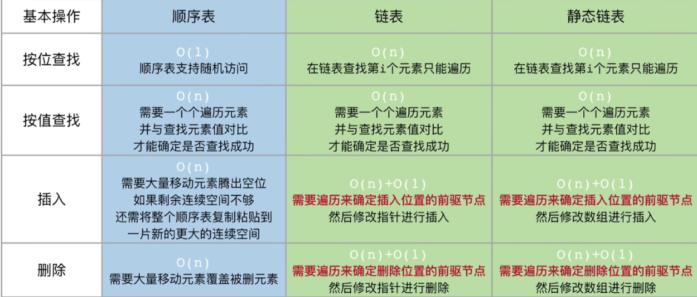
>2. 注意：一般的树无法使用线性表表示，因为树的孩子个数无法确定；而二叉树的孩子个数确定可以使用线性表确定

### 线性表的顺序表示
- <span style="background:#FFFF33;">表中元素的逻辑顺序与其物理存储顺序完全一致</span>
- 可在$O(1)$​时间内直接访问表中的任意位置的元素，称作“随机存取”
- <span style="background:#FFFF33;">插入和删除操作效率低下</span>，需移动数据
- <span style="background:#FFFF33;">需要连续的存储空间</span>

### 线性表的链式表示
>[!important] 概念区分：头指针、头结点、首元结点
>1. 头指针：一个指针，不是结点，是访问链表的唯一入口
>2. 头结点：在真正存放数据的第一个结点(首元结点)之前，额外附加的一个**不存实际数据(或存放长度等辅助信息)的结点**
>3. 首元结点：是链表中**第一个真正存放数据元素的结点**
>
>结构示意：
>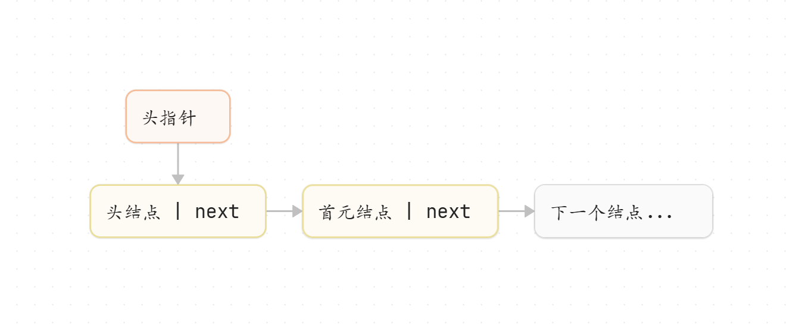
>[错题：添加头结点的作用](../错题集/错题集_1.md#^e78bea)

#### 单链表

插入：

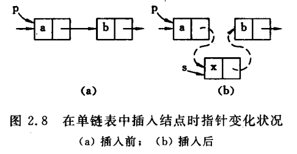

```c++
s->next=p->next; p->next=s;
```

删除：

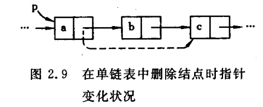

```c++
//考虑是否是链尾
if(p->next!=NULL){
    q=p->next;
    p->next=q->next;
    if(q!=NULL){
        free(q);
    }
}else{
    return;
}

//删除的结点以及旁边的结点均在链中
q=p->next; p->next=q->next; free(q);
```
#### 双链表

插入：

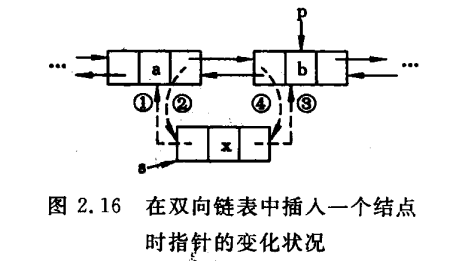

```c++
s->prior=p->prior;
s->next=p;
p->prior->next=s;
p->prior=s;
```

删除：

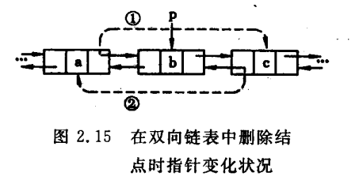

```c++
//删除的结点以及周围节点均在链中
p->prior->next=p->next;
p->next->prior=p->prior;
free(p);
```
#### 循环链表
- 循环单链表
- 循环双链表
[错题：循环单链表判空](../错题集/错题集_1.md#^798329)
[错题：循环双链表判空](../错题集/错题集_1.md#^65d72e)

#### 静态链表
>[!important] 强化：静态链表的相关内容
>1. 静态链表由数组实现，存储空间虽为顺序分配，但是元素的存储并非顺序存储(同单链表)，由指针编号将元素进行串联
>2. 静态链表空间一经分配确定，便无法增加与删除空间
>3. **静态链表中结点的删除/回收**：
>	1. 更改 删除结点的前驱 的指针编号为 删除结点的后继结点 编号
>	2. 删除结点的回收：
>		1. ~~标记法：更改删除结点的指针编号为 -2(或其他约定，不可指向 -1 或不变动，避免重新分配时无法确定是否为“空结点”)。\[分配时需要遍历整个数组，效率低下，易内存泄漏。\]~~(了解即可)
>		2. **加入 “可分配置池” 中**：将该节点链接到以**下标 0 为头结点**的空闲链表中

<div style="page-break-after: always;"></div>

## 第三章 栈、队列和数组

### 栈
**先进后出**，仅允许在一端进行插入删除操作

数学特性：当$n$个不同元素按固定顺序依次入栈时，可能出栈序列总数为$$\colorbox{yellow}{$\frac{1}{n+1}C_{2n}^n$}$$
[错题：出栈次序的判断](../错题集/错题集_1.md#^5d7346)
<font color="#548dd4">题型：出栈次序的个数、具体出栈次序中第 i 次出栈的可能元素</font>

#### 栈的顺序表示
略

#### 栈的链式表示
略

#### 共享栈

<span style="background:#FFFF00;">共享栈栈满的唯一条件是：<strong>两个栈的栈顶元素相邻</strong></span>

设栈1的栈顶指针 top1 位于低地址，栈2的栈顶指针 top2 位于高地址：

|     top1     |     top2     |    栈满条件     |                           示意图                           |
| :----------: | :----------: | :---------: | :-----------------------------------------------------: |
|    指向栈顶元素    |    指向栈顶元素    | top1+1=top2 | 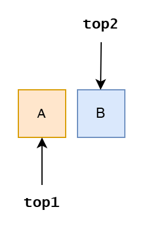 |
| 指向栈顶元素的下一个位置 |    指向栈顶元素    |  top1=top2  | 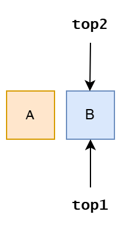  |
|    指向栈顶元素    | 指向栈顶元素的下一个位置 |  top1=top2  | 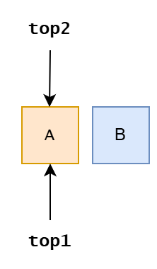 |
| 指向栈顶元素的下一个位置 | 指向栈顶元素的下一个位置 | top2+1=top1 | 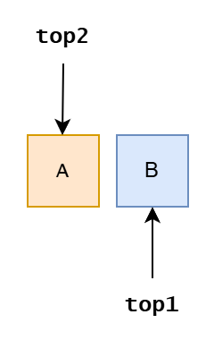  |


### 队列

**先进先出**

一般的，队首指针 front 指向队首元素，队尾元素 rear 指向队尾元素的下一个位置
[错题：队空时队首/尾指针的指向](../错题集/错题集_1.md#^51437a)

#### 循环队列

为解决顺序队列的假溢出问题，引入循环队列：<span style="background:#FFFF33;">将顺序存储空间在逻辑上组织为换装结构，可以通过取模运算(%)实现</span>.
- 初始状态：$Q.front=Q.rear$
- 队首指针进1(出队)：$Q.front=(Q.front+1)\%MaxSize$
- 队尾指针进1(入队)：$Q.rear=(Q.rear+1)\%MaxSize$
- 队列长度：$\color{red}{length=(Q.rear-Q.front+MaxSize)\%MaxSize}$
- 队满条件(<span style="background:#FF6666;">牺牲一个存储单元</span>)：$\color{red}{(Q.rear+1)\%MaxSize==Q.front}\quad\text{尾指针下一个位置为队首}$

> [!note]
> 辨析：
> 
> | 队首指针的指向   | 队尾指针的指向    | 队长的计算              | 队空的判断                   | 队满的判断               |
> | --------- | ---------- | ------------------ | ----------------------- | ------------------- |
> | 队首元素      | 队尾元素的下一个位置 | (rear-front+M)%M   | front \== rear          | (rear+1)%M == front |
> | 队首元素      | 队尾元素       | (rear-front+M+1)%M | (rear + 1) % M == front | size == M           |
> | 队首元素前一个位置 | 队尾元素       | (rear-front+M)%M   | size == 0               | size == M           |
> | 队首元素前一个位置 | 队尾元素下一个位置  | (rear-front+M-1)%M | size == 0               | size == M           |
> 
> 循环队列长度的计算：“**基准间距看尾首，尾指元素加一，首指前驱减一**”


#### 双端队列
- 双端插入删除均不受限
- 输入受限：允许在一端进行插入和删除，但在另一端仅允许删除
- 输出受限：允许在一端进行插入和删除，但在另一端仅允许插入

### 栈和队列的应用

#### 栈在括号匹配中的应用
算法思想如下:
1) 初始化一个空栈，顺序扫描输入的括号序列。
2) 若遇到左括号，将其压入栈中，表示新增一个待匹配的期待，且其优先级最高。
3) 若遇到右括号，则检查栈是否为空:若栈非空且栈顶左括号与当前右括号匹配，则弹出栈顶，完成一次匹配;否则，括号序列非法，算法终止。
4) 扫描结束后，若栈为空，则括号序列合法;否则，存在未匹配的左括号，序列非法。

#### 栈在表达式求值中的应用
- 算术表达式
- <u>中缀表达式转后缀表达式</u>
	- 遇到操作数:直接加入后缀表达式。
	- 遇到界限符:若为“(”，直接入栈;若为“)”，不入栈，且不断弹出栈顶运算符并加入后缀表达式，直到遇到“(”，将其弹出并丢弃。
	- 遇到运算符:
		- ①若其优先级高于栈顶运算符，或栈顶为“(”，则直接入栈;
		- ②若其优先级低于或等于栈顶运算符，则依次弹出栈中运算符并加入后缀表达式，直到栈空，或栈顶为“(”，或遇到优先级更低的运算符为止，再将当前运算符入栈。
	- 按上述方法扫描完所有字符后，将栈中剩余运算符依次弹出并加入后缀表达式。
- 后缀表达式求值

\[注意\]：从操作数栈中取数**a,b(a在栈顶)**，则对应的运算结果为：**b OPER a**.
[错题：表达式求值](../错题集/错题集_1.md#^cd254a)


#### 栈在递归中的应用
计算递归函数的调用次数
1. 绘制调用树：从初始调用开始，根据递归函数的定义，将每次调用展开为它直接调用的子调用，直至所有分支达到基例。 
2. 计数节点：统计树中所有节点的数量，即为总调用次数。

[题型：递归调用次数的计算](../错题集/错题集_1.md#^f65d1b) 
[题型：某次递归调用的判断](../错题集/错题集_1.md#^ba232b)

#### 队列在层次遍历的应用
[第5章 树与二叉树 › 层次遍历](第5章%20树与二叉树.md#层次遍历)

#### 队列在计算机中的应用

>[!important] 强化：栈与队列的相互实现
>1. 可以使用至少 1 个队列实现一个后进先出的栈
>2. 可以使用至少 2 个栈实现一个先进先出的队列：
>	1. 功能：输入栈(N)、输出栈(N)
>	2. 逻辑大小：2N
>	3. 基本操作算法

### 数组
#### 特殊数组的压缩存储
\[注意\]：按列优先/按行优先
- 对称矩阵
- 三角矩阵
- 三对角矩阵
- <span style="background:#FFFF33;">稀疏矩阵->三元组：(行号,列号,非零元素)</span>，均需额外存储原矩阵的行数、列数、非零元素的个数
	- 数组存储
	- 十字链表存储

<div style="page-break-after: always;"></div>

## 第四章 串

### <span style="background:#FFFF33;">KMP 算法</span>

#### 关键代码

```cpp
int Index_KMP(SString S,SString T){
    int i=1,j=1;
    int next[T.length+1];
    get_next(T,next);
    while(i<=S.length && j<=T.length){
	    //相互匹配，均向前移动
        if(j==0 || S.ch[i] == T.ch[j]){
            ++i;
            ++j;
        }else{
        //匹配失败，模式串回溯，主串不变化
            j = next[j];
        }
    }
    if(j>T.length)
        return i - T.length;
    else 
        return -1;
}

//计算next数组的算法实现
void get_next(SString T,int next[]){
    int i=1,j=0;
    next[1]=0;
    while(i<T.length){
        if(i==0||T.ch[i]==T.ch[j]){
            ++i;++j;
            next[i]=j;
        }
        else
            j=next[i];
    }
}
```

时间复杂度：最坏为 $\color{red}{O(m+n)}$​

#### 手算求 next 数组

1. <span style="background:#FFFF66;">next[1]都写 0；next[2]都写 1</span>
2. 其他next：
   - 方法一：
     - 当第$j$个字符匹配失败，由前 $1\textasciitilde j-1$ 个字符组成的串记为$S$，则：$next[j]=S$ 的<span style="background:#FFFF66;">最长相等前后缀长度</span>+$1$
   - 方法二：
     - 在不匹配的位置前，划一分界线
     - 模式串一步一步往后退，直到分界线之前“能对上”，或模式串完全跨过分界线为止。
     - 此时 j 指向哪儿，next数组值就是多少
#### next 数组的优化--nextval 数组

1. 求解 next 数组
2. 初始化 nextval\[1\]=next\[1\]
3. 依次遍历 next 数组中下标为 $2\textasciitilde n$​ 的元素，
	- <span style="background:#FFFF33;">若 T[j]=T[next[j]]，则 nextval[j]=nextval[next[j]]；</span>
	- <span style="background:#FFFF33;">否则 nextval[j]=next[j].</span>
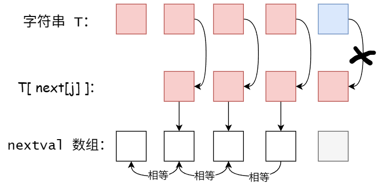

例子：

|  序号$j$   | 1                                          | 2                                          | 3                                          | 4                                          | 5                                          |
| :--------: | ------------------------------------------ | ------------------------------------------ | ------------------------------------------ | ------------------------------------------ | ------------------------------------------ |
| 模式串$T$  | a                                          | a                                          | a                                          | a                                          | b                                          |
|  next[j]   | 0                                          | 1                                          | 2                                          | 3                                          | 4                                          |
| T[next[j]] |                                            | a                                          | a                                          | a                                          | a                                          |
| nextval[j] | <span style="background:#FFFF66;">0</span> | <span style="background:#FFFF66;">0</span> | <span style="background:#FFFF66;">0</span> | <span style="background:#FFFF66;">0</span> | <span style="background:#FFFF66;">4</span> |

<div style="page-break-after: always;"></div>
---

---
## 数据结构定义与基本操作速查
### 线性表
#### 顺序表
```c
#define MaxSize 50
typedef struct {
    ElemType data[MaxSize];
    int length;                 // 当前表长
} SqList;                       // 顺序表类型

// 初始化
void InitList(SqList &L) { L.length = 0; }

// 插入 —— 在第 i 个位置(1≤i≤length+1)插入 e
bool ListInsert(SqList &L, int i, ElemType e) {
    if (i < 1 || i > L.length + 1) return false;
    if (L.length >= MaxSize)     return false;   // 表满
    for (int j = L.length; j >= i; j--)
        L.data[j] = L.data[j - 1];               // 后移
    L.data[i - 1] = e;
    L.length++;
    return true;
}

// 删除 —— 删除第 i 个位置的元素，用 e 返回
bool ListDelete(SqList &L, int i, ElemType &e) {
    if (i < 1 || i > L.length) return false;
    e = L.data[i - 1];
    for (int j = i; j < L.length; j++)
        L.data[j - 1] = L.data[j];               // 前移
    L.length--;
    return true;
}

// 按值查找 —— 返回位序，失败返回 0
int LocateElem(SqList L, ElemType e) {
    for (int i = 0; i < L.length; i++)
        if (L.data[i] == e) return i + 1;
    return 0;
}
```

#### 链式表
##### 单链表
```c
typedef struct LNode {
    ElemType data;
    struct LNode *next;
} LNode, *LinkList;

// 头插法建立(带头结点)
LinkList List_HeadInsert(LinkList &L) {
    L = (LinkList)malloc(sizeof(LNode));
    L->next = NULL;
    ElemType x; scanf("%d", &x);
    while (x != 9999) {                            // 约定结束标志
        LNode *s = (LNode*)malloc(sizeof(LNode));
        s->data = x;
        s->next = L->next; L->next = s;
        scanf("%d", &x);
    }
    return L;
}

// 尾插法建立(带头结点)
LinkList List_TailInsert(LinkList &L) {
    L = (LinkList)malloc(sizeof(LNode));
    LNode *r = L;                                 // r 为尾指针
    ElemType x; scanf("%d", &x);
    while (x != 9999) {
        LNode *s = (LNode*)malloc(sizeof(LNode));
        s->data = x; r->next = s; r = s;
        scanf("%d", &x);
    }
    r->next = NULL;
    return L;
}

// 按序号查找 —— 返回第 i 个结点的指针(带头结点时 i≥0)
LNode *GetElem(LinkList L, int i) {
    if (i < 1) return NULL;
    int j = 1;
    LNode *p = L->next;
    while (p && j < i) { p = p->next; j++; }
    return p;
}

// 按值查找
LNode *LocateElem(LinkList L, ElemType e) {
    LNode *p = L->next;
    while (p && p->data != e) p = p->next;
    return p;
}

// 插入 —— 在 i 个位置之后插入 e
bool ListInsert(LinkList &L, int i, ElemType e) {
    LNode *p = (i == 1) ? L : GetElem(L, i - 1); // 找到前驱
    if (!p) return false;
    LNode *s = (LNode*)malloc(sizeof(LNode));
    s->data = e; s->next = p->next; p->next = s;
    return true;
}

// 删除 —— 删除第 i 个结点，用 e 返回
bool ListDelete(LinkList &L, int i, ElemType &e) {
    LNode *p = (i == 1) ? L : GetElem(L, i - 1);
    if (!p || !p->next) return false;
    LNode *q = p->next; p->next = q->next;
    e = q->data; free(q);
    return true;
}

// 求表长
int Length(LinkList L) {
    int len = 0; LNode *p = L->next;
    while (p) { len++; p = p->next; }
    return len;
}
```

##### 双链表
```c
typedef struct DNode {
    ElemType data;
    struct DNode *prior, *next;
} DNode, *DLinkList;

// 在结点 p 之后插入 s
// s->next = p->next;
// s->prior = p;
// if (p->next) p->next->prior = s;
// p->next = s;

// 删除结点 p 的后继
// q = p->next; p->next = q->next;
// if (q->next) q->next->prior = p;
// free(q);
```

##### 循环单链表
```c
// 类型定义同单链表
// 判空：L->next == L
// 判表尾：p->next == L
// 借助尾指针可在 O(1) 内访问头尾
```

##### 循环双链表
```c
// 类型定义同双链表
// 判空：L->next == L && L->prior == L
// 判表尾：p->next == L
// 插入删除无需判断后继是否存在（循环结构保证非空）
```

##### 静态链表
```c
#define MaxSize 50
typedef struct {
    ElemType data;
    int next;               // 游标，指示后继数组下标
} SLinkList[MaxSize];
// 通常下标 0 作为头结点，next == -1 表示链尾
// 空闲结点通过"备用链表"管理(以 0 为头)

// 查找第 i 个结点(按位序)
int Locate(SLinkList L, int i) {
    if (i < 1) return -1;
    int p = L[0].next, j = 1;
    while (p != -1 && j < i) {
        p = L[p].next; j++;
    }
    return (p != -1) ? p : -1;
}
```

### 栈、队列、数组与串
#### 栈
##### 顺序栈
```c
#define MaxSize 50
typedef struct {
    ElemType data[MaxSize];
    int top;                 // 栈顶指针，初始为 -1
} SqStack;

void InitStack(SqStack &S)     { S.top = -1; }
bool StackEmpty(SqStack S)     { return S.top == -1; }
bool StackFull(SqStack S)      { return S.top == MaxSize - 1; }

bool Push(SqStack &S, ElemType x) {
    if (S.top == MaxSize - 1) return false;   // 栈满
    S.data[++S.top] = x;                       // 先移指针再入栈
    return true;
}

bool Pop(SqStack &S, ElemType &x) {
    if (S.top == -1) return false;            // 栈空
    x = S.data[S.top--];                       // 先出栈再移指针
    return true;
}

bool GetTop(SqStack S, ElemType &x) {
    if (S.top == -1) return false;
    x = S.data[S.top];
    return true;
}
```

##### 链式栈
```c
typedef struct LNode {
    ElemType data;
    struct LNode *next;
} LNode, *LiStack;           // 以链表头作为栈顶

// 入栈(头插)
bool Push(LiStack &S, ElemType x) {
    LNode *s = (LNode*)malloc(sizeof(LNode));
    s->data = x; s->next = S; S = s;
    return true;
}

// 出栈
bool Pop(LiStack &S, ElemType &x) {
    if (!S) return false;
    LNode *p = S; S = S->next;
    x = p->data; free(p);
    return true;
}

bool GetTop(LiStack S, ElemType &x) {
    if (!S) return false;
    x = S->data;
    return true;
}
```

##### 共享栈
```c
#define MaxSize 50
typedef struct {
    ElemType data[MaxSize];
    int top1, top2;          // top1 从 -1 开始，top2 从 MaxSize 开始
} ShStack;

void InitStack(ShStack &S) {
    S.top1 = -1; S.top2 = MaxSize;
}

bool Push1(ShStack &S, ElemType x) {
    if (S.top1 + 1 == S.top2) return false;   // 栈满条件：两栈顶相邻
    S.data[++S.top1] = x;
    return true;
}

bool Push2(ShStack &S, ElemType x) {
    if (S.top1 + 1 == S.top2) return false;
    S.data[--S.top2] = x;
    return true;
}

// Pop1 / Pop2 / GetTop1 / GetTop2 判空条件分别为
// top1 == -1 / top2 == MaxSize，其余与顺序栈类似
```

#### 队列
##### 循环队列
```c
#define MaxSize 50
typedef struct {
    ElemType data[MaxSize];
    int front, rear;        // front 指向队首，rear 指向队尾的下一个位置
} SqQueue;                  // 采用循环队列(牺牲一个单元区分队满)

void InitQueue(SqQueue &Q)     { Q.front = Q.rear = 0; }
bool QueueEmpty(SqQueue Q)     { return Q.front == Q.rear; }

// 队满：(Q.rear + 1) % MaxSize == Q.front

bool EnQueue(SqQueue &Q, ElemType x) {
    if ((Q.rear + 1) % MaxSize == Q.front)
        return false;                           // 队满
    Q.data[Q.rear] = x;
    Q.rear = (Q.rear + 1) % MaxSize;
    return true;
}

bool DeQueue(SqQueue &Q, ElemType &x) {
    if (Q.front == Q.rear) return false;        // 队空
    x = Q.data[Q.front];
    Q.front = (Q.front + 1) % MaxSize;
    return true;
}

// 队长：(Q.rear - Q.front + MaxSize) % MaxSize
```

##### 链式队列
```c
typedef struct QNode {              // 队列结点
    ElemType data;
    struct QNode *next;
} QNode;

typedef struct {                     // 队列(含头尾指针)
    QNode *front, *rear;
} LinkQueue;

// 初始化(带头结点)
void InitQueue(LinkQueue &Q) {
    Q.front = Q.rear = (QNode*)malloc(sizeof(QNode));
    Q.front->next = NULL;
}

bool QueueEmpty(LinkQueue Q) { return Q.front == Q.rear; }

void EnQueue(LinkQueue &Q, ElemType x) {
    QNode *s = (QNode*)malloc(sizeof(QNode));
    s->data = x; s->next = NULL;
    Q.rear->next = s; Q.rear = s;
}

bool DeQueue(LinkQueue &Q, ElemType &x) {
    if (Q.front == Q.rear) return false;          // 队空
    QNode *p = Q.front->next;
    x = p->data;
    Q.front->next = p->next;
    if (Q.rear == p) Q.rear = Q.front;            // 原队列仅一个结点
    free(p);
    return true;
}
```

##### 顺序队列(非循环)
```c
// 类型定义同循环队列，仅在入队时队尾指针直接递增
// 队满条件变为 rear == MaxSize（假溢出无法自动释放空间）
// 实际应用中直接用循环队列代替，此处略
```

#### 数组与特殊矩阵
##### 数组的存储映射
```c
// 一维数组：Loc(i) = Loc(0) + i × sizeof(ElemType)
// 二维数组(行优先)：Loc(i,j) = Loc(0,0) + (i × n + j) × sizeof(ElemType)
// 二维数组(列优先)：Loc(i,j) = Loc(0,0) + (j × m + i) × sizeof(ElemType)
```

##### 对称矩阵压缩
```c
// n 阶对称矩阵，只需存入主对角线 + 下三角(含对角线)
// 元素总数：n(n+1)/2
// 按行优先存于一维数组 B[n(n+1)/2]
// 元素 a_ij(i≥j) 在 B 中的下标：
//   k = i(i-1)/2 + j - 1      (若下标从 0 开始)
// 当 i<j 时，交换 i,j 再带入上式
```

##### 三角矩阵
```c
// 下三角矩阵：n 阶，存下三角(含对角线) + 1 个常数 C
// 元素总数：n(n+1)/2 + 1
// k = i(i-1)/2 + j - 1   (i≥j)
// k = n(n+1)/2           (i<j，存放常数)
```

##### 三对角矩阵(带状矩阵)
```c
// n 阶，三条对角线：|i-j| ≤ 1 的非零元素
// 非零元素总数：3n - 2
// 按行优先存于一维数组 B[3n-2]
// a_ij 在 B 中的下标：
//   k = 2i + j - 3       (若下标从 1 开始)
//   k = 2i + j - 4       (若下标从 0 开始)
```

##### 稀疏矩阵——三元组
```c
#define MaxSize 100
typedef struct {
    int i, j;               // 非零元的行号、列号
    ElemType e;             // 非零元的值
} Triple;

typedef struct {
    Triple data[MaxSize];   // 三元组表
    int mu, nu, tu;         // 矩阵行数、列数、非零元个数
} TSMatrix;

// 转置的经典算法(按列扫描三元组)略，可借助 num[]+cpot[] 实现 O(nu+tu)
```

##### 稀疏矩阵——十字链表
```c
typedef struct OLNode {
    int i, j;                    // 非零元行号、列号
    ElemType e;                  // 非零元值
    struct OLNode *right, *down; // 指向同行的下一结点、同列的下一结点
} OLNode;

typedef struct {
    OLNode *rhead, *chead;       // 行链表头指针数组、列链表头指针数组
    int mu, nu, tu;              // 矩阵行数、列数、非零元个数
} CrossList;
```

#### 串
```c
#define MaxLen 255
typedef struct {
    char ch[MaxLen];        // 一般从下标 1 开始存储字符（0 号留空或存长度）
    int length;
} SString;

// 求子串 —— 返回 S 中从 pos 起 len 个字符的子串
bool SubString(SString &Sub, SString S, int pos, int len) {
    if (pos + len - 1 > S.length) return false;
    for (int i = pos; i < pos + len; i++)
        Sub.ch[i - pos + 1] = S.ch[i];
    Sub.length = len;
    return true;
}

// 比较 —— 字典序，S>T 返回正，相等返回 0
int StrCompare(SString S, SString T) {
    for (int i = 1; i <= S.length && i <= T.length; i++)
        if (S.ch[i] != T.ch[i])
            return S.ch[i] - T.ch[i];
    return S.length - T.length;                  // 长度长的更大
}

// 定位 —— 返回模式串 T 在主串 S 中首次出现的位置（朴素模式匹配）
int Index(SString S, SString T) {
    int i = 1, j = 1;
    while (i <= S.length && j <= T.length) {
        if (S.ch[i] == T.ch[j]) { i++; j++; }
        else { i = i - j + 2; j = 1; }          // 回溯
    }
    if (j > T.length) return i - T.length;
    return 0;
}

// 求 next 数组（KMP）
void get_next(SString T, int next[]) {
    int i = 1, j = 0;
    next[1] = 0;
    while (i < T.length) {
        if (j == 0 || T.ch[i] == T.ch[j]) {
            i++; j++;
            next[i] = j;
        } else {
            j = next[j];
        }
    }
}

// 求 nextval 数组（KMP 优化）
void get_nextval(SString T, int nextval[]) {
    int i = 1, j = 0;
    nextval[1] = 0;
    while (i < T.length) {
        if (j == 0 || T.ch[i] == T.ch[j]) {
            i++; j++;
            if (T.ch[i] != T.ch[j]) nextval[i] = j;
            else nextval[i] = nextval[j];
        } else {
            j = nextval[j];
        }
    }
}

// KMP 匹配
int Index_KMP(SString S, SString T, int next[]) {
    int i = 1, j = 1;
    while (i <= S.length && j <= T.length) {
        if (j == 0 || S.ch[i] == T.ch[j]) { i++; j++; }
        else j = next[j];
    }
    if (j > T.length) return i - T.length;
    else return 0;
}
```

