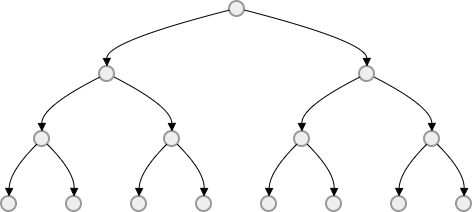
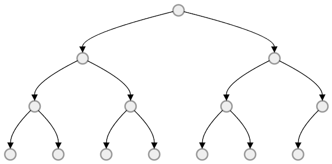
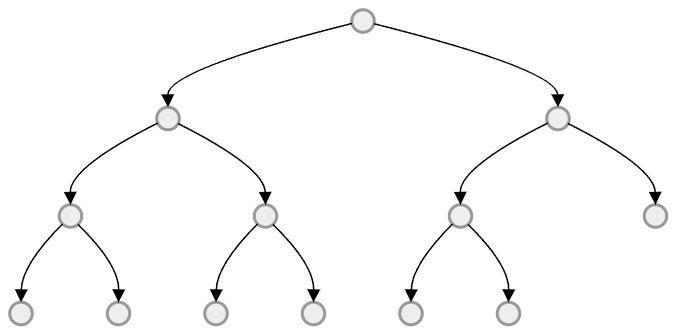
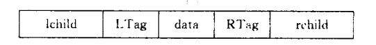
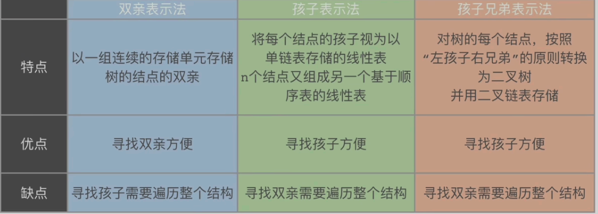
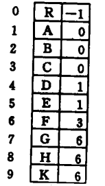
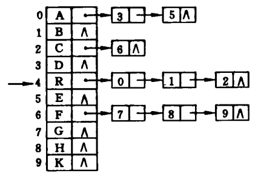
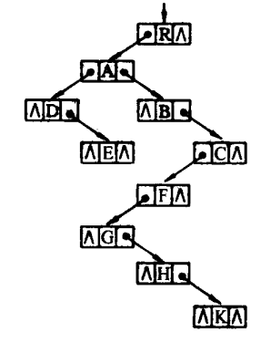

# 数据结构

## 第五章 树与二叉树

### 树的常考性质

1. <span style="background:#FFFF66;">结点数 = 总度数 + 1</span>
2. <span style="text-decoration:underline;">度为 m 的树</span> 一定是非空树且<span style="background:#FFFF66;">至少有一个结点的度为 m</span>；<span style="text-decoration:underline;">m 叉树</span>可以是空树并且允许所有节点的度小于 m.
3. <span style="text-decoration:underline;">度为 m 的树/m 叉树</span>(均为满 m 叉树) 第 i 层最多有 $\color{red}{m^{i-1}}$ 个结点.
4. 高度为 h 的 <u>m 叉树/度为 m 的树</u> (均为满 m 叉树)最多有(等比数列求和)$$\colorbox{yellow}{$\frac{1-m^h}{1-m}$}$$ 个结点. 
5. 高度为 h 的 <u>m 叉树</u>(每一层均只有一个结点) 至少有 h 个结点；高度为 h 的<u>度为 m 的树</u>至少有 h+m-1 个结点.
6. 具有 n 个结点的 <u>m 叉树/度为 m 的树</u> 的最小高度为 $\color{red}{\left\lceil \log_m \left( n(m-1) + 1 \right) \right\rceil}$.​
7. 任意一个具有 n 个结点的树均有 <span style="background:#FFFF33;">n-1</span> 条边.

> 证明（简要）：
> 1. **结点数 = 总度数 + 1**：
>    在有根树中，把每条父-子边计入父节点的度（子数），则除了根以外每个结点有且只有一个父节点，因此边数等于总度数；树的边数为 n-1，故 n = 总度数 + 1。
>
> 2. **关于"度为 m 的树"与"m 叉树"的差别**：
>    "度为 m 的树"要求存在节点的最大度是 m，因此该树非空且至少一个结点的度为 m；而"m 叉树"通常指每个节点的度不超过 m（即每个节点最多有 m 个孩子），允许空树且所有节点的度可能均小于 m。
>
> 3. **第 i 层最多有 $m^{i-1}$ 个结点**：
>    根（第 1 层）有 1 个结点；每个结点最多有 m 个孩子，因此第 2 层最多有 m 个，第 3 层最多有 $m^2$ 个，以此类推，第 i 层最多 $m^{i-1}$。
>
> 4. **高度为 h 的 m 叉树最多结点数**：
>    若每层都达到最大，则总结点数为几何级数 $1 + m + m^2 + \dots + m^{h-1} = \frac{1-m^h}{1-m}$（当 $m\neq1$ 时）。
>
> 5. **最少结点数**：
>    高度为 h 的 m 叉树至少有 h 个结点：构造一条单链（每个结点只有 1 个孩子）即可达到高度 h，结点数为 h，为最小。
>    若要求存在一个度为 m 的节点（"度为 m 的树"），则在达到高度 h 的同时还需保留该节点的 m-1 个额外子节点，故最少结点数为 h+(m-1)= h+m-1（可在链上的某一层加入额外孩子构造）。
>
> 6. **最小高度公式的由来**：
>    满 m 叉树在高度为 H 时最多结点为 $\frac{1-m^{H}}{1-m}$，反解不等式以 n 为已知求 H，得到 $H\ge\log_m\big(n(m-1)+1\big)$，取上整得公式 $\left\lceil \log_m \left( n(m-1) + 1 \right) \right\rceil$。

### 二叉树

#### 二叉树的性质

1. 度为 0 的结点个数等于度为 2 的节点个数加 1: $\color{red}{n_0 = n_2 + 1}$.
2. （此时为满二叉树）第 i 层结点的个数最多为 $2^{i-1}$ 个（前 i 层的结点总数最多为 $2^i-1$）
3. 高度为 h 的二叉树至多有 $2^h-1$​ 个结点

> 证明（简要）：
> 1. **$n_0 = n_2 + 1$**：
>    设二叉树中度为 0、1、2 的节点个数分别为 $n_0,n_1,n_2$，节点总数为 $n=n_0+n_1+n_2$。边数为 $n-1$，同时按出度计数（每个度为 1 的结点有 1 条出边，度为 2 的结点有 2 条出边），总出边数为 $n_1+2n_2$，于是 $n_1+2n_2=n-1$。代入 $n$ 得 $n_1+2n_2=n_0+n_1+n_2-1$，整理得 $n_0=n_2+1$。
>
> 2. **第 i 层最多 $2^{i-1}$**：
>    根（第 1 层）1 个，每个结点最多 2 个孩子，按层级增长最多倍增，故第 i 层最多 $2^{i-1}$；前 i 层总和为几何级数 $1+2+\dots+2^{i-1}=2^i-1$。
>
> 3. **高度为 h 的二叉树最多 $2^h-1$**：
>    若每层都满，则前 h 层结点数为 $2^h-1$​，达到最大。


#### 特殊二叉树

##### 满二叉树

定义：
每一层都含有该层所能容纳的最大结点数.

性质：
1. 高度为 h 的满二叉树能包含 $2^h-1$ 个结点
2. <span style="background:#FFFF66;">仅有度为 0,2 的结点</span>，且叶子节点仅出现在最后一层，其余节点均有左右子树



##### 完全二叉树

定义：
1. **层次编号连续**：所有结点的编号都与相同结点数的满二叉树中编号$1\sim n$的结点完全对应
2. **叶结点仅在最后两层**

性质：
1. 具有 n 个结点的完全二叉树的高度 h 为 $\lfloor \log_2 n \rfloor$ 或 $\lceil \log_2(n+1) \rceil - 1$
2. 对于完全二叉树，可以由结点数 n 推出度为 0、1、2 的节点个数 $n_0,n_1,n_2$​
3. 对完全二叉树按从上到下、从左到右的顺序依次编号 $1,2,\dots,n$ ，则有以下关系：(注意起始编号，会影响下面的计算)
   ① <mark style="background:#ff4d4f">最后一个分支结点的编号为</mark>$\lfloor n/2 \rfloor$，若$i \le \lfloor n/2 \rfloor$，则结点 $i$ 为分支结点，否则为叶结点。
   ② 叶结点只可能出现在最后两层上(相当于<span style="background:#FFFF00;">在相同高度的满二叉树的最底层、最右侧减少一些连续叶结点</span>；<mark style="background:#fff88f">当减少两个及以上叶结点时，次底层将出现叶结点</mark>)。
   ③ <span style="background:#FF6666;">若存在度为1的结点，则最多只可能有一个，且该结点只有左孩子而无右孩子</span>(度为 $1$ 的分支结点只可能是最后一个分支结点，其结点编号为$\lfloor n/2 \rfloor$)。
   ④ 按层序编号后，一旦某个结点$i$为叶结点或仅有左孩子，则所有编号大于$i$的结点均为叶结点（与上述结论 ① 和结论 ③ 一致）。
   ⑤ <span style="background:#FF6666;">若n为奇数，则每个分支结点都有左右孩子；若n为偶数，则编号最大的分支结点（编号为n/2）只有左孩子，没有右孩子，其余分支结点都有左右孩子</span>。
   ⑥ <span style="background:#FF6666;">当i>1时，结点i的双亲结点的编号为</span> $\lfloor i/2 \rfloor$。(注意起始编号)
   ⑦ 若结点$i$有左右孩子，则左孩子编号为$2i$，右孩子编号为$2i+1$。(注意起始编号)
   ⑧ <span style="background:#FF6666;">结点i所在层次（深度）为</span>$\lfloor \log_2 i \rfloor+1$。

>证明（简要）：
>1. 完全二叉树在层次上从上到下、从左到右填充，最高层满时层数与 $2^k$ 的关系给出 $\lfloor\log_2 n\rfloor$ 等式推导；也可从 $2^h\le n<2^{h+1}$ （第 h 层及以前至少有 $2^h$ 个位置）得到等价形式 $h=\lfloor\log_2 n\rfloor$，以及 $h=\lceil\log_2(n+1)\rceil-1$​​ 的等价变形。






#### 二叉树的存储结构
##### 二叉树的顺序存储结构
- <span style="background:#FF6666;">完全二叉树与满二叉树</span>特别适合采用<span style="background:#FFFF00;">顺序存储</span>，其<mark style="background:#ff4d4f">结点编号能唯一反应结点之间的关系</mark>，既能最大限度地节省存储空间，又可以直接通过数组下标快速确定结点在二叉树中的位置以及父子、兄弟关系。
- 对于<span style="background:#FF6666;">一般的二叉树</span>，需插入若干"空节点"，使其结构与<span style="background:#FF6666;">同高度的完全二叉树</span>一致，再将所有结点（包括空节点）按层序存入数组。

##### 二叉树的链式存储结构
<span style="background:#FFFF33;">在含有 n 个结点的二叉链表中，共有 n+1 个空链域</span>

#### 二叉树的遍历
1. 每个结点均被访问依次且仅一次，时间复杂度均为 O(n)
2. 在递归实现中，系统工作栈的深度等于树的高度，在最坏的情况下，空间复杂度为 O(n)
##### 先序遍历：根左右

```cpp
//递归法
void PreOrder(BiTree T){
    if(T!=NULL){
        visit(T);
        PreOrder(T->lchild);
        PreOrder(T->rchild);
    }
}
//非递归法
void PreOrder(BiTree T){
    if(T==NULL)return;
    InitStack(S);
    BiTree p;
    PushStack(S,T);
    while(!IsEmpty(S)){
        PopStack(S,p);
        visit(p);
        if(p->rchild)PushStack(S,p->rchild);
        if(p->lchild)PushStack(S,p->lchild);
    }
}
```

##### 中序遍历：左根右

```cpp
//递归法
void InOrder(BiTree T){
    if(T!=NULL){
        InOrder(T->lchild);
        visit(T);
        InOrder(T->rchild);
    }
}
//非递归法
void InOrder(BiTree T){
    if(T==NULL)return;
    InitStack(S);
    BiTree p;
    p=T;
    while(p!=NULL || !IsEmpty(S)){
        // 1. 左路到底：所有左孩子入栈
        while(p!=NULL){
            PushStack(S,p);
            p=p->lchild;
        }
        // 2. 弹出栈顶（左子树处理完），访问根节点
        PopStack(S,p);
        visit(p);
        // 3. 处理右子树
        p=p->rchild;
    }
}
```

##### 后序遍历：左右根

```cpp
//递归法
void PostOrder(BiTree T){
    if(T!=NULL){
        PostOrder(T->lchild);
        PostOrder(T->rchild);
        visit(T);
    }
}
//非递归法
void PostOrder(BiTree T){
    if(T==NULL)return;
    InitStack(S);
    BiTree p,pre;
    p=T;
    pre=NULL;// 记录上一个访问的节点（判断右子树是否处理完）
    while(p!=NULL || !IsEmpty(S)){
        // 1. 左路到底，入栈
        while(p!=NULL){
            PushStack(S,p);
            p=p->lchild;
        }
        // 2. 查看栈顶，不弹出
        PopStack(S,p);
        // 右子树为空 或 右子树已访问过 → 访问当前节点
        if(p->rchild == NULL || p->lchild == pre){
            PopStack(S,p);
            visit(p);
            pre=p;
            p=NULL;
        }else{
            // 右子树未处理 → 处理右子树
            p=p->rchild;
        }
    }
}
```

##### 层次遍历

```C
void LevelOrder(BiTree T){
    InitQuene(Q);
    BiTree p;
    EnQuene(Q,T);
    while(!IsEmpty(Q)){
        DeQuene(Q,p);
        visit(p);
        if(p->lchild){
            EnQuene(Q,p->lchild);
        }
        if(p->rchild){
            EnQuene(Q,p->rchild);
        }
    }
}
```

>[!important] 强化：树的非递归遍历算法的深度理解
>1. 简单扼要的算法思想
>	1. 先序遍历：一路向左，遇到结点就先访问再压栈；直至走到左空，弹栈访问右子树，继续一路向左
>	2. 中序遍历：一路向左，遇到结点就压栈；直至走到左空，弹出结点先访问，然后转向右子树，继续一路向左
>	3. 后序遍历：\[访问该结点前需先判断该结点的右子树是否被访问\]
>2. 辅助栈 中存放的序列的含义
>	1. 先序遍历和中序遍历中，元素的入栈次序即为 先序遍历序列，而元素的出栈序列即为 中序遍历序列
>	2. 先序、中序、后序遍历中，栈中存留元素即为 (刚)弹出元素的祖先链

##### 由遍历序列构建二叉树
- 若<span style="background:#FFFF33;">已知中序序列</span>，并辅以其他三种遍历序列中的任意一中，则<span style="background:#FFFF33;">可以唯一确定该二叉树</span>。
- 仅凭先序、后序、层序序列中的任意两种组合，通常无法唯一确定一棵二叉树。

###### 可唯一确定的二叉树
\[暴力求解\]表格法
**横中序，竖前/后(倒序)/层序，交点即为所求；最高为根，左右分治**.

例：

| 前序 \ 中序 |  D   |  B   |  E   |  A   |  F   |  C   |  G   |
| :---------: | :--: | :--: | :--: | :--: | :--: | :--: | :--: |
|      A      |      |      |      |  A   |      |      |      |
|      B      |      |  B   |      |      |      |      |      |
|      D      |  D   |      |      |      |      |      |      |
|      E      |      |      |  E   |      |      |      |      |
|      C      |      |      |      |      |      |  C   |      |
|      F      |      |      |      |      |  F   |      |      |
|      G      |      |      |      |      |      |      |  G   |

###### 无法唯一确定的二叉树
- ==仅给定<u>前序/中序/后序</u>一种序列，可能的二叉树有 $\color{red}{\frac{1}{n+1}C^n_{2n}}$​ 种.==
  - 前序：第一个元素必为整棵树根，剩余 n-1 个元素可任意分配给左/右子树（左 k 个、右 n-1-k 个），所有分配方式的组合数之和就是卡特兰数.
  - 后序：最后一个必为树根，推理同上.
  - 中序：序列中任意一个元素都可作为根，根左边为左子树、右边为右子树，递归组合的总数就是卡特兰数.
- 仅给定层序序列，无固定通项，可能的树数量远大于卡特兰数
- 给定前序与后序序列，并满足<u><mark style="background:#fff88f">前序序列与后序列互为逆序列</mark></u>，则该二叉树满足<span style="background:#FFFF33;">每层结点个数均为 1 </span>；进一步地，若该二叉树的结点个数为 n，则树形有 $2^{n-1}$ 种。 

>[!important] 强化：卡特兰数的总结
>1. 给定 n 个元素的入栈序列，则出栈序列的种类为 n 的卡特兰数
>2. 给定 n 个元素的出栈序列，则入栈序列的种类为 n 的卡特兰数
>3. n 个结点的二叉树树型，为 n 的卡特兰数
>4. n 个结点的普通树的树型(结合树与二叉树的转换)，为 n-1 的卡特兰数
>5. n 个结点的森林的形态，为 n 的卡特兰数
>6. 给定二叉树的 先序/中序/后序 的一种，则二叉树的种类为 n 的卡特兰数

>[!important] 强化：根据已知序列判断给定序列是否合法
>要点：前序遍历序列对应的是“入栈序列”，中序遍历序列对应的是“出栈序列”
>
>| 已知序列 | 待判断序列 | 方法                        |
| ---- | ----- | ------------------------- |
| 先序   | 中序    | 入栈序列判断出栈序列                |
| 中序   | 先序    | 出栈序列判读入栈序列                |
| 后序   | 中序    | 后序反转即为镜像树的先序；中序反转即为镜像树的中序 |
| 中序   | 后序    | 同上                        |
| 先序   | 后序    | -                         |
| 后序   | 先序    | -                         |


#### 线索二叉树

规定：
- 结点无左子树，则 lchild 指向指定序列的前驱结点，ltag = 1.
- 结点无右子树，则 rchild 指向指定序列的后继结点，rtag = 1.



##### 中序线索二叉树(考察较多)
查找后继：
- rtag=1，后继为 rchild 指向的结点
- rtag=0，后继为 <mark style="background:#40a9ff">右子树最左下的结点</mark>

查找前驱：
- ltag=1，前驱为 lchild 指向的结点
- ltag=0，前驱为 <mark style="background:#40a9ff">左子树最右下的结点</mark>

##### 前序线索二叉树
查找后继：
- 有左孩子，则后继为左孩子结点
- 无左孩子但有右孩子，则后继为右孩子结点
- 为叶子结点，则后继为 rchild 指向的结点

<span style="background:#FF6666;">查找前驱过于复杂</span>

##### 后序线索二叉树
<span style="background:#FF6666;">查找后继过于复杂</span>，易于查找前驱

>[!important] 强化：线索二叉树的遍历算法(了解即可)
>线索化的核心代码(并不针对特定的某种序列的线索化)
>(了解即可，真题对线索化的考查仅限于手动模拟)
>
>```cpp
>pre = NULL;// p 的前驱结点
>
>if (!p->lchild)
>{
>    p->lchild = pre;
>    p->ltag = 1;
>}
>if (pre && !pre->rchild)
>{
>    pre->rchild = p;
>    pre->rtag = 1;
>}
>pre = p;
>```


### 树、森林

#### 树的存储结构



##### 双亲表示法



利用<mark style="background:#fff88f">每个结点有且只有一个双亲</mark>的性质；<mark style="background:#fff88f">查找任意结点的双亲非常高效</mark>。

##### 孩子表示法



- 每个结点的所有孩子视为一个线性表，并用单链表存储。所有孩子链表的头指针集中存放在一个顺序表中。
- <mark style="background:#fff88f">便于查找孩子结点</mark>

##### 孩子兄弟表示法



- 二叉链表存储，结点保存：数据域、<mark style="background:#fff88f">指向第一个孩子的指针(右)、指向下一个兄弟的指针(左)</mark>
- <mark style="background:#ff4d4f">可以自然地将树转化为二叉树</mark>
- <mark style="background:#fff88f">便于查找孩子结点</mark>，不便于查找双亲节点


#### 树/森林与二叉树的转换

森林：互不相交的若干颗树称为森林

##### <mark style="background:#40a9ff">树转换为二叉树</mark>：
1. 对每一个结点，删去它除了第一个孩子之外的所有连线，第一个孩子作为它的左孩子；
2. 将兄弟结点从左到右依次连线，作为前一个结点的右孩子 / 或整体顺时针旋转 45°。
##### <mark style="background:#40a9ff">森林转换为二叉树</mark>：
1. 将森林中的每棵树转换成相应的二叉树。
2. 每棵树的根也可视为兄弟关系，从第二棵树开始，依次成为前一棵树的右孩子。
##### 特殊点
1. <span style="background:#FFFF33;">二叉树中结点右指针为空，则在对应的树/森林中该结点无兄弟；左指针为空，则无子树，对应叶子节点</span>
2. **树**转化为二叉树时，树的每个分支结点的所有子结点中的最右子结点无右孩子，根结点转换后也没有右孩子，因此，<span style="background:#FFFF33;">对应二叉树中无右孩子的结点个数为 <strong>原树除叶结点外结点个数+1(根节点)，即 $N-n_0+1$</strong></span>；**森林**转为二叉树，对应二叉树中无右孩子的结点个数仍为 <mark style="background:#fff88f">$N-n_0+1$</mark>(其中 +1 是指最后一棵树的根) 
3. 森林中树的个数为对应为二叉树中从根结点开始，一直沿着右孩子指针向下所经过的结点个数
4. <mark style="background:#fff88f">森林/树中叶节点数</mark>为对应<mark style="background:#fff88f">二叉树中左指针为空的结点个数</mark>

#### 树/森林的遍历

|                       树                       |                      二叉树                      |  森林  |
| :-------------------------------------------: | :-------------------------------------------: | :--: |
|                     先根遍历                      |                     先序遍历                      | 先序遍历 |
| <span style="background:#FFFF33;">后根遍历</span> | <span style="background:#FFFF00;">中序遍历</span> | 中序遍历 |

### 树与二叉树的应用

#### 哈夫曼树

##### 带权路径长度
定义：从树的根结点到某一结点的路径长度与该结点的权值乘积，称为该结点的带权路径长度。
<span style="background:#FFFF00;">树的所有叶结点的带权路径长度之和称为该树的带权路径长度(WPL)</span>，记为：
$$
WPL=\sum_{i=1}^{n}w_il_i\quad w_i\text{为第}i\text{个叶结点的权值，}l_i\text{为该叶结点到根结点的路径长度}
$$
WPL 最小的二叉树称为哈夫曼树

##### 哈夫曼树的构造
给定 $n$ 个权值分别为 $w_1, w_2, \cdots, w_n$ 的结点，构造哈夫曼树的步骤如下：

1）将这 $n$ 个结点分别视为 $n$ 棵仅含一个结点的二叉树，构成森林 $F$。
2）构造一个新结点，从 $F$ 中<mark style="background:#40a9ff">选取两棵根结点权值最小的树</mark>作为其左右子树，并将新结点的权值设为左右子树根结点的权值之和。
3）从 $F$ 中删除所选的两棵树，并将新生成的树加入 $F$。
4）重复步骤 2）和 3），直至 $F$ 中仅剩一棵树为止，最终得到的树即为哈夫曼树。

##### 哈夫曼树的性质

1）<span style="background:#FFFF33;">每个初始结点最终都成为叶结点</span>，且<mark style="background:#fff88f">权值越小的结点，其到根的路径长度越大</mark>。
2）构造过程中共新建了 $n-1$ 个结点（<mark style="background:#d3f8b6">双分支结点</mark>），因此<span style="background:#FFFF33;">哈夫曼树的结点总数为 2n-1</span>。
3）每次合并均选取两棵树，故<span style="background:#FFFF33;">哈夫曼树中不存在度为 1 的结点（为严格二叉树）</span>。
4）哈夫曼树的带权路径长度计算：<span style="background:#FFFF33;">① 所有叶子结点<u>带权路径长度</u>总和；② 所有<u>分支节点(即非叶节点)</u>的<u>权值</u>总和</span>
5）推广：m 叉哈夫曼树的构造，需要添加“虚段”，同“最佳归并树” [最佳归并树的构造](第8章%20排序.md#多路归并的最佳归并树)

##### 哈夫曼编码
- 前缀码：编码集中，没有任意一个编码是另一个编码的前缀
- 利用哈夫曼树可以设计出总长最短的二进制前缀编码


#### 并查集

##### 并查集的存储结构
- 树的<span style="background:#FFFF33;">双亲表示法</span>
- 数组下标表示集合中的元素，而每个元素所存值为双亲结点的下标
##### 并查集的操作

```cpp
//初始化
void Initial(int parent[],int size){
    for(int i=0;i<size;i++){
        parent[i]=-1;
    }
}


//Find操作:O(d),d 指树的深度
int Find(int parent[],int x){
    while(parent[x]>=0){
        x=parent[x];
    }
    return x;
}

//优化后的 Find 操作:压缩路径机制，树的深度为 O(\alpha(n))，接近常数
int Find_val(int parent[],int x){
    if(parent[x]<0){
        return parent[x];
    }
    int root = Find_val(parent,parent[x]);
    parent[x] = root;
    return root;
}


//Union 操作：O(1)
void Union(int parent[],int Root1,int Root2){
    if(Root1==Root2)return;
    parent[Root1]=Root2;
}

//优化后的 Union 操作：小树并入大树，树根放集合元素个数的相反数；树的深度不大于 ⌊log_{2}n⌋+1
void Union_val(int parent[],int Root1,int Root2){
    if(Root1==Root2)return;
    if(parent[Root1]>parent[Root2])
    {
        parent[Root2]+=parent[Root1];
        parent[Root1]=Root2;
    }
    else {
        parent[Root1]+=parent[Root2];
        parent[Root2]=Root1;
    }
}
```

##### 并查集的应用
1. <u>判断图中是否有环路</u>
	- **简要说明**：遍历图中每条边，如果边的两个顶点已经属于同一个集合（即已经连通），则说明添加这条边会形成环路；否则将这两个顶点合并到同一个集合。
2. <u>用于实现克鲁斯卡尔算法</u>(最小生成树算法)
	- 用于避免选择的边与已选的边产生“环路”，即检查选择的边的两个顶点是否都处于已选择边的顶点集合中
3. <u>判断无向图的连通性</u>
	- 判断所有顶点是否处于同一个集合即可：若两个顶点存在直接相连的边则该两个顶点属于同一个集合中；特别地，遍历所有的边后，并查集中的集合数目即为 该无向图的连通分量个数


---
## 数据结构定义与基本操作

### 二叉树

#### 顺序存储结构

```cpp
#define MaxSize 100

// 完全二叉树/满二叉树 的顺序存储
typedef int SqBiTree[MaxSize];  // 数组下标按层序编号 1~n（0号下标通常闲置或存结点数）

// 使用要点：
// - 下标 i 的左孩子为 2i，右孩子为 2i+1，双亲为 ⌊i/2⌋（从 1 开始编号）
// - 适用于完全二叉树和满二叉树；一般二叉树需要补空结点，空间浪费大
```

#### 链式存储结构

```cpp
// 二叉链表结点定义（二叉树的常用链式存储）
typedef struct BiTNode {
    ElemType data;                 // 数据域
    struct BiTNode *lchild, *rchild;  // 左、右孩子指针
} BiTNode, *BiTree;

// 基本操作接口（函数原型）

// 1. 初始化
void InitBiTree(BiTree &T);          // 构造空二叉树

// 2. 判空
bool BiTreeEmpty(BiTree T);          // 若 T 为空二叉树，返回 true

// 3. 遍历（四种）
void PreOrder(BiTree T);             // 先序遍历（递归）
void InOrder(BiTree T);              // 中序遍历（递归）
void PostOrder(BiTree T);            // 后序遍历（递归）
void LevelOrder(BiTree T);           // 层次遍历（队列）

// 4. 基本操作
int  BiTreeDepth(BiTree T);          // 返回二叉树的深度
BiTree FindNode(BiTree T, ElemType e); // 查找值为 e 的结点指针
void Assign(BiTree T, ElemType &e);  // 赋给结点 e 的值
BiTree Parent(BiTree T, BiTree p);   // 返回 p 的双亲（若有）
BiTree LeftChild(BiTree T, BiTree p); // 返回 p 的左孩子
BiTree RightChild(BiTree T, BiTree p);// 返回 p 的右孩子
void InsertChild(BiTree &T, BiTree p, int LR, BiTree c);
                                     // 将 c 插入为 p 的 LR(0左/1右)子树
void DeleteChild(BiTree &T, BiTree p, int LR);
                                     // 删除 p 的 LR(0左/1右)子树
```

#### 线索二叉树（链式存储）

```cpp
// 线索二叉树结点（以线索链表存储）
typedef struct ThreadNode {
    ElemType data;
    struct ThreadNode *lchild, *rchild;  // 左右指针
    int ltag, rtag;                      // 线索标志：0→孩子指针，1→线索指针
} ThreadNode, *ThreadTree;

// 基本操作

// 1. 中序线索化
void CreateInThread(ThreadTree &T);      // 对二叉树进行中序线索化

// 2. 查找前驱 / 后继（中序）
ThreadNode *InPreNode(ThreadNode *p);    // 返回 p 的中序前驱
ThreadNode *InNextNode(ThreadNode *p);    // 返回 p 的中序后继

// 3. 中序线索二叉树遍历
void InOrderThread(ThreadTree T);        // 利用线索进行中序遍历（非递归，无栈）

// 4. 前序线索二叉树的遍历
void PreOrderThread(ThreadTree T);       // 利用线索进行前序遍历（非递归，无栈）

// 5. 后序线索二叉树的遍历（需要栈或三叉链表辅助）
void PostOrderThread(ThreadTree T);      // 后序线索二叉树遍历
```

> **注意**：
> - `ltag = 0`：`lchild` 指向左孩子；`ltag = 1`：`lchild` 指向前驱线索。
> - `rtag = 0`：`rchild` 指向右孩子；`rtag = 1`：`rchild` 指向后继线索。

### 树/森林

#### 双亲表示法（顺序存储）

```cpp
#define MAX_TREE_SIZE 100

// 双亲表示法的结点结构
typedef struct PTNode {
    ElemType data;       // 数据域
    int parent;          // 双亲位置域（根结点的 parent 为 -1）
} PTNode;

// 双亲表示法的树结构
typedef struct PTree {
    PTNode nodes[MAX_TREE_SIZE];  // 结点数组
    int n;                        // 结点数
} PTree;

// 基本操作
int Parent(PTree T, int i);       // 返回结点 i 的双亲下标
int Child(PTree T, int i, int k); // 返回结点 i 的第 k 个孩子下标（需遍历）
```

#### 孩子表示法（顺序 + 链式）

```cpp
// 孩子结点（链表）
typedef struct CTNode {
    int child;                    // 孩子结点在数组中的下标
    struct CTNode *next;          // 指向下一个孩子
} *ChildPtr;

// 双亲结点（顺序表头）
typedef struct CTBox {
    ElemType data;
    int parent;                   // 双亲下标（可选，用于兼顾双亲查询）
    ChildPtr firstchild;          // 指向第一个孩子的指针
} CTBox;

// 孩子表示法的树
typedef struct CTree {
    CTBox nodes[MAX_TREE_SIZE];
    int n, r;                     // 结点数 和 根的位置
} CTree;
```

#### 孩子兄弟表示法（二叉链表，最常用）

```cpp
// 孩子兄弟表示法 → 也是树/森林 转换为二叉树的存储基础
typedef struct CSNode {
    ElemType data;
    struct CSNode *firstchild;    // 指向第一个孩子结点（对应二叉树的左孩子）
    struct CSNode *nextsibling;   // 指向下一个兄弟结点（对应二叉树的右孩子）
} CSNode, *CSTree;

// 基本操作

// 1. 遍历
void PreOrderTree(CSTree T);      // 树的先根遍历（等效于对应二叉树的先序遍历）
void PostOrderTree(CSTree T);     // 树的后根遍历（等效于对应二叉树的中序遍历）

// 2. 查找
CSNode *Parent_CSTree(CSTree T, CSNode *p);
                                  // 查找 p 的双亲（需遍历，不便于直接查找）
```

### 树与二叉树的应用

#### 哈夫曼树

```cpp
// 哈夫曼树结点（顺序存储，静态链表）
typedef struct HTNode {
    int weight;                    // 权值
    int parent, lchild, rchild;    // 双亲、左、右孩子在数组中的下标（-1 表示无）
} HTNode, *HuffmanTree;

// 基本操作

// 1. 构造哈夫曼树
void CreateHuffmanTree(HuffmanTree &HT, int n);
// 参数说明：HT 为返回的哈夫曼树，n 为初始叶子结点个数
// 构造完成后 HT 数组大小为 2n-1

// 2. 哈夫曼编码
void CreateHuffmanCode(HuffmanTree HT, char **&HC, int n);
// 根据哈夫曼树 HT 求哈夫曼编码 HC
```

#### 并查集

```cpp
#define MAXN 1000

// 并查集的存储结构（树的双亲表示法）
typedef struct {
    int parent[MAXN];   // parent[i]：双亲下标；根结点存集合大小的相反数（用于优化）
    int n;              // 元素个数
} UnionFindSet;

// 基本操作

// 1. 初始化
void InitUFS(UnionFindSet &U, int n);
// 将所有元素的 parent 设为 -1（各自为独立的集合）

// 2. 查找（含路径压缩）
int FindUFS(UnionFindSet &U, int x);
// 返回元素 x 所在集合的根结点编号
// 路径压缩：递归查找过程中将沿途结点直接指向根

// 3. 合并（按秩合并：小树并入大树）
void UnionUFS(UnionFindSet &U, int a, int b);
// 将 a、b 所在集合合并
// 树根存集合大小的相反数：值越小（即绝对值越大）代表树越大

// 4. 判断是否在同一集合
bool SameUFS(UnionFindSet &U, int a, int b);
// 返回 Find(U,a) == Find(U,b)
```

