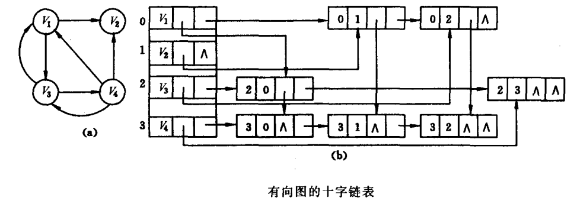
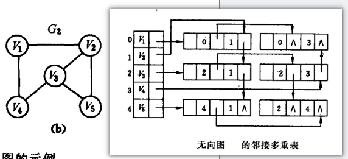
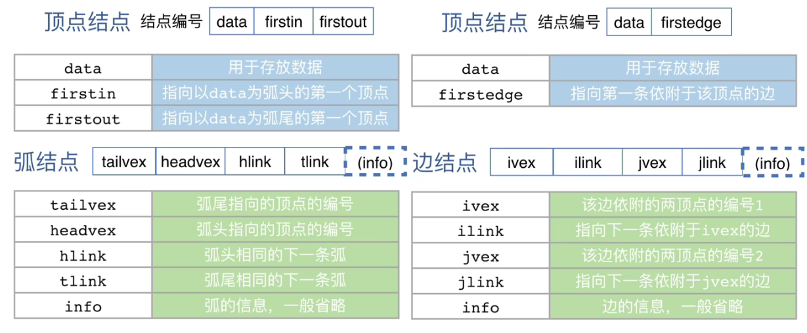
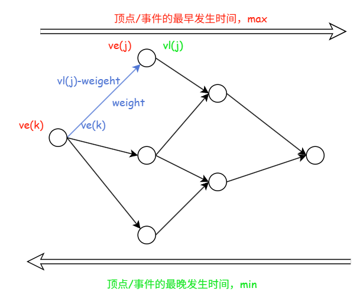

# 数据结构

## 第六章 图

### 图的基本概念
(省略部分)
1. 子图：顶点和边都是原图的子集，且边不超出子图顶点范围
   - 并非 $V$,$E$ 的任何子集都能构成 $G$ 的子图，有可能某些子集组合无法构成图，即 $E$ 的子集中的某些边关联的顶点没有在该 $V$ 的子集
1. 无向图的**极大连通子图**称为**连通分量**。
2. 在有向图中，如果一对顶点 $v$ 和 $w$，从 $v$ 到 $w$ 和从 $w$ 到 $v$ 之间都有路径，则称该两个顶点是**强连通**的。
3. **连通图的生成树**是一个包含所有顶点的**极小连通子图**。<span style="background:#FFFF33;">若图中有 n 个顶点，则生成树恰好包含 n-1 条边</span>。<span style="background:#FFFF33;">对于生成树而言，若移除任意一条边，都会变成非连通图；添加任意一条边都会形成一个回路。</span>
4. 极大连通子图要求子图必须连通，而且包含尽可能多的顶点和边；极小连通子图是既要保持子图连通，又要使得边数最少的子图。
5. <mark style="background:#fff88f">简单路径 即不存在重复的顶点</mark>

#### 简单图的性质
1. 在具有 n 个顶点、e 条边的<u>无向图</u>中，$\sum_{i=1}^{n} \mathrm{TD}(v_i) = 2e$;
   在具有 n 个顶点、e 条边的<u>有向图</u>中，$\sum_{i=1}^{n} \mathrm{ID}(v_i) = \sum_{i=1}^{n} \mathrm{OD}(v_i) = e$​.
2. 对于 n 个顶点的无向图 G ，若 G 是连通图，则最少边数为 n-1；若 G 是非连通图，则最多边数为 $\color{red}\frac{(n-1)(n-2)}{2}=C_{n-1}^2$；当边数为 $\frac{(n-1)(n-2)}{2}+1$ 时，该无向图一定是连通图。
3. 对于 n(n>1) 个顶点的有向图 G，<span style="background:#FF6666;">若 G 是强连通图，则最少有 n 条边（形成回路）</span>；当边数为 <mark style="background:#40a9ff">$2C_{n-1}^2+n$</mark> 时，该有向一定是强连通图
4. <span style="background:#FF6666;">n 个顶点的图，若 |E| > n-1，则一定有回路</span>


### 图的存储

#### 邻接矩阵
方法：通过存储一个一维数组存储图中顶点的信息，并用一个二维数组存储边的信息。
特点：
1. 邻接矩阵表示法的空间复杂度为 $\color{red}{O(|V|^2)}$.
2. <span style="background:#FFFF33;">无向图的邻接矩阵一定是 <strong>对称矩阵</strong></span>，实际存储时只需存储上/下三角。在顶点编号固定的条件下，邻接矩阵是 **唯一** 的。
3. 对于<span style="background:#FFFF33;">无向图</span>，邻接矩阵的第 i <span style="background:#FF3333;">行/列</span> 非零元素/非 $\infty$ 元素的数量正好是顶点 $i$ 的度 $TD(v_i)$.
4. 对于<span style="background:#FFFF33;">有向图</span>，邻接矩阵的<mark style="background:#ff4d4f">行</mark>非零元素/非 $\infty$ 元素的数量是顶点 $i$ 的<mark style="background:#ff4d4f">出度</mark> $OD(v_i)$;第 $i$ <span style="background:#FF3333;">列</span>非零元素/非 $\infty$ 元素的数量是顶点 $i$ 的<mark style="background:#ff4d4f">入度</mark> $ID(V_i)$.
5. 邻接矩阵便于判断两顶点间是否有边相连
6. **稠密图**适合使用邻接矩阵存储
7. <mark>设图 $G$ 的邻接矩阵为 $A$（矩阵元素为 0/1），则 $A^n$ 的元素 $A^n[i][j]$ 等于由顶点 $i$ 到顶点 $j$ 的长度为 $n$ 的路径的数目</mark>。

#### 邻接表法
方法：邻接表指，对图 $G$ 中的每一个顶点 $v_i$ 建立一个单链表。第 $i$ 个单链表中的结点表示依附于顶点 $v_i$ 的边(对于有向图，该些边是以$v_i$为<mark style="background:#ff4d4f">尾</mark>的弧)。边表的头指针与顶点的数据信息采用顺序存储，称为顶点表。

特点：
1. 若 $G$ 为无向图，所需存储空间为 <span style="background:#FFFF33;">O(|V|+2|E|)</span>(<span style="background:#FFFF33;">无向图中的每条边在邻接表中会出现两次</span>)；若为有向图，则为 <span style="background:#FFFF33;">O(|V|+|E|)​</span>.
2. <span style="background:#FFFF33;">邻接表遍历的时间复杂度为 O(|V|+|E|)</span>.
3. **稀疏图**适合使用邻接表存储
4. 便于查找指定顶点的所有邻接点，只需遍历对应的边表；难以判断两顶点之间是否存在路径，需遍历所有顶点的边表。
5. <span style="background:#FFFF66;">无向图</span>的邻接表中，<span style="background:#FFFF33;"><span style="background:#FF3333;">顶点的度</span>为其邻接表中边表结点的个数</span>。<span style="background:#FFFF66;">有向图</span>的邻接表中，<span style="background:#FFFF33;"><span style="background:#FF3333;">顶点的出度</span>为其领接表中边表结点的个数</span>，<mark style="background:#fff88f">入度则需遍历所有顶点的边表</mark>
6. 邻接表的表示不唯一


#### 十字链表法(了解) 与 邻接多重表(了解)
**有向图**的存储方式
 
**无向图**的存储方式


总结：

1. 十字链表法结合了邻接表和逆邻接表，可以方便地计算顶点 $v_i$ 的入度(沿着 fistin 与 hlink)和出度(沿着 firstout 与 tlink)/寻找依附于某一顶点的所有弧
2. 邻接多重表中，每条边只会被存储一次，且所有依附于同一顶点的边都被串联在一个链表中，便于计算顶点的度/寻找依附于某一顶点的所有边


### 图的遍历

#### 广度优先搜索(BFS,Breadth-First Search)
类似于树的<strong><span style="background:#FFFF33;">层次遍历</span></strong>

**基本思想**：<mark style="background:#40a9ff">先访问完当前顶点的所有邻接顶点</mark>（一层），再依次访问这些邻接顶点的邻接顶点（下一层），直到遍历完所有可达顶点。
**算法实现**：
1. **辅助队列**，用于暂存当前层顶点的下一层邻接顶点
2. **辅助数组 visit[]**，用于标记顶点是否被访问

```C
bool visited[MAX_VERTEX_NUM];//访问标记数组
Quene Q;//暂存下一层顶点
void BFSTraverse(Graph G){
    for(int i=0;i<MAX_VERTEX_NUM;i++)visited[i]=false;
    
    InitQuene(Q);
    for(int i=0;i<MAX_VERTEX_NUM;i++){
        if(!visited[i]){
            BFS(G,i);
        }
    }
}

void BFS(Graph G,int i){
    visit(i);
    visited[i]=true;
    EnQuene(Q,i);
    
    while(!IsEmpty(Q)){
        int v=0;
        DeQuene(G,v);
        //邻接表存储
        for(int p=G.vertices[v].firstarc;p;p=p->nextarc){
            w=p->adjvex;
            if(!visited[w]){
                visit(w);
                visited[w]=true;
                EnQuene(G,w);
            }
        }
        
        //邻接矩阵存储
        /*for(int w=0;w<G.vexnum;w++){
            if(!visited[w]&&G.edge[v][w]==1){
                visit(w);
                visited[w]=true;
                EnQuene(G,w);
            }
        }*/
    }
}
```
##### 性能分析
1. <span style="background:#FFFF33;">空间复杂度 O(|V|)</span>.
2. 时间复杂度
   - <mark style="background:#ff4d4f">遍历图的实质为对每个顶点查找其邻接顶点的过程，耗时取决于所采用的存储结构</mark>。
   - 采用<span style="background:#FFFF33;">邻接表存储</span>：
     - 每个顶点均被搜索一次，时间复杂度为 $O(|V|)$.
     - 在搜索每个顶点的邻接点时，每条边均需访问一次，时间复杂度为 $O(|E|)$.
     - 总的时间复杂度为 <span style="background:#FFFF33;">O(|V|+|E|)</span>.
   - 采用<span style="background:#FFFF66;">邻接矩阵存储</span>：
     - 查找每个顶点的邻接点的时间复杂度为 $O(|V|)$.
     - 总的时间复杂度为 $\color{red}O(|V|^2)$.

##### 应用：求解单源最短路径问题
BFS 算法可用于求解 **<span style="background:#FFFF33;">非带权图/权值相同的带全图的单源最短路径问题</span>**，因为 <span style="background:#FFFF66;">BFS算法总是按照距离由近及远的顺序遍历图中顶点</span>，从而保证每个顶点首次被访问时，所经过的路径即为最短路径。
##### ~~广度优先搜索树/森林~~
- 邻接表存储，同一源点得到的结果不唯一
- 邻接矩阵存储，同一源点得到的结果唯一


#### 深度优先搜索(DFS,Depth-First Search)
类似于树的<strong><span style="background:#FFFF33;">先序遍历</span></strong>

**基本思想**：从起始顶点出发，<mark style="background:#40a9ff">沿着一条路径尽可能深地访问顶点</mark>（优先访问当前顶点的未访问邻接顶点），当路径走到尽头（无未访问邻接顶点）时，回溯到上一个顶点，选择另一条未探索的路径继续深入，直至遍历完所有可达顶点
**算法实现**：
1. **辅助数组 visit[]**，用于标记顶点是否被访问
2. **栈/递归**，用于记录 "待回溯的顶点"
3. 只有当该点的所有后继结点都访问完后，该点才可退栈

```cpp
bool visited[MAX_VERTEX_NUM];//访问标记数组
void DFSTraverse(Graph G){
    for(int i=0;i<MAX_VERTEX_NUM;i++)visited[i]=false;
    
    for(int i=0;i<MAX_VERTEX_NUM;i++){
        if(!visited[i]){
            DFS(G,i);
        }
    }
}

void DFS(Graph G,int i){
    visit(i);
    visited[i]=true;
    
    //邻接表存储
    for(int p=G.vertices[i].firstarc;p;p=p->nextarc){
        int w = p->adjvex;
        if(!visit[w]){
            DFS(G,w);
        }
    }
    
    //邻接矩阵存储
    /*for(int w=0;w<G.vexnum;w++){
        if(!visited[w]&&G.edge[v][w]==1){
            DFS(G,w);
        }
    }*/
}
```
##### 性能分析
1. 空间复杂度 <span style="background:#FFFF66;">O(|V|)</span>，通常使用递归实现
2. 空间复杂度 同广度优先搜索的分析

##### 应用：判断环路与拓扑排序
1. 判断环路
2. 拓扑排序：DFS 退栈顺序即为 逆拓扑排序


##### ~~深度优先搜索树/森林~~
同广度优先搜索数/森林


#### 图的遍历与图的连通性
- 对于<span style="background:#FFFF33;">无向图</span>，<span style="background:#FF6666;">调用 BFS(G,i)或DFS(G,i) 的次数恰好等于该图的连通分量数</span>，因为<span style="background:#FFFF33;">每次调用都会遍历一个连通分量中的所有顶点</span>
- 对于<span style="background:#FFFF66;">有向图</span>，<span style="background:#FFFF33;">仅当初始顶点到达图中每个顶点都存在路径时，才能通过一次遍历访问到所有结点</span>；否则，将不能访问所有顶点。

### 图的应用

#### 最小生成树
特点：
1. 若图 $G$ 中含有权值相同的边，则最小生成树可能不唯一；<span style="background:#FFFF33;">当图 G 中所有边的权值互不同时，最小生成树是唯一的</span>。
2. 若无向连通图本身的边数等于顶点数减 1，即该图本身就是一棵树，则最小生成树就是其本身。
3. <span style="background:#FFFF33;">虽然最小生成树可能不唯一，但所有的<span style="background:#FF6666;">最小生成树的总权重都是相同的</span>，且为最小值</span>。
4. <span style="background:#FFFF33;">最小生成树的边数等于顶点数减1</span>
5. <span style="background:#FFFF33;">最小生成树中所有边的权值之和最小，但<span style="background:#FF6666;">不能保证任意两个顶点之间的路径是最短的</span></span>

##### 最小生成树算法
**核心思想**：假设 $G=(V,E)$ 是一个带权无向连通图，$U$ 是顶点集 $V$ 的一个非空子集。若 $(u,v)$ 是一条权值最小的边，其中 $u \in U,v\in V-U$，则图 $G$ 中必存在一棵包含边 $(u,v)$ 的最小生成树。

###### <mark style="background:#40a9ff">Prim 算法</mark>
每次选距离<span style="background:#FF6666;">已选结点集合</span>最短的结点并利用刚选择的结点更新<span style="background:#FF6666;">距离向量(到已选结点集合的距离)</span>
性能分析：
- 未优化：时间复杂度 $\color{red}O(|V|^2)$，与边数 $|E|$ 无关，与图的存储结构无关，特别适合用于求解 **边稠密** 图的最小生成树。
- 优化后：若使用 **堆** 存储距离向量，每次更新或选择最短候选边时间为 $O(\log_2|V|)$，每条边最多被扫描一次来更新候选边，耗时 $O(|E|\log_2|V|)$；总时间复杂度为 $O(|E|\log_2|V|)$

###### <mark style="background:#40a9ff">Kruskal 算法</mark>
选择<span style="background:#FF6666;">权重最小</span>且<span style="background:#FF6666;">不会形成回路</span>的边
性能分析：
- 最坏情况下，需要对所有的 $|E|$ 条边各扫描一次。
- 使用 **堆** 存储边，每次从中选择最小权值的边所需时间为 $O(\log_2|E|)$.
- 使用 **并查集** 来判断两个顶点是否属于同一集合的时间复杂度为 $O(\alpha(|V|))$，$\alpha(|V|)$增长缓慢，可视为常数
- 总的时间复杂度为 $\color{red}O(|E|\log_2|E|)$，与顶点数$|V|$无关，特别适合处理 **边稀疏、顶点多** 的图。


#### 最短路径
求解最短路径问题的算法通常基于其 **最优子结构问题**：**两点间最短路径上的任意子路径，也是对应端点间的最短路径**。

##### BFS 算法
(不能解决权值不同的带权图的最短路径问题)
利用<span style="background:#FF6666;">广度优先搜索</span>算法

##### <mark style="background:#40a9ff">迪杰斯特拉算法</mark>
(<span style="background:#FFFF33;">单源最短路径问题</span>，不能解决负权图的最短路径问题)
每次选择距离<span style="background:#FF6666;">起点</span>最短的结点并利用刚选择的结点更新<span style="background:#FF6666;">距离向量(到起点的距离)</span>

性能分析：
- <span style="background:#FFFF33;">邻接矩阵</span>存储图，并采用线性表扫描距离向量查找最小值时，时间复杂度为 $\color{red}O(|V|^2)$.
- <span style="background:#FFFF33;">邻接表</span>存储图，松弛操作时间复杂度可降至 $O(|E|)$，但查找距离向量最小值的时间复杂度仍为 $O(|V|)$，总时间复杂度仍为 $\color{red}O(|V|^2)$
- 求解任意两个结点之间的最短路径的时间复杂度为 $O(|V|^3)$

##### 弗洛伊德算法
(单/<span style="background:#FFFF33;">多源最短路问题</span>，图中可以存在负权，但<span style="background:#FFFF66;">不能解决含有负权的环路图</span>)
以所有结点为中间结点逐步松弛任意结点间的路径

其中迭代产生的方阵$A^{(k)}$中 $\color{red}A^{(k)}[i][j]$ 表示从顶点 $v_i$ 到 $v_j$ 、仅允许<span style="background:#FF6666;">使用编号不超过 k 的顶点作为中间顶点</span>时的最短路径长度。 

时间复杂度：$O(|V|^3)$

#### 有向无环图描述表达式
有向无环图(DAG) 是指一个不含任何有向环路的有向图。
有向无环图是表示含有公共子表达式的代数表达式的有效工具。

#### 拓扑排序(AOV网)
基本思想：
① 从 AOV 网中选择一个<span style="background:#FFFF33;">没有前驱（入度为 O）的顶点</span>并输出。
② 从网中删除该顶点和所有以它为起点的有向边。
③ 重复 ① 和 ② 直到当前的 AOV 网为空或<u>当前网中不存在无前驱的顶点</u>为止(图中存在环)

性能分析：
- <span style="background:#FFFF33;">邻接表</span>存储，时间复杂度为 $\color{red}O(|V|+|E|)$.
- <span style="background:#FFFF33;">邻接矩阵</span>存储，时间复杂度为 $\color{red}O(|V|^2)$.

特点：
1. 拓扑排序的结果可能不唯一
   - <span style="background:#FFFF33;">拓扑序列唯一的充要条件</span>为：AOV 网中任意两个顶点之间都存在单向路径，即<span style="background:#FFFF33;">任意两个活动都有明确的先后顺序</span>
   - 实际判断方法为：每次输出顶点时，若当前入度为 0 的顶点恰好只有 1 个，则最终拓扑序列唯一
   - <span style="background:#FFFF33;">即使拓扑序列唯一，仍无法唯一确定该图</span>(形象化记忆：知道了所有人的考试成绩排名（唯一序），但依然不知道每个人之间是否真的直接比较过（是否有边），因为可能存在间接的传递比较)
2. 有向无环图的<mark style="background:#40a9ff">逆拓扑序列</mark>：在 DFS 算法中退栈返回时输出相应的顶点，则输出的序列为逆拓扑序列
   - 说明：<span style="background:#FFFF66;">根据 DFS 规则可知，某顶点入栈后，必先遍历完其后继顶点后该顶点才会出栈</span>；故输出的顶点序列为逆拓扑序列
3. 拓扑排序无法用于判断两个顶点之间是否存在路径
4. 拓展：拓扑排序算法的实现需借助 <mark style="background:#fff88f">栈</mark>;当图的存储结构为邻接表时，时间复杂度为 $O(|V|+|E|)$ (本质仍是遍历图的存储结构)

#### 关键路径(AOE网)
<span style="background:#FF6666;">关键路径是源点到汇点的<strong>最长路径</strong></span>
基本思想：
1. 按拓扑排序序列，依次求各个顶点/事件的 最早发生时间ve(k)：
   $ve(源点)=0$
   $ve(k)= \colorbox{yellow}{Max}\{ve(j) + Weight(v_j, v_k)\}$， v<sub>j</sub>为v<sub>k</sub>的任意前驱
2. 按逆拓扑排序序列，依次求各个顶点/事件的 最晚发生时间vl(k)：
   $vl(汇点) = ve(汇点)$
   $vl(k) = \colorbox{yellow}{Min}\{vl(j) - Weight(v_k,v_i)\}$，v<sub>i</sub> 为v<sub>k</sub> 的任意后继
3. 若边 <v<sub>k</sub>,v<sub>j</sub>> 表示活动 a<sub>i</sub>，则有 最早开始时间 $e(i) = ve(k)$
4. 若边 <v<sub>k</sub>,v<sub>j</sub>> 表示活动 a<sub>i</sub>，则有 最迟开始时间 $l(i) = vl(j) - Weight(v_k,v_j)$
5. 所有活动的**时间余量**：$d(i) = l(i) - e(i)$，$\colorbox{yellow}{d(k) = 0}$​的活动就是关键活动，由关键活动可得关键路径



性能分析：关键路径的求解是以拓扑排序为基础的，同 拓扑排序

特点：
1. 若改变关键路径上的<span style="background:#FFFF33;">公共活动</span>，则不一定会产生不同的关键路径
   - <span style="background:#FFFF33;">延长必然不会导致改变</span>
   - <span style="background:#FFFF33;">缩短才可能导致改变</span>
2. 关键路径上的所有活动均为关键活动。缩短关键活动的持续时间有可能缩短工期，但不能任意缩短关键活动的持续时间，否则会引发关键路径的改变
3. 关键路径可能不止一条。<span style="background:#FFFF33;">只有<span style="background:#FF6666;">缩短关键路径上的公共活动</span> 或者 <span style="background:#FF6666;">缩短的活动能够覆盖所有关键路径</span>，才能达到缩短工期的目的</span>

---
## 数据结构定义与基本操作

### 图

#### 邻接矩阵

```c
#define MaxVertexNum 100          // 最大顶点数
typedef char VertexType;          // 顶点数据类型
typedef int EdgeType;             // 边数据类型

typedef struct {
    VertexType Vex[MaxVertexNum];                    // 顶点表
    EdgeType Edge[MaxVertexNum][MaxVertexNum];       // 邻接矩阵，边表
    int vexnum, arcnum;                              // 当前顶点数和边数/弧数
} MGraph;

// 基本操作
void CreateMGraph(MGraph *G);                        // 创建图
int FirstNeighbor(MGraph G, int v);                  // 求顶点v的第一个邻接点
int NextNeighbor(MGraph G, int v, int w);            // 求顶点v的邻接点w的下一个邻接点
```

#### 邻接表

```c
#define MaxVertexNum 100

// 边表结点
typedef struct ArcNode {
    int adjvex;                // 该弧所指向的顶点的位置
    struct ArcNode *next;      // 指向下一条弧的指针
    // InfoType info;          // 网的权值
} ArcNode;

// 顶点表结点
typedef struct VNode {
    VertexType data;           // 顶点信息
    ArcNode *first;            // 指向第一条依附该顶点的弧的指针
} VNode, AdjList[MaxVertexNum];

// 图
typedef struct {
    AdjList vertices;          // 邻接表
    int vexnum, arcnum;        // 顶点数和弧数
} ALGraph;

// 基本操作
void CreateALGraph(ALGraph *G);                      // 创建图
int FirstNeighbor(ALGraph G, int v);                 // 求顶点v的第一个邻接点
int NextNeighbor(ALGraph G, int v, int w);           // 求顶点v的邻接点w的下一个邻接点
```

#### 十字链表(了解)

```c
#define MaxVertexNum 100

// 弧结点
typedef struct ArcBox {
    int tailvex, headvex;               // 弧尾、弧头顶点位置
    struct ArcBox *hlink, *tlink;       // 分别指向弧头相同和弧尾相同的下一个弧
    // InfoType info;                   // 权值
} ArcBox;

// 顶点结点
typedef struct VexNode {
    VertexType data;
    ArcBox *firstin, *firstout;         // 指向第一条入弧和出弧
} VexNode;

// 图
typedef struct {
    VexNode xlist[MaxVertexNum];        // 顶点表
    int vexnum, arcnum;                 // 顶点数和弧数
} OLGraph;
```

#### 邻接多重表(了解)

```c
#define MaxVertexNum 100

// 边结点
typedef struct ENode {
    int mark;                           // 访问标记
    int ivex, jvex;                     // 该边依附的两个顶点位置
    struct ENode *ilink, *jlink;        // 分别指向依附于ivex和jvex的下一条边
    // InfoType info;                   // 权值
} ENode;

// 顶点结点
typedef struct VexBox {
    VertexType data;
    ENode *firstedge;                   // 指向第一条依附该顶点的边
} VexBox;

// 图
typedef struct {
    VexBox adjmulist[MaxVertexNum];     // 顶点表
    int vexnum, edgenum;                // 顶点数和边数
} AMLGraph;
```

### 图的应用

#### 最小生成树

##### Prim 算法

```c
#define INF 0x3f3f3f3f                 // 无穷大

typedef struct {
    int adjvex;                         // 最小边在U中的顶点
    int lowcost;                        // 最小边上的权值
} CloseEdge;

// 基本操作
void Prim(MGraph G, int u);             // 从顶点u出发构造最小生成树
```

##### Kruskal 算法

```c
typedef struct {
    int a, b;                           // 边的两个顶点
    int weight;                         // 边的权值
} Edge;

// 基本操作
void Kruskal(MGraph G, Edge edges[]);   // 对边集排序后依次选边构造最小生成树
```

#### 最短路径

##### 广度优先搜索算法

```c
// 基本操作
void BFS_MIN_Distance(Graph G, int u);
// 借助 BFS 求解非带权图的单源最短路径，dist[] 记录最短路径长度，path[] 记录路径
```

##### 迪杰斯特拉算法

```c
#define INF 0x3f3f3f3f

// 基本操作
void Dijkstra(MGraph G, int v, int dist[], int path[]);
// dist[] 记录从源点v到各顶点的最短路径长度
// path[] 记录最短路径上每个顶点的前驱顶点
```

##### 弗洛伊德算法

```c
#define INF 0x3f3f3f3f

// 基本操作
void Floyd(MGraph G, int dist[][MaxVertexNum], int path[][MaxVertexNum]);
// dist[k][i][j] 表示顶点i到j、允许使用编号不超过k的顶点作为中间顶点的最短路径长度
// path[][] 记录中转顶点
```


<div style="page-break-after: always;"></div>
