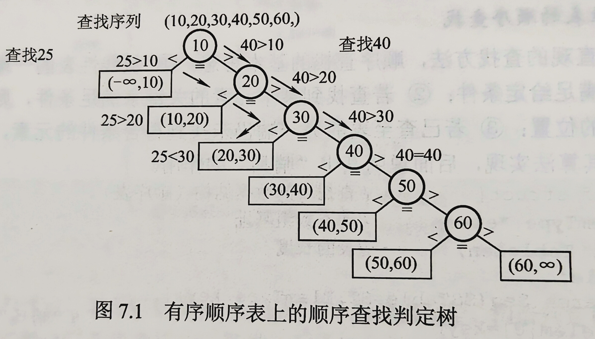
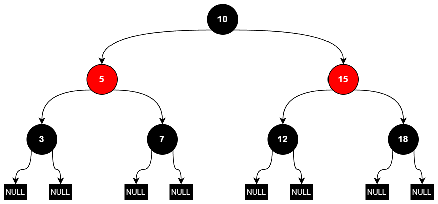
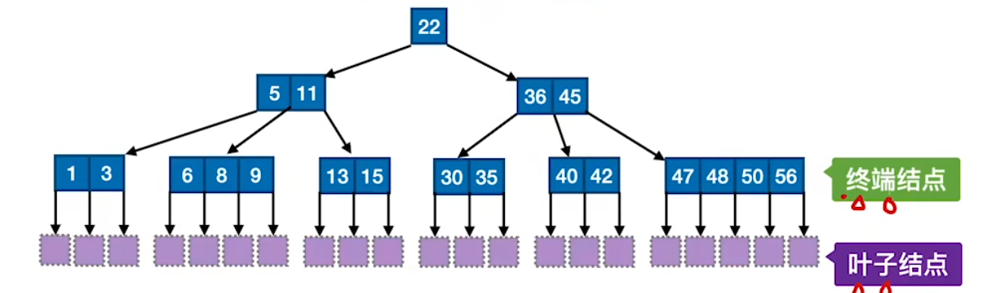
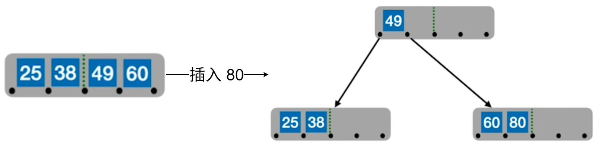
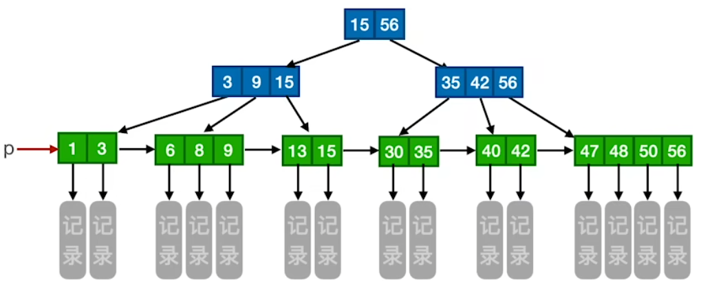

# 数据结构

## 第七章 查找

> [!tip] **重要概念**：
> 动态查找：即在查找过程中可能进行插入或删除操作的场景，适合使用 <mark style="background:#40a9ff">分块查找</mark> 进行查找


### 顺序查找与折半查找

#### 顺序查找
适用于<span style="background:#FFFF33;">顺序表与链表</span>
##### 一般顺序表的顺序查找
基本思想：从线性表的一端开始<mark style="background:#40a9ff">逐个检查</mark>元素的关键字是否满足给定条件
算法实现：**引入'哨兵'**，将线性表 ST.elem\[0\] 作为哨兵，目的是：**避免在循环中反复判断数组下标是否越界**

效率分析：
- 查找成功：定位第 i 个关键字，需进行 n-i+1 次比较，则 $$\colorbox{yellow}{$ASL_{成功}=\sum_{i=1}^{n}p_i(n-i+1);若 p_i=\frac{1}{n},则 ASL_{成功}=\frac{n+1}{2}\approx\frac{n}{2}$}$$
- 查找失败：查找失败时，与表中各关键字的比较次数显然为 n+1，即 $ASL_{失败}=\begin{cases}n+1,&存在哨兵位\\n,&不存在哨兵位\end{cases}$
- 时间复杂度为 $O(n)$
##### 有序线性表的顺序查找
基本思想：<span style="background:#FFFF33;">在查找失败时，无需继续比较到表的另一端即可返回查找失败的信息</span>，从而降低查找失败的平均查找长度

判定树：


效率分析：
- 查找成功：同一般线性表的顺序查找
- 查找失败：
  - <mark style="background:#40a9ff">到达某一失败结点时所经历的比较次数，等于父结点（路径上最后一个真实元素结点）所在的层数</mark>。
  - 在等概率查找失败的情形下：$$ASL_{失败}=\sum_{j=1}^nq_j(l_j-1)=\frac{1+2+\dots+n+n}{n+1}=\colorbox{yellow}{$\frac{n}{2}+\frac{n}{n+1}$}$$ 其中 $q_j是到达第j个失败结点的概率，l_j是第j个失败结点所在的层数$
  
#### <mark style="background:#40a9ff">折半查找</mark>
仅适用于<span style="background:#FFFF33;">关键字<span style="background:#FF6666;">有序</span>的<span style="background:#FF6666;">顺序表</span></span>
基本思想：
1. 首先将给定值 key 与表中中间位置的元素进行比较，若相等，则查找成功，返回该元素的存储位置；
2. 若不相等，则待查元素只能位于中间元素以外的前半部分或后半部分（例如，当表按升序排列时，若 key 大于中间元素，则待查元素只可能在后半部分），随后在缩小的范围内重复上述过程，直到找到目标元素；或确定表中不存在该元素为止，此时返回查找失败信息。

算法实现：

```cpp
int Binary_Search(SSTable L,ElemType key){
    int low=0,high=L.TableLen-1,mid;
    while(low<=high){
        mid=(low+high)/2;
        if(L.elem[mid]==key)return mid;
        else if(L.elem[mid]>key)high=mid-1;
        else low=mid+1;
    }
    return -1;
}
```

注意：<span style="background:#FFFF33;">选取中间结点时，既可以采用向下取整，也可以采用向上取整，但每次查找必须采用相同的取整方式</span>。

判定树：
- 判定树是一棵<span style="background:#FF6666;">平衡二叉树</span>；<span style="background:#FFFF33;">若判定树是一棵二叉排序树，则可以使用折半查找</span>
- 判定树的树高为 $\color{red}\lceil\log_2(n+1)\rceil$(与同结点数的完全二叉树同高)
- 查找长度：
	- 查找<span style="background:#FF6666;">成功</span>时的查找长度为<span style="background:#FFFF66;">从根结点到目的结点的路径上的结点数</span>
	- 查找<span style="background:#FF6666;">失败</span>时的查找长度为<span style="background:#FFFF66;">从根结点到对应失败结点的父结点的路径上的结点数</span>
- 若有序表包含n个元素，则对应判定树有n个分支节点，n+1个叶子结点/失败结点
- <span style="background:#FF6666;">当采用向下取整来选取中间结点时，右子树结点数-左子树结点数=0或1</span>

效率分析：
- 查找成功：等概率情况下，$\begin{align*}ASL_{成功}&=\frac{1}{n}\sum_{i=1}^nl_i=\frac{1}{n}(1\times1+2\times2+\dots+h\times2^{h-1})\quad 其中h是判定树的高度\\ &=\frac{n + 1}{n}\log_2(n + 1)-1\\&\approx \log_2(n+1)+1\end{align*}$​.
- 查找失败：等概率情况下，$ASL_{失败}=\frac{1}{n+1}\sum_{i=0}^{n}l_i$


#### 分块查找
基本思想：
1. 将查找表分块：<span style="background:#FF6666;">块内元素可无序，块间必须有序</span>
2. 建立索引表：每个元素包含对应块的最大的关键字和该块的起止地址，且按<span style="background:#FF6666;">最大关键字有序排列</span>
3. 查找过程：
	1. 在索引表中确定待查记录所在的块(可采用顺序查找或折半查找，因索引表有序)
	2. 在目标块内进行顺序查找(因块内无序)

效率分析：
平均查找长度等于<mark style="background:#40a9ff">索引查找的平均长度</mark>($L_I$)与<mark style="background:#40a9ff">块内查找的平均长度</mark>($L_S$)之和，即$ASL=L_I+L_S$

若将长度为 n 的查找表均匀分为 b 块，每块包含 s 个记录( n = bs )，并在<span style="background:#FFFF33;">等概率</span>的假设下<span style="background:#FFFF33;">对索引表和块内均使用顺序查找</span>，则平均查找长度为：
$$
ASL=L_I+L_S=\frac{b+1}{2}+\frac{s+1}{2}=\frac{s^2+2s+n}{2s}
$$
此时，当块大小 <mark style="background:#ff4d4f">s 取最优值$\sqrt{n}$</mark>，则平均查找长度达到<mark style="background:#ff4d4f">最小值为$\sqrt{n}+1$</mark>.


### 树形查找

#### 二叉排序树(BST)
定义：关键字大小关系：左子树 < 根 < 右子树；
显然，中序遍历可以得到一个递增的有序关键字序列

##### 二叉排序树的查找
略

##### 二叉排序树的插入
<span style="background:#FFFF33;">新插入节点一定是一个叶子结点</span>，且恰好是查找失败时所访问的最后一个结点的左孩子或右孩子。

##### 二叉排序树的删除
1. 若被删除结点 z 是叶结点，则直接删除，不会破坏二叉排序树的性质。
2. 若结点 z 只有一棵左子树或右子树，则让 z 的子树成为 z 父结点的子树，替代 z 的位置。
3. 若结点 z 有左、右两棵子树，则令 z 的<span style="background:#FFFF33;">直接后继 [中序遍历中 z 结点的下一个结点 或者 z 的右子树最左下的结点]</span>（或<span style="background:#FFFF33;">直接前驱 [中序遍历中 z 结点的前一个结点 或者 z 的左子树最右下的结点]</span>）替代 z，然后从二叉排序树中删去这个直接后继（或直接前驱），这样就转换成了第一或第二种情况。

\[注意\]：<span style="background:#FFFF33;">若结点 z 为叶结点，删除后重新插入，原二叉排序树与现二叉排序树一致；否则，不一致</span>

##### 二叉排序树查找效率
- 查找效率主要<mark style="background:#40a9ff">取决于树的高度</mark>
- <mark style="background:#40a9ff">最佳情况下，即左右子树的高度之差的绝对值不超过 1 (即平衡二叉树)</mark>，此时平均查找长度为 $O(\log_2n)$.
- <mark style="background:#40a9ff">最坏情况下，只有左孩子或右孩子的单支树，即有序链表</mark>，此时平均查找长度退化为 $\frac{n+1}{2}$.


#### 平衡二叉树(AVL)
定义：
- 首先该树为<mark style="background:#fff88f">二叉排序树</mark>
- <mark style="background:#fff88f">任意结点的左右子树高度差的绝对值不超过 1</mark>

\[注意\]：某结点即使左右子树的平衡因子为 0，也无法说明左右子树高度相等，即无法说明 该结点的平衡因子为 0

##### 调整失衡的平衡二叉树
调整最小不平衡子树
1. LL失衡


2. RR失衡


3. LR失衡


4. RL失衡


##### 二叉平衡树的插入
首先，与二叉排序树的插入一致，新结点的插入位置为 叶结点
其次，判断平衡二叉树是否失衡，若失衡则按照上述的规则进行“旋转”以达到平衡，否则结束

##### 二叉平衡树的删除
首先，按照二叉排序树的结点删除规则删除结点；
其次，从删除结点向上回溯，查找是否存在失衡的结点；
最后，若不存在失衡结点，则结束；若存在，则进行平衡调节(LL/RR/LR/RL)，并重复上一步骤。

\[注意\]：
- <span style="background:#FFFF33;">对于结点 z 无论是叶结点还是分支结点，若删除后重新插入则原二叉平衡树与现二叉平衡树可能相同可能不相同</span>
- 二叉平衡树的 插入和删除 均有可能引起该平衡树的 <font color="#548dd4">2</font> 次调整


##### 二叉平衡树的节点个数--h 层的平衡二叉树最少的结点数
- <span style="background:#FFFF33;">假设以 n<sub>h</sub> 表示深度为 h 的平衡树中含有的最少结点数。则有 n<sub>0</sub> = 0, n<sub>1</sub> = 1, n<sub>2</sub> = 2,并且有 n<sub>h</sub> = n<sub>h-1</sub> + n<sub>h-2</sub> + 1</span>(斐波那契型)<span style="background:#FF6666;">此时非叶结点的平衡因子均为 1 </span>.此时平衡二叉树高达到最高
- n 个结点的平衡二叉树的最小高度为 $\lceil\log_2(n+1)\rceil$
- 高度为 h 的平衡二叉树的结点数最多为 $2^h-1$(即满二叉树)


#### 红黑树(RBT)
##### 定义
1. 是一棵<span style="background:#FFFF00;">二叉排序树</span>
2. 每个结点或是红色，或是黑色
3. <span style="background:#FFFF00;">根结点是黑色的</span>
4. <span style="background:#FFFF00;">叶子结点(虚构的外部节点/NULL结点/查找失败的结点)都是黑色的</span>
5. 不存在两个相邻的红色结点(<span style="background:#FFFF00;">红结点的父结点和孩子结点均是黑色的</span>)
6. <span style="background:#FF6666;">对于每个结点，从该结点(不包含该结点)到任意一个叶结点(包含叶子节点)的简单路径上，所含黑结点的数量相同</span>

\[口诀\]：<span style="background:#FFFF33;">左根右，根叶黑，不红红，黑路同</span>




##### 重要概念
**黑高**:从某个节点出发，到达任意一个叶子节点（NIL节点）的路径上，所经过的<span style="background:#FF6666;">黑色节点的数量</span>


##### 常用结论
1. <span style="background:#FFFF33;">从根到叶结点的最长路径不大于最短路径的 2 倍</span>
   **证明**：从根到任意一个叶子结点的最短路径必然全由黑结点组成；当某条路径最长时，该路径必然是由黑结点与红结点交替构成的，此时黑结点数量固定，红结点的数量最多等于黑结点的数量。
   **推论**：<span style="background:#FF6666;">从根到叶子结点(不含叶子结点)的任意一条简单路径上都至少有一半是黑结点</span>    \[无“红结点个数不会超过内部结点的一半”的结论\]
2. <span style="background:#FFFF33;">有 n 个内部结点的红黑树的高度</span> $\color{red}h\le2\log_2(n+1)$.
   **推论**：黑高为 h 的红黑树的内部结点数至少为 $2^h-1$(全黑的满二叉树)，最多为 $2^{2h}-1$(在全黑的满二叉树中，每相邻的黑结点层插入一层红结点).
3. 红黑树允许左右子树**高度**相差最多 2 倍，是<mark style="background:#fff88f">非平衡的</mark>


##### ~~红黑树的插入~~
<mark style="background:#40a9ff">时间复杂度为 $O(\log_2n)$ </mark>
1. 先查找，确定插入位置（原理同二叉排序树），插入新结点
2. 新结点是 根 —— 染为 黑色
3. 新结点 非根 —— 染为 红色
   - 若插入新结点后依然满足红黑树定义，则插入结束
   - 若插入新结点后不满足红黑树定义，需要调整，使其重新满足红黑树定义
     - 叔结点为黑：旋转+染色
       - LL型：右单旋，父换爷+染色
       - RR型：左单旋，父换爷+染色
       - LR型：左、右双旋，儿换爷+染色
       - RL型：右、左双旋，儿换爷+染色
     - 叔结点为红：染色+变新
       - 叔父爷染色，爷变为新结点

如何调整：看新结点叔结点的颜色


##### ~~红黑树的删除~~
<mark style="background:#40a9ff">时间复杂度为 $O(\log_2n)$</mark>​


##### 红黑树与平衡二叉树的对比
1. 设计红黑树的目的就是解决$AVL$维护起来比较麻烦的问题，红黑树的读取略逊于$AVL$，维护强于$AVL$，每次插入和删除的平均旋转次数远小于$AVL$ 
2. $AVL$追求绝对严格的平衡，必须满足左右子树高度差不超过$1$，而红黑树放弃追求完全平衡，它的旋转次数少，**插入最多$2$次旋转**，**删除最多$3$次旋转**，所以对于搜索、插入、删除操作较多的情况下，红黑树的效率是优于$AVL$的


#### B树(并不会考察代码)



##### 定义
**B树**，又称**多路平衡查找树**，B 树中所有结点的孩子个数的最大值称为 B 树的阶，通常用 m 表示。一棵 m 阶 B 树或为空树，或为满足如下特性的 m 叉树：
1) 树中每个结点至多有 m 棵子树，即至多含有 m-1 个关键字。
2) 若根结点不是终端结点，则至少有两棵子树。
3) <span style="background:#FFFF33;"><span style="background:#FF6666;">除根结点外</span>的所有非叶结点至少有 ⌈m/2⌉ 棵子树，即至少含有 ⌈m/2⌉-1 个关键字</span> (B树每层包含的结点个数过少，导致树过高，查找效率低下)
4) <span style="background:#FFFF33;">所有的叶结点都出现在同一层次上，并且不带信息</span>(可以视为外部结点或类似于折半查找判定树的<span style="background:#FFFF33;">查找失败结点，实际上这些结点不存在，指向这些结点的指针为空</span>)。
5) 所有非叶结点的结构如下：

| $n$  | <span style="background:#FFFF00;">$P_0$</span> | $K_1$ | <span style="background:#FFFF00;">$P_1$</span> | $K_2$ | <span style="background:#FFFF00;">$P_2$</span> | $\dots$ | $K_n$ | <span style="background:#FFFF00;">$P_n$</span> |
| ---- | ---------------------------------------------- | ----- | ---------------------------------------------- | ----- | ---------------------------------------------- | ------- | ----- | ---------------------------------------------- |

其中，$K_i$（$i = 1, 2, \dots, n$）为结点的关键字，且满足\[<span style="background:#FFFF00;">关键字有序：递增/递减</span>\] $K_1 < K_2 < \dots < K_n$；$P_i$（$i = 0, 1, \dots, n$）为指向子树根结点的指针，且指针 $P_{i-1}$ 所指子树中所有结点的关键字均小于 $K_i$，$P_i$ 所指子树中所有结点的关键字均大于 $K_i$，$n$($\lceil m/2 \rceil - 1 \le n \le m - 1$)为结点中关键字的个数。

##### 查找
B 树的每个结点存储在 一个磁盘块中，每次查找需要将对应的磁盘块读入内存(1 次 I/O 操作)

##### m 阶 B 树的核心特性：
1)  子树个数：(树型尽可能“矮胖”)
    - **根节点**：
      - 子树数 ∈ \[$2$, $m$\]
      - 关键字数 ∈ \[$1$, $m-1$\]
    - **其他结点**：
      - 子树数 ∈ \[$\lceil m/2 \rceil$, $m$\]
      - 关键字数 ∈ \[$\lceil m/2 \rceil - 1$, $m-1$\]
2)  <span style="background:#FFFF00;">绝对平衡特性：对任一结点，其所有子树高度都相同</span>。(类比"平衡二叉树"的任意一个结点的左右子树高度之差的绝对值不超过 1)
3)  关键字的值：子树$0$ < 关键字$1$ < 子树$1$ < 关键字$2$ < 子树$2$ < $\cdots$（类比二叉查找树 左<中<右）。


##### B树的高度(不包含失败结点)

**最小高度**
让每个结点尽可能的满，即每个结点均有 $m-1$ 个关键字，$m$ 个分叉，则有
$$
n \le (m-1)\left(1 + m + m^2 + m^3 + \dots + m^{h-1}\right) = m^h - 1
$$
因此
$$
\colorbox{yellow}{$h \ge \log_m(n+1)$}
$$
**最大高度**
让每个结点包含的关键字、分叉尽可能的少。记 $k = \lceil m/2 \rceil$

|          | 最少结点数 | 最少关键字数    |
| -------- | ---------- | --------------- |
| 第一层   | $1$        | $1$             |
| 第二层   | $2$        | $2(k-1)$        |
| 第三层   | $2k$       | $2k(k-1)$       |
| 第四层   | $2k^2$     | $2k^2(k-1)$     |
| $\cdots$ | $\cdots$   | $\cdots$        |
| 第$h$层  | $2k^{h-2}$ | $2k^{h-2}(k-1)$ |

$h$ 层的 $m$ 阶B树至少包含关键字总数：
$$
1 + 2(k-1)\left(k^0 + k^1 + k^2 + \dots + k^{h-2}\right) = 1 + 2\left(k^{h-1} - 1\right)
$$
若关键字总数少于这个值，则高度一定小于 $h$，因此：
$$
n \ge 1 + 2\left(k^{h-1} - 1\right)
$$
得，
$$
\colorbox{yellow}{$h \le \log_k \frac{n+1}{2} + 1 = \log_{\lceil m/2 \rceil} \frac{n+1}{2} + 1$}
$$
\[注意\]：n 个关键字的 B 树有且仅有 n+1 个失败结点。


##### B 树的插入与删除

> 核心要求：
> ① 对$m$阶B树——除根节点外，结点关键字个数 $\lceil m/2 \rceil - 1 \leqslant n \leqslant m - 1$
> ② 子树$0 <$ 关键字$1 <$ 子树$1 <$ 关键字$2 <$ 子树$2 < \dots$

###### B 树的插入
1. <span style="background:#FFFF00;">新元素一定是插入到最底层"终端节点"</span>，用"查找"来确定插入位置
2. 在插入 key 后，若导致原结点<span style="background:#FFFF00;">关键字数超过上限，则从中间位置(⌈m/2⌉)将其中的关键字分为两部分</span>，左部分包含的关键字放在原结点中，右部分包含的关键字放到新结点中，中间位置$(\lceil m/2 \rceil)$的结点插入原结点的父结点。
3. 若上述操作导致其父结点的关键字个数也超过了上限，则继续进行这种分裂操作，直至这个过程传到根结点为止，进而导致 B 树高度增 1​​。



###### B 树的删除
1. 删除后结点中关键字个数<span style="background:#FFFF00;">不低于下限 $\lceil m/2 \rceil - 1$</span>
   - 若被删除关键字在终端节点，则直接删除该关键字
   - 若被删除关键字在非终端节点，则用直接前驱(右子树最左下元素)或直接后继(左子树最右下元素)来替代被删除的关键字 \[将非终端结点的删除转化成终端结点的删除\]
2. 删除后结点中关键字个数低于下限 $\lceil m/2 \rceil - 1$
   - 兄弟够借。若被删除关键字所在结点删除前的关键字个数低于下限，且与此结点右（或左）兄弟结点的关键字个数还很宽裕，则需要调整该结点、右（或左）兄弟结点及其双亲结点（父子换位法） 
     <span style="background:#FFFF00;">[当左兄弟很宽裕时，用当前结点的前驱、前驱的前驱 来填补空缺；当右兄弟很宽裕时，用当前结点的后继、后继的后继 来填补空缺]</span>

   - 兄弟不够借。若被删除关键字所在结点删除前的关键字个数低于下限，且此时与该结点相邻的左、右兄弟结点的关键字个数均 =$\lceil m/2 \rceil - 1$，则<span style="background:#FFFF00;">将关键字删除后与左（或右）兄弟结点及双亲结点中的关键字进行合并</span>。

     在合并过程中，双亲结点中的关键字个数会减$1$。若其双亲结点是根结点且关键字个数减少至$0$（根结点关键字个数为$1$时，有$2$棵子树），则直接将根结点删除，合并后的新结点成为根；若双亲结点不是根结点，且关键字个数减少到 $\lceil m/2 \rceil - 2$，则又要与它自己的兄弟结点进行调整或合并操作，并重复上述步骤，直至符合树的要求为止。


#### B+树

##### 定义
一棵m阶的B+树需满足下列条件：
1) 每个分支结点最多有m棵子树（孩子结点）。
2) 非叶根结点至少有两棵子树，其他<span style="background:#FFFF00;">每个分支结点至少有 $\lceil m/2 \rceil$ 棵子树</span>。
3) <span style="background:#FFFF00;">结点的子树个数与关键字个数相等</span>。
4) 所有叶结点包含全部关键字及指向相应记录的指针，<span style="background:#FF6666;">叶结点中将关键字按大小顺序排列，并且相邻叶结点按大小顺序相互链接起来</span>。
5) <span style="background:#FF6666;">所有分支结点中仅包含它的各个子结点中关键字的最大值及指向其子结点的指针</span>。\[类比"分块查找"\]



##### B+树 与 B树 的区别

1. <span style="background:#FFFF00;">m 阶 B+ 树：结点中的 n 个关键字对应 n 棵子树</span>
   m 阶 B 树：结点中的n个关键字对应 n+1 棵子树
2. 共同点是 <span style="background:#FFFF00;">m 阶 B 树 与 m 阶 B+ 树 的非根非叶结点的分支数下限为 $\lceil m/2 \rceil$</span>
3. m 阶 B 树：
   - 根节点的关键字数$n \in [1, m-1]$
   - 其他结点的关键字数$n \in [\lceil m/2 \rceil - 1, m-1]$​
   
   m 阶 B+ 树：
   - 根节点的关键字数$n \in [1, m]$
   - 其他结点的关键字数$n \in [\lceil m/2 \rceil, m]$
1. <span style="background:#FFFF00;">m 阶 B+ 树：在 B+ 树中，叶结点包含全部关键字，非叶结点中出现过的关键字也会出现在叶结点中</span>
   m 阶 B 树：在 B 树中，各结点中包含的关键字是不重复的
2. <span style="background:#FFFF00;">m 阶 B+ 树：在 B+ 树中，叶结点包含信息，所有非叶结点仅起索引作用，非叶结点中的每个索引项只含有对应子树的最大关键字和指向该子树的指针，不含有该关键字对应记录的存储地址</span>。
   m 阶 B 树：B 树的结点中都包含了关键字对应的记录的存储地址
3. B 树支持<mark style="background:#fff88f">随机查找</mark>：指**通过关键字直接定位目标，无需顺序遍历整个结构**(类似哈希表的“随机访问”)
	B+ 树支持<mark style="background:#fff88f">随机查找和顺序查找</mark>

### 散列表(Hash)

#### 重要概念

**散列函数**：将关键字映射到其对应存储地址的函数
**冲突**：散列函数可能将两个或两个以上不同的关键字映射到同一地址
><span style="background:#FFFF00;">减少冲突的方法：1.设计良好的散列函数 2.冲突不可避免，还需设计有效的冲突处理方法</span>

**同义词**：发生冲突的不同关键字

#### 散列函数的构造
##### 要求
1. 散列函数的<span style="background:#FFFF00;">定义域必须包含所有关键字</span>，而<span style="background:#FFFF00;">值域的取值范围则取决于散列表的大小</span>
2. 散列函数<span style="background:#FFFF00;">计算出的地址应尽可能均匀地分布在整个地址空间</span>，以有效减少冲突
3. 散列函数应<span style="background:#FFFF00;">尽可能简单</span>
##### 直接定址法
方法：直接取关键字的某个线性函数值作为散列地址
适用于：关键字分布基本连续
缺点：若关键字分布稀疏、空位较多，则会造成存储空间的浪费

##### <mark style="background:#ff4d4f">除留余数法</mark>
方法：<span style="background:#FF6666;">选择一个不超过散列表长度且尽可能接近散列表长度的质数 p，即 H(key) = key % p</span>

##### 数字分析法
方法：选取数码中分布较均匀的数位，以其组合构成新的散列函数
适用于：已知且固定的关键字集合

##### 平方取中法
方法：取关键字平方值的中间几位作为散列地址

#### <mark style="background:#ff4d4f">处理冲突的方法</mark>

##### 开放定址法
- 基本原理
  - 当初始散列地址发生冲突时，根据"探测序列"$d_i$ 探测下一个地址
- 元素的操作
  - 插入
    - 根据散列函数算出初始散列地址，若发生冲突，就"探测"下一个地址，直到找到一个空闲地址，即可插入元素
  - 查找
    - 根据散列函数算出初始散列地址，对比关键字，若关键字不匹配，就"探测"下一个地址，直到关键字匹配(成功)或<span style="background:#FFFF00;">探测到一个空位置(失败)</span>\[在查找中以空位为失败的标志\]
  - 删除
    - 先按照"查找操作"的规则找到目标元素。若查找成功，就<span style="background:#FFFF00;">把目标元素"逻辑删除"。注意不能"物理删除"</span>(删除会破坏探测链)
- 四种常用的"探测序列"
  - <mark style="background:#40a9ff">线性探测法</mark>：$d_i = 0, 1, 2, 3, \ldots, m-1$
  - <mark style="background:#40a9ff">平方探测法</mark>：$d_i = 0^2, 1^2, -1^2, 2^2, -2^2, \ldots, k^2, -k^2$。其中 $k \le m/2$
  - <mark style="background:#40a9ff">双散列法</mark>：$d_i = i \times hash_2(key)$。其中 $hash_2(key)$ 是另一散列函数
  - <mark style="background:#40a9ff">伪随机序列法</mark>：$d_i$ 是一个伪随机序列，如 $d_i = 0, 5, 3, 11, \ldots$

##### 拉链法(<mark style="background:#ff4d4f">不会产生"聚集"现象</mark>)
<span style="background:#FFFF00;">将散列到同一个地址的所有同义词组织成一个链表</span>，即若散列地址为 i ，则该同义词链表的头指针存放在散列表的第 i 个单元中。

#### 散列表的查找与性能分析
1. **如何计算散列表的ASL**
    - $ASL_{成功} = \frac{1}{n} \sum_{i=1}^{n} C_i$ —— 其中，<span style="background:#FFFF00;">n为散列表中已存在的元素个数</span>，$C_i$为成功查找第 i 个元素所需的比较次数
    - $ASL_{失败} = \frac{1}{r} \sum_{i=1}^{r} C_i$
        - 其中，<span style="background:#FFFF00;">r 为散列函数取值的个数</span>，$C_i$为散列函数取值为 i 时查找失败的比较次数(<span style="background:#FF6666;">包括与"空位"的比较</span>，与空位的比较次数记为 1；特别的，拉链法解决冲突时的失败查找长度为：1.该结点为 空，则记为 1；2.该结点不空，则记为 该单链表元素个数 + 1)
        - <span style="background:#FF6666;">特别注意：散列函数取值的个数、散列表长度可能不相同</span>

2. **装填因子**
    - $\alpha = \frac{\text{表中记录数} n}{\text{散列表长度} m}$ —— 反映了一个散列表"满"的程度
    - 装填因子越大，越容易发生冲突。从而导致插入、查找效率降低，ASL增大(<span style="background:#FF6666;">平均查找长度主要依赖于填充因子，而不直接依赖于散列表长度或表中数据个数</span>)
    - 注意：<span style="background:#FF6666;">分子表示的是关键字的总数而非散列表中非空槽数，尤其是在使用拉链法解决冲突时</span>
    
3. **聚集（堆积）现象**
    - 在处理冲突的过程中，几个初始散列地址不同的元素争夺同一个后继散列地址的现象称作"聚集"（或称作"堆积"）
    - <span style="background:#FF6666;">聚集（堆积）现象会影响查找效率，导致ASL提升</span>
    - <span style="background:#FFFF00;">采用线性探测法处理冲突更容易导致"聚集（堆积）现象"</span>，用其他方法处理冲突可以将元素"打散"，从而减少"聚集（堆积）现象"
    - <span style="background:#FF6666;">造成"聚集"现象的主要原因是：冲突解决方案的设计</span>
