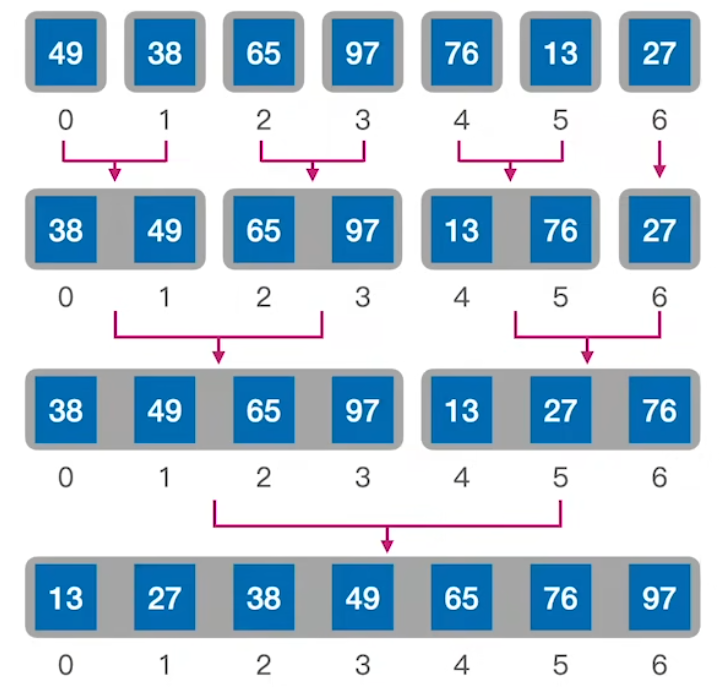
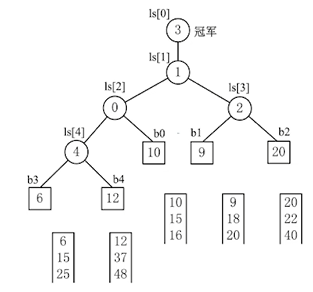
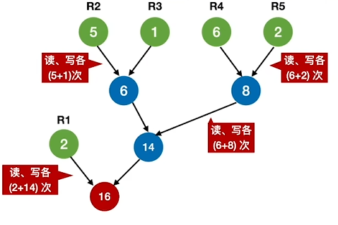
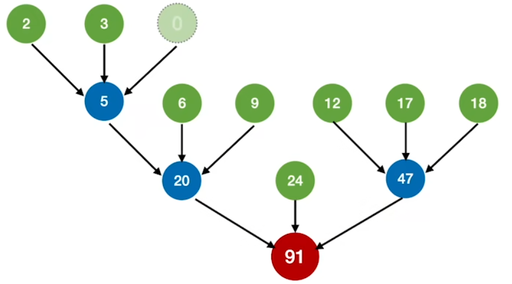

# 数据结构

## 第八章 排序

### 排序算法

#### 重要概念
**算法的稳定性**：
若待排序表中有两个元素 $R_i$ 和 $R_j$，则<span style="background:#FFFF00;">其关键字相同（$key_i = key_j$），且排序前 $R_i$ 位于 $R_j$ 之前；若使用某一排序算法排序后，$R_i$ 仍位于 $R_j$ 之前，则称该排序算法是稳定的</span>，否则，称为不稳定的。需要注意的是，稳定性并不能用来衡量算法的优劣，而只是描述其性质之一。当待排序关键字互不重复时，排序结果唯一，此时算法是否稳定就无关紧要了。


### 插入排序
#### 直接插入排序
##### 算法思想
<span style="background:#FFFF00;">每次将一个待排序的记录按其关键字大小插入到前面已排好序的子序列中</span>，直到全部记录插入完成。

##### 代码实现

```cpp
void InsertSort(int array[],int num){
    int i=0,j=0,temp=0;
    for(i=1;i<num;i++){
        if(array[i]<array[i-1]){
            temp = array[i];
            for(j=i-1;j>=0 && array[j]>temp;j--)
                array[j+1]=array[j];
            array[j+1]=temp;
        }
    }
}

void InsertSort(int array[],int num){
    int i=0,j=0;
    for(i=2;i<=num;i++){
        if(array[i]<array[i-1]){
            array[0] = array[i];
            for(j=i-1;array[j]>array[0];j--)
                array[j+1] = array[j];
            array[j+1] = array[0];
        }
    }
}

//折半插入排序，只改变了比较次数，但并没有改变元素移动的次数，时间复杂度仍然是 O(n^2)
void InsertSort_BinarySearch(int array[],int num){
    int i=0,j=0,temp=0;
    for(i=1;i<num;i++){
        if(array[i]<array[i-1]){
            temp = array[i];
            int low=0,high=i-1,middle=0;
            while(low<=high){
                middle=(low+high)/2;
                if(array[middle]>temp)
                    high = middle - 1;
                else
                    low = middle + 1; //为保证算法的"稳定性"，当关键字与中间字相等时，仍需向后比较
            }
            for(j=i-1;j>=low;j--)
                array[j+1] = array[j];
            array[low] = temp;        //注意最终元素插入的位置
            //或者 array[high+1] = temp;
        }
    }
}
```

[pic/排序--直接插入排序算法.gif]

##### 性能分析

**空间复杂度**：仅使用常数个辅助单元，空间复杂度为 $O(1)$

**时间复杂度**：
- <span style="background:#FFFF00;">整个过程<mark style="background:#ff4d4f">总是</mark>需要进行 n-1 次插入操作</span>，每次包括关键字比较和元素的移动。
- 最好情况下，即表中元素为有序，每次插入一个元素仅需要一次比较，无需移动，时间复杂度为 $O(n)$
- 最坏情况下，即表中元素为逆序，每次插入需比较 i-1 次并移动 i-1 个元素，时间复杂度为 $O(n^2)$​
- 平均情况下，时间复杂度为 $O(n^2)$ 

**稳定性**：<span style="background:#FFFF00;">稳定</span>的排序算法
**适用性**：不仅适用于 顺序存储 也适用于 链式存储 的线性表。

> 注意：对于直接插入排序，在最后一趟排序开始之前，所有的元素可能都不在最终位置上。


#### 希尔排序

##### 算法思想

先将待排序表分割成若干形如 $L[i, i+d, i+2d, \dots, i+kd]$ 的"特殊"子表，<span style="background:#FFFF00;">对各个子表分别进行直接插入排序</span>。<span style="background:#FFFF00;">缩小**增量$d$**</span>，重复上述过程，直到$d=1$为止。

##### 代码实现

```cpp
//希尔排序
void ShellSort(int A[],int n){
    int d, i, j;
    //A[0]只是暂存单元，不是哨兵，当j<=0时，插入位置已到
    for(d= n/2; d>=1; d=d/2)    //步长变化
        for(i=d+1; i<=n; ++i)
            if(A[i]<A[i-d]){    //需将A[i]插入有序增量子表
                A[0]=A[i];              //暂存在A[0]
                for(j= i-d; j>0 && A[0]<A[j]; j-=d)
                    A[j+d]=A[j];        //记录后移，查找插入的位置
                A[j+d]=A[0];            //插入
            }//if
}

// 希尔排序：先完整排完一个子表，再排下一个子表
void ShellSort(int A[], int n) {
    int d, i, j, k;
    // 步长变化
    for (d = n / 2; d >= 1; d /= 2) {
        // 遍历每个子表的起始位置 k：0 ~ d-1
        for (k = 0; k < d; k++) {
            // 对第 k 个子表做直接插入排序
            // 子表元素：A[k], A[k+d], A[k+2d], ...
            for (i = k + d; i < n; i += d) {
                int temp = A[i];
                for (j = i - d; j >= k && temp < A[j]; j -= d) {
                    A[j + d] = A[j];
                }
                A[j + d] = temp;
            }
        }
    }
}
```

[pic/排序--希尔排序算法.gif]

##### 性能分析

**空间复杂度**：$O(1)$

**时间复杂度**：

- <mark style="background:#40a9ff">目前无法用数学手段证明确切的时间复杂度</mark>

- 最坏情况下，当增量 $d=1$ 时，希尔排序退化为 直接插入排序算法 ，时间复杂度可达 $O(n^2)$

**稳定性**：<span style="background:#FFFF00;">不稳定</span>
**适用性**：仅适用于 顺序存储 的线性表(<mark style="background:#d3f8b6">依赖于顺序存储线性表(如数组)的"随机访问"能力</mark>)


### 交换排序

#### 冒泡排序

##### 算法思想
1. 从后往前（或从前往后）两两比较相邻元素的值，若为逆序，则交换它们，直到序列比较完。称这样过程为"一趟"冒泡排序。<span style="background:#FFFF00;">最多只需 $n-1$ 趟排序</span>
2. <span style="background:#FF6666;">每一趟排序都可以使一个元素的移动到最终位置</span>，已经确定最终位置的元素在之后的处理中无需再对比
3. <span style="background:#FFFF00;">如果某一趟排序过程中未发生"交换"，则算法可提前结束</span>

##### 代码实现

```Cpp
//冒泡排序
void BubbleSort(int A[],int n){
    for(int i=0;i<n-1;i++){
        bool flag=false;          //表示本趟冒泡是否发生交换的标志
        for(int j=n-1;j>i;j--)   //一趟冒泡过程
            if(A[j-1]>A[j]){     //若为逆序
                swap(A[j-1],A[j]);  //交换
                flag=true;
            }
        if(flag==false)
            return;              //本趟遍历后没有发生交换，说明表已经有序
    }
}
```

[pic/排序--冒泡排序算法.webp]

##### 性能分析

**空间复杂度**：$O(1)$

**时间复杂度**：

- 最好的情况下，即序列有序，只需要一次比较即可，时间复杂度为 $O(n)$
- 最坏的情况下，即序列逆序，时间复杂度为 $O(n^2)$

**稳定性**：稳定的算法
**适用性**：不仅适用于 顺序存储 也更适用于 链式存储 的线性表


#### 快速排序

##### 算法思想

1. 在待排序表$L[1...n]$中<span style="background:#FFFF00;">任取一个元素$pivot$作为枢轴（或基准，通常取首元素）</span>。
2. 通过一趟排序将待排序表划分为独立的两部分$L[1...k-1]$和$L[k+1...n]$，使得$L[1...k-1]$中的所有元素小于$pivot$，$L[k+1...n]$中的所有元素大于等于$pivot$，则<span style="background:#FFFF00;">$pivot$放在了其最终位置</span>$L(k)$上，这个过程称为一次"划分"。
3. 然后分别递归地对两个子表重复上述过程，直至每部分内只有一个元素或空为止，即所有元素放在了其最终位置上。

##### 代码实现

```Cpp
//快速排序
void QuickSort(int A[],int low,int high){
    if(low<high){   //递归跳出的条件
        int pivotpos=Partition(A,low,high); //划分
        QuickSort(A,low,pivotpos-1);  //划分左子表
        QuickSort(A,pivotpos+1,high); //划分右子表
    }
}

//用第一个元素将待排序序列划分成左右两个部分
int Partition(int A[],int low,int high){
    int pivot=A[low];    //第一个元素作为枢轴
    while(low<high){     //用low、high搜索枢轴的最终位置
        while(low<high&&A[high]>=pivot) --high;
        A[low]=A[high];    //比枢轴小的元素移动到左端
        while(low<high&&A[low]<=pivot) ++low;
        A[high]=A[low];    //比枢轴大的元素移动到右端
    }
    A[low]=pivot;    //枢轴元素存放到最终位置
    return low;      //返回存放枢轴的最终位置
}
```

[pic/排序--快速排序算法.webp]

##### 性能分析

**空间复杂度**：

与递归层数相关，即 $O(\text{递归层数})$​

**时间复杂度**：

1. 在递归树的每一层，所有的 Partition 操作加起来，都会遍历当前层所有的元素。无论怎么分，这一层所有子问题的规模之和始终等于 $n$ 。因此，每一层的时间复杂度固定为 $O(n)$​ 。
2. 而递归的层数与递归树的高度相关，则最后的时间复杂度为 $O(n*递归层数)$

> 根据算法思想可得，<span style="background:#FFFF00;">在执行快速排序算法过程中，其实在构建一棵**二叉搜索树**，而**树高** h 便对应着程序执行中所需的**递归层数**</span>。故：
>
> - 最好情况下，即每次划分较均匀时，树高为 $\lfloor\log_2n\rfloor+1$.     时间复杂度为 $O(n\log_2n)$，空间复杂度为 $O(\log_2n)$
> - 最坏情况下，即序列有序或逆序，树高为 $n$.                 时间复杂度为 $O(n^2)$，空间复杂度为 $O(n)$​
> - 平均情况下，时间复杂度接近最好情况下的时间复杂度。
> - 为每次能更好地划分均匀，每次选择的枢轴可以从序列中随机选择一个，或者从开头、中间、结尾三个元素中选择中位数。

**稳定性**：<mark style="background:#fff88f">不稳定</mark>的算法

**适用性**：仅适用于顺序存储的线性表

> 注意：<span style="background:#FFFF00;">对于快速排序，在执行第 n 趟排序结束后，至少有 n 元素已经到达最终的位置</span>


### 选择排序

#### 简单选择排序

##### 算法思想

假设序列为 $L[1...n]$，第 i 趟排序从 $L[i...n]$ 中选择关键字最小的元素，并将其与 L(i) 交换。

<span style="background:#FF6666;">每一趟排序均可以确定一个元素的最终位置</span>，<span style="background:#FFFF00;">经过 n-1 趟排序后，整个序列有序</span>(与初始序列的状态没有任何关联)

##### 代码实现

```cpp
void SelectSort(int array[],int len){
    for(int i=0;i<len;i++){
        int min_index = i;
        for(int j=i;j<len;j++){
            if(array[j]<array[min_index]){
                min_index = j;
            }
        }
        int temp = array[i];
        array[i] = array[min_index];
        array[min_index] = temp;
    }
}
```

[pic/排序--简单选择排序算法.webp]

##### 性能分析

**空间复杂度**：$O(1)$

**时间复杂度**：$O(n^2)$

**稳定性**：<span style="background:#FFFF00;">不稳定的算法</span>

**适用性**：不仅适用于 顺序存储结构 也更适用于 链式存储结构 的线性表


#### 堆排序

##### 堆
**定义**：
堆是一棵顺序存储的<mark style="background:#ff4d4f">完全二叉树</mark>(设根结点的编号从 1 开始)，结点之间大小关系的要求：

- 根(i) >= 左(2 \* i)、右(2 \* i+1) -> 大根堆
- 根 <= 左、右 -> 小根堆


**删除操作**：将"最后一个元素"代替待删除的元素，并自顶向下进行"下沉"操作

- <span style="background:#FFFF00;">"下沉"操作</span>：左右结点比较出最值，得到的最值再与根结点比较，判断是否交换(<span style="background:#FFFF00;">需要比较 2 次</span>)

**插入操作**：将元素插入最后位置，并自底向上进行"上浮"操作

- <span style="background:#FFFF00;">"上浮"操作</span>：结点直接与根结点比较，判断是否交换(<span style="background:#FFFF00;">仅需要比较 1 次即可</span>)


##### 算法思想(以大根堆为例)[<span style="background:#FFFF00;">原地建堆</span>]

- **建堆**
    - 编号 $\le n/2$ 的所有结点依次"下沉"调整（自底向上处理各分支节点）
    - 调整规则：小元素逐层"下坠"（与关键字更大的孩子交换）
- **排序**
    - 将堆顶元素加入有序子序列（堆顶元素与堆底元素交换）
    - 堆底元素换到堆顶后，需要进行"下坠"调整，恢复"大根堆"的特性
    - 上述过程重复 $n-1$ 趟

```Cpp
//建立大根堆
void BuildMaxHeap(int A[], int len){
    for(int i=len/2; i>0; i--)   //从后往前调整所有非终端结点
        HeadAdjust(A, i, len);
}

//堆排序的完整逻辑
void HeapSort(int A[], int len){
    BuildMaxHeap(A, len);        //初始建堆
    for(int i=len; i>1; i--){    //n-1趟的交换和建堆过程
        swap(A[i], A[1]);        //堆顶元素和堆底元素交换
        HeadAdjust(A, 1, i-1);   //把剩余的待排序元素整理成堆
    }
}

//将以 k 为根的子树调整为大根堆
void HeadAdjust(int A[], int k, int len){
    A[0]=A[k];                   //A[0]暂存子树的根结点
    for(int i=2*k; i<=len; i*=2){ //沿key较大的子结点向下筛选
        if(i<len && A[i]<A[i+1])
            i++;                 //取key较大的子结点的下标
        if(A[0]>=A[i]) break;    //筛选结束
        else{
            A[k]=A[i];           //将A[i]调整到双亲结点上
            k=i;                 //修改k值，以便继续向下筛选
        }
    }
    A[k]=A[0];                   //被筛选结点的值放入最终位置
}
```

##### 算法分析(以大根堆为例)

**时间复杂度**：

1. **<span style="background:#FF6666;">建堆</span>操作的性能分析**：
   -  一个结点，每"下坠"一层，最多需要比较 2 次(当左右结点均存在时)
   -  若结点在第 i 层，则在调整该节点时，最多"下坠" h-i 层，最多需要比较次数为 2(h-i)
   -  第 i 层至多有 $2^{i-1}$ 个结点，且仅有 1~(h-1) 层才可能需要"下坠"操作
   -  将整棵树调整为大根堆，比较次数不超过 $\sum_{i=h-1}^12^{i-1}2(h-i)\le 4n\quad(\text{计算略})$ ，即<span style="background:#FF6666;">时间复杂度为 $O(n)$</span>.

2. **<span style="background:#FF6666;">排序</span>操作的性能分析**：
   -  根节点最多"下坠"$h-1$层
   -  而每"下坠"一层，最多只需对比关键字$2$次，因此每一趟排序复杂度不超过<span style="background:#FF6666;">$O(h) = O(\log_2 n)$</span>

<span style="background:#FF6666;">总的时间复杂为 $O(n\log_2n)$</span>

**空间复杂度**：$O(1)$

**稳定性**：<span style="background:#FFFF00;">不稳定</span>的算法

**适用性**：仅适用于 顺序存储 的线性表(<mark style="background:#d3f8b6">堆的数据结构为 顺序存储的完全二叉树，依赖于数组的随机访问能力</mark>)

> 基于大根堆排序得到的是递减序列
>
> 基于小根堆排序得到的是递增序列

> [!important]
>
> **建堆方法**
>
> | 维度       | 方法一：插入法（在线建堆）                                   | 方法二：Floyd法（原地建堆）                                  |
> | :--------- | :----------------------------------------------------------- | :----------------------------------------------------------- |
> | 适用场景   | <span style="background:#FFFF00;">数据逐个到达</span>，或题干明确"依次插入" | <span style="background:#FFFF00;">给定完整数组</span>，要求"构建堆"或"堆排序"，或没有明确"从 0 开始" |
> | 核心思想   | <span style="background:#FFFF00;">将新元素置于末尾，通过上浮调整堆性质</span> | <span style="background:#FFFF00;">将数组视为完全二叉树，从最后一个非叶子节点开始，自底向上、自右向左进行下沉调整</span> |
> | 操作方向   | 从索引 0 到 n-1，逐个处理                                    | 从索引 ⌊n/2⌋−1 到 0，逆序处理非叶子节点                      |
> | 调整操作   | <span style="color:#FF6666;">上浮（Percolate-Up / Heapify-Up）</span> | <span style="color:#FF6666;">下沉（Sift-Down / Heapify-Down）</span> |
> | 时间复杂度 | <span style="background:#FFFF00;">O(N log N)</span>          | <span style="background:#FFFF00;">O(N)（更优，为默认标准方法）</span> |
> | 空间复杂度 | O(1)（原地）                                                 | O(1)（原地）                                                 |
> | 稳定性     | 不稳定                                                       | 不稳定                                                       |


### 归并排序

#### 算法思想

核心思想：将两个或者多个有序序列合并成一个更长的有序序列，<span style="background:#FFFF00;">多采用 2 路归并排序</span>

具体的，首先将这两个子表的所有元素分别有序复制到辅助数组 $B$ 中。随后，设置两个指针分别指向 $B$ 中两段的起始位置，依次比较当前元素的关键字，将较小者放入原数组 $A$ 的对应位置。其中一段的所有元素均已复制完毕后，将另一段的剩余部分直接复制到 $A$​​ 中。

归并排序：

①若 $low < high$，则将序列分从中间 $mid = (low + high) / 2$ 分开
②对左半部分 $[low, mid]$ 递归地进行归并排序
③对右半部分 $[mid + 1, high]$ 递归地进行归并排序
④将左右两个有序子序列 Merge 为一个有序序列

#### 代码实现

```Cpp
int *B=(int *)malloc(n*sizeof(int)); //辅助数组B
//A[low..mid]和A[mid+1..high]各自有序，将两个部分归并
void Merge(int A[],int low,int mid,int high){
    int i,j,k;
    for(k=low;k<=high;k++)
        B[k]=A[k];        //将A中所有元素复制到B中
    for(i=low,j=mid+1,k=i;i<=mid&&j<=high;k++){
        if(B[i]<=B[j])
            A[k]=B[i++];    //将较小值复制到A中
        else
            A[k]=B[j++];
    }//for
    while(i<=mid)  A[k++]=B[i++];
    while(j<=high) A[k++]=B[j++];
}

void MergeSort(int A[],int low,int high){
    if(low<high){
        int mid=(low+high)/2;   //从中间划分
        MergeSort(A,low,mid);   //对左半部分归并排序
        MergeSort(A,mid+1,high);//对右半部分归并排序
        Merge(A,low,mid,high);  //归并
    }//if
}
```

[pic/排序--归并排序算法.gif]

#### 性能分析



<center>示例</center>

<span style="background:#FF6666;">归并的过程可形象化为一棵 二叉树(当采用 2 路归并排序时)</span>

此时，<span style="background:#FFFF00;">树高 h 满足 $2^{h-1}\le n$，即树高 $h=\lfloor \log_2n\rfloor+1$，也即排序次数，递归栈的开销</span>

**空间复杂度**：辅助数列的空间开销，$O(n)$；递归栈的空间开销，$O(h)=O(\log_2n)$.<span style="background:#FFFF00;">总的空间复杂度为 $O(n)$</span>.

**时间复杂度：**

- 每次的排序的时间复杂度为 $O(n)$
- <span style="background:#FFFF00;">总的时间复杂度为 $O(n\log_2n)$</span> [时间复杂度总是如此]

**稳定性：**<span style="background:#FFFF00;">稳定</span>的算法

**适用性**：既适用于 顺序存储 的线性表，也适用于 链式存储 的线性表

> 考虑两个升序链表合并为降序序列，两两比较表中的元素，每比较一次，确定一个元素的位置（<span style="background:#FF6666;">取较小元素，头插法</span>）


### 基数排序

#### 算法思想

**不依赖于元素之间的比较**，而基于关键字各位的大小进行排序，是一种借助**多关键字排序的思想**的排序方法。

假设长度为 n 的线性表中，每个结点 $a_j$ 的关键字由 $d$ 个分量($k_j^{d-1},k_j^{d-2},\cdots,k_j^1,k_j^0$)组成，满足 $0\le k_j^i\le r-1(0\le j<n,0\le i\le d-1)$。其中 $k_j^{d-1}$ 为最高位关键字，$k_j^0$​ 为最低位关键字。

\[<mark style="background:#40a9ff">d 是关键字的"位数"，r 是关键字中每一位最大的取值，n 为待排元素个数</mark>\]

以 **最低位优先基数排序** 为例：

1. 算法使用 r 个队列 $Q_0,Q_1,\cdots,Q_{r-1}$。
2. 对每一位 $i=0,1,\cdots,d-1$，依次进行一次分配和收集操作：
   1. 分配：初始化所有队列为空，然后依次扫描线性表中的每一个结点 $a_j$ ，若 $a_j$ 在当前位上的关键字值为 k ,则将其加入队列 $Q_k$
   2. 收集：按 $Q_0\to Q_{r-1}$ 的顺序，依次将各个队列中的结点收集起来，形成新的线性表
3. 最后得到 <span style="background:#FF6666;">递增</span>的序列

> **最低位优先基数排序** -> 递增序列
>
> **最高位优先基数排序** -> 递减序列

[pic/排序--基数排序算法.gif]

#### 性能分析

**空间复杂度**：<span style="background:#FFFF00;">辅助空间 r，即 r 个辅助队列(仅包含队首指针等)，空间复杂度为 $O(r)$</span>

**时间复杂度**：共进行 d 次分配与收集。每次分配需遍历 n 个元素，所需时间为 $O(n)$；每趟收集需处理 r 个队列，所需时间为 $O(r)$.

<span style="background:#FF6666;">总的时间复杂度为 $O(d(n+r))$，它与初始状态无关</span>。

**稳定性**：<span style="background:#FFFF00;">稳定</span>的算法

**适用性**：适用于的 顺序存储 的线性表，更适用于 链式存储 的线性表

> 基数排序，时间复杂度 = $O(d(n+r))$
>
> 基数排序擅长解决的问题：
>
> ① 数据元素的关键字可以方便地拆分为 $d$ 组，且 $d$ 较小
>    - 反例：给5个人的身份证号排序
>
> ② 每组关键字的取值范围不大，即 $r$ 较小
>    - 反例：给中文人名排序
>
> ③ 数据元素个数 $n$ 较大
>    - 擅长：给十亿人的身份证号排序


### 计数排序

#### 算法思想

同样不依赖于比较的排序算法。核心思想为：对每个待排序元素 x，统计小于 x 的元素个数，从而确定 x 在有序序列中的位置。

#### 代码实现

```Cpp
// 计数排序
void CountSort(int A[], int B[], int n, int k){
    int i, C[k];            // 辅助数组C的长度取决于待排数组的长度
    
    // 初始化计数数组
    for(i=0; i<k; i++)
        C[i]=0;

    for(i=0; i<n; i++)      // Step1: 遍历待排序数组, 统计等于 A[i] 元素的个数
        C[A[i]]++;

    for(i=1; i<k; i++)      // Step2: 再次处理辅助数组,统计小于等于 A[i] 元素的个数
        C[i]=C[i]+C[i-1];   // C[i]保存的是小于或等于 i

    for(i=n-1; i>=0; i--){  // Step3: 利用辅助数组C实现
        C[A[i]]=C[A[i]]-1;
        B[C[A[i]]]=A[i];    // 将元素 A[i]放在输出数组 B[]
    }
}
```

代码解读：

1. 第二个 for 循环遍历输入数组 $A$，对每个元素 $x=A[i]$，将 $C[x]$ 加 $1$；循环结束后，<span style="background:#FF6666;">$C[x]$ 保存的是值等于 $x$ 的元素个数</span>。

2. 第三个 for 循环通过累加计算后，使 <span style="background:#FF6666;">$C[x]$ 变为小于或等于 $x$ 的元素总数，即 $x$ 在最终有序序列中的最后可能出现的位置</span>（从 $1$ 开始计数）。

3. 第四个 for 循环从后往前遍历 $A$：对于每个 $A[i]$，将其放入输出数组 $B$ 的 $C[A[i]]-1$ 位置（下标从 $0$ 开始），然后将 $C[A[i]]$ 减 $1$。

4. 若 $A$ 中无重复元素，则 $C[A[i]]-1$ 即为 $A[i]$ 在 $B$ 中的唯一正确位置；<span style="background:#FFFF00;">若存在重复元素，"从后往前遍历+计数递减"的策略确保在 $A$ 中先出现的相同元素，在 $B$ 中仍排在前面，从而保证排序的稳定性</span>。

[pic/排序--计数排序算法.webp]

#### 性能分析

**空间复杂度**：<span style="background:#FFFF00;">以空间换时间的算法</span>，输出数组 B 的长度为 n；计数数组 C 的长度为 k，<span style="background:#FFFF00;">空间复杂度为 $O(n+k)$</span>

**时间复杂度**：由代码可得，<span style="background:#FFFF00;">总的时间时间复杂为 $O(n+k)$</span>.

- 当 $k = O(n)$，即<span style="background:#FFFF00;">序列中的元素均在 0 到 n 之间时，计数排序可达线性时间 $O(n)$</span>
- 当 $k\gg O(n\log n)$ 时，其效率远不如其他基于比较的算法

**稳定性**：稳定的算法

**适用性**：适用于 顺序存储 的线性表


### 内部排序的比较与应用

#### 内部排序算法对比

| 排序算法 | 稳定性 | 平均时间复杂度           | 最好时间复杂度 | 最坏时间复杂度 | 空间复杂度  |
| -------- | ------ | ------------------------ | -------------- | -------------- | ----------- |
| 冒泡排序 | 稳定   | $O(n^2)$                 | $O(n)$         | $O(n^2)$       | $O(1)$      |
| 插入排序 | 稳定   | $O(n^2)$                 | $O(n)$         | $O(n^2)$       | $O(1)$      |
| 归并排序 | 稳定   | $O(n\log n)$             | $O(n\log n)$   | $O(n\log n)$   | $O(n)$      |
| 基数排序 | 稳定   | $O(d(n+r))$              | $O(d(n+r))$    | $O(d(n+r))$    | $O(n+r)$    |
| 选择排序 | 不稳定 | $O(n^2)$                 | $O(n^2)$       | $O(n^2)$       | $O(1)$      |
| 快速排序 | 不稳定 | $O(n\log n)$             | $O(n\log n)$   | $O(n^2)$       | $O(\log n)$ |
| 堆排序   | 不稳定 | $O(n\log n)$             | $O(n\log n)$   | $O(n\log n)$   | $O(1)$      |
| 希尔排序 | 不稳定 | $O(n^{1.3}) \sim O(n^2)$ | $O(n)$         | $O(n^2)$       | $O(1)$      |

**时间复杂度**与初始序列状态无关的算法：简单选择排序、堆排序、归并排序、基数排序
**不稳定**的算法：希尔排序、简单选择排序、快速排序、堆排序
**比较次数**与序列初始状态无关的算法：折半插入排序、未优化的冒泡排序、简单选择排序、归并排序、基数排序
**移动次数**与序列初始状态无关的算法：归并排序、基数排序
**总趟数**与序列的初始状态有关的算法：优化的冒泡排序、快速排序

1) <span style="background:#FFFF00;">若 $n$ 较小</span>，可采用<span style="background:#FF6666;">直接插入排序或简单选择排序</span>。直接插入排序的记录移动次数通常多于简单选择排序，因此当记录本身信息量较大时，简单选择排序更为合适。
2) <span style="background:#FFFF00;">若 $n$ 较大</span>，应采用时间复杂度为 $O(n\log_2n)$ 的排序算法，如<span style="background:#FF6666;">快速排序、堆排序或归并排序</span>。当关键字随机分布时，快速排序通常被认为是最高效的基于比较的内部排序算法。堆排序所需辅助空间少于快速排序，且不会退化到最坏情况，但两者均为不稳定排序。若既要求稳定性，又希望达到$O(n\log_2n)$ 的时间复杂度，则应选用归并排序。
3) 若<span style="background:#FFFF00;">初始序列已基本有序</span>，则<span style="background:#FF6666;">直接插入或冒泡排序</span>更为高效，因其最好时间复杂度为 $O(n)$。
4) 在基于比较的排序算法中，每次比较两个关键字仅有两种可能的结果，因此其执行过程可用一棵判定树来描述。由此可证明：<span style="background:#FFFF00;">对于 $n$ 个关键字的随机排列，任何基于比较的排序算法，在最坏情况下至少需要 $O(n\log_2n)$ 的时间</span>。
5) <span style="background:#FFFF00;">若 $n$ 很大，且关键字位数较少、可分解为多个子关键字</span>（如整数、字符串），则<span style="background:#FF6666;">基数排序</span>是更优选择，因其时间复杂度可接近线性。
6) 当记录本身信息量较大（如包含大量字段或大对象）时，为避免因频繁移动记录而产生高昂开销，宜<span style="background:#FFFF00;">采用链表作为存储结构</span>，此时<span style="background:#FF6666;">插入类或归并类</span>排序更具优势。


>[!important] **快速判断某个序列是否为某个排序算法的第 n 趟**
>
> | 排序算法 | 第 `n` 趟后的核心特征                                  |
> | :------- | :----------------------------------------------------- |
> | 插入排序 | 前 `n` 个元素有序，且来自原始序列的前 `n` 个。         |
> | 冒泡排序 | 后 `n` 个元素是全局最大的 `n` 个且有序。               |
> | 选择排序 | 前 `n` 个元素是全局最小的 `n` 个且有序。               |
> | 堆排序   | 后 `n` 个元素是全局最大的 `n` 个且有序，前部是一个堆。 |
> | 快速排序 | 至少 `n` 个枢轴已处于最终位置，左边均小于它，右边均大于它。 |
> | 归并排序 | 序列由多个长度为 `2^n` 的有序子段构成。                |
>
> **注意**：对于某些排序算法，如快速算法，并不能简单地计数序列中已到达最后位置的元素的个数(虽然大多数情况下生效)
>
> - 情况一：若每次选择的枢轴为当前序列的最大值或最小值，则此时序列仅仅被分为 1 段，经过一趟排序可以确定 1 个元素在子段中的位置
> - 情况二：若每次选择的枢轴非当前序列的最值，则此时序列被分为 2 段，经过一趟排序可以确定 1 个元素在子段中的位置

### 外部排序

#### 外部排序基本概念

若要进行 $k$ 路<span style="background:#FF6666;">归并排序</span>，则需要在内存中分配 $k$ 个输入缓冲区和 1 个输出缓冲区

- **步骤**
    - ① 生成 $r$ 个初始归并段（对 $L$ 个记录进行内部排序，组成一个有序的初始归并段）
    - ② <span style="background:#FFFF33;">进行 $S$ 趟 $k$ 路归并，$S = \lceil \log_k r \rceil$</span>

- **如何进行 $k$ 路归并**
    - 把 $k$ 个归并段的块读入 $k$ 个输入缓冲区
    - 用"归并排序"的方法从 $k$ 个归并段中选出几个最小记录暂存到输出缓冲区中
    - 当输出缓冲区满时，写出外存
    - 当 $k$ 个输入缓冲区中存在空缓冲区时，必须先将其填充后再进行归并
    
- **外部排序时间开销**
    - <span style="background:#FFFF00;">读写外存的时间 + 内部排序所需时间 + 内部归并所需时间</span>
    - 其中 <span style="background:#FFFF00;">读写外存的时间 占据相当大的比例</span>
    
- **优化**
    - 增加归并路数 $k$，进行多路平衡归并
        - 代价 1：需要增加相应的输入缓冲区
        - 代价 2：每次从 $k$ 个归并段中选一个最小元素需要 $(k-1)$ 次关键字对比
    - 减少初始归并段数量 $r$

>[!important] 磁盘读写次数的分析
>对外存信息的读写是以磁盘块为单位的，假设初始归并段共占据 x 个磁盘块，那么生成初始归并段需要进行 x\*2 次读写，二路归并需要进行 x\*2\*趟数 次读写


#### 败者树

优化思路：归并趟数$S = \lceil \log_k r \rceil$，归并路数$k$增加，归并趟数$S$​减小，读写磁盘总次数减少



##### 定义

1. 一棵 <span style="background:#FFFF33;">完全二叉树</span>
2. <span style="background:#FFFF33;">非叶子节点记录</span>的是两个子结点比较后的失败者，即<span style="background:#FFFF33;">关键字较大者</span>，而胜利者（关键字较小的）则继续向上与更高层的结点进行比较 (<span style="background:#FFFF33;">实际上，在外部排序中结点并不直接存储关键字，而是存储关键字所在的<mark style="background:#ff4d4f">归并段编号</mark></span>)

##### 性能分析

对于 $k$ 路归并，<span style="background:#FFFF33;">第一次构造败者树需要对比关键字 $k-1$ 次</span>

有了败者树，选出最小元素，<span style="background:#FFFF33;">至多只需对比关键字 $\lceil \log_2 k \rceil$ 次</span>

> 数量关系：
>
> 1. 设败者树的树高为 h，则选出最小元素需要比较的次数至多为 h-1 次
> 2. 第 h 层的结点数量至多为 $2^{h-1}$ 个，满足 $k\le2^{h-1}$，即 $h-1\le\log_2k\rightarrow h-1 = \lceil\log_2k\rceil$. 

> 败者树性质：
>
> 1. <mark style="background:#40a9ff">不存在 度为 1 的结点</mark>，因为败者树的核心逻辑是"锦标赛机制"，即<mark style="background:#40a9ff">两两比较得到较小者</mark>
> 2. 若采用 k 路归并，得到的败者树为 内部节点个数为 k-1，叶子节点个数为 k 的 完全二叉树 或 满二叉树，故总结点数为 2k-1 (不计冠军结点)
>\[上述性质可类比于 哈夫曼树\]


#### 置换-选择排序

优化思路：减少初始归并段 $r$

当前局面：
用于内部排序的内存工作区$WA$可容纳$l$个记录，则每个初始归并段也只能包含$l$个记录，若文件共有$n$个记录，则初始归并段的数量$r = n/l$

##### 实现思路
设初始待排文件为$FI$，初始归并段输出文件为$FO$，内存工作区为$WA$，$FO$和$WA$的初始状态为空，$WA$可容纳$w$个记录。置换-选择算法的步骤如下：
1) 从$FI$输入$w$个记录到工作区$WA$。
2) 从$WA$中选出其中关键字取最小值的记录，记为$MINIMAX$记录。
3) 将$MINIMAX$记录输出到$FO$中去。
4) 若$FI$不空，则从$FI$输入下一个记录到$WA$中。
5) 从$WA$中所有关键字比$MINIMAX$记录的关键字大的记录中选出最小关键字记录，作为新的$MINIMAX$记录。
6) 重复3)～5)，直至在$WA$中选不出新的$MINIMAX$记录为止，由此得到一个初始归并段，输出一个归并段的结束标志到$FO$中去。
7) 重复2)～6)，直至$WA$为空。由此得到全部初始归并段。

> 由"置换-选择排序"得到的归并段的长度一般不相等
> 归并段最小的长度为 w(等于工作区的大小)，最大的长度为 |FI|(即只有一个归并段)


#### 最佳归并树

产生原因：由"置换-选择排序"所得到的归并段的长度的不确定性



每个初始归并段看作一个叶子结点，归并段的长度作为结点权值，则上面这棵归并树的带权路径长度
$WPL = 2*1 + (5+1+6+2) * 3 = 44 =$ 读磁盘的次数 = 写磁盘的次数

重要结论：<mark style="background:#ff4d4f">归并过程中的磁盘$I/O$次数 = 归并树的$WPL$ * 2</mark>


##### 多路归并的最佳归并树

注意：<span style="background:#FFFF33;">对于 $k$ 叉归并，若初始归并段的数量无法构成严格的 $k$ 叉归并树，则需要补充几个长度为 0 的"虚段"，再进行 $k$ 叉哈夫曼树的构造</span>。

<span style="background:#FFFF33;">$k$ 叉的最佳归并树一定是一棵严格的 $k$ 叉树，即树中只包含度为 $k$、度为 $0$ 的结点</span>。
设度为 $k$ 的结点有 $n_k$ 个，度为 $0$ 的结点有 $n_0$ 个，归并树总结点数 $=n$ 则：(在树中表示初始归并段的结点一定是叶子节点)
$$
初始归并段数量 + 虚段数量 =n_0
$$
且 严格 $k$ 叉树有如下的性质：
$$
\begin{aligned}
n &= n_0 + n_k &\quad& \text{结点个数} \\
k n_k &= n - 1 &\quad& \text{树的度与结点个数的关系}
\end{aligned}
$$
根据上面的公式可得：
$$
\colorbox{yellow}{$n_0 = (k-1)n_k + 1\rightarrow n_k = \frac{n_0 - 1}{k - 1}$}
$$


如果是"严格 $k$ 叉"一定能除得

① 若 (初始归并段数量 $-1$) % $(k-1) = 0$，说明刚好可以构成严格 $k$ 叉树，此时不需要添加虚段
② 若 (初始归并段数量 $-1$) % $(k-1) = u \neq 0$，则需要补充 $(k-1) - u$ 个虚段



<center>通过添加虚段来构建最佳归并树示例</center>
