# 第二章 数据的表示和运算
## 数制与编码
### 进位数制及其相互转换
#### 计算机采用二进制的原因
1. 二进制只有两个状态，<mark style="background:#fff88f">只需使用具有两个稳定物理状态的器件即可表示每一位</mark>，硬件实现成本低
2. 二进制的 1 和 0 恰可对应逻辑值 “真”与“假”，<mark style="background:#fff88f">方便实现逻辑运算</mark>
3. <mark style="background:#fff88f">二进制的运算可以通过逻辑门运算电路实现运算</mark>

#### 进位计数制
**r进制**：
$$
\begin{aligned} (K)_{r} &= K_n K_{n-1} \cdots K_1 K_0 . K_{-1} \cdots K_{-m} \\ &= K_n \cdot r^n + K_{n-1} \cdot r^{n-1} + \cdots + K_0 \cdot r^0 \\ &\quad + K_{-1} \cdot r^{-1} + K_{-2} \cdot r^{-2} + \cdots + K_{-m} \cdot r^{-m} \end{aligned}
$$
不同位置的数字具有不同的**位权**

**基数**：每个数码位所用到的不同符号的个数，r进制的基数为r

#### 不同进制之间的转换
##### 其他进制向十进制转换
直接按照 “不同的数码位有不同的位权” 展开即可，即上述公式<mark style="background:#40a9ff">按权展开</mark>

##### 二进制与八进制和十六进制之间的转换
**二进制转八进制**：
<mark style="background:#fff88f">以小数点为界限</mark>，整数部分自右向左<mark style="background:#fff88f">每三位一组转换成八进制数</mark>，小数部分自左向右每三位一组转换成八进制数，<mark style="background:#fff88f">不足三位补零</mark>

**二进制转十六进制**：
同上，但每四位一组转换成十六进制数

**八进制转二进制**：
每一位八进制数转为对应的<mark style="background:#fff88f">三位</mark>二进制数

**十六进制转二进制**：
每一位十六进制数转为对应的<mark style="background:#fff88f">四位</mark>二进制数

##### 十进制向其他进制转换
对整数和小数部分分别处理：
1. <mark style="background:#fff88f">整数部分使用除基取余法</mark>：不断除以目标进制的基数，记录余数，直至商为 0；<mark style="background:#ff4d4f">最先得到的余数为最低位，最后得到的为最高位</mark>
2. <mark style="background:#fff88f">小数部分使用乘基取整法</mark>：不断乘以基数，记录整数部分，直至小数部分为 0 或达到所需精度。<mark style="background:#ff4d4f">先得到的整数为最高位，最后得到的整数为最低位</mark>

最后将两部分结果拼接，即得到目标进制数。
>[!warning]- 并不是所有的小数都可以精确表示
>例：$(0.3)_{10}=(0.0100110011\ldots)_2$ 循环节为$0011$

### 定点数的编码表示
#### 机器数的定点表示
1. 定点整数：表示纯整数，约定小数点的位于数值部分最低位之后
2. 定点小数：表示纯小数，约定小数点位于符号位之后、数值部分最高位之前

#### 真值、原码、反码、补码、移码之间的转换
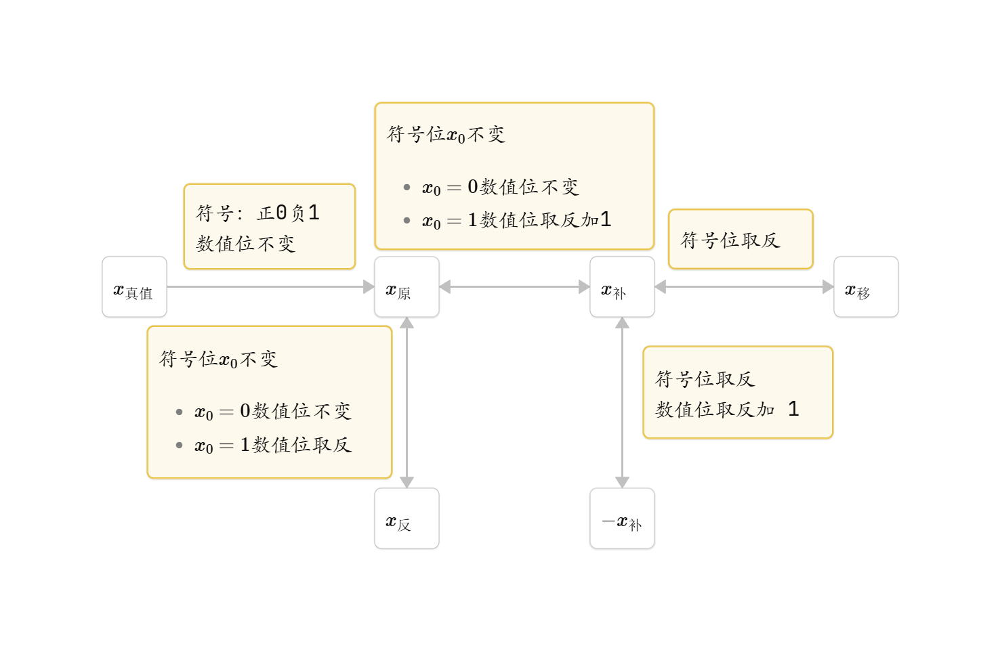

设用于表示数据的位数为 $n+1$ 位
1. 原码
	- ==整数表示范围：$\color{blue}-(2^n-1)\sim 2^n-1$ 关于原点对称==
	- ==小数表示范围：$\color{blue}-(1-2^{-n})\sim1-2^{-n}$==
	- 存在 $[+0]_{\text{原}}=0,0000000;[-0]_{原}=1,0000000$
>[!important] (负数)原码转变为补码的方式：
>方式1：符号位不变，数值位取反加 1
>方式2(更便捷)：自右向左，确定第一个 1 的位置，符号位以及该 1 之间部分按位取反
2. ~~反码~~(仅作为原码转变为补码的中间过渡态)
	- 反码与原码一一对应，可表示的范围同原码
	- 且反码同样存在 零 有两种表示方式
3. 补码
	- <mark>正数的补码与原码相同</mark>，<mark>负数的补码等于 模( n+1 位补码的模为$2^{n+1}$)与该负数的绝对值之差</mark>
	- ==整数表示范围：$\color{blue}-2^n\sim2^n-1$ 比原码多表示一个负数，即 $2^{-n}$==
	- ==小数表示范围：$\color{blue}-1\sim1-2^{-n}$==
	- <mark style="background:#40a9ff">零的表示唯一的</mark>：$\color{blue}[-0]_{补}=[+0]_{补}=0,0000000$
	- 最大正整数/最大正小数：$[2^n-1]_{补(表示整数时)}=[1-2^{-n}]_{补(表示小数时)}=0,1111\ldots1$
	- 最小负整数/最小负小数：$[-2^{n}]_{补(表示整数时)}=[-1]_{补(表示小数时)}=1,0000\ldots0\quad(在原码中用于表示 -0)$ 
>[!caution] 整数-1与小数-1的补码表示
> $[-1]_{补(表示整数时)}=1,1111\ldots1$
> $[-1]_{补(表示小数时)}=1,0000\ldots0$

>[!important] 补码的作用
> 补码表示法的加法与减法运算均可通过加法器统一实现，降低了硬件成本。补码的加减法运算：
> 1. 加法：$[A+B]_{补}=[A]_{补}+[B]_{补}$
> 2. 减法：$[A-B]_{补}=[A]_{补}+[-B]_{补}$

4. 移码
	- 零的表示唯一：$[0]_{移}=1,0000000$
	- <mark style="background:#fff88f">移码保持真值的大小顺序：移码值越大，对应真值越大，便于阶码比较</mark>
	- 原码与移码的数量关系：$x_{[原]}+2^{n-1}=x_{[移]}$
	- 当偏置值取 $2^{n-1}$ 时，移码即为 补码符号位取反

>[!attention] 原码、反码、补码、移码的相对大小
>(只考虑数值位)
>1.<mark style="background:#40a9ff">原码：无论正数还是负数，高位 1 越多，绝对值越大</mark>
>~~[2.反码：对于正数来说，高位 1 越多；对于负数来说，高位 0 越多，绝对值越大]~~
>3.<mark style="background:#40a9ff">补码：对于正数来说，高位 1 越多，绝对值越大；对于负数来说，高位 0 越多，绝对值越大</mark>
>4.移码：高位 1 越多，对应真值越大

### C语言中整数类型及类型转换
在现代计算机中，<mark style="background:#fff88f">所有有符号整型均采用 <mark style="background:#40a9ff">补码</mark> 的形式存储</mark>。
#### <mark style="background:#ff4d4f">整型</mark>之间的类型转换
1. <mark style="background:#40a9ff">位截断</mark>：当长类型转换为短类型时，系统直接丢弃高位，仅保留低位部分(无条件截断，即使是符号位，会导致正负翻转现象)
2. <mark style="background:#40a9ff">位扩展</mark>：当短类型转换为长类型时，系统通过填充高位来保持数值语义不变
	- <mark style="background:#fff88f">零扩展</mark>：用于<mark style="background:#fff88f">无符号数</mark>，在高位补 0
	- <mark style="background:#fff88f">符号扩展</mark>：用于<mark style="background:#fff88f">补码表示的有符号数</mark>，高位重复填充符号位
3. <mark style="background:#40a9ff">改变解释方式</mark>：相同字长类型的之间的转换，不改变二进制数据，仅改变解释方式。例：`short->unsigned short`
>[!caution] 有符号短类型转无符号长类型
>如 `short->unsigned int`
>先扩展长度，再转换解释，即`short->int->unsigned int`

>[!important] 转换前后真值之间的关系
>1. `unsigned int\int->unsigned short`：直接 $n\quad mod\quad 2^{16}$ 得到的即为所求
>2. `unsinged short\short->int`：`int`位数足够完全可以表示`unsigned short\short`，故真值不变，仅作零扩展\符号扩展
>3. `short->unsigned short\int->unsigned int`：同位长的有符号数转无符号数，二进制数不变，仅改变解释方式。若 $m\ge0$，则转换后的真值仍为 m；否则真值为 $2^{n}+m\quad(n对应取16,32)$
>4. `unsigned short->short\unsigned int->int`：同位长的无符号数转有符号数，二进制数不变，仅改变解释方式。若 $m<2^{n-1}\quad(n对应取16,32)$，则转换后的真值仍为 m；否则真值为 $m-2^{n}\quad(n对应取16,32)$
>其中 $2^{16}=65535$,~~$2^{32}=4294967296$~~
>>1. `unsigned int\int->short`：可以认为是 `unsigned int\int-> unsigned short-> short`：$n\quad mod\quad 2^{16}$ 得到低 16 位二进制数的无符号数解释 m；若 $m<2^{15}$ 则转为`short`后的真值为 m；否则真值为 $m-2^{16}$
>>2. `short->unsigned int`：可以认为是 `short ->int ->unsigned int`：先做符号扩展，然后同位长的有符号数转无符号数，二进制数不变，仅改变解释方式


## 运算方法和运算电路

>[!col3]- 补充知识：逻辑运算与运算器件
>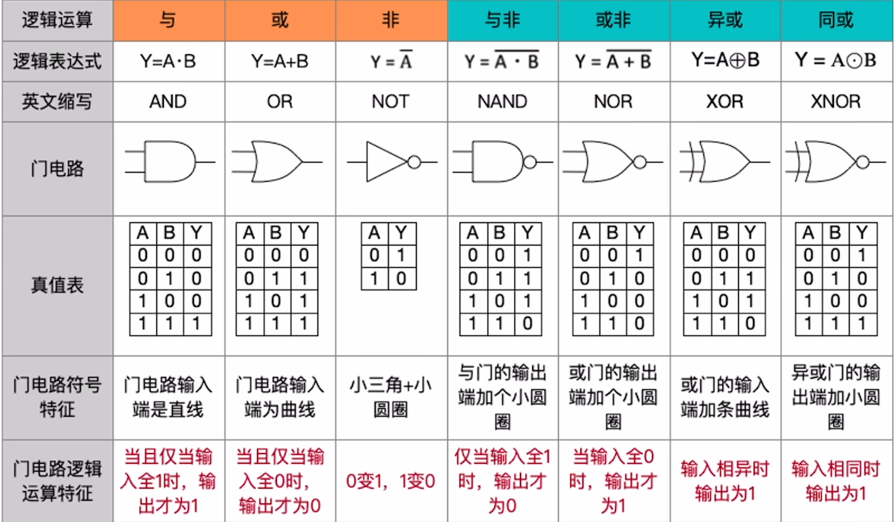
>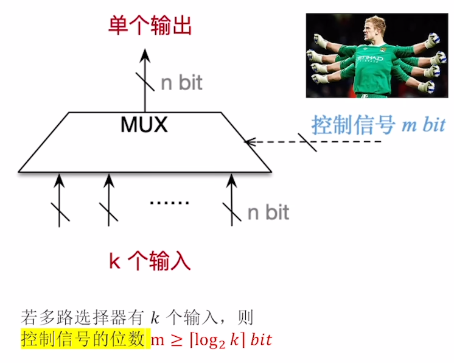
>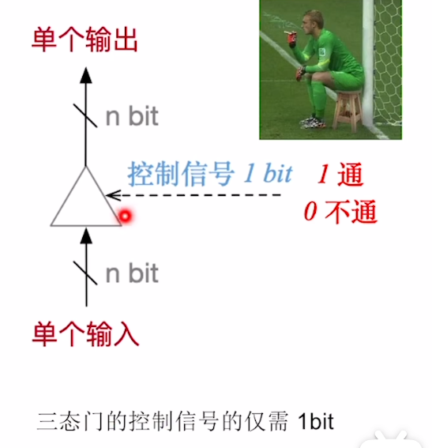

#### 基本运算部件
##### 一位全加器
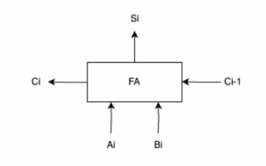

运算规则：
三个输入：$A_i,B_i,C_{i-1}\text{(来自低位的进位)}$，两个输出：本位和$S_i$，进位$C_i$
逻辑表达式为：
- 和：$\color{red}S_i=A_i\oplus B_i\oplus C_{i-1}\quad(当A_i,B_i,C_{i-1}中 1 的个数为奇数个时，S_i =1)$
- 进位：$\color{red}C_i=A_iB_i+(A_i\oplus B_i)C_{i-1} \quad (\text{当 } A_i, B_i, C_{i-1} \text{ 中 1 的个数} \ge 2 \text{ 时，产生进位})$


#### 串行加法器
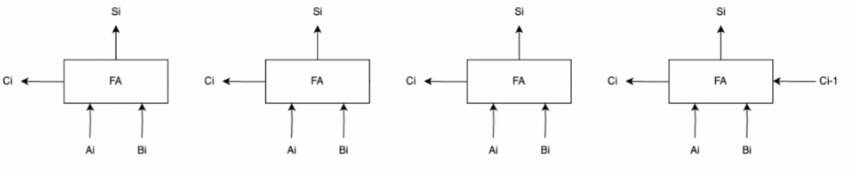

将 n 个全加器级联可以得到 n 位串行进位加法器，其中进位信息逐级传递，每一级的进位输出直接作为下一级的进位输入。
<mark style="background:#40a9ff">在串行进位加法器中，总运算延迟主要由<mark style="background:#ff4d4f">进位信号</mark>从最低位传播到最高位的时间决定</mark>；缩短进位传递路径是提升加法器性能的关键

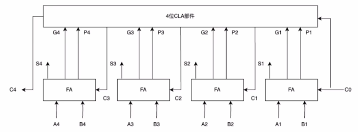

#### 带标志位的加法器
在并行加法器的基础上，增加电路逻辑，输出OF、SF、ZF、CF等标志位：
- OF(Overflow Flag) —— <mark style="background:#40a9ff">有符号数的加减运算</mark>是否发生了溢出。$OF=1$ 时，说明发生了溢出.逻辑表达式：$OF=C_{n}\oplus C_{n-1}$ [溢出的判别方法](#^609440)
- SF(Sign Flag) —— <mark style="background:#40a9ff">有符号数加减运算</mark>结果的正负性。$SF=0$ 时表示运算结果为正.逻辑表达式：$SF=S_{n}$
- ZF(Zero Flag) —— <mark style="background:#40a9ff">加减运算结果是否为0</mark>。$ZF=1$ 表示运算结果为0.逻辑表达式：$ZF=\overline{S_n+S_{n-1}+S_{n-2}+\ldots+S_1}$
- CF(Carry Flag) —— <mark style="background:#40a9ff">无符号数加减法</mark>是否发生了溢出，表示进位/借位信息。当 $CF=1$ 时说明发生了溢出.逻辑表达式：$CF=C_{out}\oplus C_{in}=C_{n}\oplus C_{0}$.在加法中，$CF = 1$ 表示最高位有进位，即“<mark style="background:#fff88f">上溢出</mark>”；在减法中，$CF=1$ 表示最高位有借位，即“<mark style="background:#fff88f">不够减</mark>”
>[!tip] ALU 生成标志位的逻辑 
><mark style="background:#40a9ff">ALU 生成标志位时只负责计算，而不管运算对象是有符号数还是无符号数，上述的符号位均会按照对应的逻辑表达式进行计算得出</mark>。
>例：当手算 CF 时，从人的角度，将操作数视为无符号数进行计算，得到的结果若溢出，则 CF = 1；手算 OF 时，将操作数视为有符号数进行计算，得到的结果若溢出，则 OF = 1.

#### 算数逻辑单元
##### ALU 的功能
- 算数运算：加减乘除等
- 逻辑运算：与或非等
- 其他：求补码等
##### 电路图示
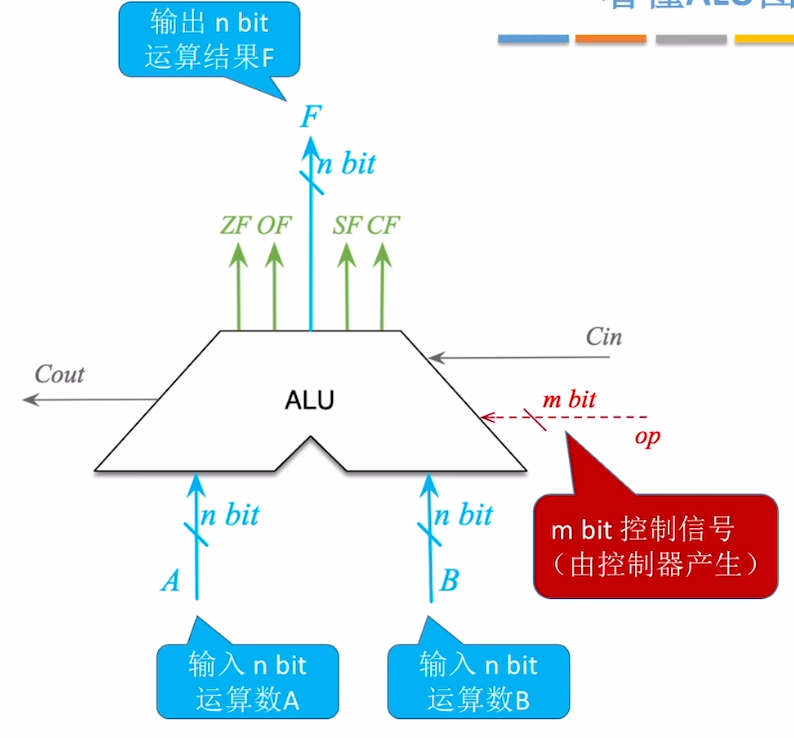
输入：
- 输入的运算数位数 n 等于 机器字长
- 控制信号位数 m 满足 $m\ge \lceil \log_2k\rceil$，其中 k 为 ALU 支持的功能个数

输出：
- 运算结果位数 n 等于 机器字长
- 标志位信息送入 PSW 寄存器(又称FR)
>[!important] 
>1.<mark style="background:#40a9ff">所有运算均以加法器为基础，ALU 以加法器为中心</mark>
>2.<mark style="background:#d3f8b6">ALU</mark> 一次能够处理的最大 bit 数为机器字长，且<mark style="background:#d3f8b6">通用寄存器的位数也等于机器字长</mark>

### 定点数的移位运算
#### <mark style="background:#40a9ff">逻辑移位</mark>
- 逻辑左移：高位移出丢弃，低位补 $0$
- 逻辑右移：低位移出丢弃，高位补 $0$
#### <mark style="background:#40a9ff">算数移位</mark>
- 算数左移：高位移出丢弃，低位补 $0$
- 算数右移：低位移出丢弃，<mark style="background:#fff88f">高位补符号位</mark>
#### 移位运算与乘/除运算之间的关系
##### <mark style="background:#fff88f">对无符号整数</mark>
1. 每逻辑左移一位，相当于乘以 $2$
  - 注意：<mark style="background:#40a9ff">若高位移出 1，则发生溢出</mark>
2. 每逻辑右移一位，相当于除以 $2$
  - 注意：<mark style="background:#40a9ff">若低位移出 1，则丢失精度</mark>
##### <mark style="background:#fff88f">对带符号整数</mark>
1. 每算数左移一位，相当于乘以 $2$
  - 注意：<mark style="background:#40a9ff">若左移前后的符号位不同，则发生溢出</mark>
2. 每算数右移一位，相当于除以 $2$
  - 注意：<mark style="background:#40a9ff">若低位移出 1，则丢失精度</mark>
##### 常考
- 用左移 $r$ 位等效实现 $\times 2^r$
- 用右移 $r$ 位等效实现 $\div 2^r$


### 定点数的加减运算
#### 补码的加减运算
运算规则：
1. 加减法均使用<mark style="background:#40a9ff">加法器实现</mark>
$\color{red}[A+B]_{补}=[A]_{补}+[B]_{补}$
$\color{red}[A-B]_{补}=[A]_{补}+[-B]_{补}$
2. <mark style="background:#40a9ff">符号位与数值位一同参与计算</mark>，结果的符号位由运算自然得出
3. <mark style="background:#40a9ff">运算结果自动截断为 n+1 位</mark>(模 $2^{n+1}$)，高位进位被舍弃，<mark style="background:#d3f8b6">仍为补码</mark>

#### 溢出的判别方法

^609440

<mark style="background:#fff88f">补码加减运算仅在运算数同号时可能发生溢出</mark>
##### 采用一位符号位
<mark style="background:#ff4d4f">溢出仅发生在参与运算的两个数符号相同，而结果符号与之不同的情况下。</mark>
设参与运算的两个操作数的符号位为 $A_s,B_s$，而结果符号位为 $S_s$，则
$$
V=A_sB_s\overline{S_s}+\overline{A_s}\;\overline{B_s}S_s
$$
##### 采用一位符号位并结合进位情况(模 2 补码)
设符号位进位为 $C_n$，数值位最高位进位为 $C_{n-1}$，<mark style="background:#40a9ff">两者不同表示溢出</mark>，则
$$
V=C_n\oplus C_{n-1}
$$
##### 采用两位符号位(模 4 补码)
使用两位符号位 $S_1S_2\quad (其中S_1为高位符号位)$ ，<mark style="background:#40a9ff">两个符号位不同表示溢出</mark>，则
$$
V=S_1\oplus S_2
$$
未发生溢出时，$S_1S_2=00$ 为正数；$S_1S_2=11$ 为负数
发生溢出时，$S_1S_2=01$ 为正溢出；$S_1S_2=10$ 为负溢出
> 简记：最高位符号位 $S_1$ 总是表示运算结果应该的 符号

>[!attention] 模 4 补码的存储与运算
><mark style="background:#40a9ff">模 4 补码</mark>在<mark style="background:#ff4d4f">存储</mark>时仍然使用<mark style="background:#ff4d4f">一个符号位</mark>，仅在 ALU 中<mark style="background:#ff4d4f">参与运算</mark>时才采用<mark style="background:#ff4d4f">双符号位</mark>

>[!note] 无符号数的加减法运算
>无符号数在计算机中以 <mark style="background:#40a9ff">真值</mark> 形式直接存储，并在运算过程中也是以真值形式参与运算
>1. 运算规则
>- 加法：直接二进制相加
>- <mark style="background:#fff88f">减法</mark>：<mark style="background:#40a9ff">通过模$2^n$补码加法实现（$A-B = A + (2^n-B)$）</mark>[由$B$转为$2^n-B$:按位取反，末位加1]
>2. 判断溢出
>- <mark style="background:#fff88f">加法</mark>：<mark style="background:#40a9ff">最高位进位为 1 时，发生溢出</mark>
>- <mark style="background:#fff88f">减法</mark>：<mark style="background:#40a9ff">最高位进位为 0 时，发生溢出</mark>
>- 或者<mark style="background:#40a9ff">直接手算</mark>，将操作数转为十进制，判断最后计算结果是否超出 n 位二进制无符号数所能表示的范围

#### 补码加法器

运算实现：
1. 加法：信号 $Sub=0$，操作数 Y <u>直送</u>，低位进位 $Cin=0$
2. 减法：信号 $Sub=1$，<u>操作数 Y 经过 非门 实现按位取反，低位进位</u> $\underline{Cin=1}$(该步骤实现了 $[Y]_{补}$ 向 $[-Y]_{补}$ 的转变，将减法运算转为加法运算)
>[!tip] (有符号数)补码加法器同样适用于无符号数的加减运算


### ~~定点整数乘除运算~~(非重点内容，了解运算规则即可，运算电路无需了解)
#### 无符号整数乘法运算
类比十进制乘法运算，二进制乘法运算同样遵循“<mark style="background:#40a9ff">逐位相乘，错位相加</mark>”的运算原则
##### 硬件实现
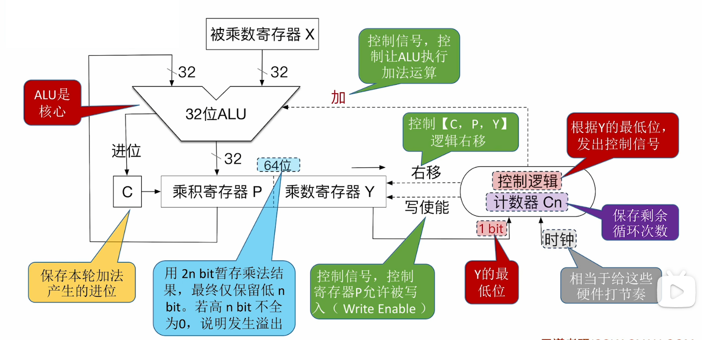
运算步骤：
**开始：**
1. 将被乘数、乘数分别放入寄存器 $X$、$Y$
2. 乘积寄存器 $P$ <mark style="background:#40a9ff">置为 0</mark>
3. 计数器 $C_n$ 的初始值置为 $n$（$n$ 为乘数的位数）
>[!tip] 特殊情况：当被乘数、乘数中有一个为全 $0$ 时，结果直接得 $0$，不需要再进行后续的运算步骤

重复 $n$ 轮加法、移位运算，直到计数器 $C_n = 0$：

4. 将乘数寄存器 $Y$ 的最低位，送入“控制逻辑”进行判断
5. ①若 $Y$ 的<mark style="background:#40a9ff">最低位为 1，则执行加法</mark>，运算结果写回 $P$（注意加法产生的进位需保存至进位触发器 $C$）；②若 $Y$ 的<mark style="background:#40a9ff">最低位为 0，则什么也不做</mark>。
6. 将 $[C, P, Y]$ 视为整体，<mark style="background:#40a9ff">逻辑右移</mark>一位
7. 计数器 $C_n$ 减 $1$

**结束（计数器 $C_n = 0$）：**
① 乘法运算的结果用 $2n$ 位暂存（寄存器 $P$、寄存器 $Y$）
② <u>在很多计算机架构中，通常仅保留低</u> $\underline{n}$ <u>位作为乘积结果</u>（因此，运算结果可能发生溢出）

##### 溢出判断
无符号整数乘法的溢出判断:
- 两个 $n$ bit 无符号整数相乘，运算结果用 $2n$ bit 暂存。通常仅保留低 $n$ 位作为乘法运算结果。==若高 $\color{red}n$ 位不全为 $\color{red}0$，说明发生溢出，此时可将 CF 标志位（溢出标志位）置为 $1$==

溢出的处理:
- 程序员可以选择忽略“溢出”，只不过这样会导致错误的运算结果
- 如果想要处理“溢出”这种“异常”，可以在乘法指令之后执行一条<mark style="background:#40a9ff">溢出自陷指令</mark>，（例如：x86 的 INTO 指令（Interrupt on Overflow））。该指令会检查 OF 标志位，若 OF=1，就执行操作系统的“异常处理程序”

#### 有符号数的乘法运算
##### 硬件实现

>[!attention] 无符号数与有符号数的硬件电路对比
>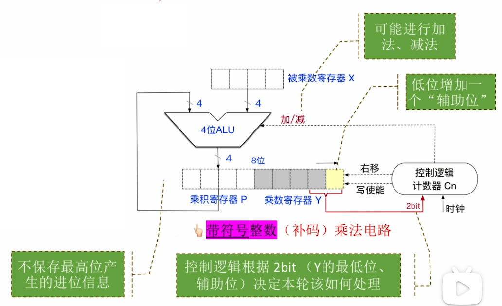

运算步骤：
**开始**：
1. 将被乘数、乘数 分别放入寄存器$X$、$Y$
2. 乘积寄存器$P$ <mark style="background:#40a9ff">置为0</mark>，<mark>“辅助位” 置为0</mark>
3. 计数器$C_n$ 的初始值置为 $n$ （$n$ 为乘数的位数）
>[!tip] 特殊情况
>当被乘数、乘数中有一个为全 $0$ 时，结果直接得 $0$，不需要再进行后续的运算步骤

重复 $n$ 轮 加/减法、移位运算，直到计数器 $C_n = 0$：
1. 将乘数寄存器 $Y$ 的<mark style="background:#40a9ff">最低位、辅助位</mark>，$2\text{bit}$ 送入 “控制逻辑” 进行判断
2. 根据寄存器 $Y$ 的最低位、辅助位，决定是 “$+[x]_{\text{补}}$” “$-[x]_{\text{补}}$” “$+0$”
3. 将 $[P,\;Y,\;\text{辅助位}]$ 视为整体，<mark style="background:#40a9ff">算数右移</mark>一位
4. 计数器 $C_n$ 减 $1$
>[!note] 
>| 寄存器Y最低位 | 辅助位 | 本轮操作 |
| :--- | :--- | :--- |
| $0$ | $0$ | $+0$ |
| $0$ | $1$ | $+[x]_{\text{补}}$ |
| $1$ | $0$ | $-[x]_{\text{补}}$ |
| $1$ | $1$ | $+0$ |

**结束**（计数器 $C_n = 0$）：
① 乘法运算的结果用 $2n$ 位暂存（寄存器 $P$、寄存器 $Y$）
② 在很多计算机架构中，通常仅保留低 $n$ 位作为乘积结果（因此，运算结果可能发生溢出）

##### 溢出判断
带符号整数（补码）乘法的溢出判断：
- 两个 $n$ bit 带符号整数相乘，运算结果用 $2n$ bit 暂存。通常仅保留低 $n$ 位作为乘法运算结果。==若高 $\color{red}n+1$ 位不完全相同，说明发生溢出，此时可将 OF 标志位（溢出标志位）置为 1==

溢出的处理：
- 程序员可以选择忽略“溢出”，只不过这样会导致错误的运算结果
- 如果想要处理“溢出”这种“异常”，可以在乘法指令之后执行一条<mark style="background:#40a9ff">溢出自陷指令</mark>，（例如：x86 的 INTO 指令（Interrupt on Overflow））。该指令会检查 OF 标志位，若 OF=1，就执行操作系统的“异常处理程序”

>[!summary] 在计算机内，实现乘法运算的三种常见方式对比：
>- <mark style="background:#40a9ff">阵列乘法器</mark>（快速乘法器中的一种）的运算速度<mark style="background:#ff4d4f">最快</mark>——可 <mark style="background:#ff4d4f">1 个时钟</mark>内完成运算。
>	- 基本部件仅包括：与门、全加器。
>	- 虽然是 并行 计算，但进位传播仍是必需的。
>- <mark style="background:#40a9ff">由 ALU、移位器、寄存器、控制逻辑 组成的乘法电路</mark>运算速度<mark style="background:#ff4d4f">较快</mark>——通常需<mark style="background:#ff4d4f">多个时钟</mark>才能完成运算
>- 可以<mark style="background:#40a9ff">使用移位运算、加/减运算 等效实现乘法</mark>，但运算速度<mark style="background:#ff4d4f">最慢</mark>


#### 无符号数的除法运算
被除数 ÷ 除数 = 商

类比十进制的除法运算，二进制除法运算遵循“<mark style="background:#40a9ff">就近上商</mark>”原则：商 \* 除数 的值要尽可能的接近“中间余数”，但又不能大于“中间余数”。
##### 硬件实现(恢复余数法)
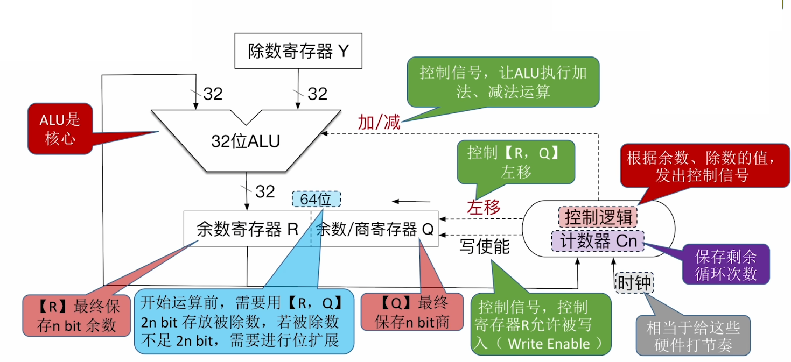
运算步骤：
**开始**：
1. 除数放入寄存器 $Y$；
2. 被除数放入寄存器 $[R,Q]$ 并完成<mark style="background:#ff4d4f">零扩展</mark>；
3. 计数器 $C_n$ 的初始值置为 $n$

>[!tip] **特殊情况检查**
>- 如果除数为 $0$，发生“除数为 $0$”异常，停止除法运算，调出操作系统的异常处理程序
>- 如果 $|\text{被除数}([R,Q])| < |\text{除数}(Y)|$，则 $\text{商} = 0$，$\text{余数} = \text{被除数}$，除法器不必再执行

**进行 $1+n$ 轮处理（计算 $1+n$ 位商）**
- **上商的规则**：<mark style="background:#40a9ff">如果</mark> $\color{red}[R] - [Y] \geq 0$ ，<mark style="background:#40a9ff">则上商 1；否则上商 0，并再执行一次加法以恢复余数</mark>
- **第1轮特殊处理（<mark style="background:#40a9ff">商溢出判断</mark>）**
	直接上商，
	- 若第一位商 $= 1$，发生“商溢出”异常，停止除法运算
	- 若第一位商 $= 0$，说明不会发生“商溢出”，不必保存这位商，也不让 $C_n--$，除法运算继续
- **其余 $n$ 轮处理**
    - ① $[R,Q]$ 先 **左移**，空出的位用于上商
    - ② **上商**，背后的过程可能会进行 **加法/减法**
    - ③ **计数器 $C_n--$**，当计数器 $C_n = 0$ 时，除法运算结束

**结束**：
当计数器 $C_n = 0$ 时，除法运算结束。$n\ \text{bit}$ 寄存器$[R]$保存余数、$n\ \text{bit}$ 寄存器$[Q]$保存商
>[!note] 双精度与单精度
> 单精度：$n\;bit\div n\;bit$ 一定不会发生商溢出
> 双精度：$2n\;bit\div n\;bit$ 可能发生商溢出

>[!note] 不恢复余数法的上商规则
>1. 余数为正，商上 1，左移 1 位，减除数；
>2. 余数为负，商上 0，左移 1 位，加除数。


#### 有符号整数的除法运算
##### 硬件实现

(硬件电路同 无符号整数的除法电路)

运算步骤：
**运算前初始化**
- 被除数 — $n$ bit 被除数，需<mark style="background:#ff4d4f">符号扩展</mark>为 $2n$ bit，放入寄存器$[R,Q]$
- 除数 — $n$ bit 除数，放入寄存器$[Y]$
- 计数器 $C_n$ — 初始值置为 $n$，表示剩余 $n$ 轮处理

**$n$轮处理**
1. 先 **左移**，空出的位用于上商
2. 上商
 - 由控制逻辑根据中间余数与除数的符号组合 来决定本轮做减法 or 加法（**同号减，异号加**）
 - 再根据$ALU$运算结果（新余数）的符号位来决定上商为 $1$ 还是 $0$
 - **新余数与老余数相比，符号不变→上商$1$；符号变→上商$0$，并还原为老余数**
3. 计数器 $C_n$ --，当计数器$C_n=0$ 时，除法运算结束

**结束** 
当计数器$C_n=0$ 时，除法运算结束。
$n$ bit 寄存器$[R]$保存余数、$n$ bit 寄存器$[Q]$保存商

>[!attention] 特殊情况
>- 可直接得到除法运算结果？ 
>	- 如果 $|被除数[Y]| < |除数[Q]|$，则 商=$0$，余数=被除数，除法器不必再执行
>- 除数是否为$0$？ 
>	- 如果除数为$0$，发生“除数为$0$”异常，停止除法运算，调出操作系统的异常处理程序
>- 是否可能发生溢出？ 
>	- 考试要点：对于补码的单精度除法（即 $n$ bit $\div$ $n$ bit，得到 $n$ bit 商、$n$ bit 余数），仅“绝对值最大的负数 $\div$ $-1$”，才有可能发生“商溢出”异常

>[!hint] 有符号数除法运算要求
>结合手算，有能力将硬件电路中寄存器的初始状态以及最终状态计算出来即可，以及要注意除法运算中遇到的几个特殊情况。对于除法运算过程中，硬件电路的状态不必深究


>[!attention] 无符号数与有符号数之间的运算
>无符号数和有符号数一起参与运算时，计算机按照无符号数来解释最终的执行结果。
>>[!example] 示例
>> 1. 加法
>>- `signed char a = -1;`（补码 `11111111`，转无符号为 `255`）
>>- `unsigned char b = 2;`
>>- 运算：`255 + 2 = 257`，截断为 `1`
>>- 结果按**无符号数**解释为 `1`
>> 2. 比较运算
>> 
>>```cpp
>>int a = -1;
>>unsigned int b = 0;
>>if (a < b)  // 实际结果：假(0)
>>```


## 浮点数的表示与运算
### IEEE 754 标准的浮点数
#### IEEE 754 标准的浮点数格式(规格化)
类比“十进制的科学计数法”，二进制的浮点数可表示为：
$$
N=(-1)^{S}\times M\times 2^{E}
$$
其中，$S$ 决定浮点数的符号；$M$ 是一个非负的定点小数，称为“尾数”，通常采用原码表示；$E$ 是一个定点整数，称为“阶码”，通常采用偏置表示，即移码。

进一步地，IEEE 754 标准的浮点数要求：
1. 尾数 $f$ 采用<mark style="background:#ff4d4f">原码</mark>表示，并且规格化<mark style="background:#ff4d4f">要求尾数的最高位恒为 1</mark>，<mark style="background:#ff4d4f">不显示存储该位</mark>，而是将其隐藏在小数点之前.
2. 阶码采用<mark style="background:#ff4d4f">移码</mark>表示，偏置值 $e'$ 采用 $\color{red}2^{n-1}-1$，而非 $2^{n-1}$.

>[!note]- 原码向移码的转换 
>1. 当偏置值取 $\color{red}2^{n-1}$ 时，<mark style="background:#40a9ff">移码为 原码取补码，然后符号位取反</mark>
>2. 当偏置值取 $\color{red}2^{n-1}-1$ 时，<mark style="background:#40a9ff">移码为 原码取补码，然后符号位取反，再 -1</mark>

>[!note] 移码与真值之间的转换
>1. 真值向移码转换：真值加上偏置值，得到的结果按照 “无符号数” 解释得到移码
>2. 移码向真值转换：移码按照 “无符号数” 解释，得到的结果减去偏置值得到真值

即，IEEE 754 标准的(规格化)浮点数对应的真值为：
$$
N = (-1)^s\times \colorbox{red}{1}.f\times 2^{e-e'}
$$
特别的，32 位单精度浮点数与 64 位双精度浮点数，格式如下：
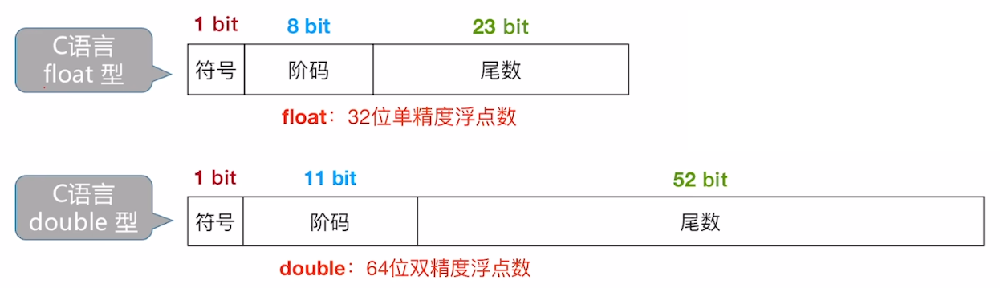
>[!attention] 补码形式的浮点数的规格化(非 IEEE 754 标准的浮点数)
>浮点数<mark style="background:#fff88f">采用补码表示</mark>，<mark style="background:#fff88f">数符和尾数小数点后第一位数字相异为规格化数</mark>。
>格式：<mark style="background:#d3f8b6">|阶符|阶码(补码)|数符|尾数(补码)|</mark>

#### IEEE 754 格式的浮点数的表示范围与几种特殊情况
IEEE 754 规定：
1. 仅当阶码不全为$0$、也不全为$1$时，表示这是一个“规格化浮点数”
2. 阶码全为$0$、全为$1$留作特殊用途，需要按照特殊的方式去解读真值

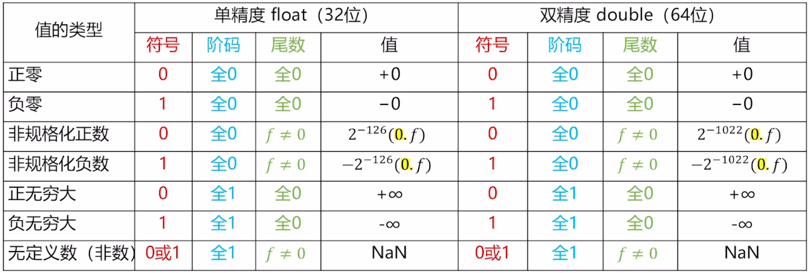

(单精度浮点数格式：1 bit 符号位，8 bit 阶码，23 bit 尾数)
##### <mark style="background:#fff88f">规格化</mark>的 IEEE 754 标准的浮点数表示范围(以单精度浮点数为例)
阶码所能表示的范围：$00000001\sim 11111110$，即 $-126\sim 127$ 
>说明：规格化阶码既不能全为0也不能全为1，则规格化阶码可取：$00000001\sim 11111110$，先按 无符号数 解释，得到 $1\sim 254$，减去偏置值 127 得到 $-126\sim 127$.

最大正数：$(0,11111110,11111111111111111111111)_2=(2-2^{-23})\times 2^{127}$
最小正数：$(0,00000001,00000000000000000000000)_2=1.0\times 2^{-126}$

最小负数：$(1,11111110,11111111111111111111111)_2=-(2-2^{-23})\times 2^{127}$
最大负数：$(1,00000001,00000000000000000000000)_2=-1.0\times 2^{-126}$
[取值范围关于原点对称]

##### <mark style="background:#fff88f">非规格化</mark>的 IEEE 754 标准的浮点数表示范围(以单精度为例)
1. 非规格化：阶码全为 0，尾数不为 0.<mark style="background:#40a9ff">此时尾数的最高位隐藏位不再为 1，而是 0</mark>
2. <mark style="background:#40a9ff">阶码固定为</mark>：$\color{red}00000000$，<mark style="background:#40a9ff">固定解释为</mark> $\color{red}2^{-126}$
3. 由于正/负零的表示，在非规格化浮点数中 尾数不能全为 0
>[!note] 非规格化浮点数对应的真值表达式为：
>$$
>N = (-1)^s\times \colorbox{red}{0}.f\times 2^{e-e'}
>$$

最小正数：$(0,00000000,00000000000000000000001)_2=2^{-23}\times2^{-126}=2^{-149}$
最大正数：$(0,00000000,11111111111111111111111)_2=(1-2^{-23})\times 2^{-126}=2^{-126}-2^{-149}$

最大负数：$(1,00000000,00000000000000000000001)_2=-2^{-23}\times2^{-126}=-2^{-149}$
最小负数：$(1,00000000,11111111111111111111111)_2=-(1-2^{-23})\times 2^{-126}=-(2^{-126}-2^{-146})$
[取值范围关于原点对称]

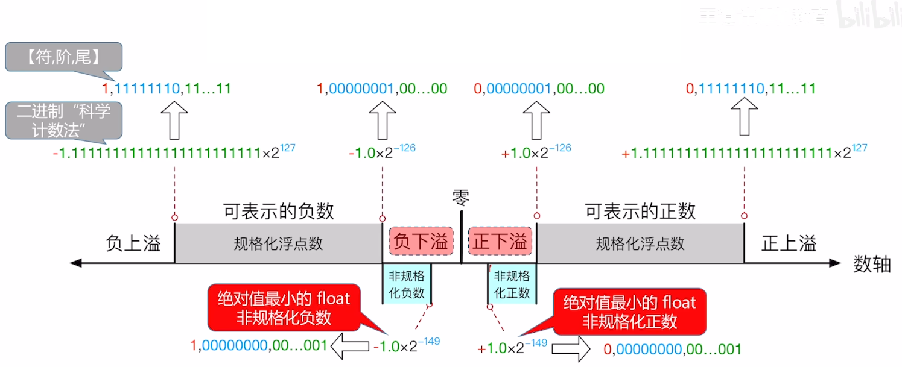
##### 溢出处理

^13204c

1. 正/负上溢：将结果设为对应的 $+\infty$ 或 $-\infty$ ；置位浮点溢出异常标志，默认情况下不触发异常中断
2. 正/负下溢：采用<mark style="background:#40a9ff">渐进下溢</mark>机制
	- 若结果<mark style="background:#40a9ff">落在非规格化数可表示范围内，则以非规格化形式存储</mark>，保留有效精度
	- 若结果<mark style="background:#40a9ff">过于接近零，则存储为 +0 或 -0</mark>(两者逻辑上并无差异，仅是符号位不同)，并置浮点下溢异常，默认情况下不响应下溢异常


### 浮点数的加减运算
1. <mark style="background:#ff4d4f">对阶</mark>：<mark style="background:#40a9ff">小阶向大阶对齐</mark>，即将阶码小的数的尾数右移，右移位数等于两阶码差的<mark style="background:#40a9ff">绝对值</mark>(阶码的大小关系是根据阶码做差后的结果进行判断的，采用 有符号数/<mark style="background:#d3f8b6">补码减法规则</mark>，<mark style="background:#d3f8b6">最后机器数结果为阶差的补码形式</mark>)；并且移出的低位不应丢弃，而应保留并参与后续尾数的计算。
2. <mark style="background:#ff4d4f">尾数加减</mark>：在存储时，尾数为定点原码小数；<mark style="background:#40a9ff">在运算时，需将原码转为补码，再进行加减运算，得到的结果再转为原码</mark>。<mark style="background:#40a9ff">对阶过程中保留的低位也应参与计算</mark>。
3. <mark style="background:#ff4d4f">尾数规格化</mark>：通过调整尾数与阶码，<mark style="background:#40a9ff">使得浮点数的尾数满足最高有效位为 1 的形式</mark>。
	- 左规：尾数左移(相等于乘 2)，阶码减 1
	- 右规：尾数右移(相当于除 2)，阶码加 1
>[!note] 特殊情况
>如果当前阶码已经为 $00000001$，但尾数仍需左规，就直接将阶码置为全$0$。并且 尾数的隐藏位由 0 变为 1，尾数需整体左移 1 位
4. <mark style="background:#ff4d4f">舍入</mark>：(保护位：紧邻尾数最低有效位之后的第一位)
	- 直接截断
	- 正向舍入
	- 负向舍入
	- 就近舍入(默认舍入方式)：
		- <mark style="background:#fff88f">0XX，直接舍弃</mark>
		- <mark style="background:#fff88f">1XX，若 XX 不全为 0，则进 1</mark>
		- <mark style="background:#40a9ff">100，若尾数最低有效位为 1，则进 1；否则，直接舍弃</mark>
5. <mark style="background:#ff4d4f">溢出判断</mark>：
	- <mark style="background:#40a9ff">当<mark style="background:#ff4d4f">阶码</mark>全为 1 或 全为 0 时，发生溢出</mark>
	- 溢出处理：[溢出处理](#^13204c)

>[!note] C语言类型转换
>1. 不同类型之间的比较、赋值、计算等操作，会触发自动类型转换，由范围和精度较低的类型转向范围和精度较高的类型：`char->int->long->double,float->double`，一般不会有精度的损失
>2. `int->float`：当整数值的二进制有效位为 24 位时，需要进行舍入处理，导致精度损失。\[虽然`int`与`float`的长度相等，但之间的转换需要重新计算，而不是简单的拷贝；或者说，整型数据与浮点型数据之间的转换均需要重新计算，而不是简单的拷贝\]
>3. `int/float->double`：`double`有效位更多，通常不会有精度的损失。
>4. `double->float`：可能发生溢出以及精度损失。
>5. `float/double->int`：小数部分被直接舍弃；同时若浮点数的范围超出 int 的范围，发生溢出。


### 数据的存储与排列
#### 大小端模式
大小端模式即指数据的存储模式：
<mark style="background:#40a9ff">大端模式</mark>：数据的高位字节存储在内存的低地址处，低位字节存储在内存的高地址处。这种存储方式类似于我们书写数字的顺序，<mark style="background:#40a9ff">高位在前，低位在后</mark>。
<mark style="background:#40a9ff">小端模式</mark>：数据的低位字节存储在内存的低地址处，高位字节存储在内存的高地址处。这种存储方式与书写顺序相反，<mark style="background:#40a9ff">低位在前，高位在后</mark>。
>[!important]
>1. 示例数据：ABCD00FF H(正常的书写顺序)
>	在一块连续的存储空间内：(低地址->高地址)
>	大端模式存储：ABCD00FF H (高字节->低字节，题干中数据是什么顺序就是什么顺序)
>	小端模式存储：FF00CDAB H (低字节->高字节，将题干中的顺序颠倒)
>
>2. 在指定的存储模式下，主存中的数据(无论是操作数还是指令)均遵循该存储模式

#### 边界对齐
现代计算机通常是<mark style="background:#40a9ff">按字节编址</mark>，即每个字节对应 1 个地址
通常也支持按字、按半字、按字节寻址。
假设存储字长为 32 位，则 1 个字 = 32 bit，半字 = 16 bit。

<mark style="background:#ff4d4f">边界对齐要求数据的存储地址是其对齐值的整数倍：半字地址必须为 2 的倍数，字地址必须为 4 的倍数。</mark>
>[!important]
>1. char：1 字节，任意地址
>2. short：2 字节，地址必须为 2 的倍数
>3. int：4 字节，地址必须为 4 的倍数
>4. float：4 字节，地址必须为 4 的倍数
>5. double：8 字节，地址必须为 8 的倍数

<mark style="background:#40a9ff">每次访存只能读/写1个字</mark>；若采用边界不对齐方式，对某一数据的读取可能需要多次访存；而采用边界对齐方式，虽然会浪费一定的内存空间，但是会有效减少访存的次数。

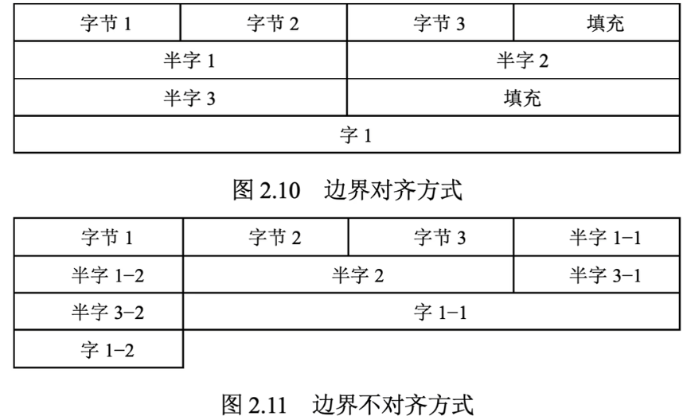


