# 第三章 存储系统
## 存储系统概述
### 层次结构
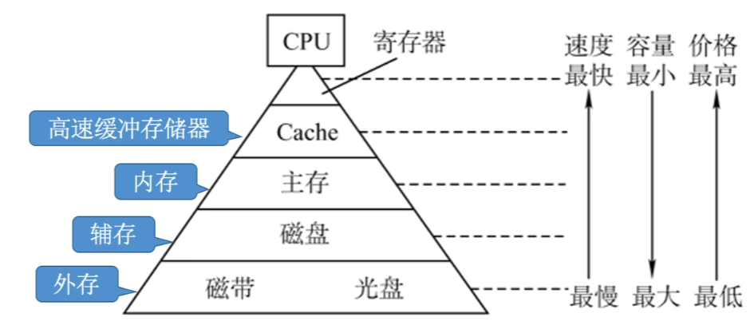
- 高速缓存 (Cache)\[可被 CPU 直接读写\]
- 主存储器 (主存、内存)\[可被 CPU 直接读写\]
- 辅助存储器 (辅存、外存)

> **主存—辅存**：实现虚拟存储系统，解决了<mark style="background:#40a9ff">主存容量不够</mark>的问题，数据调度由<mark style="background:#40a9ff">硬件与操作系统</mark>协同完成，<mark style="background:#40a9ff">对应用程序员透明</mark>
> **Cache—主存**：解决了主存与 $CPU$ <mark style="background:#40a9ff">速度不匹配</mark>的问题，数据调度由<mark style="background:#40a9ff">硬件</mark>自动完成，<mark style="background:#40a9ff">对所有程序员透明</mark>

> [!non-important]- 分类
> - **按层次结构**：同上↑
> - **按存储介质**：半导体存储器、磁表面存储器、光存储器
> - **按存取方式**：
> 	- 随机存取存储器 ($RAM$)，如内存，数据的读写与数据存储的物理位置无关；
> 	- 顺序存取存储器 ($SAM$)，如磁带，数据的读写与数据存储的物理位置有关；
> 	- 直接存取存储器 ($DAM$)，如磁盘，既兼顾了随机存取的特性，也具备顺序存储的特性；
> 	- 相联存储器（可按内容访问的存储器，$CAM$），如快表。
> - **按信息可更改性**：
> 	- 读/写存储器；
> 	- 只读存储器 ($ROM$)
> - **断电后信息是否消失**：
> 	- 易失性存储器，如内存、Cache；
> 	- 非易失性存储器，如磁盘、光盘
> - **信息读出后，原信息是否被破坏**：
> 	- 破坏性读出，如 $DRAM$ 芯片；
> 	- 非破坏性读出，如 $SRAM$ 芯片、磁盘

### 存储器性能指标
- 存储容量 = 存储字数 \* 字长
- 单位成本 (每位价格) = 总成本 / 总容量
- 数据传输率 (主存带宽) = 数据的宽度 / 存储周期
- 存取周期 = 存取时间 + 恢复时间
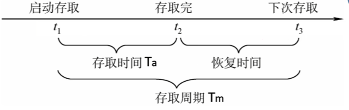
>[!important] MDR 的长度
>1. 题干中仅说明 字长，则 MDR = 字长
>2. 若明确指出 字长 ≠ 数据总线宽度，则 MDR = 数据总线宽度

## 主存储器
### 主存储器的基本组成
#### 基本元件
- MOS管，作为通电“开关”(高电平为开，低电平为关)
- 电容，存储电荷（即存储二进制 $0/1$）
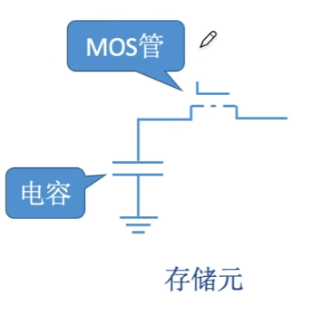
#### 存储芯片的结构
- **译码驱动电路**：译码器将地址信号转化为字选通线的高低电平
- **存储矩阵（存储体）**：由多个存储单元构成，每个存储单元又由多个存储元构成
- **读写电路**：每次读/写一个存储字
- <mark style="background:#40a9ff">地址线、数据线、片选线、读写控制线</mark>（可能分开两根，也可能只有一根）
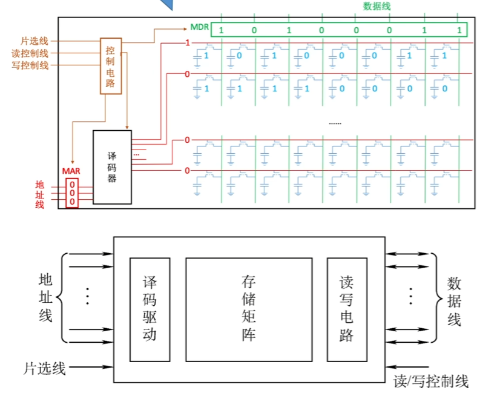

#### ~~寻址~~
- 现代计算机通常按字节编址（每个字节），即每个字节对应一个地址
- 按字节寻址、按字寻址、按半字寻址、按双字寻址
>[!note]- 由按字/半字/双字寻址转为按字节寻址
>不妨设字长为 4B，则半字为 2B，双字为 8B
>1. 按字寻址：当前的字地址左移 2 位得到对应的字节地址
>2. 按半字寻址：当前半字地址左移 1 位得到对应的字节地址
>3. 按双字寻址：当前双字地址左移 3 位得到对应的字节地址

### 半导体随机存取存储器
| 类型特点                                                | SRAM（静态RAM） | DRAM（动态RAM）   |
| :-------------------------------------------------- | :---------- | :------------ |
| 存储信息                                                | 触发器         | 电容            |
| <mark style="background:#40a9ff">破坏性读出</mark>       | 非           | 是             |
| 读出后需要重写？（再生）                                        | 不用          | 需要            |
| 运行速度                                                | 快           | 慢             |
| 集成度                                                 | 低           | 高             |
| 发热量                                                 | 大           | 小             |
| 存储成本                                                | 高           | 低             |
| <mark style="background:#40a9ff">易失/非易失性存储器？</mark> | 易失（断电后信息消失） | 易失（断电后信息消失）   |
| <mark style="background:#40a9ff">需要“刷新”？</mark>     | 不需要         | 需要（分散、集中、异步）  |
| <mark style="background:#40a9ff">送行列地址</mark>       | 同时送         | 分两次送（地址线复用技术） |
| 用途                                                  | 常用于 Cache   | 常用于 主存        |

1. <mark style="background:#40a9ff">DRAM</mark> 的读写过程是 电容的充放电过程：读出信息后，电容中的电荷会被释放，使得存储的信息被破坏，故<mark style="background:#40a9ff">读出后需要重写</mark>。
2. 由于“电容断电后极板上电荷会缓慢流失”的特性，为保证信息不失真，<mark style="background:#40a9ff">DRAM 需要进行定时“刷新”操作</mark>：
	- 电容所能维持数据不失真的最大时间跨度/刷新周期：一般为 <mark style="background:#40a9ff">2ms</mark> (或者题目中指明)
	- <mark style="background:#40a9ff">每次刷新存储单元的数量：以<mark style="background:#ff4d4f">行</mark>为单位，每次刷新一行存储单元</mark>
	- 硬件实现：将地址拆分为 行、列地址两部分(尽可能等分)，实现二维存储矩阵
	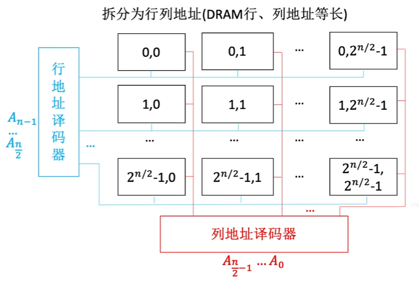
	- 刷新时间：(一次刷新操作约为 一个读写周期，并且读写周期要远小于刷新时间)
		- <mark style="background:#fff88f">分散刷新</mark>：每次读写完都刷新一行\[会使得读写周期翻倍，且刷新次数过多，仍存在少量“死区”\]
		- <mark style="background:#fff88f">集中刷新</mark>：在 一个刷新周期 内安排集中时间全部刷新\[存在一段连续且较长的“死区”，使得无法访问主存\]
		- <mark style="background:#fff88f">异步刷新</mark>：在 一个刷新周期 内每行刷新一次即可，可在 CPU 译码阶段执行\[利用 CPU 空闲时间进行刷新，不存在“死区”；两次刷新操作的最大时间间隔为 $\color{red}\frac{刷新周期}{行数}$\]
		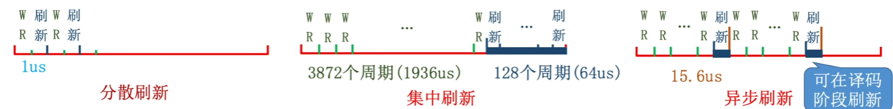
		>[!caution] 对“死区”的形象化理解
		>**死区** 是 CPU 发起了内存请求，但 DRAM 正在刷新无法响应，CPU 被迫等待的那段时间，即 CPU 想访问主存而无法访问主存的情况
3. DRAM 的<mark style="background:#ff4d4f">地址线复用技术</mark>：(在题干默认情况下，DRAM 是采用地址线复用技术)
	- 若存储体的容量为 $2^n$，则地址译码器的内部一端同样需要 $2^n$ 根选通线，外部另一端需要 n 根地址线；
	- 当采用拆分行、列地址时，(内部)行(列)地址译码器一端仅需要 $2^{\frac{n}{2}}$ 根选通线，另一端仅需要 $\frac{n}{2}$ 地址线即可；
	- 进一步地，若行、列地址采用分时传递，则最后暴露出来的地址线仅仅需要 $\frac{n}{2}$ 根 [错题：地址线的复用相关计算](../错题集/错题集_1.md#^9d1a18)
	- <mark style="background:#40a9ff">行、列地址的分时传递</mark>，即将地址分为两部分先后传递给 行地址缓冲器和列地址缓冲器；并且 <mark style="background:#40a9ff">DRAM 中的行缓冲器由 SRAM 实现</mark>
	- 此时<mark style="background:#40a9ff">如果希望暴露出的地址引脚尽可能的<mark style="background:#ff4d4f">少</mark>，则应该 行地址 r 与 列地址 c 的位数划分应该尽可能的<mark style="background:#ff4d4f">均等</mark></mark> [错题：r,c的取值对地址线数量的影响](../错题集/错题集_1.md#^0d551a)
4. SDRAM 为 同步的DRAM，与 CPU 采用同步方式交换数据，属于 DRAM [错题：DRAM 与 SDRAM 的区别](../错题集/错题集_1.md#^114cd1)

### 非易失性存储器
#### 辅存中的 ROM
MROM (Mask Read-Only Memory) —— 掩模式只读存储器
厂家按照客户需求，在芯片生产过程中直接写入信息，之后任何人<mark style="background:#40a9ff">不可重写（只能读出）</mark>
可靠性高、灵活性差、生产周期长、只适合批量定制

PROM (Programmable Read-Only Memory) —— 可编程只读存储器
用户可用专门的 PROM 写入器写入信息，<mark style="background:#40a9ff">写一次之后就不可更改</mark>

EPROM (Erasable Programmable Read-Only Memory) —— 可擦除可编程只读存储器
允许用户写入信息，之后用某种方法擦除数据，<mark style="background:#40a9ff">可进行多次重写</mark>

UVEPROM (ultraviolet rays) —— 用紫外线照射 $8 \sim 20$ 分钟，擦除所有信息
EEPROM (也常记为 E$^2$PROM，第一个 E 是 Electrically) —— 可用“电擦除”的方式，擦除特定的字

<mark style="background:#40a9ff">Flash Memory</mark> —— 闪速存储器 (注：<mark style="background:#fff88f">U盘、SD卡就是闪存</mark>)，每个存储元只需单个 MOS 管，位密度比 RAM 高
- 在 EEPROM 基础上发展而来，<mark style="background:#40a9ff">断电后也能保存信息</mark>，且<mark style="background:#40a9ff">可进行多次快速擦除重写</mark>
- 注意：<mark style="background:#40a9ff">由于闪存需要先擦除在写入，因此闪存的“写”速度要比“读”速度更慢</mark>。

SSD (Solid State Drives) —— 固态硬盘
由控制单元 + 存储单元 (Flash 芯片) 构成，与闪速存储器的核心区别在于控制单元不一样，但存储介质都类似，可进行多次快速擦除重写。SSD 速度快、功耗低、价格高。目前个人电脑上常用 SSD 取代传统的机械硬盘

#### 计算机中的重要 ROM 
主板上的 $BIOS$ 芯片（$ROM$），存储了“自举装入程序”，负责引导装入操作系统（开机）
并且<mark style="background:#40a9ff">主板上的 ROM 是存在于 “内存条” 上的，即地址与 RAM 相连接</mark>

>[!caution] 注意
>1. 很多 $ROM$ 芯片虽然名字是“$Read-Only$”，但很多 $ROM$ 也可以“写”
>2. 闪存的写速度一般比读速度更慢，因为写入前要先擦除
>3. $RAM$ 芯片是易失性的，$ROM$ 芯片是非易失性的。很多 $ROM$ 也具有“随机存取”的特性

### 多模块存储器
存取周期(T) = 存取时间(r) + 恢复时间(nr)
根据上述公式，在存取周期中 恢复时间 总是占据很大一部分时间。

#### 多体并行存储器
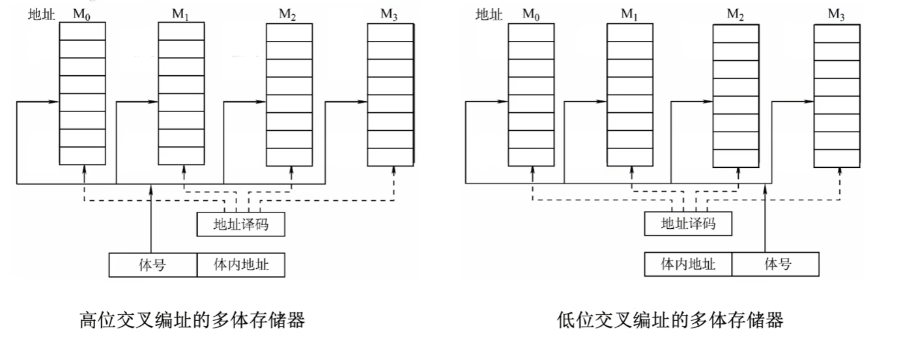
每个模块都有相同的容量和存取速度。<mark style="background:#40a9ff">各模块都有<mark style="background:#ff4d4f">独立</mark>的读写控制电路、地址寄存器和数据寄存器</mark>。它们<mark style="background:#40a9ff">既能并行工作，又能交叉工作</mark>。

- 高位交叉编址：
	- 理论上多个存储体可以被并行访问，但是由于通常会连续访问，因此实际效果相当于单纯的扩容
	- <mark style="background:#fff88f">编址格式：|体号|体内地址|</mark>
	- 连续读取 $a$ 个字时，总耗时为：$aT$
- 低位交叉编址：
	- <mark style="background:#fff88f">编址格式：|体内地址|体号|</mark>
    - 当存储模块数 $\color{red}m \ge T/r$ 时，可使<mark style="background:#ff4d4f">流水线</mark>不间断
    - 每个存储周期内可读写地址连续的 $m$ 个字，且每隔 r 时间间隔可提供 1 个存储字
    - 微观上，$m$ 个模块被串行访问；宏观上，每个存取周期内所有模块被并行访问
    - 连续读取 $a>T/r$ 个字时，总耗时为：$T+(a-1)r$.
[错题：流水线技术与读取时间的计算](../错题集/错题集_1.md#^6ef5ac)

>[!important] 并行与交叉编址
>现有由 $a$ 个 $2^n\times b\;bit$ 的 DRAM 芯片组成的存储体，数据总线的宽度为 $m\;bit$.
>1. 芯片 DRAM 行数据缓存器的长度：$b\times 2^c=b\times 2^{\frac{n}{2}}\;bit$(c为地址列位数)，而行地址存储器的长度为：$\frac{n}{2}\; bit$
>2. 若恰有 $a\times b = m$，则该些 DRAM 芯片可一并向数据总线提供数据。
>3. 若 $a\times b\ne m$，一般为 $b=m$，则一定需要进行交叉编址，才可以最大限度的利用存储体；<mark style="background:#40a9ff">为支持突发式访存需要进行低位交叉编址</mark>，$t$ 个周期用于准备数据，随后每 1 个周期数据总线总可以传输一个数据；但若某个数据(长度为 $l\ge m\;bit$)的存储并没有对其边界，即并不是从 片0 开始存储，则至少需要两次读取。[错题：非对齐数据存取周期的计算](../错题集/错题集_1.md#^d39cad)
>[错题：交叉编址与并行的混淆](../错题集/错题集_1.md#^94b273)

#### 单体多字存储器
- 每次并行读出 $m$ 个连续的字
- 总线宽度也要扩展为 $m$ 个字

## 主存储器与 CPU 的连接
### 存储芯片的输入输出信号
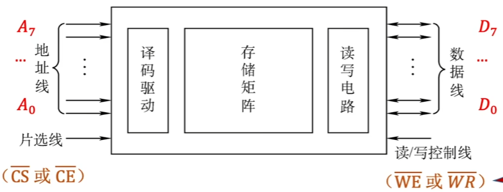
- **地址线**：地址线的数量反应片内存储矩阵的存储容量，$n\;bit\rightarrow 2^n 个存储单元$
- **数据线**：数据线的数量反应片内一次可以向外提供多少 $bit$ 的数据，$n\;bit\rightarrow n\;bit 数据$
- **片选线**：决定该芯片是否工作
- **读写线**：决定该芯片是否进行读/写的操作
>[!caution]- 低电平有效或高电平有效
>图示中出现许多诸如 $\overline{CE}$ 带有“上划线”的标记，该标记表示低电平有效，即输入 0 时有效，而输入 1 无效。例如：$\overline{CE}$ 表示低电平时该芯片被选中，$\overline{WE}$ 表示低电平时该芯片进行写操作，高电平进行读操作(以该芯片被选中为前提)

### 字扩展

线选法与译码器选法的对比：

|            线选法            |            译码器选法            |
| :-----------------------: | :-------------------------: |
| $n$条线$\rightarrow n$个选片信号 | $n$条线$\rightarrow 2^n$个选片信号 |
|           电路简单            |            电路复杂             |
|          地址空间不连续          |           地址空间可连续           |
共用数据线、地址线以及读写线，通过片选线来决定某个芯片是否响应。

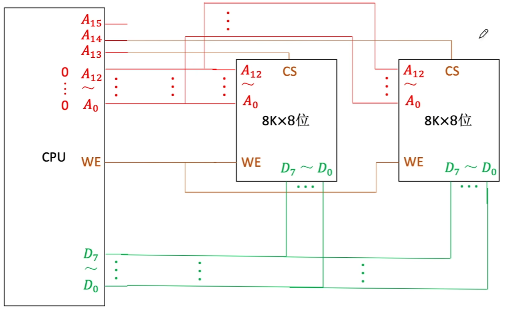
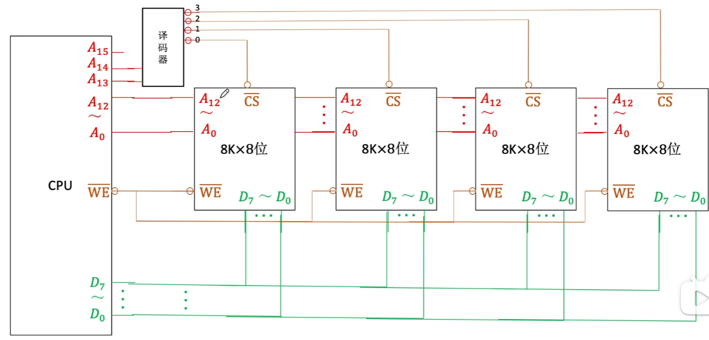

>[!caution] 坑点
>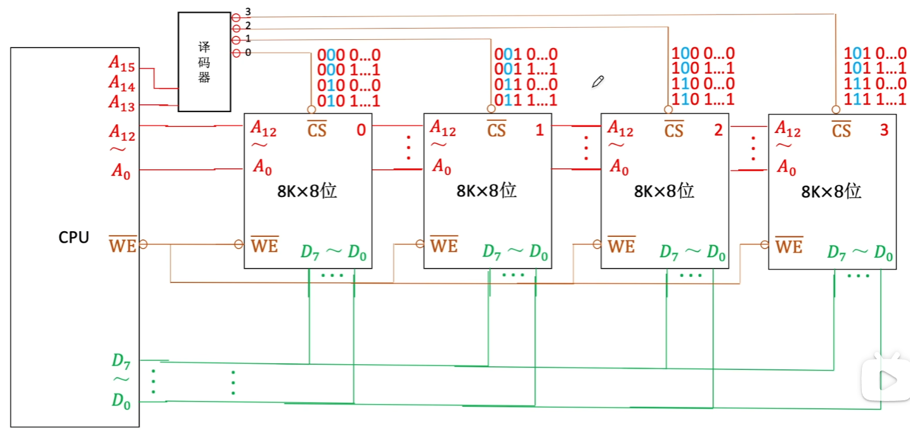
>注意：地址线 $A_{14}$ 未被使用，直接被跳过；此时地址不连续，且存在不同地址会指向同一块内存空间
### 位扩展

1. 总是共用地址线，<mark style="background:#40a9ff">选择不同芯片的同一位置的数据进行输出</mark>；
2. <mark style="background:#40a9ff">片选线总是有效</mark>，不同芯片同时工作；
3. 共用读写线，<mark style="background:#40a9ff">总是同时进行读/写操作</mark>；
4. 输出的数据有序放置在不同的数据线上。
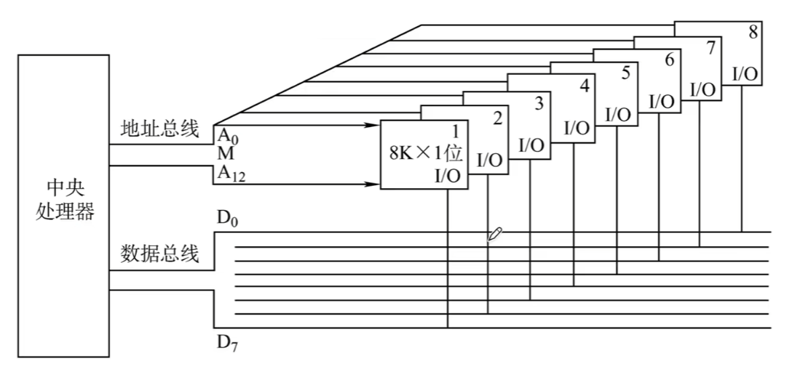

### 字位扩展
组内芯片(相当于位扩展)：
1. 共用地址线，选中同一块内存空间；
2. 共用片选线，同时工作；
3. 共用读写线，同时进行读/写操作；
4. 输出的内容分别有序放置不同的数据线上。
组间芯片(相当于字扩展)共用数据线等。
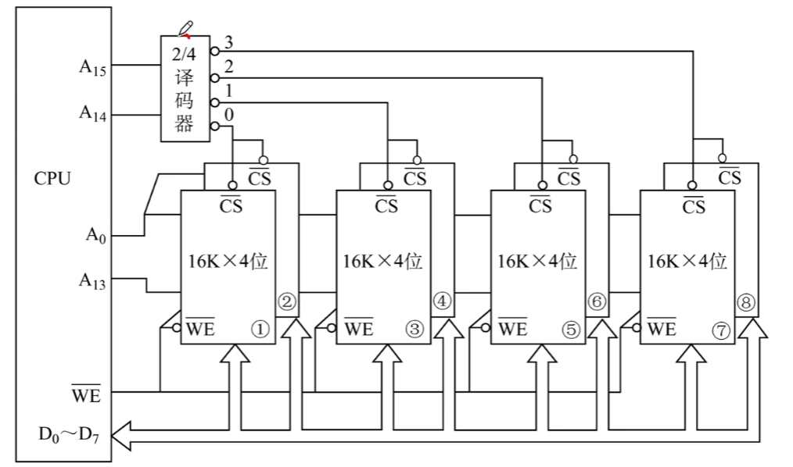

## 外存储器
### 磁盘存储器
^5f70fe
>[!note]- 优缺点
磁表面存储器的优点：
①存储容量大，位价格低；
②记录介质可以重复使用；
③记录信息可以长期保存而不丢失，甚至可以脱机存档；
④非破坏性读出，读出时不需要再生。
>
磁表面存储器的缺点：
①存取速度慢；
②机械结构复杂；
③对工作环境要求较高。
#### 存储结构
一块硬盘含有若干个记录面，每个记录面划分为若干条磁道，而每条磁道又划分为若干个扇区，<mark style="background:#40a9ff">扇区（也称块）是磁盘读写的最小单位</mark>，也就是说磁盘按块存取。(<mark style="background:#40a9ff">环形区域</mark>)
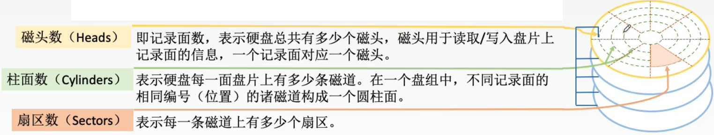
>[!addition]- 磁盘结构
>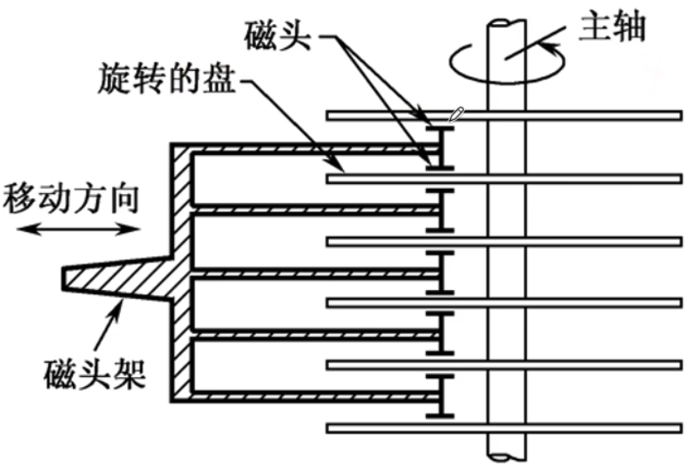
>
>\[操作系统相关内容\] 根据磁头是否可移动分类：
>- 固定头磁盘(每个磁道都有一个磁头)
>- 移动头磁盘(每个盘面只有一个磁头)

#### 性能指标
① 磁盘的容量：一个磁盘所能存储的字节总数称为磁盘容量。磁盘容量有非格式化容量和格式化容量之分。\[<mark style="background:#40a9ff">非格式化容量 > 格式化容量</mark>\]
> [!note] 注意
> 1. 非格式化容量：是指磁记录表面可以利用的磁化单元总数。
> 2. 格式化容量：是指按照某种特定的记录格式所能存储信息的总量。

② 记录密度：记录密度是指盘片单位面积上记录的二进制的信息量，通常以道密度、位密度和面密度表示。
1. 道密度是沿磁盘半径方向单位长度上的磁道数；
2. 位密度是磁道单位长度上能记录的二进制代码位数；
3. 面密度是位密度和道密度的乘积。
>[!caution]
>磁盘<mark style="background:#40a9ff">所有磁道记录的信息量一定是相等的</mark>，并不是圆越大信息越多，故<mark style="background:#40a9ff">每个磁道的位密度都不同</mark>。

③ <mark style="background:#ff4d4f">平均存取时间</mark>：
**平均存取时间** = 
**控制延迟时间**（极少涉及，除非题目给出） +
**寻道时间**（<mark style="background:#40a9ff">影响最大</mark>；磁头移动到目的磁道；题干中一般会直接给出<mark style="background:#40a9ff">平均寻道时间</mark>）+ 
**旋转延迟时间**（磁头定位到所在扇区；同样使用平均旋转时间，由于数据出现在某个扇区的概率均等，故平均旋转延迟时间为 <mark style="background:#40a9ff">半圈旋转时间</mark>）+ 
**传输时间**（传输数据所花费的时间；需要根据题目进行手算，公式为 $\frac{b\;bit}{D_r\;bit/s}=\frac{b\;bit}{rN\;bit/s}$）
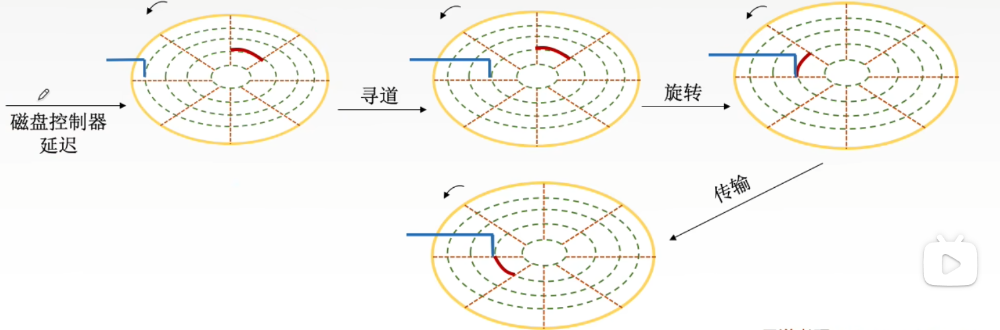 ^0cdf53

④ 数据传输率：磁盘存储器在单位时间内向主机传送数据的字节数，称为数据传输率。
假设磁盘转数为 $r$（转/秒），每条磁道容量为 $N$ 个字节，则数据传输率为 $D_r = rN \;Byte/s$

#### 寻址
磁盘的编址格式一般为：

| 驱动器号        | 柱面(磁道)号  | 盘面号    | 扇区号           |
| ----------- | -------- | ------ | ------------- |
| 一台电脑可能有多个磁盘 | 移动磁臂(寻道) | 激活某个磁头 | 通过旋转将磁头划过某个扇区 |

>硬盘属于机械式部件，其<mark style="background:#40a9ff">读写操作是串行的</mark>，不可能在同一时刻既读又写，也不可能在同一时刻读两组数据或写两组数据；借用缓冲器，以<mark style="background:#40a9ff">批处理</mark>的形式响应 CPU。

#### 磁盘阵列
RAID（Redundant Array of Inexpensive Disks，廉价冗余磁盘阵列）是将多个独立的物理磁盘组成一个独立的逻辑盘，数据在多个物理盘上分割交叉存储、并行访问，具有更好的存储性能、可靠性和安全性。

RAID的分级如下所示。在RAID1～RAID5的几种方案中，无论何时有磁盘损坏，都可以随时拔出受损的磁盘再插入好的磁盘，而数据不会损坏。
- RAID0：无冗余和无校验的磁盘阵列。
	- <mark style="background:#40a9ff">逻辑上相邻的两个扇区在物理上存到两个磁盘</mark>，类比“低位交叉编址的多体存储器”
- RAID1：<mark style="background:#40a9ff">镜像</mark>磁盘阵列。
	- <mark style="background:#40a9ff">直接存储两份数据</mark>
- RAID2：采用纠错的<mark style="background:#40a9ff">海明码</mark>的磁盘阵列。
	- 逻辑上连续的几个 bit 物理上分散存储在各个盘中
	- 4 bit信息位 + 3 bit海明校验位——可纠正一位错
- RAID3：位交叉奇偶校验的磁盘阵列。
- RAID4：块交叉奇偶校验的磁盘阵列。
- RAID5：无独立校验的奇偶校验磁盘阵列。

### 固态硬盘 SSD
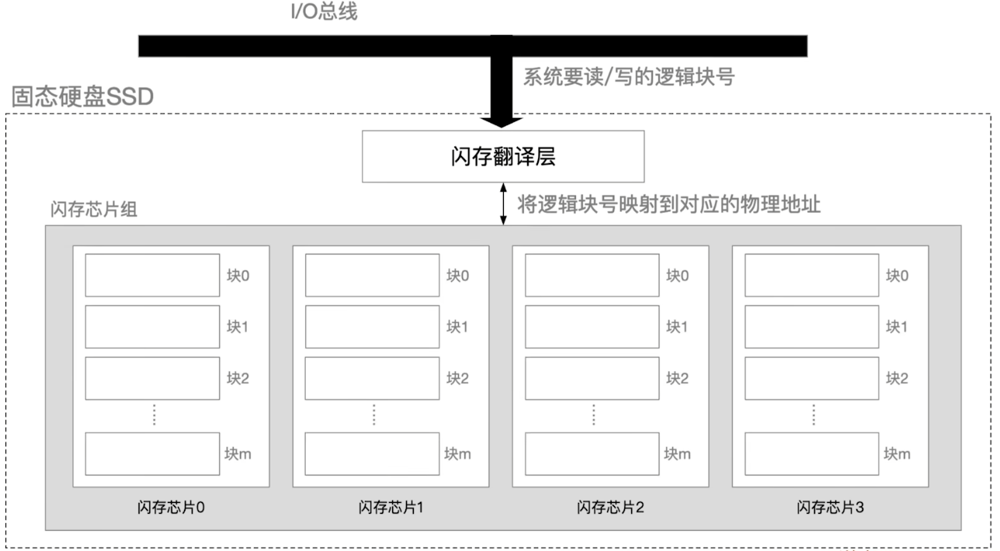
- **原理**：基于闪存技术 $\color{red}Flash\ Memory$，属于电可擦除 $ROM$，即 $EEPROM$
- **组成**
    - **闪存翻译层**：负责翻译逻辑块号，找到对应页（$Page$）
    - **存储介质**：
	    - 多个闪存芯片（$Flash\ Chip$）
	    - 每个芯片包含多个块（$block$）
	    - 每个块包含多个页（$page$）
- **读写性能特性**
    - 以<mark style="background:#ff4d4f">页</mark>（$page$）为单位<mark style="background:#ff4d4f">读/写</mark> —— 相当于磁盘的“扇区”
    - 以<mark style="background:#ff4d4f">块</mark>（$block$）为单位<mark style="background:#ff4d4f">“擦除”</mark>，擦干净的块，其中的每页都可以写一次，读无限次
    - <mark style="background:#40a9ff">支持随机访问</mark>，系统给定一个逻辑地址，闪存翻译层可通过电路迅速定位到对应的物理地址
    - 读快、写慢：<mark style="background:#40a9ff">要写的页如果有数据，则不能写入，需要将块内其他页全部复制到一个新的（擦除过的）块中，再写入新的页，并改变逻辑地址的指向</mark> (写比较慢的原因)
- **与机械硬盘相比的特点**
    - $SSD$ <mark style="background:#fff88f">读写速度快</mark>，<mark style="background:#fff88f">随机访问性能高</mark>，用<mark style="background:#fff88f">电路控制访问位置</mark>；机械硬盘通过移动磁臂旋转磁盘控制访问位置，有寻道时间和旋转延迟
    - $SSD$ 安静无噪音、耐摔抗震、能耗低、造价更贵
    - $SSD$ 的一个<mark style="background:#fff88f">“块”被擦除次数过多（重复写同一个块）可能会坏掉</mark>，而机械硬盘的<mark style="background:#fff88f">扇区不会因为写的次数太多而坏掉</mark>
    - SSD <mark style="background:#fff88f">无需采取调度算法</mark>
- **磨损均衡技术**
    - **思想**：将“擦除”平均分布在各个块上，以提升使用寿命
    - **动态磨损均衡**：<mark style="background:#fff88f">写入数据时，优先选择累计擦除次数少的新闪存块</mark>
    - **静态磨损均衡**：即使没有数据写入时，$SSD$ 仍会监测并自动进行数据分配、迁移，让老旧的闪存块承担以读为主的储存任务，让较新的闪存块承担更多的写任务

## 高速缓冲存储器 Cache
### 程序访问的局部性原理
1. **时间局部性**：是指<mark style="background:#40a9ff">如果某条指令或数据当前被访问，则在不久的将来很可能再次被访问</mark>。这源于程序中存在循环、重复调用的子程序，以及对同一数据的多次操作，例如 for/while 循环。
2. **空间局部性**：是指<mark style="background:#40a9ff">如果某存储单元被访问，则其临近的存储单元在不久的将来很可能也被访问</mark>。这源于指令通常顺序存储并顺序执行，而数据也往往以连续块的形式存储，例如对数组的操作。
[错题：程序的局部性原理的应用](../错题集/错题集_1.md#^1b56b7)

### Cache 的基本工作原理
Cache 和 主存 都被划分为大小相等的块，Cache 块也成为 Cache 行，每行/块由若干字节(几十到上百字节不等)组成。且 <mark style="background:#40a9ff">Cache 中保存的为 主存中**最活跃**的若干块的 **副本**</mark>(讨论存储系统的容量时，不计入 Cache 的容量)。
>[!caution] Cache 和 CPU 与主存交换数据的单位的区别
>1. Cache 与 主存 以 <mark style="background:#40a9ff">块/行/页</mark> 为单位进行数据交换
>2. CPU 与 主存/Cache 以 <mark style="background:#40a9ff">字</mark> 为单位进行数据交换
>[错题：Cache 和 CPU 与主存交换数据的单位](../错题集/错题集_1.md#^9a31eb)

#### Cache 的命中率
CPU 访问的数据已在 Cache 中的概率为命中率 H，
设 CPU 从 Cache 读取数据耗时为 $t_c$，直接从主存中读取数据耗时为 $t_m$，
则 CPU 平均访存时间为：
① 先访问 Cache，未命中后访问 主存：$\color{red}t=Ht_c+(1-H)*(t_c+t_m)$
② 一同访问 Cache 和 主存：$\color{red}t=H*t_c+(1-H)*t_m$

>[!important] 多级 Cache 的平均访存时间计算
>设由 L1 Cache、L2 Cache 组成的多级 Cache；多级 Cache 的访存操作为：若 L1 Cache 命中失败，则尝试命中 L2 Cache，若 L2 Cache 也命中失败，才会访问主存。
>不妨设 L1 Cache 的命中率为 $H_1$（全局命中率），访问时间为 $t_1$；L2 Cache 的命中率为 $H_2$（局部命中率，即在 L1 未命中后 L2 命中的条件概率），访问时间为 $t_2$；主存访问时间为 $t_3$。
>访问主存当且仅当 L1、L2 均未命中，其概率为 $(1-H_1)(1-H_2)$。三种情况及对应的概率、耗时如下：
>- L1 命中：概率 $H_1$，耗时 $t_1$
>- L1 未命中、L2 命中：概率 $(1-H_1)H_2$，耗时 $t_1+t_2$（先访问 L1 再访问 L2）
>- 两级均未命中、访问主存：概率 $(1-H_1)(1-H_2)$，耗时 $t_1+t_2+t_3$（依次访问 L1、L2、主存）
>那么平均访存时间为：$\color{red}t=H_1 t_1+(1-H_1)H_2(t_1+t_2)+(1-H_1)(1-H_2)(t_1+t_2+t_3)$ 

[错题：Cache 缺失率的计算](../错题集/错题集_1.md#^38ee55)

#### Cache 和主存的映射方式
1. 为识别每个 Cache 行对应哪个主存块，需要设置一个<mark style="background:#40a9ff">标志位，记录主存块的编号</mark>。
2. 同时设置一位<mark style="background:#40a9ff">有效位，用于指示该行数据是否有效</mark>：初始化为 0，表示无效；置为 1，表示有效。
[错题：不同映射方式中各部分位数的计算](../错题集/错题集_1.md#^ba98b7)

不妨设 Cache 总块数为 $2^c$，主存总块数为 $2^m$，每块有 $2^b$ 个字节(按字节编址)
##### 直接映射
主存的每一块只能装入 Cache 中的<mark style="background:#40a9ff">唯一指定位置</mark>。若当前位置有内容，则发生块冲突，原块被无条件替换(<mark style="background:#40a9ff">无替换算法</mark>)。
缺点：块冲突概率高，空间利用率低

- 直接映射关系为：<mark style="background:#40a9ff">Cache 块号 = 主存块号 mod Cache 总块数</mark>
	则主存块号的低 c 位二进制数即为对应的 Cache 块号。 
- 标识为 主存块号的高 $(m-c)\;bit$
- 则主存地址可划分为 <mark style="background:#fff88f">|标识($m-c\;bit$)|Cache 块号($c\;bit$)|块内地址($b\;bit$)|</mark>
><mark style="background:#40a9ff">比较器个数为 1</mark>，不需要多路选择器，相较于全相联映射、组相联映射，具有最简单的线路

##### 全相联映射
主存中的每一块可以装入 Cache 中的<mark style="background:#40a9ff">任意位置</mark>。
优点：块冲突率低，只要有空闲块就不会出现冲突；空间利用率高；命中率高
缺点：标记的比较速度较慢；<mark style="background:#fff88f">实现成本高</mark>，通常需要采用按内容寻址的相联存储器

标识为 主存块号，则主存地址可划分为 <mark style="background:#fff88f">|标识($m\;bit$)|块内地址($b\;bit$)|</mark>
>比较器个数为 $2^c$，即 <mark style="background:#40a9ff">cache 行数</mark>，线路最为复杂

##### 组相联映射
将 Cache 划分为 Q 个大小相等的组(每组包含 k 行)，每个主存块只能映射到固定组中的任意一块，即<mark style="background:#40a9ff">组间采用直接映射，组内采用全相联映射</mark>。

- 组相联映射关系可为：<mark style="background:#40a9ff">Cache 组号 = 主存块号 mod Cache 组数</mark>
	若 Cache 组数恰为 $2^r$，则 Cache 组号为主存块号的低 r 位
- 标识为 主存块号的高 $(m-r)\;bit$
- 则主存地址可划分为：
	|标识($m-r\;bit$)|Cache 组号($r\;bit$)|块内地址($b\;bit$)|
>比较器个数为 k，即 <mark style="background:#40a9ff">cache 组内行数</mark>

>[!note] CPU 按主存地址如何访问 Cache
>1. 首先 CPU 将主存地址进行拆解，得到待比较的 tag 位
>2. 随后 将得到的 tag 与选中的比较器中的内容进行比较
>	1. 直接映射：映射位置唯一，仅需要比计较一次即可
>	2. 全相联映射：需与全部的 cache 行的比较器进行比较，直至内容相等或比较失败
>	3. 组相联映射：映射组位置唯一，仅需要在组内进行比较
>
>[错题：采用组相联映射时 CPU 如何访问 Cache](../错题集/错题集_1.md#^133dc1)

#### Cache 的替换算法
依据 “Cache 和主存的映射方式” 可知，“直接映射” 不涉及页面的替换，替换算法主要用于 “全相联映射” 和 “组相联映射”。

##### 随机替换算法 RAND
1. 算法逻辑：<mark style="background:#40a9ff">随机</mark>选择一个 Cache 块进行替换
2. 性能分析：实现算法简单，但<mark style="background:#fff88f">完全没有考虑局部性原理</mark>，命中率低，实际效果很不稳定

##### 先进先出算法 FIFO
1. 算法逻辑：替换<mark style="background:#40a9ff">最先</mark>调入 Cache 的块
2. 性能分析：
	- 实现简单，最开始按 `#0#1#2#3...` 放入 Cache，之后轮流替换 `#0#1#2#3...`
	- <mark style="background:#fff88f">FIFO 依然没考虑局部性原理</mark>，最先被调入 Cache 的块也有可能是被频繁访问的

##### <mark style="background:#ff4d4f">近期最少访问算法 LRU</mark>
1. 算法逻辑：为每一个 Cache 块设置一个“计数器”，用于<mark style="background:#d3f8b6">记录每个 Cache 块已经多久没有被访问</mark>；当 Cache 填充满后，<mark style="background:#d3f8b6">替换“计数器”值最大的</mark>。
2. 算法实现：
	①命中时，所命中的行的计数器清零，<mark style="background:#fff88f">比其低的计数器加 1，其余不变</mark>；
	②未命中且还有空闲行时，新装入的行的计数器置 0，其余非空闲行全加 1；
	③未命中且无空闲行时，计数值最大的行的信息块被淘汰，新装行的块的计数器置 0，其余全加 1。
3. 性能分析：
	- <mark style="background:#ff4d4f">基于“局部性原理”</mark>，近期被访问过的主存块，在不久的将来也很有可能被再次访问，因此淘汰最久没被访问过的块是合理的。
	- <mark style="background:#40a9ff">LRU算法的实际运行效果优秀，Cache命中率高</mark>。
	- 若被频繁访问的主存块数量 > Cache 行的数量，则有可能发生“抖动”

##### 最不经常使用算法 LFU
1. 算法逻辑：为每一个 Cache 块设置一个“计数器”，用于<mark style="background:#d3f8b6">记录每个 Cache 块被访问过几次</mark>。当 Cache 满后<mark style="background:#d3f8b6">替换“计数器”最小的</mark>
2. 算法实现：
	- 新调入的块计数器 = 0，之后<mark style="background:#fff88f">每被访问一次计数器 + 1</mark>。
	- 需要替换时，选择计数器最小的一行；如果有多个 Cache 行符合要求，则采用 FIFO 策略或者优先替换行号低/高的行
3. 性能分析：<mark style="background:#fff88f">曾经被经常访问的主存块在未来不一定会用到</mark>(如：微信视频聊天相关的块)，并没有很好地遵循局部性原理，因此实际运行效果不如 LRU

#### Cache 写策略
为标识是否需要写回主存，<mark style="background:#40a9ff">Cache 行需要增添 1 bit 脏位来指明</mark>
##### 写命中
- 全写法(写直通法，write-through)：当 $CPU$ 对 $Cache$ 写命中时，必须<mark style="background:#40a9ff">把数据同时写入$Cache$ 和 主存</mark>，一般使用写缓冲（write buffer）
- 写回法(write-allocate)：当 $CPU$ 对 $Cache$ 写命中时，<mark style="background:#40a9ff">只修改 $Cache$ 的内容，而不立即写入主存，只有当此块被换出时才写回主存</mark>
##### 写不命中
- 写分配法(write-allocate)：当 $CPU$ 对 $Cache$ 写不命中时，把主存中的块调入 $Cache$，在 $Cache$ 中修改。通常搭配写回法使用。
- 非写分配法(not-write-allocate)：当 $CPU$ 对 $Cache$ 写不命中时只写入主存，不调入$Cache$。通常搭配全写法使用。
##### 多级$Cache$
现代计算机通常采用多级 $Cache$ 结构，各级 $Cache$ 间常采用 “全写法+非写分配法”，$Cache$ 和主存间常采用 “写回法+写分配法”

>[!important] Cache 行的位数的组成
>1. 数据块
>2. 标识位
>3. 有效位 -> 1 bit
>4. 脏位(表示Cache块与主存块是否一致) -> 1bit(<mark style="background:#40a9ff">当采用“写回法”该位为必须的</mark>)
>[错题：Cache 行的位长的计算](../错题集/错题集_1.md#^3643b8)

## 虚拟存储器/虚拟内存管理

|]