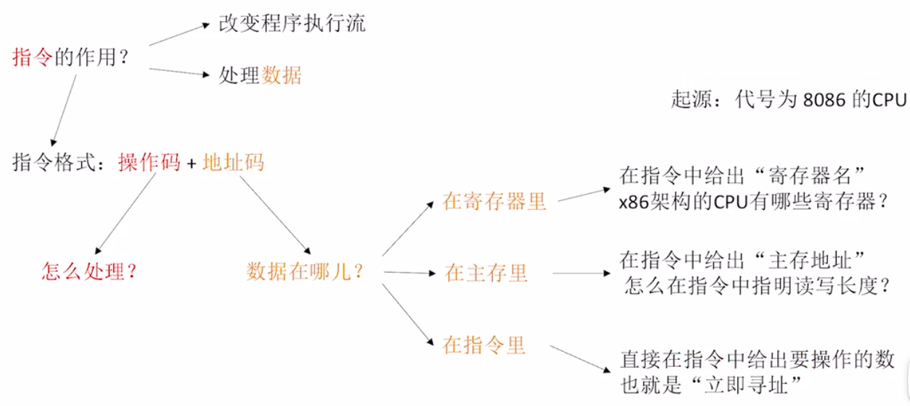
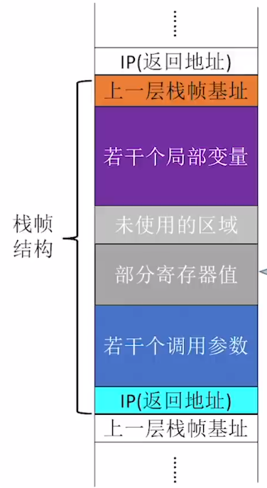
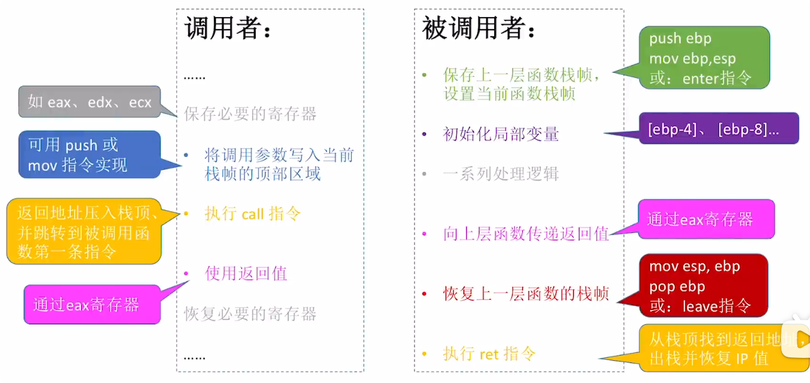

# 第四章 指令系统
## 指令系统概述
### 指令集系结构 ISA
ISA 规定的内容主要包括：
1. <mark style="background:#40a9ff">指令格式、寻址方式、操作类型</mark>，以及各操作所需要<mark style="background:#40a9ff">操作数的个数、类型、寻址约束</mark>
2. 操作数的<mark style="background:#40a9ff">数据类型</mark>，以及<mark style="background:#40a9ff">存储模式</mark>(是按大端还是小端方式存放)
3. 程序可访问的<mark style="background:#40a9ff">寄存器编号、数量、位数</mark>，<mark style="background:#40a9ff">存储空间的大小及编址方式</mark>
4. 程序员可见的<mark style="background:#40a9ff">控制状态</mark>，如程序计数器、条件码的定义与行为等

>[!important] 从指令的格式上来理解 ISA (个人理解)
>指令格式：<center>|操作码字段|寻址特征1|形式地址1|寻址特征2|形式地址2|</center>
>1. 显而易见的有：指令格式、寻址方式(寻址特征)、操作类型(操作码)，操作数的个数(形式地址的个数)、寻址约束(寻址特征) \[并未提及操作数的类型\]
>2. 若寻址特征为 寄存器寻址/寄存器间接寻址 时，形式地址便指向 可访问的寄存器(包括编号、数量、位数)
>3. 进一步，操作数的存取，不仅取决于 寻址方式、形式地址的约束，还有 存储的模式、编址方式等
>4. 再者，指令的执行，不仅取决于 操作码、操作数，还有 系统的状态/PSW


### 指令的基本格式
一条指令指的是机器语言的一个语句，由一组有意义的二进制代码组成。基本格式如下：
					<center>|操作码字段|地址码字段|</center>

> [!non-important]- 根据指令中操作数地址码数目的不同进行分类
> (访存次数的计算均在地址码为主存地址的情景下)
> 
> **零地址指令**
> 							<center>|OP|</center>
> 1. 仅包含操作码，无显示地址
> 2. 适用于：
> 	- 无需操作数的指令，如空操作、停机、关中断等
> 	- 堆栈计算机，其操作数隐含在堆栈的栈顶和次栈顶，并将计算结果压回栈顶
> 3. 访存次数：1 (取指)
> 
> **一地址指令**
> 							<center>|OP|$A_1$|</center>
> 4. 适用于：
> 	- 单操作数指令：按 $A_1$ 地址读取操作数，执行 OP 操作后结果放回 $A_1$
> 	- 累加器型双操作数指令：$A_1$ 为源操作数地址，另一操作数隐含在 ACC，结果存入 ACC
> 5. 访存次数：3 (取指，取数，存数)
> 
> **二地址指令**
> 							<center>|OP|$A_1$|$A_2$|</center>
> 6. $A_1$ 为目的操作数地址（兼结果地址），$A_2$ 为源操作数地址
> 7. 访存次数：4 (取指，取数\*2，存数)
> 
> **三地址指令**
> 							<center>|OP|$A_1$|$A_2$|$A_3$|</center>
> 8. $A_1$,$A_2$ 均为两个源操作数地址，$A_3$ 为结果地址
> 9. 访存次数：4 (取指，取数\*2，存数)
> 
> **四地址指令**
> 							<center>|OP|$A_1$|$A_2$|$A_3$|$A_4$|</center>
> 10. $A_1\sim A_3$ 同“三地址指令”，$A_4$ 为下一条指令的地址
> 11. 访存次数：4 (取指，取数\*2，存数)


### 指令的长度
<mark style="background:#ff4d4f">机器字长</mark>：CPU进行一次整数运算所能处理的二进制数据的位数（<mark style="background:#40a9ff">通常和ALU直接相关</mark>）
存储字长：一个存储单元中的二进制代码位数（通常和MDR位数相同）
指令字长：一条指令的总长度（可能会变）
>[!nnon-important]- ~~了解 半字长指令、单字长指令、双字长指令~~
>半字长指令、单字长指令、双字长指令，指令长度是<mark style="background:#40a9ff">机器字长</mark>的多少倍
 指令字长会影响取指令所需时间。如：机器字长=存储字长=16bit，则取一条双字长指令需要两次访存

>[!note] 机器字长、指令字长与存储字长之间的关系
><mark style="background:#d3f8b6">机器字长与存储字长没有必然的联系，指令字长与存储字长也没有必然的联系</mark>，但为数据与指令存取方便，一般将 机器字长与指令字长 设置为 存储字长的整数倍
>其中，<mark style="background:#d3f8b6">ALU 和 通用寄存器 的位数与 机器字长 相等</mark>

按指令的长度分类：
**定长指令字结构**
**变长指令字结构**

按操作码长度分类：
**定长操作码**：
1. 指令系统中所有指令的操作码长度都相同，$n$位 $\rightarrow$ $2^n$条指令
2. 控制器的译码电路设计简单，但灵活性较低

**可变长操作码**：
1. 指令系统中各指令的操作码长度可变，<mark style="background:#ff4d4f">不允许短操作码成为长操作码的前缀</mark>
2. 优缺点：
	-  优：可在有限的指令字长内支持丰富的指令种类，灵活度较高
	-  缺：控制器的译码电路设计复杂
3. <mark style="background:#40a9ff">设地址长度为$n$，上一层留出$m$种状态，下一层可扩展出$m \times 2^n$种状态</mark>
\[题型：设计扩展码指令\]

### 指令类型
1. **数据传送指令**
	- 寄存器之间的传送、从内存单元读取数据到CPU寄存器、从CPU寄存器写数据到内存单元、进栈操作、出栈操作
2. **算术和逻辑运算指令**
	- 加减乘除、自增、自减、与或非、取反、异或等
3. **移位操作指令**
	- 算数移位、逻辑移位、循环移位等
4. **顺序控制指令**
	- 无条件转移、条件转移、调用、返回、陷阱、循环等
5. **输入输出指令**
	- I/O 指令
6. **CPU 控制指令**
	- 停机、开中断、关中断、系统模式切换以及进入特殊处理程序等

## 寻址方式
### 指令寻址
确定下一条将要执行的指令地址称为“指令寻址”
>[!important] CPU 将要执行下一条的指令永远由 **程序计数器**(PC) 指明
#### 顺序寻址
通过 **程序计数器(PC)** 加上**当前指令的字节长度(按字节编址)**，自动形成下一条指令地址
							<center>PC+"1"->PC</center>
#### 跳跃寻址
通过转移指令实现，是否发生转移取决于当前执行的指令内容。
转移方式：
① <mark style="background:#fff88f">绝对转移</mark>，地址码直接给出目标地址
② <mark style="background:#fff88f">相对转移</mark>，地址码给出相对于当前 PC 值的偏移量(补码形式，<mark style="background:#fff88f">注意将“偏移量”位数扩充至与 PC 位数相等</mark>)

### 数据寻址
确定本条指令操作数地址称为“数据寻址”。
为区分不同的寻址方式，指令字中通常设置有寻址特征字段，其位数决定了可支持的寻址当时种类。指令格式如下：
<center>|操作码|<mark style="background:#40a9ff">寻址特征</mark>|形式地址 A|</center>
其中，指令中的地址码字段所包含的地址称为“形式地址”(A)，即不代表操作数的真实地址；真实地址需要通过寻址方式由形式地址计算得到，称为“有效地址”(EA)

>[!caution] 寻址特征与形式地址的个数
>1. 指令字中可能有多个形式地址，且每个形式地址的寻址方式各不相同，故为指明每个形式地址的寻址方式，形式地址前总是存在一个寻址特征，即 <mark style="background:#ff4d4f">寻址特征的个数与形式地址的个数相等</mark>
>2. 对于 <mark style="background:#fff88f">零地址指令</mark> 而言，<mark style="background:#fff88f">指令字中不必保留寻址特征位，即全指令字为操作码</mark>

#### 常见的数据寻址方式
**直接寻址**：
1. 指令中的<mark style="background:#fff88f">形式地址 A 即为操作数的真实地址 EA</mark>，即 EA=A
2. 优缺点：
	1. 优点：实现简单，无需额外计算操作数地址，在执行阶段只需1次访存
	2. 缺点：形式地址 A 的位数长度限制了寻址范围，且地址固定，难以修改
3. 访存次数：1

**间接寻址**：
1. 指令中的<mark style="background:#fff88f">形式地址 A 指向一个主存单元，而该主存单元中存放着操作数的有效地址</mark>，即 EA=(A)
2. 优缺点：
	1. 优点：相较于直接寻址，扩大了寻址范围，即有效地址的位数由存储字长决定而不是形式地址 A 的位长决定
	2. 缺点：需要多次访存
3. 访存次数：2

**寄存器寻址**
1. 指令中的<mark style="background:#fff88f">形式地址 A 指向一个寄存器，而该寄存器中存放着操作数</mark>，即 EA=$R_i$
2. 优缺点：
	1. 优点：执行阶段无需访存，仅需访问寄存器，执行速度快
	2. 缺点：寄存器造价高，个数有限
3. 访存次数：0

**寄存器间接寻址**：
1. “套娃操作”：“寄存器寻址”中的<mark style="background:#fff88f">寄存器存放的地址指向主存单元，再该主存单元中存放着操作数</mark>，即 EA=($R_i$)
2. 优缺点：
	1. 优点：与间接寻址相比，在执行阶段只需1次访存，减少了访存开销；扩大了寻址范围
	2. 缺点：与寄存器寻址相比，增加了访存需求
3. 访存次数：1

**立即寻址**：
1. 指令的形式地址字段并不表示操作数的地址，而是<mark style="background:#fff88f">直接存放操作数本身，称为“立即数”</mark>，通常采用补码表示；且 <mark style="background:#40a9ff"># 用于表示立即寻址特征</mark>，特别的：
<center>|操作码|#|立即数|</center>
2. 优缺点：
	1. 优点：执行阶段无需访存，执行速度最快
	2. 缺点：立即数的大小受限于形式地址字段的位数
3. 访存次数：0

**隐含寻址**：
1. <mark style="background:#fff88f">指令不显示给出操作数的地址，而将操作数隐含在特定寄存器中</mark>，例如累加器型结构指令
2. 优缺点：
	1. 优点：可有效缩短指令字长
	2. 缺点：依赖于隐含操作数的硬件(如 ACC)
3. 访存次数：0 

**基址寻址**：
1. 将 CPU 中<mark style="background:#fff88f">基址寄存器(BR)的内容(即当前程序执行的起始地址)加上指令格式中的形式地址A</mark>，而形成操作数的有效地址，即 EA = (BR) + A
>[!caution] 
>1. 可能 CPU 内部并不会专门设置基地址寄存器，而是用通用寄存器代替，此时便需要在指令中利用若干比特来指明使用的某个通用寄存器
>2. <mark style="background:#40a9ff">基地址寄存器</mark>(即使是被指定为基地址寄存器的通用寄存器)中的内容是由操作系统决定的，<mark style="background:#40a9ff">对于软件程序员来说是不可见的</mark>，即面向操作系统而不是面向用户；但对<mark style="background:#fff88f">汇编程序员可见</mark>

2. 优缺点：
	1. 优点：<mark style="background:#40a9ff">便于整段程序在主存中“浮动”</mark>，方便多道程序并发运行；可扩大寻址范围
	2. 缺点：-
3. 访存次数：1

**变址寻址**：
1. 有效地址 EA 等于<mark style="background:#fff88f">指令字中的形式地址 A 与变址寄存器 IX 的内容相加之和</mark>，即 EA = (IX) + A，其中 IX 可为变址寄存器（专用），也可用通用寄存器作为变址寄存器。
>[!caution] 
>1. 与基地址寄存器相比，<mark style="background:#40a9ff">变址寄存器中的内容对于程序员是可见的</mark>，即面向用户
>2. <mark style="background:#40a9ff">与基址寻址相比，形式地址 A 相当于“基地址”</mark>

2. 优点：在数组处理过程中，可设定 A 为数组的首地址，不断改变变址寄存器 IX 的内容，便可很容易形成数组中任一数据的地址，特别<mark style="background:#40a9ff">适合编制循环程序</mark>
3. 访存次数：1

**相对寻址**：
1. <mark style="background:#fff88f">把程序计数器 PC 的内容加上指令格式中的形式地址 A </mark>而形成操作数的有效地址，即 EA = (PC) + A，其中<mark style="background:#40a9ff"> A 是相对于 PC 所指地址的位移量，可正可负，<mark style="background:#ff4d4f">补码表示</mark></mark>。
2. 优点：操作数的地址不是固定的，它随着 PC 值的变化而变化，并且与指令地址之间总是相差一个固定值，因此便于程序浮动（一段代码在程序内部的浮动）。相对寻址广泛应用于转移指令。
3. 访存次数：1

**堆栈寻址**：
1. <mark style="background:#fff88f">操作数存放在堆栈中，隐含使用堆栈指针(SP)作为操作数地址</mark>。
2. 堆栈是<mark style="background:#fff88f">存储器[软堆栈]（或专用寄存器组[硬堆栈]）</mark>中一块特定的按“后进先出(LIFO)”原则管理的存储区，该存储区中被读/写单元的地址是用一个特定的寄存器给出的，该寄存器称为堆栈指针（SP）。
3. 访存次数：硬堆栈不访存、软堆栈访存 1 次

>[!caution] 存储模式对寻址方式的影响
>存储模式仅针对于 <mark style="background:#40a9ff">主存中的数据(包括操作数以及指令)</mark>，不影响 CPU 中的寄存器以及计算的中间状态，即<mark style="background:#40a9ff">从主存中取出的操作数、指令(整体而非分部分“翻译”)(包括操作码、寻址特征、形式地址等)需要按照指定的存储模式进行“翻译”</mark>，而 CPU 中的寄存器中的数据则不必


## 程序的机器级代码表示
高级语言编译后得到的 <mark style="background:#40a9ff">汇编代码</mark> 以及汇编代码汇编后得到的 <mark style="background:#40a9ff">0/1机器码</mark> 均属于<mark style="background:#ff4d4f">机器级代码</mark>

### 数据源

1. x86 处理器中的寄存器
	1. <mark style="background:#40a9ff">寄存器名称 一般均以 "e(expand)" 开头</mark>，且<mark style="background:#40a9ff">表示该寄存器的位长为 32 bit</mark>，如 eax,ebx,ecx,edx("x" 表示通用寄存器),esi,edi(变址寄存器),ebp,esp(堆栈寄存器)
	2. 对于某些不以 "e" 开头的寄存器有 ax,bx,cx,dx 表示该寄存器的位长为 16 bit
	3. 而该些 16 bit 的寄存器又可以进一步拆分成 8 bit 寄存器
2. 取数据
	1. \<reg\> 寄存器编号，表示**寄存器寻址**，即操作数存在于寄存器中
	2. \<con\> 表示常数，即**立即数**，操作数直接存在于指令中(在题干中的形式可为 10进制\[以 D/d 结尾\]或16进制\[以 0x 开头，或者以 H/h 结尾\])
	3. \<mem\> 表示**主存地址**，即操作数的实际地址
	4. \[\<reg\>\] 表示**寄存器间接寻址**，即操作数的实际地址在寄存器中
	5. \[\<reg\> ± con\] 表示在寄存器所指向的地址进行 con(常数) 的偏移
	6. \[\<mem\>\] 
	7. \[\<mem\> ± con\] 表示在 mem 指向的主存地址上进行 con 的偏移
3. 数据长度：除指明数据的存储地址外，还需指明数据的长度
	1. **word** prt\[\<mem\>\] 一个字的长度，即 16 bit
	2. **dword** prt\[\<mem\>\] 两个字的长度，即 32 bit
	3. **byte** prt\[\<mem\>\] 一个byte的长度，即 8 bit
	4. \[\<mem\>\] **默认情况下为 32 bit**

### 常见的汇编指令
<mark style="background:#40a9ff">在汇编指令中，"s" 表示源操作数，"d" 表示目的操作数</mark>
1. <mark style="background:#40a9ff">并将计算结果存储在 "d" 中，故指令中的目的操作数 "d" 不可为常数</mark>，一定为 主存地址或寄存器编号
2. 为避免在指令执行过程中访存次数过多，<mark style="background:#40a9ff">"s" 与 "d" 不可同为主存地址</mark>

> [!non-important]- 常见指令
> 常见的算术运算指令
> 
> | 功能   | 英文       | 汇编指令                 | 注释                                                                      |
> | :--- | :------- | :------------------- | :---------------------------------------------------------------------- |
> | 加    | add      | add d,s              | \#计算d+s，结果存入d                                                           |
> | 减    | subtract | sub d,s              | \#计算d-s，结果存入d                                                           |
> | 乘    | multiply | mul d,s <br>imul d,s | \#无符号数d\*s，乘积存入d <br> \#有符号数d\*s，乘积存入d                                  |
> | 除    | divide   | div s <br> idiv s    | \#无符号数除法 edx:eax/s，商存入eax，余数存入edx <br>\#有符号数除法 edx:eax/s，商存入eax，余数存入edx |
> | 取负数  | negative | neg d                | \#将d取负数，结果存入d                                                           |
> | 自增++ | increase | inc d                | \#将d++，结果存入d                                                            |
> | 自减-- | decrease | dec d                | \#将d--，结果存入d                                                            |
> 
> 常见的逻辑运算指令
> 
> | 功能  | 英文           | 汇编指令    | 注释                       |
> | :-- | :----------- | :------ | :----------------------- |
> | 与   | and          | and d,s | \#将 d、s 逐位相与，结果放回d       |
> | 或   | or           | or d,s  | \#将 d、s 逐位相或，结果放回d       |
> | 非   | not          | not d   | \#将 d 逐位取反，结果放回d         |
> | 异或  | exclusive or | xor d,s | \#将 d、s 逐位异或，结果放回d       |
> | 左移  | shift left   | shl d,s | \#将d逻辑左移s位，结果放回d（通常s是常量） |
> | 右移  | shift right  | shr d,s | \#将d逻辑右移s位，结果放回d（通常s是常量） |
> 

### AT&T 格式与 Intel 格式

|                  | Intel 格式(考题默认)                                                                                                                                               | AT&T 格式                                                                                                                                     |
| ---------------- | ------------------------------------------------------------------------------------------------------------------------------------------------------------ | ------------------------------------------------------------------------------------------------------------------------------------------- |
| 目的操作数$d$、源操作数$s$ | `op d, s`<br>注：源操作数在右，目的操作数在左                                                                                                                                | `op s, d`<br>注：源操作数在左，目的操作数在右                                                                                                               |
| 寄存器的表示           | `mov eax, ebx`<br>注：直接写寄存器名即可                                                                                                                                | `mov %ebx, %eax`<br>注：寄存器名之前必须加`%`                                                                                                          |
| 立即数的表示           | `mov eax, 985`<br>注：直接写数字即可                                                                                                                                  | `mov $985, %eax`<br>注：立即数之前必须加`$`                                                                                                           |
| 主存地址的表示          | `mov [af996h], eax`<br>注：用“中括号”                                                                                                                              | `mov %eax, (af996h)`<br>注：用“小括号”                                                                                                            |
| 读写长度的表示          | `mov byte ptr [af996h], 5`<br>`mov word ptr [af996h], 5`<br>`mov dword ptr [af996h], 5`<br>`add byte ptr [af996h], 4`<br>注：在主存地址前说明读写长度`byte`、`word`、`dword` | `movb $5, (af996h)`<br>`movw $5, (af996h)`<br>`movl $5, (af996h)`<br>`addb $4, (af996h)`<br>注：指令后加`b`、`w`、`l`分别表示读写长度为`byte`、`word`、`dword` |
| 主存地址偏移量的表示       | `mov eax, [ebx - 8]`<br>注：`[基址+偏移量]`<br><br>`mov eax, [ebx + ecx*32 + 4]`<br>注：`[基址+变址*比例因子+偏移量]`                                                            | `movl -8(%ebx), %eax`<br>注：偏移量(基址)<br><br>`movl 4(%ebx, %ecx, 32), %eax`<br>注：偏移量(基址, 变址, 比例因子)                                             |
| 指令大小写是否敏感        | <mark style="background:#fff88f">大小写不敏感</mark>                                                                                                               | 指令、寄存器名称等<mark style="background:#fff88f">通常必须使用小写，对大小写敏感</mark>                                                                            |

### 选择语句的机器级表示
#### 无条件跳转指令 jmp
- jmp \<reg\>
- jmp \[\<reg\>\]
- jmp \<mem\>
- jmp \[\<mem\>\]
- jmp NEXT   NEXT 表示锚点
>[!important] 锚点
>1. 锚点即指向一段代码的起始地址；以变量代主存地址，便于阅读；
>2. 在汇编语言中，函数名也会被当做锚点并指向函数体的起始位置

#### 条件跳转指令 j*condition*
条件跳转指令需要与 比较指令 cmp 结合使用：
<center>cmp a,b</center>
<center>jcondition target</center>

j*condition* 指令：

| 指令         | 跳转条件（语义）   | 跳转条件（标志位）                                  |
| ---------- | ---------- | ------------------------------------------ |
| `je <地址>`  | 若$a==b$则跳转 | $\text{ZF}==1$                             |
| `jne <地址>` | 若$a!=b$则跳转 | $\text{ZF}==0$                             |
| `jg <地址>`  | 若$a>b$则跳转  | $\text{ZF}==0\ \&\&\ \text{SF}==\text{OF}$ |
| `jge <地址>` | 若$a>=b$则跳转 | $\text{SF}==\text{OF}$                     |
| `jl <地址>`  | 若$a<b$则跳转  | $\text{SF}!=\text{OF}$                     |
| `jle <地址>` | 若$a<=b$则跳转 | $\text{SF}!=\text{OF}\ \|\ \text{ZF}==1$   |
>[!note] cmp 的实现
>在执行 cmp 指令时，会<mark style="background:#40a9ff">将两个操作数进行做差</mark>，并<mark style="background:#40a9ff">产生标志位 ZF,SF,OF,CF </mark>等，而条件跳转指令则是根据上述的标志位判断是否进行跳转


### 循环语句的机器级表示
#### 通过条件跳转指令实现循环
用条件转移指令实现循环，需要4个部分构成：
①循环前的初始化
②是否直接跳过循环?
③循环主体
④是否继续循环?

示例：
```c
int result = 0;
for(int i=1;i<=100;i++){
	result +=i;
}//求1+2+3+...+100
```

```assembly
mov eax, 0      #用 eax 保存 result，初值为 0
mov edx, 1      #用 edx 保存 i，初始值为 1

cmp edx, 100    #比较 i 和 100
jg L2           #若 i>100，转跳到 L2 执行

L1:             #循环主体
add eax, edx    #实现 result += i
inc edx         # inc 自增指令，实现 i++

cmp edx, 100    # i 和 100
jle L1          #若 i<=100，转跳到 L1 执行

L2:             #跳出循环主体
```

#### 通过 loop 指令实现循环
1. <mark style="background:#40a9ff">loop 指令的实现必须使用 ecx 寄存器</mark>，该寄存器主要用于 循环计数器
2. loop Looptop 相当于：
<center>dec ecx; </center>
<center>cmp ecx,0; </center>
<center>jne Looptop;</center>

示例：
```c
for(int i=500;i>0;i--) {
	//做某些处理；
}//循环500轮
```

``` assembly
mov ecx, 500       #用ecx作为循环计数器

Looptop:           #循环的开始
...
做某些处理
...
loop Looptop      # ecx--，若ecx!=0，跳转到Looptop
```

### 函数调用的机器级表示
在 x86 处理其中，程序计数器 PC 通常被称为 指令指针寄存器 IP
#### 重要概念
1. **栈帧**
  - 在函数调用栈中，一个栈帧对应一层函数，用于存储每层函数相关的一些信息
  - <mark style="background:#40a9ff">栈底在高地址方向、栈顶在低地址方向</mark>。<mark style="background:#fff88f">以4字节为单位</mark>操作栈帧
2. $\text{ebp}$、$\text{esp}$ 寄存器
  - 标记了当前正在执行的函数栈帧范围
  - $\text{ebp}$ 指向当前函数栈帧<mark style="background:#40a9ff">底部</mark> 4 字节、$\text{esp}$ 指向当前函数栈帧<mark style="background:#40a9ff">顶部</mark> 4 字节
3. $\text{push}$、$\text{pop}$ 指令
  - $\text{push}$ 指令将数据压入栈顶，并将 $\text{esp}$ 减4
  - $\text{pop}$ 指令将栈顶元素出栈，并将 $\text{esp}$ 加4
4. **如何切换栈帧**
  - 在每个函数开头，需例行执行 $\text{enter}$ 指令 —— 等价于 $\text{push ebp};\quad \text{mov ebp,esp}$
  - 每个函数 $\text{ret}$ 之前，需例行执行 $\text{leave}$ 指令 —— 等价于 $\text{mov esp, ebp};\quad \text{pop ebp}$

#### 发起调用与返回
- $\text{call}$ 指令
  - ①将$\text{IP}$旧值压栈保存（保存在函数的栈帧顶部）
  - ②设置$\text{IP}$新值，无条件转移至被调用函数的第一条指令（等价于 jmp \<tag\>）
- $\text{ret}$ 指令
	- 从函数的栈帧顶部找到 $\text{IP}$ 旧值，将其出栈并恢复$\text{IP}$寄存器
- 如何传递参数、返回值
  - 在$\text{call}$指令前，将调用参数写入栈帧顶部区域
  - 在$\text{ret}$指令前，将函数返回值写入 $\text{eax}$ 寄存器

#### 如何访问栈帧参数
  - 访问当前函数的局部变量
	  - 当前函数的<mark style="background:#40a9ff">局部变量会被存放在栈帧中<mark style="background:#ff4d4f">靠近底部</mark>的位置</mark>；越先定义的变量，距离栈底越远
	  - $[\text{ebp}-4]$、$[\text{ebp}-8]$...
  - 访问上一层函数传过来的参数
	  - <mark style="background:#40a9ff">调用参数会被存放在上一层函数栈帧中<mark style="background:#ff4d4f">靠近顶部</mark>的位置</mark>；参数列表中越靠前的参数，距离栈顶越远
	  - $[\text{ebp}+8]$、$[\text{ebp}+12]$...

#### 调用流程
1. 调用者准备参数
- **从右向左**将参数压入栈中。
- 例如 `push 5`（参数2），`push 3`（参数1）。  
  栈顶此时是第一个参数，栈向低地址增长。
2. 调用函数
- 执行 `call 函数名`。
- CPU 自动将**返回地址**（`call` 下一条指令的地址）压入栈，然后跳转到函数入口。
3. 被调用者（函数）建立栈帧
- `push ebp`：保存调用者的 `ebp`（帧基址）。
- `mov ebp, esp`：让 `ebp` 指向当前栈顶，作为本函数栈帧的**固定参考点**。
4. 执行函数体
- 通过 `[ebp+8]`、`[ebp+12]` 等访问参数（`ebp+4` 是返回地址，`ebp+0` 是保存的旧 `ebp`）。
- 计算结果一般存于 `eax`（返回值寄存器）。
5. 函数返回与清理
- `pop ebp`：恢复调用者的 `ebp`。
- `ret`：从栈顶弹出返回地址，跳回调用者下一条指令。
- 调用者执行 `add esp, 8` 平衡栈（清除压入的参数）。

#### 栈帧中的内容
（自底向顶）
①上一层栈帧的基地址（$\text{ebp}$旧值）；
②若干个局部变量；
③未使用区；
④部分寄存器值；
⑤若干个调用参数；
⑥返回地址（$\text{IP}$旧值）




## CISC 与 RISC

| 对比项目\类别    | CISC(复杂指令集)        | RISC(精简指令集)                    |
| ---------- | ------------------ | ------------------------------ |
| 指令系统       | 复杂，庞大              | 简单，精简                          |
| 指令数目       | 一般大于$200$条         | 一般小于$100$条                     |
| 指令字长       | 不固定，编码长度较长于精简指令集   | **<mark>定长</mark>**                     |
| <mark style="background:#fff88f">处理器复杂度     | 复杂                 | 简单          </mark>                   |
| **寻址方式数目** | **多**              | **少**                          |
| 可访存指令      | 不加限制               | ==只有$\text{Load/Store}$指令==    |
| 各种指令执行时间   | 相差较大               | <mark>绝大多数在一个周期内完成</mark>               |
| 各种指令使用频度   | 相差很大               | 都比较常用                          |
| 通用寄存器数量    | 较少                 | 多                              |
| 目标代码       | 难以用优化编译生成高效的目标代码程序 | <mark>采用优化的编译程序</mark>，生成代码较为高效         |
| <mark>控制方式</mark>   | **绝大多数为<mark>微程序控制</mark>** | 绝大多数为组合逻辑控制，**普遍采用<mark>硬布线控制器</mark>** |
| <mark>指令流水线</mark>  | 可以通过一定方式实现         | **<mark>必须实现</mark>**                   |
| 适用于        | 笔记本、主机等            | 手机、平板等                         |
