# 第五章 中央处理器
## CPU 的功能与基本结构
### CPU 的基本功能
1. **指令控制**。完成取指令、分析指令和执行指令的操作，即程序的顺序控制。
2. **操作控制**。一条指令的功能往往是由若干操作信号的组合来实现的。$CPU$管理并产生由内存取出的每条指令的操作信号，把各种操作信号送往相应的部件，从而控制这些部件按指令的要求进行动作。
3. **时间控制**。对各种操作加以时间上的控制。时间控制要为每条指令按时间顺序提供应有的控制信号。
4. **数据加工**。对数据进行算术和逻辑运算。
5. **中断处理**。对计算机运行过程中出现的异常情况和特殊请求进行处理。

**按 CPU 部件分类**：
- **运算器**：对数据进行加工
- **控制器**：协调并控制计算机各部件执行程序的指令序列，基本功能包括**取指令、分析指令、执行指令**
	- *取指令*：自动形成指令地址；自动发出取指令的命令。
	- *分析指令*：操作码译码(分析本条指令要完成什么操作)；产生操作数的有效地址。
	- *执行指令*：根据分析指令得到的“操作命令”和“操作数地址”，形成操作信号控制序列，控制运算器、存储器以及$I/O$设备完成相应的操作。
	- *中断处理*：管理总线及输入输出；处理异常情况(如掉电)和特殊请求(如打印机请求打印一行字符)。

### CPU 的基本结构
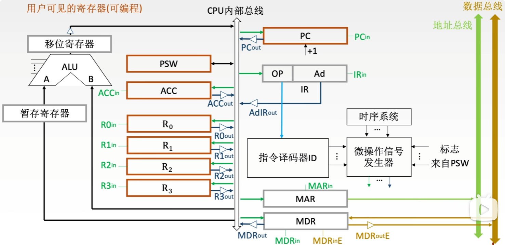

(当CPU内部采用<mark style="background:#40a9ff">单总线</mark>方式：将所有寄存器的输入端和输出端都连接到一条公共的通路上；所有向总线输出数据的部件，输出端必须加三态门：未选通时呈高阻态，与总线物理隔离，避免总线冲突)
1. **算术逻辑单元**：主要功能是进行算术/逻辑运算。
2. **通用寄存器组**：如$AX$、$BX$、$CX$、$DX$、$SP$等，<mark style="background:#40a9ff">用于存放操作数</mark>（包括源操作数、目的操作数及中间结果）<mark style="background:#40a9ff">和各种地址信息等</mark>。$SP$是堆栈指针，用于指示栈顶的地址。
3. **暂存寄存器**：用于暂存从主存读来的数据，这个数据不能存放在通用寄存器中，否则会破坏其原有内容。
4. **累加寄存器**：它是一个通用寄存器，用于暂时存放$ALU$运算的结果信息，用于实现加法运算。
5. **程序状态字寄存器**：保留由算术逻辑运算指令或测试指令的结果而建立的各种状态信息，如溢出标志（$OF$）、符号标志（$SF$）、零标志（$ZF$）、进位标志（$CF$）等。$PSW$中的这些位参与并决定微操作的形成。
6. **移位器**：对运算结果进行移位运算。
7. **计数器**：控制乘除运算的操作步数。

8. **程序计数器**：用于指出下一条指令在主存中的存放地址。$CPU$ 就是根据 $PC$ 的内容去主存中取指令的。因程序中指令（通常）是顺序执行的，所以 $PC$ 有自增功能。
>[!caution] 
>1. <mark style="background:#40a9ff">CPU 执行的指令地址总是由程序计数器给出</mark>
>2. 在执行跳转语句时，PC 并不总是为跳转指令中目标地址：对于条件跳转指令，若满足跳转条件，则 PC 中更改为目标地址；若不满足，则 PC 中为自增后的结果；而对于无条件跳转指令，PC 总是更改为目标地址。
>3. <mark style="background:#40a9ff">$PC$ 的自增行为仍然需要 $CPU$ 发出控制信号</mark>
9. **指令寄存器**：用于保存当前正在执行的那条指令。
10. **指令译码器**：仅对操作码字段进行译码，向控制器提供特定的操作信号。
11. **微操作信号发生器**：根据 $IR$ 的内容（指令）、$PSW$ 的内容（状态信息）及时序信号，产生控制整个计算机系统所需的各种控制信号，其结构有组合逻辑型和存储逻辑型两种。
12. **时序系统**：用于产生各种时序信号，它们都是由统一时钟（$CLOCK$）分频得到。
13. **存储器地址寄存器**：用于存放所要访问的主存单元的地址。
14. **存储器数据寄存器**：用于存放向主存写入的信息或从主存中读出的信息。

>[!important] 重要寄存器的可见性
> | 寄存器类型       | 典型代表          | 汇编程序员               | 应用程序员/用户               | 考试本质                                   |
> | ---------------- | ----------------- | ------------------------ | ------------------------ | ------------------------------------------ |
> | 通用/地址寄存器  | AX, R0, SP, PC    | ✅ 可见                   | PC 寄存器可见 | 属于 <mark style="background:#40a9ff">ISA 级</mark>，汇编可操作                    |
> | 状态寄存器       | PSW（标志位）| ✅ 可见（条件转移依赖）| 可见                   | 汇编必考 JZ / JC 对标志位的读取            |
> | 指令取指/访存类  | IR, MAR, MDR      | × 透明                   | × 透明                   | 属于 微架构级，纯硬件自动完成              |
> | 流水线分段类     | IF/ID, EX/MEM 等  | × 透明                   | × 透明                   | 引入流水线后增加，程序员无感知              |
> 

## 指令执行过程
### 指令周期
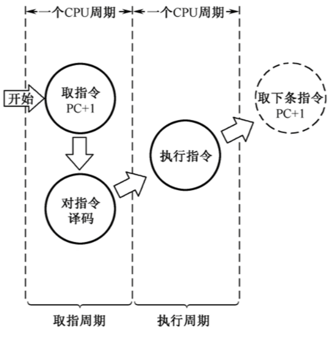
1. **指令周期**：CPU从主存中每取出并执行一条指令所需的全部时间。
2. **指令周期常常用若干机器周期来表示**，机器周期又叫 CPU 周期。
3. 一个**机器周期**又包含若干时钟周期（也称为**节拍**、**T周期**或**CPU时钟周期**，它是CPU操作的最基本单位）
>[!caution]- 机器周期与时钟周期的关系
>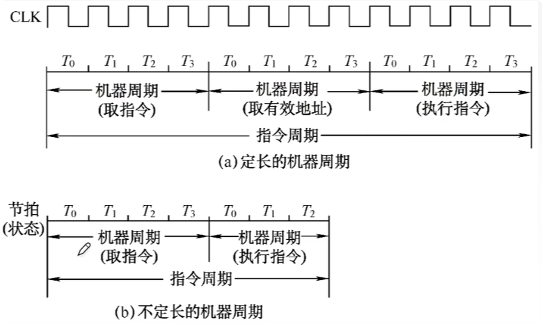
>1. 机器周期即为完成一个指令中 子程序 的所需的时间。
>2. 每个指令周期内机器周期数可以不等，每个机器周期内的节拍数也可以不等。

### 指令周期流程
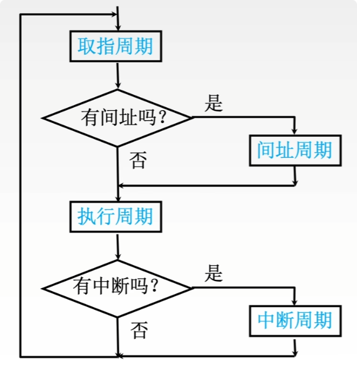
指令周期完整流程为：<mark style="background:#40a9ff">取指周期->间址周期->执行周期->中断周期</mark>

>[!caution]- CPU 如何区分所在的指令周期阶段
>CPU 为区分所在的指令周期阶段，设置一系列 **触发器**
>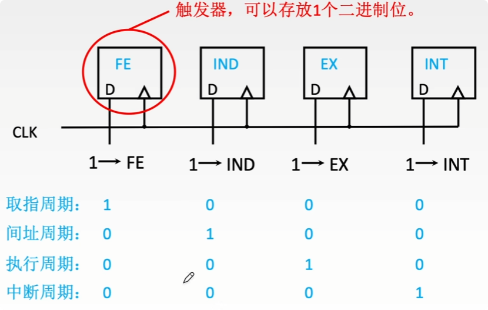

四个工作周期都有CPU访存操作，只是访存的目的不同：
**取指周期**是为了**取指令**，**间址周期**是为了**取有效地址**，**执行周期**是为了**取操作数**，**中断周期**是为了**保存程序断点**。

### 指令周期中的数据流
#### 取指周期
1. 当前指令地址送至存储器地址寄存器，记做：(PC)→MAR
2. CU 发出控制信号，经控制总线传到主存，这里是读信号，记做：1→R
3. 将 MAR 所指主存中的内容经数据总线送入 MDR，记做：M(MAR)→MDR
4. 将 MDR 中的内容(此时是指令)送入 IR，记做：(MDR)→IR
5. CU 发出控制信号，形成下一条指令地址，记做：(PC)+"1"→PC

#### 间址周期
1. 将指令的地址码送入 MAR，记做：Ad(IR)→MAR 或 Ad(MDR)→MAR
2. CU 发出控制信号，启动主存做读操作，记做：1→R
3. 将 MAR 所指主存中的内容经数据总线送 MDR，记做：M(MAR)→MDR
4. 将有效地址送至指令的地址码字段，记做：(MDR)→Ad(IR)

#### 执行周期
执行周期的任务是根据 IR 中的指令字的操作码和操作数通过 ALU 操作产生执行结果。不同指令的执行周期操作不同，因此没有统一的数据流向。

#### 中断周期
中断：暂停当前任务去完成其他任务。
为了能够恢复当前任务，需要保存断点。一般使用堆栈来保存断点，这里用 SP 表示栈顶地址，假设<mark style="background:#40a9ff">SP 指向栈顶元素</mark>，进栈操作是先修改指针，后存入数据。
>[!caution] 在计算机中，**堆栈的栈底位于高地址端**

1. CU 控制将 SP 减 1，修改后的地址送入 MAR 记做：(SP)-1→SP，(SP)→MAR；本质上是将断点存入某个存储单元，假设其地址为 a，故可记做：a → MAR
2. CU 发出控制信号，启动主存做写操作，记做：1 → W
3. 将断点( PC 内容)送入 MDR，记做：(PC)→MDR
4. CU 控制将中断服务程序的入口地址(由向量地址形成部件产生)送入 PC，记做：向量地址→PC

### 指令执行方案
方案1.**单指令周期**
特点：
- **对所有指令都选用相同的执行时间来完成**。
- 指令之间**串行执行**；**指令周期取决于执行时间最长的指令的执行时间**。

缺点：对于那些本来可以在更短时间内完成的指令，要使用较长的周期来完成，**会降低整个系统的运行速度**。
>[!important] 单周期 CPU 要点：
>1. <mark style="background:#40a9ff">所有指令在一个时钟周期内完成</mark>，其时钟周期由最慢的指令决定
>2. <mark style="background:#40a9ff">不易支持复杂指令</mark>，原因：加入复杂指令会明显加长时钟周期，降低整体性能
>3. <mark style="background:#40a9ff">需要大量专用通路实现并行</mark>，硬件冗杂高、利用率低
>4. 在一条指令执行过程中，单周期 CPU 的<mark style="background:#40a9ff">每个控制信号保持不变，每个部件仅使用一次</mark>
>5. 单周期 CPU 需要在一个时钟周期内完成 取指令、运算、访存，而<mark style="background:#40a9ff">单总线结构无法实现同时传输多路数据，必须采用分离的数据/指令存储器</mark>，但<mark style="background:#fff88f">对硬件的要求不高，因为不必拆解指令、不必实现复杂的流水线技术</mark>
>6. <mark style="background:#40a9ff">CPI 固定为 1</mark>
>7. 指令的解析、执行是同时进行的，无需设置 IR 暂存当前正在执行的指令

方案2.**多指令周期**
特点：
- **对不同类型的指令选用不同的执行步骤来完成**；
- 指令之间**串行执行**；
- 可选用不同个数的时钟周期来完成不同指令的执行过程。

缺点：需要**更复杂的硬件设计**。
>[!important] 多周期 CPU 要点：
>1. <mark style="background:#40a9ff">CPI > 1</mark>
>2. <mark style="background:#40a9ff">更易支持复杂指令</mark>，原因：可将复杂指令拆解成若干简单指令
>3. <mark style="background:#40a9ff">可将指令和数据存放在同一单端口存储器中</mark>
>4. <mark style="background:#40a9ff">可基于单总线数据通路实现</mark>
>5. 在执行一条指令时，数据通路上的<mark style="background:#40a9ff">每个元件都可以被多次使用</mark>

方案3.**流水线方案**
特点：
- 在每一个时钟周期启动一条指令，尽量让多条指令同时运行，但各自处在不同的执行步骤中。
- 指令之间**并行执行**。
>[!caution]
>在理想情况下，采用流水线技术，处理器总是在每来一个时钟信号就开始执行一条新的指令

## 数据通路
数据通路：数据在功能部件之间传送的路径
>[!important] 理解要点：
>1. 信息/数据从哪里来、中间经过哪些部件、最后到哪里去
>2. 传输过程中 CU 都发出哪些控制信号

数据通路的三种实现方式：
1. <mark style="background:#fff88f">单总线数据通路</mark>
2. 多总线数据通路
3. <mark style="background:#fff88f">专用数据通路</mark>
>[!caution] 内部总线与系统总线之间的区别
>1. **内部总线**是指同一部件，如 $CPU$ 内部连接各寄存器及运算部件之间的总线； 
>2. **系统总线**是指同一台计算机系统的各部件(如 $CPU$、内存、通道和各类$I/O$接口)间互相连接的总线。

### 数据通路的组成
数据通路的基本元件可以分为 **组合逻辑元件** 和 **时序逻辑元件**：
#### 组合逻辑元件(操作元件)
组合逻辑元件 <mark style="background:#ff4d4f">主要用于执行数据运算与路径选择</mark>，也称为 操作元件。特征是：任意时刻的输出仅由当前的输入决定，不依赖历史状态
常用的组合逻辑元件包括：<mark style="background:#ff4d4f">加法器</mark>、<mark style="background:#ff4d4f">算数逻辑单元</mark>、<mark style="background:#ff4d4f">译码器</mark>、<mark style="background:#ff4d4f">多路选择器</mark>、<mark style="background:#ff4d4f">三态门</mark>等

#### 时序逻辑元件(状态元件)
时序逻辑元件的输出不仅取决于当前的输入，还依赖于电路的历史状态，因此其<mark style="background:#ff4d4f">内部必然包含用于存储信息的记忆单元</mark>；且必须在时钟的同步控制下工作
常用的时序逻辑元件包括：<mark style="background:#ff4d4f">各类寄存器和存储器</mark>，例如<mark style="background:#40a9ff">通用寄存器</mark>、<mark style="background:#40a9ff">程序计数器</mark>、<mark style="background:#40a9ff">状态/暂停寄存器</mark>

### 单总线数据通路
单总线数据通路在某一时刻只允许一个部件占用总线发出信号，但允许任意多个部件同时接收该信号，从而实现一对多或一对一的通信。

#### 示例
1.  寄存器之间数据传送
比如把$PC$内容送至$MAR$，实现传送操作的流程及控制信号为：

| 微操作          | 控制信号说明                     |
|-----------------|----------------------------------|
| $(PC) \to Bus$  | $PC_{out}$有效，$PC$内容送总线   |
| $Bus \to MAR$   | $MAR_{in}$有效，总线内容送$MAR$  |

2.  主存与$CPU$之间的数据传送
比如$CPU$从主存读取指令，实现传送操作的流程及控制信号为：

| 微操作                    | 控制信号说明                                  |
| ---------------------- | --------------------------------------- |
| $(PC) \to Bus \to MAR$ | $PC_{out}$和$MAR_{in}$有效，现行指令地址$\to MAR$ |
| $1 \to R$              | $CU$发读命令(通过控制总线发出)                      |
| $MEM(MAR) \to MDR$     | $MDR_{in}$有效                            |
| $MDR \to Bus \to IR$   | $MDR_{out}$和$IR_{in}$有效，现行指令$\to IR$    |

3.  执行算术或逻辑运算
>[!caution] 
>当数据通路采用单总线的结构时，由于 ALU 的计算需要两个操作数同时有效，而单总线某一时刻仅允许一个数据传输，故需要设置一个寄存器用于暂存 ALU 的操作数等待另一个操作数的送达

比如一条加法指令，微操作序列及控制信号为：

| 微操作                              | 控制信号说明                                                 |
|-------------------------------------|--------------------------------------------------------------|
| $Ad(IR) \to Bus \to MAR$             | $MDR_{out}$和$MAR_{in}$有效                                  |
| $1 \to R$                            | $CU$发读命令                                                 |
| $MEM(MAR) \to 数据线 \to MDR$        | $MDR_{in}$有效                                               |
| $MDR \to Bus \to Y$                  | $MDR_{out}$和$Y_{in}$有效，操作数$\to Y$                     |
| $(ACC)+(Y) \to Z$                    | $ACC_{out}$和$ALU_{in}$有效，$CU$向$ALU$发送加命令           |
| $Z \to ACC$                          | $Z_{out}$和$ACC_{in}$有效，结果$\to ACC$                     |

### 专用数据通路
为解决单总线无法实现多个部件之间同时传输多个数据，可以采用 <mark style="background:#fff88f">多总线</mark> 或者 <mark style="background:#fff88f">专用数据通路</mark>。
<mark style="background:#fff88f">专用数据通路，即在任意两个需要进行数据交换的部件之间建立专用的通路</mark>

## 控制器的设计

>[!caution] CPU 控制器的组成部分
><mark style="background:#40a9ff">指令寄存器、指令译码器、程序计数器、操作控制器</mark>
>注意：<mark style="background:#40a9ff">状态寄存器通常属于运算器的部件</mark>，保存由算术指令和逻辑指令运行或测试的结果建立的各种条件码内容

### 回顾指令执行周期
1. 一个节拍内可以**并行**完成多个“相容的”微操作
2. 同一个微操作可能在不同指令的不同阶段被使用
3. 不同指令的执行周期所需节拍数各不相同。为了简化设计，选择**定长的机器周期**，以可能出现的最大节拍数为准（通常**以访存所需节拍数作为参考**）
4. 若实际所需节拍数较少，可将微操作安排在机器周期末尾几个节拍上进行

指令周期中，取指周期、间址周期、中断周期中指令的***执行完全一致***，但是执行周期的执行却不尽相同，所以 控制器的设计主要要解决的问题为执行周期的指令流

控制器的设计原则为：根据指令操作码、目前的机器周期、节拍信号、机器状态条件，即可确定现在这个节拍下应该发出哪些“微命令”

### 硬布线控制器
硬布线控制器：微操作控制信号由组合逻辑电路根据当前的指令码、状态和时序，即时产生
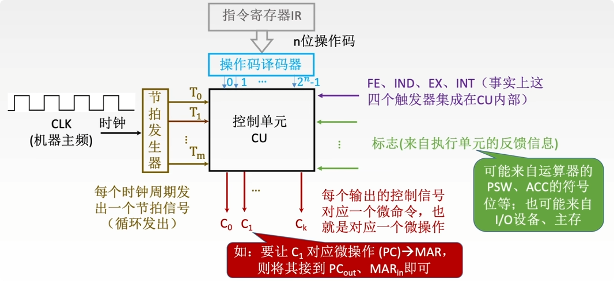
> [!note] 设计步骤
> 1.  分析每个阶段的微操作序列（取值、间址、执行、中断 四个阶段）
>     > 确定哪些指令在什么阶段、在什么条件下会使用到的微操作
> 2.  选择$CPU$的控制方式
>     > 采用定长机器周期还是不定长机器周期？每个机器周期安排几个节拍？
>     > 不妨假设采用的是定长的机器周期，并且每个机器周期内为 3 个节拍
> 3.  安排微操作时序
>     > 如何用$3$个节拍完成整个机器周期内的所有微操作？
>     > 原则一：微操作的 先后顺序不得随意 更改
>     > 原则二：被控对象不同的微操作，尽量安排在一个节拍 内完成
>     > 原则三：占用时间较短的微操作，尽量安排在 一个节拍内完成，并允许有先后顺序
> 4.  电路设计
>     > 确定每个微操作命令的逻辑表达式，并用电路实现
>     > 1. 列出操作时间表
>     > 2. 写出微操作命令的最简表达式 
>     > 3. 画出逻辑图

#### 特点
1. 指令越多，设计和实现就越复杂，因此<mark style="background:#40a9ff">一般用于RISC</mark>（精简指令集系统）
2. 如果扩充一条新的指令则控制器的设计就需要大改，因此<mark style="background:#40a9ff">扩充指令较困难</mark>
3. 由于<mark style="background:#d3f8b6">使用纯硬件实现控制</mark>，因此<mark style="background:#40a9ff">执行速度很快</mark>。微操作控制信号由组合逻辑电路即时产生。

### 微程序控制器
类比 高级语言编写的程序与指令之间的关系，将微指令拆分为若干个微命令。
设计思想为：<mark style="background:#40a9ff">采用“存储程序”的思想</mark>，CPU 出厂前将所有指令的“微程序”存入“控制存储器”中

>[!caution] 包含关系
> 微命令 = 微操作，微指令 = 若干微命令，微程序 = 指令 = 若干微指令，程序 = 若干指令
> 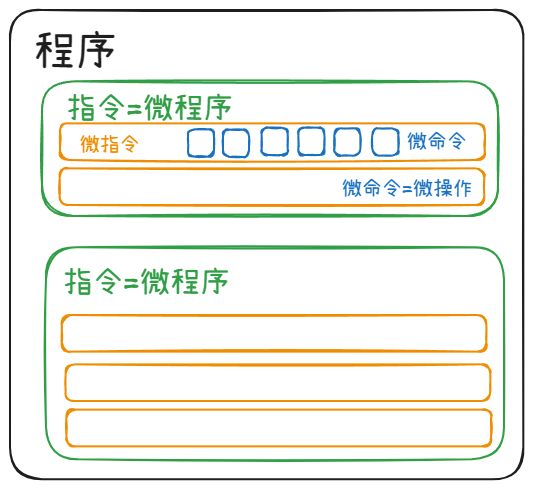

微命令的基本格式：|操作控制|顺序控制|

#### 微程序控制器的基本结构
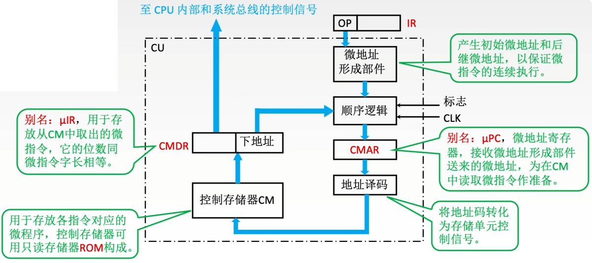
数据通路 简单分析：
	顺序逻辑部件产生微指令的地址，并送入 CMAR，随后传入地址译码器将地址转为控制信号，从控制存储器中读取指定的微命令，随后送入 CMDR，最后将控制信号传入 CPU内 和系统总线，下地址部分送入顺序逻辑部件

>[!caution] 
>1. 由于在<mark style="background:#40a9ff">取指周期、间址周期、中断周期</mark>中执行的指令均相同，故上述指令周期阶段对应的微程序 CM <mark style="background:#40a9ff">共享使用</mark>
>2. 若一个 CPU 支持 n 条机器指令，那么控制存储器中的微指令段的个数至少为 n+1。原因：机器指令与微程序是一一对应的关系，并且在指令周期中 <mark style="background:#40a9ff">间址周期、中断周期 可以缺省</mark>，故需要 共用的取指周期阶段的微程序 以及 n 条机器指令对应的执行周期阶段的微程序

#### 微指令的设计
##### 微程序控制器的工作原理
微命令与微操作一一对应，一个微命令对应一根输出线；
有的微命令可以并行执行，因此一条微指令可以包含多个微命令。

##### 微指令的格式
###### 水平型微指令
基本格式：|操作控制|顺序控制|
特点：一条微指令<mark style="background:#40a9ff">能定义多条可并行的微命令</mark>
优点：微程序指令条数较少，执行速度较快
缺点：微指令较长，编写微程序较麻烦

###### 垂直型微指令
基本格式：|微操作码|目的地址|源地址|
特点：一条微指令<mark style="background:#40a9ff">只能定义一个微命令</mark>，<mark style="background:#40a9ff">由微操作码字段规定具体功能</mark>
优点：微指令较短，简单、规整，便于编写微程序
缺点：微程序较长，执行速度较慢，工作效率低
>[!caution] 
>一条 垂直型微指令 对应多个控制信号，而且垂直微指令不讨论“相容性”
>(“相容性”概念天然属于“水平型微指令”，并且“相容性”的分析对象为 微命令)

###### ~~混合型微指令~~ (不必过多了解)
~~特点：在垂直型的基础上增加一些不太复杂的并行操作。~~
~~优点：微指令较短，仍便于编写；微程序也不长，执行速度加快。~~

##### 微指令的编码方式
以 水平型微指令 为例

###### 直接编码方式
特点：在微指令的操作控制字段中，<mark style="background:#40a9ff">每一位代表一个微命令</mark>；某位为“1”表示该控制信号有效
优点：简单直观，执行速度快，操作并行性好
缺点：微指令字长过长，n 个微命令就要求操作控制字段有 n 位，造成控存容量极大

###### 字段直接编码方式
特点：将微指令的控制字段<mark style="background:#40a9ff">分成若干“段”</mark>，<mark style="background:#40a9ff">每段经译码后发出控制信号</mark>

微命令字段分段的原则：
1. <mark style="background:#40a9ff">互斥性微命令分在同一个段内，相容性微命令分在不同段内</mark>
2. 每个小段中包含的<mark style="background:#40a9ff">信息位不能太多</mark>，否则将增加译码线路的复杂性和编码时间
3. 一般<mark style="background:#ff4d4f">每个小段还要空出一个状态</mark>，表示本字段不发出任何微命令

优点：与直接编码相比，可以缩短微指令字长
缺点：要通过译码电路后再发出微命令，因此与直接编码相比较慢

###### 字段间接编码方式 (简单了解即可)
特点：<mark style="background:#40a9ff">一个字段的某些微命令需由另一个字段中的某些微命令来解释</mark>，由于不是靠字段直接译码发出的微命令，故称为字段间接编码，又称隐式编码。
优点：可进一步缩短微指令字长。
缺点：<mark style="background:#40a9ff">削弱了微指令的并行控制能力</mark>，故通常作为字段直接编码方式的一种辅助手段。

##### 微指令的地址形成方式
1. 微指令的 **下地址字段** 指出  
	微指令格式中设置一个下地址字段，由微指令的下地址字段直接指出后继微指令的地址，这种方式又称为<mark style="background:#ff4d4f">断定方式</mark>。
2. 根据机器指令的 **操作码** 形成  
	当机器指令取至指令寄存器后，微指令的地址由操作码经微地址形成部件形成。
3. <mark style="background:#ff4d4f">增量计数器法</mark>(类比于 PC)  $\ (\text{CMAR}) + 1 \longrightarrow \text{CMAR}$
4. 分支转移  
	转移方式：指明判别条件；转移地址：指明转移成功后的去向。

| 操作控制字段 | 转移方式 | 转移地址 |
| --- | --- | --- |

5. ~~通过测试网络~~
6. 由<mark style="background:#40a9ff">硬件产生</mark>微程序入口地址  
	- 第一条微指令地址：由专门 **硬件** 产生（用专门的硬件记录取指周期微程序首地址）
	- **中断周期**：由 **硬件** 产生 **中断周期微程序首地址**（用专门的硬件记录）

#### 微程序控制单元的设计
设计步骤：
1.  分析每个阶段的微操作序列
2.  写出对应机器指令的微操作命令及节拍安排
    (1) 写出每个周期所需要的微操作(参照硬布线)
    (2) 补充微程序控制器特有的微操作：
        a. 取指周期：
           $\text{Ad}(\text{CMDR}) \rightarrow \text{CMAR}$
	           \[每条微指令结束之后都需要进行\]
           $\text{OP}(\text{IR}) \rightarrow \text{CMAR}$
	           \[取指周期的最后一条微指令完成后，要根据指令操作码确定其执行周期的微程序首地址\]
        b. 执行周期：
           $\text{Ad}(\text{CMDR}) \rightarrow \text{CMAR}$
3.  确定微指令格式
    根据微操作个数决定采用何种编码方式，以确定微指令的操作控制字段的位数。
    根据$\text{CM}$中存储的微指令总数，确定微指令的顺序控制字段的位数。
    最后按操作控制字段位数和顺序控制字段位数就可确定微指令字长。
4.  编写微指令码点
    根据操作控制字段每一位代表的微操作命令，编写每一条微指令的码点。

>[!note]-
>1. 静态微程序设计和动态微程序设计  
>- 静态　微程序无需改变，采用 $\text{ROM}$  
>- 动态　通过 $\text{改变微指令}$ 和 $\text{微程序}$ 改变机器指令  
　　　 有利于仿真，采用 $\text{EPROM}$  
>2. 毫微程序设计  
毫微程序设计的基本概念  
>- 微程序设计　用 $\text{微程序解释机器指令}$  
>- 毫微程序设计　用 $\text{毫微程序解释微程序}$  

### 硬布线控制器与微程序控制器的对比
| 对比项目\类别 |                                                                                  微程序控制器                                                                                   |                                  硬布线控制器                                   |
| :-----: | :-----------------------------------------------------------------------------------------------------------------------------------------------------------------------: | :-----------------------------------------------------------------------: |
|  工作原理   | 微操作控制信号以<mark style="background:#40a9ff">微程序</mark>的形式存放在<mark style="background:#40a9ff">控制存储器中</mark>，执行指令时读出即可； 采用“<mark style="background:#40a9ff">程序存储</mark>”的思想 | 微操作控制信号由<mark style="background:#40a9ff">组合逻辑电路</mark>根据当前的指令码、状态和时序，即时产生 |
|  执行速度   |                                                                                     慢                                                                                     |                                     快                                     |
|   规整性   |                                                                                    较规整                                                                                    |                                  烦琐、不规整                                   |
|  应用场合   |                                                                             $\text{CISC CPU}$                                                                             |                             $\text{RISC CPU}$                             |
|  易扩充性   |                                                               <mark style="background:#40a9ff">易扩充修改</mark>                                                               |                                    困难                                     |

## 指令流水线技术

### <mark style="background:#ff4d4f">指令执行模型--五段式指令</mark>
指令的执行过程可以分为多个阶段；不同的计算机，具体的分法也不尽相同。为讲解指令流水线技术，对指令执行做必要的简化：

取指->分析->执行->访存->写回

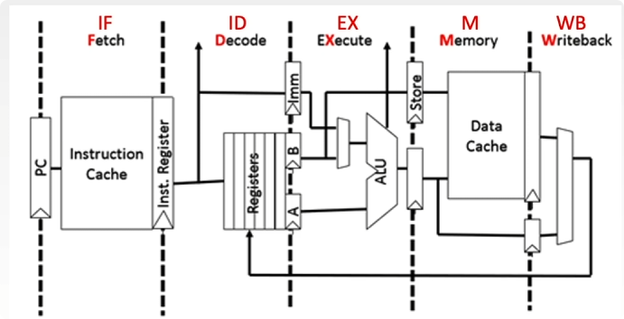

**取指**：根据 PC 内容访问指令 Cache 或 主存储器，取出一条指令送到 IR 中。
**分析**：对指令操作码进行译码，按照给定的寻址方式和地址字段中的内容形成操作数的有效地址 EA，并从有效地址 EA 中取出操作数。<mark style="background:#40a9ff">分析阶段的数据均从 通用寄存器 中读取</mark>。
**执行**：根据操作码字段，完成指令规定的功能，比如 操作数的数据运算 或者 *有效存储地址的运算*。
**访存**：根据执行阶段计算的结果，从数据 Cache 或 主存储器中读取数据；或者将某个通用寄存器中的数据写入数据 Cache 或 主存储器中。
**写回**：将运算结果或取数结果写回到目标寄存器中。

在上述的五段式指令流中：
1. <mark style="background:#40a9ff">所有指令均流经全部 5 个流水级</mark>，即使某级对该指令无实质功能，指令仍需通过该级，但该级的控制信号被清零以禁止产生实际效果。
2. 为简化模型和设计流水线，上述的五段式指令流<mark style="background:#40a9ff">每个阶段的所花费时间均相同</mark>；流水线每个功能段部件后都要有一个<mark style="background:#40a9ff">缓冲寄存器/锁存器，作用是保存本流水段的执行结果，提供给下一流水段使用</mark>。
3. 数据准备：<mark style="background:#40a9ff">在无数据依赖的情况下，EX 段的源操作数应在 ID 段末稳定于 ID/EX 寄存器，EX 段初开始运算。若存在数据依赖，需通过数据转发机制解决</mark>。
4. <mark style="background:#40a9ff">Cache 被分做 指令 Cache 与 数据 Cache，便于在 取指、访存阶段并行访问</mark>。

>[!important] 五类常见指令：取数指令、存数指令、运算类指令、条件转移指令、无条件跳转指令
>取数五段全用，存数花前四段，运算跳过 MEM，跳转跳过 MEM+WB。EX 段既是 ALU 运算又是地址计算，MEM 段区分读主存、写主存、空过三种命运。

### 流水线的表示方法
1. 指令执行过程图
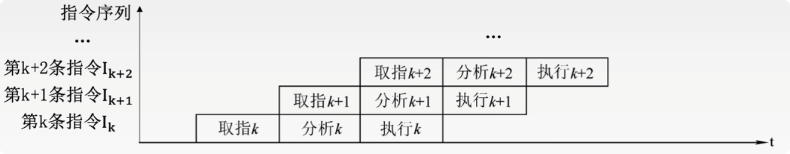
主要用于分析指令执行过程以及影响流水线的因素
2. 时空图(空间：不同阶段所对应的不同的硬件资源)
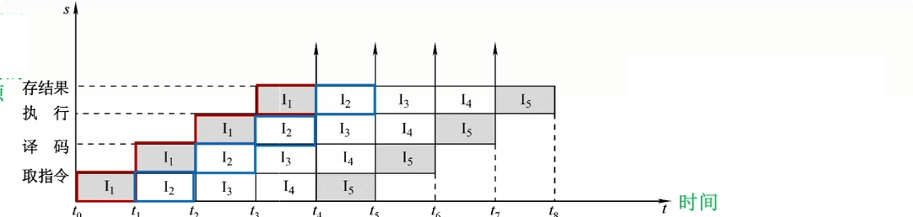
主要用于分析流水线的性能

### 流水线的性能指标
理想状态下的指令流水线时空图：

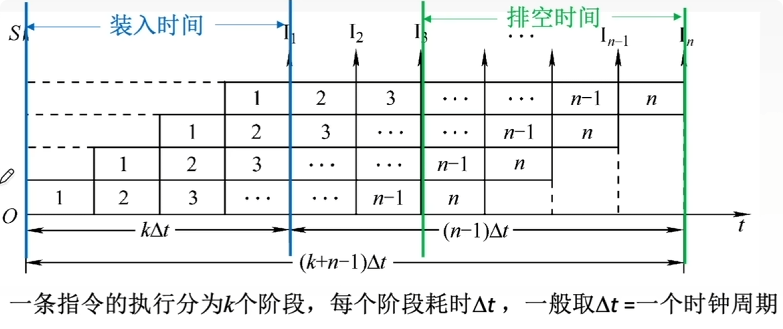
#### 吞吐率
定义：吞吐率是指在<mark style="background:#40a9ff">单位时间内流水线所完成的任务数量</mark>，或是输出结果的数量。

计算：
设任务数量为 n：处理完成 n 个任务所用的时间为 $T_k=(k+n-1)\Delta t$
计算流水线吞吐率的基本公式为 $\color{red}TP=\frac{n}{T_k}=\frac{n}{(k+n-1)\Delta t}$
>[!caution] 对比 m 段的流水线 CPU 与 m 个并行部件 CPU 的吞吐率
>1. $m$段流水线CPU通过**时间重叠**提高吞吐率，极限吞吐率为 $1/\Delta t$，加速比约 $m$（相对无流水串行）
>2. 拥有 $m$ 个并行功能部件的CPU通过**空间重叠**进一步提高吞吐率，极限吞吐率为 $m/\Delta t$，理论加速比约 $m^2$
>3. 后者吞吐率是前者的 $m$ 倍，但代价是 $m$ 倍的硬件开销、更复杂的指令调度逻辑

#### 加速比
定义：<mark style="background:#40a9ff">完成同一批任务，不使用流线所用的时间与使用流线所用的时间之比</mark>。

计算：
设 $T_0$ 表示不使用流水线时所使用的时间，即顺序执行所用的时间
则计算流水加速比的基本公式为 $\color{red}S=\frac{T_0}{T_k}=\frac{kn\Delta t}{(k+n-1)\Delta t}=\frac{kn}{k+n-1}$

#### 效率
定义：<mark style="background:#40a9ff">流水线设备利用率称为流水线的效率</mark>。

计算：
在时空图上，流水线的效率定义为完成 n 个任务占用的时空区有效面积与 n 个任务所用的时间与 k 个流水段所围成的时空区总面积之比
则流水线效率计算公式为 $\color{red}E=\frac{n 个任务占用时空区的有效面积}{n 个任务所用的时间与 k 个流水段所围成的时空区总面积}=\frac{T_0}{kT_k}=\frac{kn}{k(k+n-1)}$

### 影响流水线的因素
#### 结构相关(资源冲突)
类比“操作系统--互斥问题”
定义：由于多条指令在<mark style="background:#40a9ff">同一时刻争用同一资源而形成的冲突</mark>称为结构相关
解决方法：
1. 后一相关指令暂停一周期
2. 资源重复配置：数据存储器 + 指令存储器

#### <mark style="background:#ff4d4f">数据相关(数据冲突)</mark>
类比“操作系统--同步问题”
定义：指在<mark style="background:#ff4d4f">一个程序中，存在必须等前一条指令执行完才能执行后一条指令的情况</mark>，则这两条指令即为数据相关。
解决方法：
1. 把遇到数据相关的指令及<mark style="background:#40a9ff">其后续指令都暂停一至几个时钟周期</mark>，直到数据相关问题消失后再继续执行。可分为<mark style="background:#40a9ff">硬件阻塞(stall)和软件插入“NOP”</mark>两种方法。
2. <mark style="background:#ff4d4f">数据旁路技术/转发机制</mark>
3. <mark style="background:#ff4d4f">编译优化</mark>：通过编译器调整指令顺序来解决数据相关

>[!caution] 
>1. <mark style="background:#40a9ff"><mark style="background:#fff88f">任何</mark>数据相关均可以采用 适当插入 NOP/硬件阻塞 和 调整指令执行顺序 来避免</mark>，但仅部分的数据相关可以通过 数据旁路 得到避免
>2. 数据旁路技术可以解决的数据相关：只要不是 LW/访存类指令，EX 阶段结束后结果就就绪，后续任何需要的指令都可以通过数据转发拿到，不受距离限制。 <mark style="background:#40a9ff">LW/访存类指令 的结果要等到 MEM 阶段结束后才能转发</mark>。
>3. 流水线数据冒险分析中，须逐条检查<mark style="background:#40a9ff">循环体内指令间的数据相关</mark>；此外，<mark style="background:#40a9ff">循环体末指令与循环体首指令之间因循环回跳而形成跨迭代数据相关</mark>，应纳入检查范围。

#### 控制相关(控制冲突)
定义：当流水线遇到转移指令和其他改变 PC 值的指令而造成断流时，会引起控制相关。
解决 转移指令 的方法：
1. 转移指令<mark style="background:#40a9ff">分支预测</mark>：简单预测（永远猜ture或false）、动态预测（根据历史情况动态调整）
> 可以同时通过软件和硬件来实现
2. <mark style="background:#40a9ff">预取</mark>转移成功和不成功两个控制流方向上的目标指令
3. <mark style="background:#40a9ff">加快和提前形成条件码</mark>(类比“并行加法器”)
4. <mark style="background:#40a9ff">提高转移方向的猜准率</mark>

> [!note] 流水线的分类
> 1. 部件功能级、处理机级和处理机间级流水线
> 根据流水线使用的级别的不同，流水线可分为部件功能级流水线、处理机级流水线和处理机间流水线。
> 部件功能级流水就是将复杂的算术逻辑运算组成流水线工作方式。例如，可将浮点加法操作分成求阶差、对阶、尾数相加以及结果规格化等$4$个子过程。
> 
> 处理机级流水是把一条指令解释过程分成多个子过程，如前面提到的取指、译码、执行、访存及写回$5$个子过程。
> 
> 处理机间流水是一种宏流水，其中每一个处理机完成某一专门任务，各个处理机所得到的结果需存放在与下一个处理机所共享的存储器中。
> 
> 2. 单功能流水线和多功能流水线
> 按流水线可以完成的功能，流水线可分为单功能流水线和多功能流水线。
> 单功能流水线指只能实现一种固定的专门功能的流水线；
> 多功能流水线指通过各段间的不同连接方式可以同时或不同时地实现多种功能的流水线。
> 
> 3. 动态流水线和静态流水线
> 按同一时间内各段之间的连接方式，流水线可分为静态流水线和动态流水线。
> 静态流水线指在同一时间内，流水线的各段只能按同一种功能的连接方式工作。
> 动态流水线指在同一时间内，当某些段正在实现某种运算时，另一些段却正在进行另一种运算。这样对提高流水线的效率很有好处，但会使流水线控制变得很复杂。
> 
> 4. 线性流水线和非线性流水线
> 按流水线的各个功能段之间是否有反馈信号，流水线可分为线性流水线与非线性流水线。
> 线性流水线中，从输入到输出，每个功能段只允许经过一次，不存在反馈回路。
> 非线性流水线存在反馈回路，从输入到输出过程中，某些功能段将数次通过流水线，这种流水线适合进行线性递归的运算。
> 

### 流水线的多发技术
1. <mark style="background:#40a9ff">超标量技术</mark>
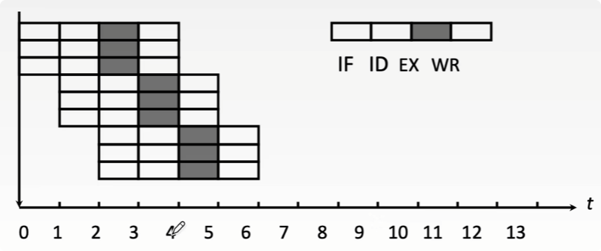
	特点：
	1. 每个时钟周期内可<mark style="background:#fff88f">并发多条独立指令</mark>
	2. <mark style="background:#fff88f">要配置多个功能部件</mark>
	3. <mark style="background:#fff88f">不能调整指令的执行顺序</mark>
2. <mark style="background:#40a9ff">超流水技术</mark>
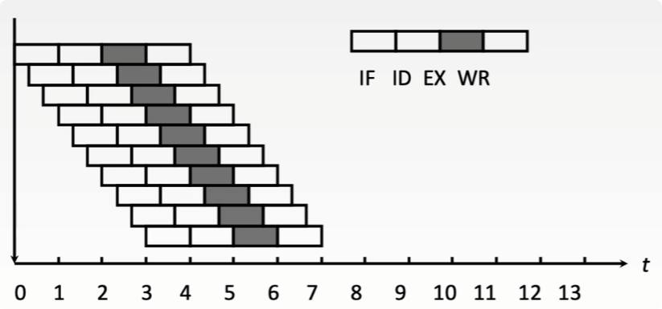
	特点:
	1. 在<mark style="background:#fff88f">一个时钟周期内再分段</mark>
	2. 在一个时钟周期内<mark style="background:#fff88f">一个功能部件使用多次</mark>
	3. <mark style="background:#fff88f">靠编译程序解决优化问题</mark>
3. <mark style="background:#40a9ff">超长指令字</mark>
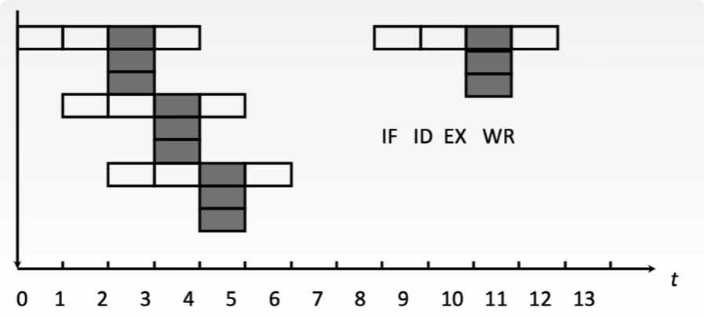
	特点：
	1. <mark style="background:#fff88f">由编译程序挖掘出指令间潜在的并行性</mark>，将多条能并行操作的指令<mark style="background:#fff88f">组合成一条</mark>
	2. 具有多个操作码字段的超长指令字（可达几百位）
	3. 采用<mark style="background:#fff88f">多个处理部件</mark>

## 多处理器系统的基本概念
(考纲仅要求了解相关概念，仅考察选择题)

- **SISD（单指令流单数据流）**
  - 特性
    - <mark style="background:#40a9ff">各指令序列只能并发、不能并行，每条指令处理一两个数据</mark>
    - <mark style="background:#fff88f">不是 数据级并行技术</mark>
  - 硬件组成
    - 一个处理器 + 一个主存储器
    - 若采用指令流水线，需设置多个功能部件，采用多模块交叉存储器

- **SIMD（单指令流多数据流）**
  - 特性
    - <mark style="background:#40a9ff">各指令序列只能并发、不能并行，但每条指令可同时处理很多个具有相同特征的数据</mark>
    - <mark style="background:#fff88f">是一种 数据级并行技术</mark>
  - 硬件组成
    - 一个指令控制部件（CU） + 多个处理单元/执行单元（如ALU） + 多个局部存储器 + 一个主存储器
    - 每个执行单元有各自的寄存器组、局部存储器、地址寄存器
    - 不同执行单元执行同一条指令，处理不同的数据

- **MISD（多指令流单数据流）**
  - <mark style="background:#40a9ff">多条指令并行执行，处理同一个数据</mark>。现实中<mark style="background:#fff88f">不存在</mark>这种计算机

- **MIMD（多指令流多数据流）**
  - 特性
    - <mark style="background:#40a9ff">各指令序列并行执行，分别处理多个不同的数据</mark>
    - 是一种 线程级并行、甚至是线程级以上并行技术
  - 进一步分类
    - 多处理器系统
      - 特性：各处理器之间，可以通过`LOAD/STORE`指令，访问同一个主存储器，可通过主存相互传送数据
      - 硬件组成：一台计算机内，包含多个处理器+一个主存储器；多个处理器共享单一的物理地址空间
    - 多计算机系统
      - 特性：各计算机之间，不能通过`LOAD/STORE`指令直接访问对方的存储器，只能通过“消息传递”相互传送数据
      - 硬件组成：由多台计算机组成，因此拥有多个处理器+多个主存储器；每台计算机拥有各自的私有存储器，物理地址空间相互独立

- **向量处理机（$SIMD$思想的进阶应用）**
  - 特性
    - 一条指令的处理对象是“向量”
    - 擅长对向量型数据并行计算、浮点数运算，常被用于超级计算机中，处理科学研究中巨大运算量
  - 硬件组成
    - 多个处理单元，多组“向量寄存器”
    - 主存储器应采用“多个端口同时读取”的交叉多模块存储器
    - 主存储器大小限定了机器的解题规模，因此要有大容量的、集中式的主存储器

- **共享内存多处理器（Shared Memory multiProcessor, $SMP$）的基本概念**
  - 多处理器系统（简称）
    - 多个处理器共享一个主存储器
    - 多个处理器共享单一的地址空间，都可以通过$LOAD$、$STORE$指令访问共享的主存储器

- **多核处理器（multi-core）的基本概念**
  - 一个$CPU$芯片中包含多个处理器，即多个核（core），因此通常也称为片级多处理器（Chip-Level MultiProcessing, $CMP$）。意思是：一块芯片上集成了多个处理器
  - 所有核共享一个$LLC$（Last-Level Cache），并共享主存储器

> 一个东西，命名角度不同而已

## 硬件多线程
(仅仅考察相关概念理解，选择题的形式)

|        | 细粒度多线程                       | 粗粒度多线程                                                  | 同时多线程（SMT）                                          |
| ------ | ---------------------------- | ------------------------------------------------------- | --------------------------------------------------- |
| 指令发射   | 轮流发射各线程的指令 （每个时钟周期发射一个线程） | 连续几个时钟周期，都发射同一线程的指令序列，流水线阻塞时，切换另一个线程                    | 一个时钟周期内，同时发射多个线程的指令                                 |
| 线程切换频率 | 每个时钟周期切换一次线程                 | <mark style="background:#40a9ff">只有流水线阻塞时才切换一次线程</mark> | NULL                                                |
| 线程切换代价 | 低                            | 高，需要重载流水线                                               | NULL                                                |
| 并行性    | 指令级并行，线程间不并行                 | 指令级并行，线程间不并行                                            | <mark style="background:#40a9ff">指令级并行，线程级并行</mark> |

>[!important] 多核处理器与单核处理器
>1. **多核处理器** 是指将<mark style="background:#40a9ff">多个独立、完整的处理单元集成到单个 CPU 芯片</mark>上，每个处理单元被称为一个核，也称为片上多处理器。<mark style="background:#40a9ff">每个核通常配备私有的 L1 Cache</mark>，而<mark style="background:#40a9ff">多个核共享更高层级的 Cache</mark>；<mark style="background:#40a9ff">所有的核通过互连网络共享主存储器</mark>。
>2. 多核系统中，必须采用多线程模型才能充分发挥硬件并行的计算能力；<mark style="background:#40a9ff">多核系统支持在物理上同时执行</mark>；而<mark style="background:#40a9ff">单核系统</mark>通过<mark style="background:#40a9ff">并发执行</mark>来自不同线程的多条指令，任何时刻仅有一个线程处于运行状态。