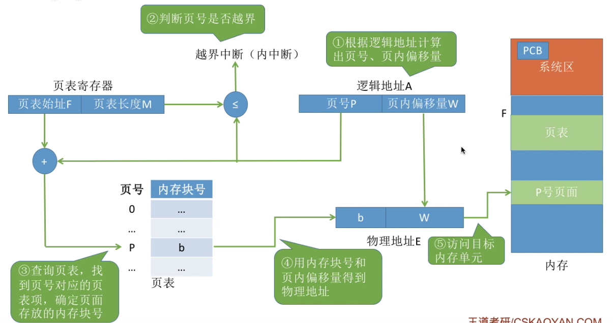
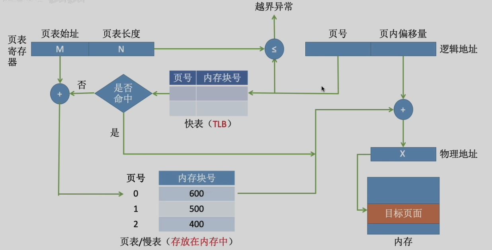
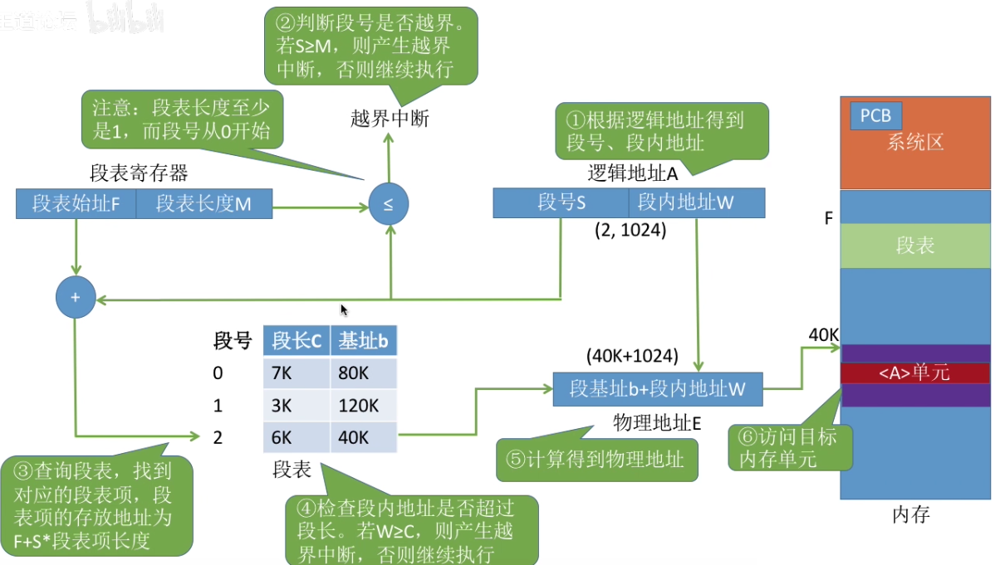
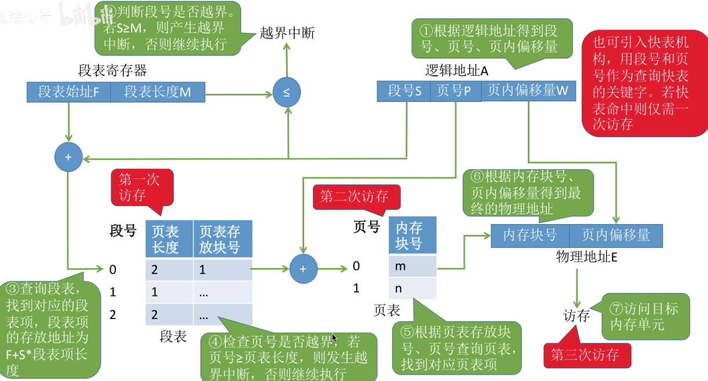

## 第三章 内存管理
## 内存管理概念
### 程序运行原理
#### 逻辑地址与物理地址
**逻辑地址**：程序经过编译、链接后生成的指令中指明的是逻辑地址，即相对于程序的起始地址而言的地址；链接程序将多个目标模块合并为一个完整的可执行程序时，依次将各个模块的相对地址拼接成一个统一的、从 0 开始的逻辑地址空间。

**物理地址/绝对地址**：是指主存中所有物理存储单元的集合，它是地址转换的最终目标，即进程无论是访问指令还是数据，最终都必须通过物理地址从主存中读取或写入信息。

#### 程序装入
1. **绝对装入**：在编译时，若**预先知道程序装入内存的起始位置**，<mark style="background:#ff4d4f">编译程序</mark>将<mark style="background:#40a9ff">产生绝对地址</mark>的目标代码。装入程序按照装入模块中的地址，将程序和数据装入内存
	1. 缺点：绝对装入**只适用于单道程序环境**
2. **静态重定位**：又称 **可重定位装入**。*编译、链接后的装入模块都是从 0 开始的*，指令中使用的地址、数据存放的地址都是相对于起始地址而言的*逻辑地址*。可根据内存的当前情况，将装入模块装入到内存的适当位置。<mark style="background:#fff88f">装入时对地址进行“重定位”，将逻辑地址变换为物理地址</mark>(地址变换是<mark style="background:#40a9ff">在装入时一次完成的</mark>)
	1. 缺点：
		1. 在一个作业转入内存时，<mark style="background:#fff88f">必须分配其要求的全部内存空间</mark>，若内存空间不足，则无法装入作业
		2. 作业一旦装入内存后，<mark style="background:#fff88f">在运行期间就不能移动，也无法申请额外内存空间</mark>
3. **动态重定位**：又称 **动态运行时装入**。*编译、链接后装入模块的地址都是从 0 开始*。转入程序把装入模块装入内存后，并不会立即把逻辑地址转换为物理地址，而是<mark style="background:#fff88f">把地址转换推迟到程序真正要执行时才进行</mark>。因此<mark style="background:#40a9ff">装入内存后，所有的地址依然是逻辑地址</mark>。但该方式需要一个<mark style="background:#40a9ff">重定位寄存器</mark>支持
	1. 优点：
		1. 允许程序在内存中发生移动；
		2. 可将程序<mark style="background:#fff88f">分配到不连续的存储区中</mark>；
		3. 在程序运行前只需装入它的部分代码即可运行，然后在程序运行期间，<mark style="background:#fff88f">根据需要动态申请分配内存</mark>；
		4. 便于<mark style="background:#fff88f">程序段的共享</mark>；可向用户提供一个比存储空间大得多的地址空间
>[!important] **动态重定位** 注意事项
>1. “**硬件地址变换机构**” 与 动态重定位 深度绑定
>2. “**重定位寄存器**” 在整个系统中<mark style="background:#fff88f">设置一个</mark>即可，原因：系统中某一时刻仅运行一条指令或访问数据

### 内存管理的概念
#### 内存管理需要实现的功能
1. **内存空间的分配与回收**
2. **~~内存空间的扩充(实现虚拟性)~~**
	1. ~~覆盖技术~~
	2. ~~交换技术~~
3. **地址转换**(<mark style="background:#fff88f">操作系统负责</mark>实现逻辑地址到物理地址的转换，即程序的装入)
4. **内存保护**(保护各个进程在自己的内存空间内运行，不会越界访问)
	1. 方式一：设置<mark style="background:#fff88f">上下界寄存器</mark>
	2. 方式二：利用<mark style="background:#fff88f">重定位寄存器</mark>(又称基地址寄存器，存放进程的起始地址)、<mark style="background:#fff88f">界地址寄存器</mark>(又称限长寄存器，存放最大逻辑地址)进行判断
>[!caution] 逻辑地址与内存保护
>逻辑地址是相对于基地址的偏移量；采用方式二时，逻辑地址的取值满足 <mark style="background:#fff88f">0 <= 逻辑地址 < 界地址寄存器的内容长度</mark>

## 内存空间的分配与回收
>[!important] 内存管理单位与内存访问单位
>1. 内存的管理单位为 <mark style="background:#40a9ff">分区/分页/分段</mark>
>2. 内存的访问单位为 <mark style="background:#40a9ff">字或字节</mark>

### 内部碎片与外部碎片
1. **内部碎片**：分配给进程的内存区域中，某些内存部分并没有得到使用
2. **外部碎片**：内存中的某些空闲分区由于过小而难以利用

### 连续分配管理方式
必须为用户进程分配**地址空间连续**的内存空间

#### 单一连续分配方式
在单一连续分配方式中，内存被分为**系统区**和**用户区**。
系统区通常位于内存的低地址部分，用于存放操作系统相关数据；用户区用于存放用户进程相关数据。
内存中**只能有一道用户程序**，用户程序独占整个用户区空间。

优点：
1. 实现简单；
2. <mark style="background:#fff88f">无外部碎片</mark>；
3. 可以采用覆盖技术扩充内存；
4. <mark style="background:#fff88f">不一定需要采取内存保护</mark>（例如：早期的 PC 操作系统 MS-DOS）。

缺点：
1. 只能用于单用户、单任务的操作系统中；
2. <mark style="background:#fff88f">有内部碎片</mark>；
3. <mark style="background:#fff88f">存储器利用率极低</mark>。

#### 固定分配方式
为了能在内存中装入多道程序，且这些程序之间又不会相互干扰，于是将整个<mark style="background:#fff88f">**用户空间划分为若干个固定大小的分区**</mark>，在**每个分区中只装入一道作业**，这样就形成了最早的、最简单的一种可运行多道程序的内存管理方式。

**固定分区分配**方式：
- **分区大小相等**：<mark style="background:#fff88f">缺乏灵活性</mark>，但是很适合用于用一台计算机控制多个相同对象的场合
- **分区大小不等**：<mark style="background:#fff88f">增加了灵活性</mark>，可以<mark style="background:#fff88f">满足不同大小的进程需求</mark>。根据常在系统中运行的作业大小情况进行划分（比如：划分多个小分区、适量中等分区、少量大分区）

描述固定分区分配的**数据结构**--**分区说明表**：
1. 每个表项对应一个分区，通常按照分区大小排列；
2. 每个表项包括对应**分区的大小、起始地址、状态**(是否分配)

优点：实现简单，<mark style="background:#fff88f">无外部碎片</mark>
缺点：
1. <mark style="background:#fff88f">当用户程序过大时，可能所有的分区都不能满足需求</mark>，此时不得不使用覆盖技术来解决，但又会降低性能
2. <mark style="background:#fff88f">会产生内部碎片，内存利用率降低</mark>

#### 动态分区分配方式
**动态分区分配**，又称为**可变分区分配**。这种分配方式<mark style="background:#fff88f">不会预先划分内存分区，而是在进程装入内存时，根据进程的大小动态地建立分区，并使分区的大小正好适合进程的需要</mark>。因此系统分区的大小和数目是可变的。

描述动态分区分配的**数据结构**：
1. **空闲分区表**：每个空闲分区对应一个表项；表项中包含<mark style="background:#fff88f">分区号、分区大小、分区起始地址</mark>等信息
2. **空闲分区链**：每个分区的起始部分与末尾部分分别设置<mark style="background:#fff88f">前向指针和后向指针</mark>；起始部分还可以记录分区大小等信息

以空闲分区表为例进行**内存的分配与回收**：
- **分配**：
	- 分配的内存大小小于被分配的分区--表项数量不变，更改相应数据
	- 分配的内存大小等于被分配的分区--表项减少
- **回收**：**注意相邻的空闲分区进行合并操作**，修改部分表项信息，删除部分表项

缺点：<mark style="background:#fff88f">存在外部碎片</mark>(可以通过 <mark style="background:#40a9ff">紧凑/拼凑</mark> 技术来解决，同时需要使用 <mark style="background:#40a9ff">动态重定向装入</mark> 技术)

动态分区**分配算法**：

<table border="1">
  <thead>
    <tr>
      <th>算法</th>
      <th>算法思想</th>
      <th>分区排列顺序</th>
      <th>优点</th>
      <th>缺点</th>
    </tr>
  </thead>
  <tbody>
    <tr>
      <td><mark style="background:#40a9ff">首次适应</mark></td>
      <td>从头到尾找适合的分区</td>
      <td>空闲分区以<mark style="background:#40a9ff">地址递增次序排列</mark></td>
      <td>1. 综合看性能<mark style="background:#40a9ff">最好</mark>。 2. <mark style="background:#40a9ff">算法开销小</mark>，回收分区后一般不需要对空闲分区队列重新排序</td>
      <td></td>
    </tr>
    <tr>
      <td>最佳适应</td>
      <td><mark style="background:#fff88f">优先使用更小的分区</mark>，以保留更多大分区</td>
      <td>空闲分区以<mark style="background:#40a9ff">容量递增次序排列</mark></td>
      <td>会有更多的<mark style="background:#d3f8b6">大分区被保留下来</mark>，更能满足大进程需求</td>
      <td>1. 会<mark style="background:#d3f8b6">产生很多太小的、难以利用的碎片</mark>； 2. <mark style="background:#d3f8b6">算法开销大，回收分区后可能需要对空闲分区队列重新排序</mark></td>
    </tr>
    <tr>
      <td>最坏适应</td>
      <td><mark style="background:#fff88f">优先使用更大的分区</mark>，以防止产生太小的不可用的碎片</td>
      <td>空闲分区以<mark style="background:#40a9ff">容量递减次序排列</mark></td>
      <td>可以<mark style="background:#d3f8b6">减少难以利用的小碎片</mark></td>
      <td>1. 大分区容易被用完，不利于大进程； 2. <mark style="background:#d3f8b6">算法开销大</mark>（原因同上）</td>
    </tr>
    <tr>
      <td>邻近适应</td>
      <td>由首次适应演变而来，<mark style="background:#fff88f">每次从上次查找结束位置开始查找</mark></td>
      <td>空闲分区以<mark style="background:#40a9ff">地址递增次序排列</mark>（可排列成循环链表）</td>
      <td>1. 不用每次都从低地址的小分区开始检索。 2. <mark style="background:#d3f8b6">算法开销小</mark>（原因同首次适应算法）</td>
      <td>会使高地址的大分区也被用完，使得<mark style="background:#d3f8b6">小分区较均匀地散落在内存中</mark></td>
    </tr>
  </tbody>
</table>

>[!important] 
>1. 基于**顺序搜索**的分配算法，**首次适应算法、循环首次适应算法、最佳适应算法、最坏适应算法**
>2. 基于**索引搜索**的分配算法，**快速适应算法、伙伴算法、哈希算法**

### 非连续分配管理方式
可以为用户进程分配**地址空间离散**的内存空间

>[!note] 非连续分配管理方式与程序装入方式
>程序装入方式中 <mark style="background:#fff88f">静态重定位装入方式</mark> 必须为进程分配连续的内存空间，<mark style="background:#fff88f">不适用于 非连续分配管理方式</mark>；<mark style="background:#fff88f">动态重定位装入方式 适用于 非连续分配管理方式</mark>

##### 基本分页存储管理
**分页存储**：
1. 内存空间的划分：将内存空间划分为一个个大小相等的分区，每个分区称为 “页框/页帧/内存块/物理块/物理页面”；每个页框都有一个编号，即“页框号”，页框号是从 0 开始的
2. 进程逻辑地址空间的划分：进程的逻辑地址空间也划分为与与框大小相等的一个个部分，每个部分称为一个 “页/页面”，并且每个页面也有一个编号，即“页号”，页号也是从 0 开始的
3. 内存空间的分配：<mark style="background:#40a9ff">操作系统以页框为单位为各个进程分配内存空间</mark>。进程的每个页面分别被装入一个页框中；<mark style="background:#40a9ff">各个页面不必连续存放，可以离散存储</mark>

描述分页存储的**数据结构**--**页表**：
1. 目的：为了能知道进程各个页面在内存中的存储位置，并<mark style="background:#fff88f">完成进程逻辑地址向内存物理地址的映射</mark>，操作系统**为每个进程**建立一张 **页表**，并<mark style="background:#40a9ff">存储在 对应进程的 PCB(<mark style="background:#ff4d4f">常驻内存</mark>) 中</mark>
2. 组成：页表的表项由 <mark style="background:#fff88f">页号、块内地址</mark> 组成，其中由于**表项在内存中连续存储且具有相同的大小**，所以*页号隐式存储*，类比数组的下标不做存储
3. 地址的转换：
	1. 确定页号：<mark style="background:#fff88f">页号 = 逻辑地址 / 页面长度</mark>
	2. 查询页表
	3. 确定页内偏移量：<mark style="background:#fff88f">偏移量 = 逻辑地址 % 页面长度</mark>
	4. 不妨设 页面长度为 $2^n$ B，逻辑地址的长度为 m bit，便有：
|页号(m-n bit)|页内偏移量(n bit)|

地址转换的**硬件机构**--**基本地址变换机构**：
1. 硬件机构：<mark style="background:#fff88f">页表寄存器(PTR)</mark>，**存放页表在内存中的起始位置  F  和页表长度  M**；
2. 运行原理：进程未执行时，<mark style="background:#fff88f">页表的起始地址和页表长度存储在 PCB 中</mark>，仅当进程被调度时，它们才会被操作系统装入页表寄存器中；操作系统中仅需设置 **一个**页表寄存器即可
3. 地址转换过程：设页面大小为 $L$，逻辑地址 $A$ 到物理地址 $E$ 的变换过程如下：
	1. **不具有快表**的地址转换：
		1. <mark style="background:#40a9ff">拆分逻辑地址</mark>：计算页号 $P$ 和页内偏移量 $W$ (<mark style="background:#ff4d4f">由硬件产生</mark>)
		2. <mark style="background:#40a9ff">越界判断</mark>：比较页号 $P$ 和页表长度 $M$，若 $P \ge M$，则产生越界中断，否则继续执行。（注意：页号是从 0 开始的，而页表长度至少是 1，因此 $P=M$ 时也会越界）
		3. <mark style="background:#40a9ff">查询页表</mark>：页表中页号 $P$ 对应的 <mark style="background:#fff88f">**页表项地址** = 页表起始地址 $F$ + 页号 $P$ * 页表项长度</mark>，取出该页表项内容 $b$，即为内存块号。
		4. <mark style="background:#40a9ff">计算物理地址</mark>：计算 $E = b * L + W$，用得到的物理地址 $E$ 去访存。（如果内存块号、页面偏移量是用二进制表示的，那么把二者拼接起来就是最终的物理地址了）
	2. **具有快表**的地址转换过程：
		1. 快表的引入：*快表又称联想寄存器(TLB)*\[属于硬件\]，是一种访问速度比内存快很多的高速缓存，用于<mark style="background:#fff88f">存放页表项的副本</mark>，可加快地址转换的速度；与之对应，内存中的页表称为*慢表*
		2. 具体过程：(类比 Cache-主存的访问)
			1. 逻辑地址拆分：$CPU$给出逻辑地址，由某个硬件算得页号、页内偏移量，将页号与快表中的所有页号进行比较。
			2. <mark style="background:#d3f8b6">查询快表</mark>：如果找到匹配的页号，说明要访问的页表项在快表中有副本，则直接从中取出该页对应的内存块号，再将内存块号与页内偏移量拼接形成物理地址，最后，**访问**该物理地址对应的**内存单元**。因此，<mark style="background:#40a9ff">若**快表命中**，则访问某个逻辑地址仅需**一次访存**即可</mark>。
			3. <mark style="background:#d3f8b6">查询慢表与修改快表</mark>：如果没有找到匹配的页号，则需要**访问内存中的页表**，找到对应页表项，得到页面存放的内存块号，再将内存块号与页内偏移量拼接形成物理地址，最后，**访问**该物理地址对应的**内存单元**。因此，<mark style="background:#40a9ff">若**快表未命中**，则访问某个逻辑地址需要**两次访存**</mark>（注意：<mark style="background:#fff88f">在找到页表项后，应同时将其存入快表</mark>，以便后面可能的再次访问。但若快表已满，则必须按照一定的算法对旧的页表项进行替换）
		3. 平均访存时间的计算(类比 Cache-主存的平均访存时间的计算)
			- 注意：TLB 的修改时间 
		4. 提高访存速度的原因：<mark style="background:#fff88f">程序的局部性原理</mark>

|  |  |
| ------------------------------------------ | ---------------------------------------------- |
>[!important] 不具有快表的地址转换的两次访存
>1. 第一次访存：访问页表，得到对应页号的起始物理地址
>2. 第二次访存：访问得到的物理地址对应的数据/指令

>[!attention]- 注意区分页表项长度、页表长度、页面大小的区别
>1. **页表长度**指的是这个页表中总共有几个页表项，即总共有几个页；
>2. **页表项长度**指的是每个页表项占多大的存储空间；
>3. **页面大小**指的是一个页面占多大的存储空间
5. 进程页表的存储：通常装入在<mark style="background:#40a9ff">地址空间连续</mark>的内存空间内

**多级页表**的引入：
1. 单级页表**存在的问题**：
	1. **页表必须连续存放**，当页表很大时，需要占据多个连续的页框
	2. 整个页表必**常驻内存**
2. 页表**离散存储**：
	1. 思想：**将页表进行分组，使得每个内存块恰好可以装入一个分组**，并为分组建立一张页表，记录各个页面的存放位置
	2. 数据结构：(二级页表为例)
		1. 目录页表/顶级页表/外层页表：记录二级页表所在的页框
		2. 二级页表：记录进程各个页面所在的页框
		3. <mark style="background:#40a9ff">不妨设 页面长度为 $2^n$ B，逻辑地址的长度为 m bit，页面可容纳的页表项个数为 $2^c$ 个，便有</mark>：
**|顶级页表(m-n-c bit)|二级页表页号(c bit)|页内偏移量(n bit)|**

		4. 地址转换：(二级页表为例)
			1. 逻辑地址拆分：按照地址结构将逻辑地址拆分成三部分
			2. 查询顶级页表：从 $\text{PCB}$ 中读出页目录表始址，再根据一级页号查页目录表，找到下一级页表在内存中的存放位置
			3. 查询二级页表：根据二级页号查表，找到最终想访问的内存块号
			4. 计算物理地址：结合页内偏移量得到物理地址
3. 按需调入内存

>[!important]
>1. 若采用多级页表机制，则<mark style="background:#40a9ff">各个页表的大小不得超过一个页面</mark>
>2. N 级页表的访存次数分析(假设不设置快表)：需要 <mark style="background:#40a9ff">N+1</mark> 次

#### 基本分段存储管理
**分段存储**：
1. 进程逻辑地址的划分：<mark style="background:#40a9ff">按照程序自身的逻辑关系划分为若干个段</mark>，每个段都有一个段名，每段从 0 开始编号
2. 内存分配规则：以段为单位进行分配，<mark style="background:#fff88f">每个段在内存中占据连续空间，但各段之间可以不相邻</mark>

描述分段存储管理的**数据结构--段表**：
1. 组成：段表的表项由 <mark style="background:#fff88f">段号、段长、基址</mark> 组成，其中段号隐式存储，表项长度相等 ^b10015
>[!caution] 段表与页面组成对比
>1. 其中 段号/页号 均由于表项长度相等，而隐式存储
>2. 而由于分页存储中每个页面的大小相等，且由操作系统负责管理，故页长不做存储；但分段存储中每个段的大小由程序员根据代码逻辑划分，大小可能不等，故需要存储段长

2. 地址转换：
	1. 地址组成：|段号|段内地址|
	2. 具体过程：
		1. 逻辑地址拆分：由逻辑地址得到段号、段内地地址(同样<mark style="background:#fff88f">由硬件产生</mark>)
		2. <mark style="background:#40a9ff">段表越界判断</mark>：段号与段表寄存器中的段长度比较，检查是否越界
		3. 查询段表：由段表始址、段号找到对应段表项
		4. <mark style="background:#40a9ff">段内越界判断</mark>：根据段表中记录的段长，检查段内地地址是否越界
		5. 计算物理地址：由段表中的“基址+段内地地址”得到最终的物理地址
		6. 访问目标单元

**分段与分页的对比**：
1. 逻辑意义与物理意义：
	1. <mark style="background:#40a9ff">页是**信息的物理单位**</mark>。分页的主要目的是为了<mark style="background:#40a9ff">实现离散分配</mark>，提高内存利用率。<mark style="background:#fff88f">分页仅仅是系统管理上的需要</mark>，完全是系统行为，<mark style="background:#fff88f">对用户是不可见的</mark>。
	2. <mark style="background:#40a9ff">段是**信息的逻辑单位**</mark>。分页的主要目的是<mark style="background:#40a9ff">更好地满足用户需求</mark>。一个段通常包含着一组属于一个逻辑模块的信息。<mark style="background:#fff88f">分段对用户是可见的，用户编程时需要显式地给出段名</mark>。
2. 段与页的大小：
	1. 页的大小固定且由系统决定。
		1. 页面过小，导致**磁盘 I/O 频繁**
		2. 页面过大，**加剧内部碎片，但可以减少表项数目**
	2. 段的长度却不固定，决定于用户编写的程序。
3. 段表与页表的对比：
	1. 分页的用户进程地址空间是**一维的**，程序员只需给出一个记忆符即可表示一个地址，分页对用户是透明的
	2. 分段的用户进程地址空间是**二维的**，程序员在标识一个地址时，既要给出段名，也要给出段内地址。
	3. 段页式的用户进程地址空间是 **二维的**
4. 信息的共享与存储：
	<mark style="background:#40a9ff">分段比分页更容易实现信息的共享和保护</mark>。不能被修改的代码称为**纯代码**或**可重入代码**(不属于临界资源，通过多进程共享同一块存储空间，或通过动态链接方法映射到相关进程中，减少了程序的换入/换出，减少了对换次数)，这样的代码是可以共享的。可修改的代码是不能共享的
5. 访存次数：
	1. 分页（单级页表）：第一次访存——查内存中的页表，第二次访存——访问目标内存单元。总共**两次访存**
	2. 分段：第一次访存——查内存中的段表，第二次访存——访问目标内存单元。总共**两次访存**；
	3. 引入快表：与分页系统类似，分段系统中也可以引入**快表**机构，将近期访问过的段表项放到快表中，这样可以少一次访问，加快地址变换速度。

#### 段页式存储管理
**分页与分段存储存在的优缺点**：
<table border="1">
  <thead>
    <tr>
      <th></th>
      <th>优点</th>
      <th>缺点</th>
    </tr>
  </thead>
  <tbody>
    <tr>
      <td>分页管理</td>
      <td>内存空间利用率高，不会产生外部碎片，只会有少量的页内碎片</td>
      <td>不方便按照逻辑模块实现信息的共享和保护</td>
    </tr>
    <tr>
      <td>分段管理</td>
      <td>很方便按照逻辑模块实现信息的共享和保护</td>
      <td>如果段长过大，为其分配很大的连续空间会很不方便。另外，段式管理会产生外部碎片</td>
    </tr>
  </tbody>
</table>

**段页式存储**：
1. 进程逻辑地址划分：<mark style="background:#40a9ff">将进程地址按逻辑模块分段，再将各段分页</mark>
2. 内存地址划分：划分为大小相同的 内存块/页框/物理块

描述段页式存储的**数据结构--段表、页表**：
1. 段表：表项由 <mark style="background:#fff88f">段号、页表长度、页表内存块号/基址</mark> 组成，其中表项的长度相等，段号隐式存储；每一个段对应一个段表项  \[[注意与基本分段存储管理中段表的表项的区别](#^b10015)\]
2. 页表：表项由 <mark style="background:#fff88f">页号、页面存放的内存块号</mark> 组成，其中表项长度相等，页号隐式存储；每一个页面对应一个页表项 \[与基本分页存储管理中页表的表项保持一致\]

**地址转换**：
1. 逻辑地址组成：|段号|页号|页内偏移量|
2. 具体过程：
	1. 由逻辑地址得到段号、页号、页内偏移量
	2. 段号与段表寄存器中的段长度比较，检查是否越界
	3. 由段表始址、段号找到对应段表项
	4. 根据段表中记录的页表长度，检查页号是否越界
	5. 由段表中的页表地址、页号得到查询页表，找到相应页表项
	6. 由页面存放的内存块号、页内偏移量得到最终的物理地址
	7. 访问目标单元

>[!important] 段页式存储管理访存次数
>1. 第一次：访问段表
>2. 第二次：访问页表
>3. 第三次：访问目标单元 

>[!important] 地址转换
>1. 硬件实现：逻辑地址拆分、越界检查、查表(TLB、页表、段表)、物理地址拼接
>2. 软件实现：缺页/段中断处理、表的维护(TLB、页表、段表)

## 虚拟内存管理
### 虚拟内存管理基本概念
#### 传统内存管理存在的问题
1. **一次性**：<mark style="background:#fff88f">作业必须一次性全部装入内存后才能开始运行</mark>
	1. 问题：
		1. 当作业过大时，不能全部装入内存，导致<mark style="background:#d3f8b6">大作业无法运行</mark>
		2. 当大量作业要求运行时，由于内存无法容纳所有作业，因此只有少量作业能运行，导致<mark style="background:#d3f8b6">多道程序并发度下降</mark>
2. **驻留性**：一旦作业装入内存，就会<mark style="background:#fff88f">持续驻留在内存</mark>中，直至作业运行完毕
	1. 问题：其实在某个时间段内，只需要访问作业的部分数据即可正常运行；这就**导致了内存中驻留大量的、暂时用不到的数据，浪费内存空间**

#### 虚拟内存的运行原理与特征
虚拟内存**运行原理**：
1. **开始执行阶段**：基于**程序局部性原理**，在程序装入时，将程序即将使用到的部分装入内存，而暂时不被使用的部分留在外存，使得程序投入运行
2. **执行阶段**：当访问的信息/数据在内存中无法命中时，由操作系统负责将所需信息从外存调入内存中，便于程序后续的执行
3. 内存空间不足：由操作系统负责将内存中暂时不被使用的信息换出到外存中

虚拟内存的**特征**：
1. **多次性**：无需在作业运行前一次性全部装入内存中，而是**允许被分成多次调入内存**
2. **对换性**：在作业运行时无需持续驻留在内存中，而是**允许在作业运行过程中，将作业换入、换出**
3. **虚拟性**：**从逻辑上扩充了内存的容量**，使得用户感知到的内存容量远大于实际的容量

#### 虚拟内存的实现
由于虚拟内存允许一个作业分多次调入内存中，故虚拟内存的实现需要建立在 **离散分配的内存管理** 方式基础上

方式：
1. 请求分页存储管理 <-> 基本分页存储管理
2. 请求分段存储管理 <-> 基本分段存储管理
3. 请求段页式存储管理 <-> 基本段页式存储管理

区别于传统的非连续分配管理方式：
1. **请求调页/段**：在程序执行过程中，所访问的信息在内存中无法命中时，由操作系统负责将所需信息从外存调入内存
2. **页面/段置换**：若内存空间不足时，由操作系统将内存中暂时用不到的信息换出到外存

>[!important] 虚拟内存/虚拟存储器/虚拟地址
>1. 进程的虚拟地址空间寻址由 <mark style="background:#ff4d4f">系统的地址结构</mark> 决定，这就决定了虚拟存储器的最大容量，而与 <mark style="background:#40a9ff">主存和外存的容量</mark> 没有必然联系；
>2. 虚拟存储器的组成部分为 `主存 + 用于虚拟内存的外存(用于存放从内存中移出的页)`；
>3. 真正可为进程使用的空间仅为 “内存”，或者说仅当进程的工作集均处于内存/主存储器中时，进程才可以顺利执行，反之发生缺页中断；
>4. 进程仅能感知“虚拟地址”，而无法直接访问“物理地址”，如 `malloc()` 函数返回的是分配空间的虚拟地址

>[!important] CPU、SWAP、IO 占用率分析
>5. <mark style="background:#40a9ff">`低 CPU、高 SWAP、低 IO`</mark>：说明在任务量较小时，<mark style="background:#40a9ff">交换操作非常频繁，可判断物理内存严重短缺</mark>
>6. `CPU 利用率低，Swap 换页频繁，磁盘 I/O 高`：系统发生“抖动（Thrashing）”，依据：分配给进程的物理块数 小于 其“工作集（Working Set）”大小。进程频繁缺页，导致大量时间消耗在页面换入换出的I/O等待上，CPU因等待而空闲
>7.  `CPU 利用率低，Swap 无活动，磁盘 I/O 高`：进程属于 “I/O密集型（I/O-bound）” 或系统存在磁盘瓶颈，依据：内存充足，不存在换页。CPU的大量时间被消耗在等待磁盘读写（如文件读写、数据库查询）的完成上
>8. `CPU 利用率高，Swap 无活动，磁盘 I/O 低`：进程属于 “CPU密集型（CPU-bound）”，系统运行正常，依据：内存页框数分配合理，缺页率极低，CPU在用户态（us）忙于算术逻辑运算，无资源争抢。

### 请求分页存储管理
基于 基本分页存储管理方式 的扩展，增添以下功能：
1. 请求调页
2. 页面置换

#### 数据结构--页表机制
与 基本分页存储管理 中页表的区别，增添如下标志位：
1. **状态位**：是否以调入内存
2. **访问字段**：记录当前页面被访问的次数/上次被访问的时间，供页面置换算法参考
3. **修改位**：页面被调入内存后是否被修改
4. **外存地址**：页面在外存中的存储位置
5. ~~(**LRU 位**：用于 LRU 页面置换算法，仅 1 bit    与后续内容的联系，不具有一般性)~~

#### 请求调页机构--缺页中断机构
请求调页的过程：
1. 确定访问的页号等信息(由硬件产生)
2. 当前要访问的页面在内存中无法命中，产生缺页中断，后由操作系统 缺页中断处理程序 处理中断
3. 当前缺页进程阻塞，放入阻塞队列；待调页完成后将其唤醒，放回就绪队列
4. 调页：
	1. 若当前内存存在空闲块，则为进程分配，并将调入的页面装入，修改页表中的标志位
	2. 若当前内存无空闲块，则根据页面置换算法淘汰一个页面，并根据标志位判断该页面是否需要写回外存；后续操作同上

**缺页中断**是因为当前执行的指令即将访问的页面未被调入内存中而产生的，属于<mark style="background:#40a9ff">内中断(或故障)</mark>
并且 <mark style="background:#40a9ff">一条指令执行过程中，可能发生多次缺页中断</mark>

#### 地址变换
与 基本分页存储管理 相比，区别如下：
1. 标志位的修改与页面写回
2. 请求调页时产生缺页中断
3. 页面置换算法：决定页面的换入换出
4. 系统开销：页面的换入换出属于慢速 I/O 操作
5. 快表内容的修改：若可在快表中命中则页面一定存在与内存；同时当页面换出内存时，删除快表与慢表中的表项

>[!important] 
>cache 既可以采用 写分配法，也可以采用 直写法，而 分页存储管理 尽可以采用 写分配法，主要原因为：
>1. **页 远大于 块**
>2. 磁盘的 I/O 速度远小于 主存

### 页面置换算法
#### ~~最佳页面置换算法(OPT)~~
算法思想：<mark style="background:#fff88f">每次选择淘汰的页面将是以后永不使用，或者在最长时间内不再被访问的页面</mark>，可以保证最低的缺页率 \[做题技巧：顺序查找当前内存中最后出现的页面\]

缺陷：需预知未来访问的页面，在现实中是无法实现的，是一种理想化的算法

#### 先进先出置换算法(FIFO)
算法思想：<mark style="background:#fff88f">每次选择淘汰的页面是当前最早进入内存的页面</mark>
算法实现：把调入内存的页面根据调入的先后顺序排成一个队列，需要换出页面时选择对头的页面即可；队列的最大长度取决于系统为进程分配的内存空间

缺陷：<mark style="background:#fff88f">只有先进先出置换算法会出现 Belady 异常</mark>(即当为进程分配的物理块数增大时，缺页次数不减反增的现象)；并没有遵循 程序局部性原理

#### <mark style="background:#ff4d4f">最近最久未使用置换算法(LRU)</mark>(高考频)
算法思想：每次淘汰的页面是最近最久未被访问的页面
算法实现：用访问字段<mark style="background:#fff88f">记录该页面自上次被访问以来所经历的时间 t</mark>，当淘汰一个页面时，选择现有页面中 t 值最大的 \[做题技巧：逆向查找当前内存中最早出现的页面\]

缺陷：若使用<mark style="background:#40a9ff">软件</mark>实现该算法，则需为每个驻留页面维护其访问历史信息，并在每次缺页的时候遍历所有页帧以确定替换目标，<mark style="background:#40a9ff">时间复杂度为  O(n)，开销较大</mark>；<mark style="background:#40a9ff">采用硬件实现，则可以减低系统开销</mark>

#### 时钟置换算法(CLOCK/NRU)
时钟置换算法是一种性能和开销较均衡的算法，又称最近未使用算法，NRU

##### 简单时钟算法
算法实现：为每个页面<mark style="background:#fff88f">设置一个访问位</mark>，再将内存中的页面都通过链接指针链接成一个<mark style="background:#fff88f">循环队列</mark>。当某页被访问时，其访问位置为 1。当需要淘汰一个页面时，只需检查页面的访问位。

如果是 0，就选择该页换出；如果是 $1$，则将它置为 $0$，暂不换出，继续检查下一个页面；第一轮扫描将页面的访问位置为 0，随后开始第二次扫描
>[!important] 页面扫描指针指向
>页面指针仅仅在缺页时会发生移动，而命中时不会移动

最多扫描轮数分析：
第二轮扫描中一定会有访问位为 0 的页面，因此<mark style="background:#40a9ff">简单的 CLOCK 算法</mark>选择一个淘汰页面<mark style="background:#40a9ff">最多会经过两轮扫描</mark>

##### 改进的时钟置换算法
简单的时钟置换算法存在的问题：<mark style="background:#fff88f">仅考虑到一个页面最近是否被访问过，未考虑是否需写回外存</mark>
改进的时钟置换算法的思想：除了考虑一个页面最近有没有被访问过之外，操作系统还应考虑页面有没有被修改过。在其他条件都相同时，<mark style="background:#d3f8b6">应优先淘汰没有修改过的页面</mark>，避免 I/O 操作。

为方便讨论，用(访问位，修改位)的形式表示各页面状态。如$(1, 1)$表示一个页面近期被访问过，且被修改过。

**算法规则**：将所有可能被置换的页面排成一个循环队列
1. 第一轮：从当前位置开始扫描到第一个$(0,0)$的帧用于替换。本轮扫描不修改任何标志位 \[最近没被访问，且没修改的页面，即(0,0)\]
2. 第二轮：若第一轮扫描失败，则重新扫描，查找第一个$(0, 1)$的帧用于替换。<mark style="background:#fff88f">本轮将所有扫描过的帧访问位设为$0$</mark> \[最近没被访问，但修改过的页面，即(0,1)\]
3. 第三轮：若第二轮扫描失败，则重新扫描，查找第一个$(0,0)$的帧用于替换。本轮扫描不修改任何标志位 \[最近访问过，但没修改过的页面，即(1,0)\]
4. 第四轮：若第三轮扫描失败，则重新扫描，查找第一个$(0, 1)$的帧用于替换。 \[最近访问过，且修改过的页面，即(1,1)\]

最多扫描轮数分析：
由于第二轮已将所有帧的访问位设为 $0$，因此经过第三轮、第四轮扫描一定会有一个帧被选中，因此<mark style="background:#40a9ff">改进型 $\text{CLOCK}$ 置换算法</mark>选择一个淘汰页面<mark style="background:#40a9ff">最多会进行四轮扫描</mark>

优点：算法开销小，性能也不错

>[!caution] **所有**的页面置换算法都无法避免产生 **抖动** 现象

### 页面分配策略
#### 页面分配、置换策略
**驻留集**：指请求分页存储管理中给进程分配的物理块的集合
在采用虚拟存储技术的系统中，驻留集大小一般小于进程的总大小
>[!caution] 驻留集大小的影响
>驻留集过小，导致缺页频繁，大量时间用于处理缺页，产生抖动现象
>驻留集过大，导致多道程序并发度下降，资源利用率降低

分配策略：
- **固定分配**：操作系统为每个进程分配一组固定数目的物理块，<mark style="background:#d3f8b6">在运行期间保持不变，即驻留集不变化</mark>
- **可变分配**：先为每个进程分配一定数目的物理块，<mark style="background:#d3f8b6">在程序运行期间，可根据情况做适当的增加或减少，即驻留集可变</mark>

置换策略：
- **局部置换**：发生缺页时<mark style="background:#d3f8b6">只能选择进程自身的物理块进行置换</mark>
- **全局置换**：<mark style="background:#d3f8b6">可以将操作系统保留的空闲物理块给缺页进程</mark>，也可以将别的进程持有的物理块置换到外存，再分配给缺页进程

分配策略与置换策略的搭配：
- **固定分配局部置换**：
	- 系统为每个进程分配一定数量的物理块，在整个运行期间都不改变。若进程在运行中发生缺页，则只能从该进程在内存中的页面中选出一页换出，然后再调入需要的页面。这种策略的缺点是：很难在刚开始就确定应为每个进程分配多少个物理块才算合理。（采用这种策略的系统可以根据进程大小、优先级、或是根据程序员给出的参数来确定为一个进程分配的内存块数）
- **可变分配全局置换**
	- 刚开始会为每个进程分配一定数量的物理块。操作系统会保持一个空闲物理块队列。当某进程发生缺页时，从空闲物理块中取出一块分配给该进程；若已无空闲物理块，则可选择一个未锁定的页面换出外存，再将该物理块分配给缺页的进程。采用这种策略时，只要某进程发生缺页，都将获得新的物理块，仅当空闲物理块用完时，系统才选择一个未锁定的页面调出。**被选择调出的页可能是系统中任何一个进程中的页**，因此这个被选中的进程拥有的物理块会减少，缺页率会增加。
- **可变分配局部置换**
	- 刚开始会为每个进程分配一定数量的物理块。当某进程发生缺页时，只允许从该进程自己的物理块中选出一个进行换出外存。如果进程在运行中频繁地缺页，系统会为该进程多分配几个物理块，直至该进程缺页率趋势适当程度；反之，如果进程在运行中缺页率特别低，则可适当减少分配给该进程的物理块。

>[!caution] 区分：可变分配全局置换与可变分配局部置换
>1. **可变分配全局置换**：只要缺页就给进程分配新的物理块
>2. **可变分配局部置换**：根据缺页发生的频率来动态地增加或减少进程的物理块

> [!non-important]- 页面调入时机与页面调入位置
> #### 页面调入时机
> 1. **预调页策略**：根据局部性原理，一次调入若干个相邻的页面可能比一次调入一个页面更高效。但如果提前调入的页面中大多数都没被访问过，则又是低效的。因此可以预测不久之后可能访问到的页面，将它们预先调入内存，但目前预测成功率只有 $50\%$ 左右。故这种策略**主要用于进程的首次调入**，由程序员指出应该先调入哪些部分。
> 2. **请求调页策略**：进程**在运行期间发现缺页时才将所缺页面调入内存**。由这种策略调入的页面一定会被访问到，但由于每次只能调入一页，而每次调页都要磁盘 $\text{I/O}$ 操作，因此 $\text{I/O}$ 开销较大。
> 
> #### 页面调入位置
> 1. **系统拥有足够的对换区空间**：页面的调入、调出都是在内存与对换区之间进行，这样可以保证页面的调入、调出速度很快。在进程运行前，需将进程相关的数据从文件区复制到对换区。
> 2. **系统缺少足够的对换区空间**：凡是不会被修改的数据都直接从文件区调入，由于这些页面不会被修改，因此换出时不必写回磁盘，下次需要时再从文件区调入即可。对于可能被修改的部分，换出时需写回磁盘对换区，下次需要时再从对换区调入。
> 3. **$\text{UNIX}$ 方式**：运行之前进程有关的数据全部放在文件区，故未使用过的页面，都可从文件区调入。若被使用过的页面需要换出，则写回对换区，下次需要时从对换区调入。

#### 抖动/颠簸现象
**抖动/颠簸现象**：刚刚换出的页面马上又要被换入内存，刚刚换入的页面马上又要换出外存，该频繁的页面调度行为称为 抖动/颠簸现象

>[!important] <mark style="background:#ff4d4f">降低抖动现象的根本措施：降低程序并发度</mark>

**工作集**：指某段时间间隔内，进程实际访问页面的集合

>[!caution]- 一些注意事项
>1. 操作系统可以根据“窗口大小”来计算工作集
>2. 工作集的大小可能小于窗口尺寸；操作系统可根据进程的工作集的大小给进程分配若干物理块
>3. 一般来说，驻留集的大小不小于工作集大小，否则进程运行过程中将频繁缺页

>[!important] 确定进程最小页框数目的影响因素
>确定最小页框数量，<mark style="background:#40a9ff">硬件的指令格式和寻址方式</mark>划定了“不死”的绝对底线（通常为2~4页），<mark style="background:#40a9ff">程序的工作集与局部性</mark>划定了“不卡”的性能底线（动态变化），而<mark style="background:#40a9ff">操作系统策略和I/O锁定</mark>则在此基础上做加减法

### 内存映射文件
内存映射文件，操作系统向上层程序员提供的功能(属于系统调用)
该机制将**文件内容**映射到进程的**虚拟地址**中
- **方便程序员访问文件数据**
	- 对比传统的文件访问方式(需使用 open\seek\read\write 等众多系统调用)，进程(使用 open\mmap 系统调用)**可以使用访问内存的方式(根据基址)来访问文件数据**，**文件数据的读入、写出均由操作系统完成**，关闭文件时操作系统负责写回数据
- **方便多个进程共享同一个文件**
	- 进程可以使用系统调用，将文件映射到进程自身的虚拟地址空间(页表)内