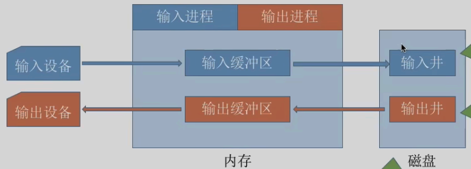
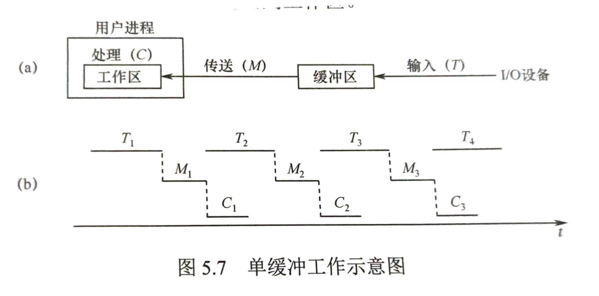
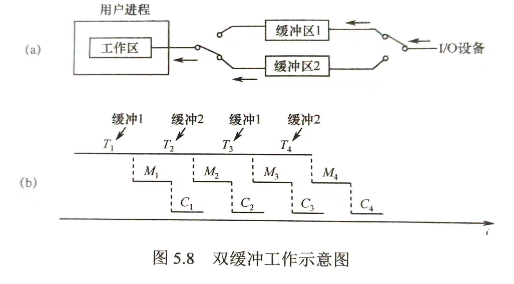
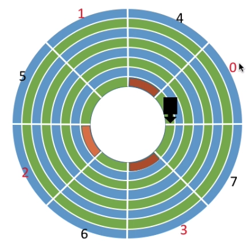
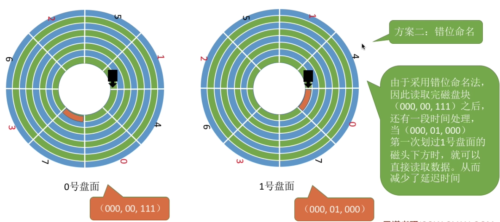

# 第五章 设备管理 
## I/O 设备基本概念
### I/O 设备分类
按信息交换的单位分类
- **块设备**
	- 传输快、**可寻址**
- **字符设备**
	- 传输慢、**不可寻址**，常采用**中断驱动方式**

按共享属性分类：
- **独占设备**：任一时刻仅允许一个进程占用；一旦分配即被独占；典型的设备**多为低速设备**
- **共享设备**：允许多个进程在逻辑上并发访问，多进程分时交替使用；**必须是可寻址、可随时访问的设备**
- **虚拟设备**：通过 **SPOOLing** 技术，将独占设备改造为多个逻辑设备，使得多个进程能并发使用；**实现独占设备的逻辑共享**

### I/O 控制器
[计算机组成原理：I/O 接口](../02.计算机组成原理/笔记/7_第七章%20输入输出系统.md)

### I/O 控制方式
[计算机组成原理：I/O 控制方式](../02.计算机组成原理/笔记/7_第七章%20输入输出系统.md)

### I/O 软件层次结构
(自顶向下)
1. **用户层软件**：实现了与用户交互的接口，用户可直接使用该层提供的、与 I/O 操作相关的<mark style="background:#fff88f">库函数</mark>对设备进行操作；而进一步，用户层软件将用户请求翻译成格式化的 I/O 请求，并通过“<mark style="background:#fff88f">系统调用</mark>”请求操作系统内核的服务
2. **设备独立/无关性软件**：与设备的硬件特性无关的功能几乎都在该层实现
	1. 向上层提供<mark style="background:#fff88f">统一的调用接口</mark>，即系统调用
	2. <mark style="background:#fff88f">设备保护</mark>：类似于文件保护，设备被视作一种特殊的文件，不同用户对设备的访问权限也不同
	3. 差错处理：即错误处理
	4. <mark style="background:#fff88f">设备的分配与回收</mark>
	5. <mark style="background:#fff88f">数据缓冲区管理</mark>：通过缓存技术屏蔽数据交换单位大小和传输速度的差异
	6. <mark style="background:#fff88f">建立逻辑设备名(用户感知)到物理设备名的映射关系，并根据设备分类选择调用相应的驱动程序</mark>：通过 <mark style="background:#40a9ff">逻辑设备表(LUT)</mark> 来确定逻辑设备对应的物理设备，并找到该设备对应的设备驱动程序(<mark style="background:#d3f8b6">不同的设备具有不同的硬件特性，CPU 需执行厂家提供的驱动程序的指令来完成设备的控制与管理</mark>)
3. **设备驱动程序**：<mark style="background:#fff88f">主要负责对硬件的具体控制</mark>，将上层发出的命令转换为特定设备可识别的操作
	1. <mark style="background:#fff88f">将抽象请求转换为具体的操作</mark>：将逻辑操作转为物理操作，比如逻辑地址向物理地址的转换
	2. 校验请求的合法性
	3. 检查设备状态
	4. 传递参数
	5. 启动设备并处理后续
	6. 其他：设备的初始化、状态维护、错误处理、<mark style="background:#fff88f">与中断处理的配合</mark>
4. **中断处理程序**：当 I/O 任务完成后，I/O 控制器会发送中断信号，系统会根据中断信号找到相应的中断处理程序并执行
5. **硬件**

>[!important] 
>1. 设备独立性软件、设备驱动程序、中断处理程序 属于操作系统内核部分
>2. <mark style="background:#40a9ff">设备驱动程序、中断处理程序</mark> 可以<mark style="background:#40a9ff">和硬件直接交互</mark>，而用户层软件、设备独立性软件 则不会和硬件直接交互
>3. <mark style="background:#fff88f">直接涉及到硬件具体细节、且与中断无关的操作</mark>肯定是在 <mark style="background:#fff88f">设备驱动程序层</mark> 完成的；<mark style="background:#fff88f">没有涉及硬件、对各种设备都需要进行的管理工作</mark>都是在 <mark style="background:#fff88f">设备独立性软件层</mark> 完成的

#### ~~输入/输出应用程序接口~~
位置：介于用户层软件与设备独立软件之间
类型：
1. **字符设备接口**
	1. 字符设备：<mark style="background:#fff88f">不可寻址，每次仅读 1 个字符</mark>
	2. 使用 get/put 系统调用向字符设备读/写 1 个字符
2. **块设备接口**：
	1. 块设备：<mark style="background:#fff88f">可寻址，每次读写 1 个块</mark>
	2. 使用 read/write 系统调用向块设备的读写指针位置读/写多个字符；使用 seek 系统调用修改读/写指针位置
3. **网络设备接口**：
	1. 网络设备接口：又称网络套接字接口，<mark style="background:#fff88f">确定数据交给“谁”/某个进程处理</mark>
	2. socket 系统调用：创建一个网络套接字，即在内核空间申请空间并返回文件描述符；需指明网络协议
	3. bind 系统调用：将套接字绑定在某个本地端口
	4. connect 系统调用：将套接字连接到远程地址
	5. read/write 系统调用：从套接字读/写数据

>[!addition] 阻塞与非阻塞 I/O
>1. **阻塞 I/O**：应用程序发出 I/O 系统调用，进程需转为阻塞态等待
>2. **非阻塞 I/O**：应用程序发出 I/O 系统调用，系统调用可迅速返回，进程无需转为阻塞态等待

#### 设备驱动程序接口
位置：介于设备独立软件与驱动程序之间
作用：<mark style="background:#fff88f">规定设备驱动程序的接口标准</mark>，各个制造厂商必须按照要求开发设备驱动程序

## I/O 核心子系统
组成与要实现的主要功能：
- 设备独立性软件
	- I/O 调度、设备保护、设备分配与回收
- 设备驱动程序
- 中断处理程序

以及属于用户软件层的 假脱机技术(SPOOLing 技术)

### 假脱机技术/SPOOLing
#### 脱机技术
早期计算机仍为人工输入阶段，I/O 与 CPU 之间存在巨大的速度差异，为<mark style="background:#40a9ff">缓解速度差异</mark>在批处理阶段引入脱机技术，即脱离主机的控制进行的输入/输出操作

批处理阶段的脱机技术的组成为：磁带(用于数据的输入/输出)、外围控制机(用于控制数据的输入/输出)

#### 假脱机技术
假脱机技术，即使用软件的方式模拟脱机技术

组成：
1. **输入井**：模拟脱机技术输入时的**磁带**，用于收容 **I/O 设备输入的数据**；位于**磁盘**上
2. **输出井**：模拟脱机技术输出时的**磁带**，用于收容 **用户进程输出的数据**；位于**磁盘**上
3. **输入进程/输出进程**：模拟脱机技术的**外围控制机**
4. **输入/输出缓冲区**：暂存从输入设备输入的数据/从输出井送出的数据；位于**内存**
5. **井管理程序**

注意：
1. 假脱机技术，<mark style="background:#40a9ff">必须要有多道程序技术的支持</mark>
2. 假脱机技术实现了 一台物理设备虚拟成逻辑上的多台设备，<mark style="background:#40a9ff">将独占式设备改造成共享设备</mark>
3. 假脱机技术 <mark style="background:#40a9ff">加快了作业的执行速度</mark>(进程将作业内容提交后即可继续；I/O 设备无需等待进程的输出，从输入井获取数据即可执行作业)
4. 原理：<mark style="background:#fff88f">预输入缓输出</mark>

#### 案例：共享打印机的实现
当多个用户进程提出输出打印的请求时，系统会<mark style="background:#fff88f">答应它们的请求</mark>，但是并不是真正把打印机分配给他们，而是由假脱机管理进程为每个进程做两件事：
1. 在<mark style="background:#40a9ff">磁盘</mark>输出井中为进程<mark style="background:#fff88f">申请一个空闲缓冲区</mark>（也就是说，该缓冲区是在磁盘上的），并<mark style="background:#fff88f">将要打印的数据送入其中</mark>；
2. 为用户进程<mark style="background:#fff88f">申请一张空白的打印请求表，并将用户的打印请求填入表中</mark>（即用于说明用户的打印数据存放位置等信息），再<mark style="background:#fff88f">将该表挂到假脱机文件队列上</mark>。

当打印机空闲时，输出进程会从文件队列的队头取出一张打印请求表，并根据表中的要求将要打印的数据从输出井传送到输出缓冲区，再输出到打印机进行打印。用这种方式可依次处理完全部的打印任务

### 设备的分配(与回收)
#### 需考虑的因素
1. 设备的<mark style="background:#40a9ff">固有属性</mark>：<mark style="background:#d3f8b6">独占设备、共享设备、虚拟设备</mark>
2. 设备<mark style="background:#40a9ff">分配算法</mark>：主要为 **先来先服务**、**最高优先级算法**
3. 设备分配中的<mark style="background:#40a9ff">安全性</mark>：
	1. **安全分配方式**：<mark style="background:#fff88f">为进程分配一个设备后就将该进程阻塞</mark>，本次 I/O 完成后才将该进程唤醒；即一个时段内每个进程只能使用一个设备
		1. 优点：<mark style="background:#40a9ff">破坏了“请求和保持条件”，不会死锁</mark>
		2. 缺点：<mark style="background:#40a9ff">对于一个进程来说，CPU 和 I/O 设备只能<mark style="background:#d3f8b6">串行</mark>工作</mark>
	2. **不安全分配方式**：进程发出 I/O 请求后，<mark style="background:#fff88f">系统为其分配 I/O 设备，进程可继续执行</mark>，之后<mark style="background:#fff88f">还可以发出新的 I/O 请求</mark>；<mark style="background:#fff88f">只有某个 I/O 请求得不到满足后才将进程阻塞</mark>。一个进程同时可以使用多个设备
		1. 优点：<mark style="background:#40a9ff">进程的计算任务与 I/O 任务可以<mark style="background:#d3f8b6">并行</mark>处理</mark>，使进程迅速推进
		2. 缺点：<mark style="background:#40a9ff">可能发生死锁</mark>(可采取 死锁避免/死锁的检测和解除 等措施)

>[!addition] 静态分配与动态分配
>1. **静态分配**：<mark style="background:#40a9ff">进程运行前为其分配全部所需资源</mark>，运行结束后归还资源 -> <mark style="background:#d3f8b6">破坏了“请求和保持”条件</mark>，不会发生死锁
>2. **动态分配**：进程运行过程中动态申请设备资源
>3. <mark style="background:#fff88f">独占设备</mark>采用 **静态分配**，<mark style="background:#fff88f">共享设备</mark>采用 **动态分配**

#### 描述设备管理的数据结构
##### 设备控制表 / DCT
作用：系统为每个设备配置一张 DCT，用于记录设备情况
组成：
1. ~~设备类型~~
2. ~~设备标识符：即物理设备名，系统中每个设备的物理设备名 唯一~~
3. ~~设备状态~~
4. <mark style="background:#fff88f">指向控制器表的指针</mark>：每个设备由一个控制器管理，该指针可找到对应控制器的信息
5. ~~重复执行次数或时间：当重复执行多次 I/O 操作后仍不成功，才认为 I/O 失败~~
6. ~~设备队列的队首指针：指向正在等待该设别的进程队列~~

##### 控制器控制表 / COCT
作用：每个设备控制器都会对应一张 COCT，操作系统根据 COCT 的信息对控制器进行操作和管理
组成：
1. ~~控制器标识符：唯一 ID~~
2. ~~控制器状态~~
3. <mark style="background:#fff88f">指向通道表的指针</mark>：每个控制器由一个通道控制，该指针可找到相应通道的信息
4. ~~控制器队列的队首指针 AND 队尾指针：指向等待进程队列~~

##### 通道控制表 / CHCT
作用：每个通道都会对应一张 CHCT，操作系统根据 CHCT 的信息对通道进行操作和管理
组成：
1. ~~通道标识符~~
2. ~~通道状态~~
3. ~~与通道连接的控制器表首址~~
4. ~~通道队列的队首指针 AND 队尾指针~~

##### 系统设备表 / SDT
作用：记录了系统中所有设备的情况，每个设备对应一个表项
组成：
1. ~~设备类型~~
2. ~~设备标识符~~
3. <mark style="background:#fff88f">设备控制表指针</mark>
4. ~~驱动程序入口~~

#### 设备分配的步骤
1. 根据进程请求的物理设备名查找$SDT$（注：物理设备名是进程请求分配设备时提供的参数）
2. 根据$SDT$找到$DCT$，若设备忙碌则将进程$PCB$挂到设备等待队列中，不忙碌则将设备分配给进程。
3. 根据$DCT$找到$COCT$，若控制器忙碌则将进程$PCB$挂到控制器等待队列中，不忙碌则将控制器分配给进程。
4. 根据$COCT$找到$CHCT$，若通道忙碌则将进程$PCB$挂到通道等待队列中，不忙碌则将通道分配给进程。

>1. 系统内可以存在多个通道，通道也可以对应多个控制器，控制器也可以对应多个设备，则上述关系可以采用树的形式表示；那么设备分配的过程可以认为 从树叶(设备)出发，逐层向树根(通道)申请使用
>2. 只有设备、控制器、通道都分配成功时，此次设备分配才算成功

上述分配方式存在的问题：
1. **编程不友好**：用户编程时<mark style="background:#fff88f">必须使用“物理设备名”</mark>，底层细节对用户不透明，不方便编程
2. **程序可移植性差**：硬件更换设备名，则程序无法运行
3. **设备资源利用率低**：若进程请求的物理设备正在忙碌，则即使系统中还有同类型的设备，进程也必须阻塞等待

解决方案：<mark style="background:#fff88f">建立逻辑设备名与物理设备名的映射机制，即增加逻辑设备表(LUT)</mark>，用户编程时只需提供逻辑设备名或者说<mark style="background:#40a9ff">设备类型</mark>，系统根据设备类型进行设备分配，仅当所有同类型的设备处于忙碌阶段时，才阻塞该进程

### 缓冲区管理
#### 缓冲区基本概念与作用
缓冲区，即存储区域
- 使用硬件作为缓冲区，成本高、容量小
- 使用内存作为缓冲区，被广泛使用

作用：
1. 缓和 CPU 和 I/O 设备之间<mark style="background:#40a9ff">速度不匹配的矛盾</mark>
2. <mark style="background:#40a9ff">减少对 CPU 的中断频率</mark>，放宽对 CPU 中断响应时间的限制
3. <mark style="background:#40a9ff">解决数据颗粒度不匹配的问题</mark>：如 CPU 与 字符型设备之间的数据交换
4. <mark style="background:#40a9ff">提高 CPU 与 I/O 设备之间的并行性</mark>

#### 缓冲区管理策略
缓冲区均存在于 主存 中

>[!caution]- 缓冲区的使用规则
>1. 当缓冲区数据非空时，不能向缓冲区冲入数据，只能从缓冲区取数据
>2. 当缓冲区为空时，可以向缓冲区冲入数据，但必须将缓冲区充满后，才可以将数据从缓冲区取走

不妨设 块设备向缓冲区传输一块数据的耗时为 T，缓冲区向工作区传送一块数据的耗时为 M，CPU 处理工作区一块数据的耗时为 C

##### 单缓冲
分配大小：在主存中为其仅仅分配一个缓冲区(默认一个缓冲区的大小即为一个块)

平均处理一块数据的时间：<mark style="background:#40a9ff">Max(T,C)+M</mark>

##### 双缓冲
分配大小：在主存中为其分配两个缓冲区

平均处理一块数据的时间：<mark style="background:#40a9ff">Max(T,C+M)</mark>

>[!important] 数据块处理时间的计算
>1. 单缓冲区：平均处理时间为 MAX(T,C)+M
>2. 双缓冲区：平均处理时间为 MAX(T,M+C)
>3. 该时间为 当 n(处理数据块的块数)趋于无穷大时的<mark style="background:#fff88f">极限值</mark>，并不能用于直接计算 n 为某确切值时的总处理时间；应结合上述的 <mark style="background:#fff88f">时间甘特图</mark> 来进行计算
>4. 单数据块的平均处理时间的计算的一般方法：
>	1. 假定一个初始状态，分析下次达到相同状态需要的时间，该时间即为处理一块数据平均所需时间；
>	2. 并尝试绘制时间甘特图辅助分析

>[!addition] 单缓冲/双缓冲在通信中的应用
>1. 单缓冲可以实现两个主机之间的单向数据传输
>2. 双缓冲可以实现两个主机之间的双向数据传输

##### 循环缓冲区(了解原理即可)
组织形式：将多个大小相等的缓冲区链接成一个循环队列，并保留队列的队首、队尾指针

##### 缓冲池(了解即可)
组织方式：由系统中共用的缓冲区组成；可分为 空缓冲队列、载满输入数据的缓冲队列、载满输出数据的缓冲队列

>[!caution] 缓冲区与中断服务程序中的数据流
> | 模式 | 数据流向（读操作） | 是否经$CPU$寄存器 | 数据终点（$ISR$内） |
> | ---- | ---- | ---- | ---- |
> | 程序直接控制模式 | 设备端口 $\rightarrow$ $CPU$寄存器 $\rightarrow$ 内核缓冲区 | 是（逐字搬运） | 内核缓冲区 |
> | $DMA$模式 | 设备缓存 $\rightarrow$ 系统总线 $\rightarrow$ 内核缓冲区 | 否（硬件直传） | 内核缓冲区（$DMA$预留区） |
> | 中断服务子程序结束后，中断返回前 | 内核缓冲区 $\rightarrow$ $CPU$寄存器 $\rightarrow$ 用户进程内存 | 是（一次拷贝） | 用户态应用程序 |

## 磁盘/温彻斯特盘
### 磁盘初识

### 磁盘调度算法
#### (一次)读写操作的平均耗时
[计算机组成原理：磁盘平均访存时间](../02.计算机组成原理/笔记/3_第三章%20存储系统.md)

#### 磁盘调度算法
##### 先来先服务算法 / FCFS
算法思想：根据进程<mark style="background:#40a9ff">请求访问磁盘的先后顺序</mark>进行调度

优点：公平；<mark style="background:#fff88f">若请求访问的磁道较集中，则算法性能较好</mark>
缺点：若有大量进程竞争使用磁盘，且<mark style="background:#fff88f">请求访问的磁道较分散，则算法性能较差，寻道时间长</mark>

##### 最短寻找时间优先算法 / SSTF
算法思想：<mark style="background:#40a9ff">优先处理与当前磁头最近的磁道</mark>；可以保证每次的寻道时间最短，但不能保证总体寻道时间最短

优点：性能较好，平均寻道时间短
缺点：可能产生 <mark style="background:#fff88f">“饥饿”</mark> 现象(磁头可能在一个小区域内来回移动)

##### 扫描算法/电梯算法/ SCAN --“撞到南墙才回头”
算法思想：只有磁头移动到最外侧磁道时才能向内移动，移动到最内侧磁道时才能向外移动

>[!caution] <mark style="background:#40a9ff">磁头必须移动到最外/内侧磁道才可改变方向</mark>，并不是移动到 **当前最外/内侧请求**磁道

优点：性能较好，<mark style="background:#fff88f">平均寻道时间较短，不会产生 “饥饿” 现象</mark>
缺点：
1. <mark style="background:#fff88f">只有移动到最外/内侧的磁道上时磁头才可以改变方向</mark>
2. <mark style="background:#fff88f">对于各个位置磁道的响应频率不平均，越接近最外/内侧的磁道响应频率越高</mark>

##### LOOK 算法
算法思想：<mark style="background:#40a9ff">若在磁头移动方向上已经没有其他的请求，磁头可以立即改变移动方向</mark> \[解决 SCAN 算法的第一个缺点\]

优点：较 SCAN 算法，不必每次都移动到最外/内侧才改变磁头方向，使得寻道时间进一步缩短

##### 循环扫描算法 / C-SCAN
算法思想：<mark style="background:#40a9ff">只有磁头朝某个特定方向移动时才处理磁道访问请求，而返回时直接快速移动至起始端而不处理任何请求</mark> \[解决 SCAN 算法的第二个缺点\]

优点：较 SCAN 算法，<mark style="background:#fff88f">对于各个位置磁道的响应频率很平均</mark>
缺点：与 SCAN 算法类似，<mark style="background:#fff88f">仅当磁头移动到最外/内侧时才改变磁头的移动方向</mark>；并且<mark style="background:#fff88f">磁头返回时需要返回至最内/外侧磁道</mark>，其实只需将磁头返回至**最内/外请求**磁道位置即可

##### C-LOOK 算法
算法思想：<mark style="background:#40a9ff">若磁头移动方向上已经没有其他请求，则磁头可以立即返回，并且磁头只需要返回到有磁道请求的位置即可</mark>

优点：较 C-SCAN 算法，不必每次都移动到最外/内侧磁道才改变磁头方向，使得寻道时间进一步缩短

>[!attention] 注意审题
>默认情况下，考题中的 SCAN 算法为 LOOK 算法，C-SCAN 算法为 C-LOOK 算法，即<mark style="background:#40a9ff">磁头不必移动到最内/外侧磁道才改变磁头移动方向</mark>

>[!caution] 磁头臂黏着
>现象：系统总是访问磁盘上的某个磁道而不响应对其他磁道的访问请求
>原因：算法贪心，总是优先满足距离当前磁头最近的磁道的访问请求
>上述磁盘调度中，<mark style="background:#40a9ff">FCFS 算法不会出现磁头臂黏着现象</mark>

#### 减少延迟时间的方法
##### 交替编号
磁头读取扇区的方式：磁头当读取完当前扇区的内容后，并不会立即读取相邻扇区的内容，而是进行数据处理等操作；但是磁盘一直处于旋转的状态，故若连续的逻辑扇区对应的物理扇区也是连续的，那么会错过下一扇区

<mark style="background:#40a9ff">采用交替编号的策略，即让逻辑上相邻的扇区在物理上有一定的间隔，可以使读取连续的逻辑扇区所需的延迟时间更小</mark>
<mark style="background:#fff88f">此时读取盘面上的一个柱面的需要 磁盘旋转两周</mark>

##### 磁盘地址结构的设计
磁盘物理地址采用 (柱面号，盘面号，扇区号) 而不使用 (盘面号，柱面号，扇区号) 的原因：
读取地址连续的磁盘块时，采用 (盘面号，柱面号，扇区号) 时，即需读取同一个盘面上的相邻柱面的内容时需要移动磁头；而<mark style="background:#40a9ff">采用 (柱面号，盘面号，扇区号) 的地址结构</mark>，优先读取同一个柱面上的相邻盘面的内容，<mark style="background:#40a9ff">可以减少磁头移动消耗的时间</mark>

##### 错位命名
读取连续磁盘块时，可能存在 <mark style="background:#fff88f">待读取的磁盘块处于上下两个不同盘面</mark> 的情况

同样是由于磁头读取完一个扇区的内容并不会立即读取相邻的扇区的内容的原因，若 k 盘面编号 i 的扇区正对 k+1 盘面编号 i 的扇区，那么读取完 k 盘面的末扇区后会错过读取 k+1 盘面的初扇区

<mark style="background:#40a9ff">采用错位命名的方法</mark>，即 k 盘面编号 i 的扇区并不正对 k+1 盘面编号 i 的扇区，来减少延迟时间

### 磁盘管理
[操作系统：磁盘的初始化、引导块、坏块的管理](4_第四章%20文件管理.md)

## 固态硬盘 SSD
[计算机组成原理：固态硬盘](../02.计算机组成原理/笔记/3_第三章%20存储系统.md)

>[!important] 提高磁盘 I/O 的方法
>1. <mark style="background:#fff88f">采用磁盘高速缓存</mark>
>2. <mark style="background:#fff88f">调整磁盘请求顺序</mark>
>3. <mark style="background:#fff88f">提前读/预读</mark>
>4. <mark style="background:#fff88f">延迟写</mark>
>5. <mark style="background:#fff88f">优化物理块的分布</mark>
>6. <mark style="background:#fff88f">虚拟盘</mark>：指采用内存空间仿真磁盘；与磁盘高速缓存的区别是：虚拟盘中的内容完全由用户决定，而磁盘高速缓存的内容则由操作系统透明管理
>7. 采用磁盘阵列 RAID

