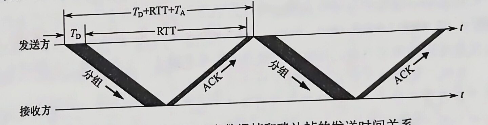
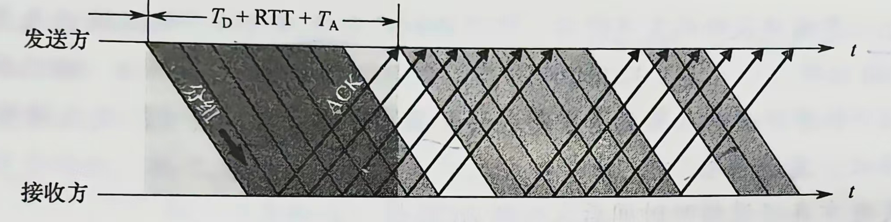

# 第三章 数据链路层
## 数据链路层的功能
### 封装成帧与透明传输
1. <mark style="background:#40a9ff">封装成帧</mark>：指在数据前后分别添加首部和尾部
	1. 首部和尾部包含控制信息，核心作用是 **帧定界**
2. <mark style="background:#40a9ff">透明传输</mark>是数据链路层的重要特性，此处“透明”是指：<mark style="background:#fff88f">即使数据中恰好出现与帧定界符相同的比特组合，也不会被误判为帧边界</mark>

### 流量控制
<mark style="background:#40a9ff">流量控制</mark>旨在限制发送方的发送速率，使其不得超过接收方的接收能力

>在 OSI 模型中，流量控制由<mark style="background:#fff88f">数据链路层</mark>实现，用于调节<mark style="background:#fff88f">相邻结点</mark>之间的流量；
>在 TCP/IP 模型中，该功能主要由<mark style="background:#fff88f">传输层</mark>实现，负责<mark style="background:#fff88f">端到端</mark>的流量控制

### 差错控制与可靠传输
### 介质访问

## ~~组帧~~
组帧需解决的问题：<mark style="background:#fff88f">帧定界、帧同步、透明传输</mark>等

### 字符计数法
1. 规则：<mark style="background:#d3f8b6">在帧首部设置一个计数字段</mark>，用于记录该帧包含的总字节数(包括计数字段自身的 1B)
2. 主要缺陷：<mark style="background:#fff88f">当计数字段在传输过程中出错时，接收方将无法识别帧的边界，导致双方失去同步</mark>

### 字节填充法
1. 规则：<mark style="background:#d3f8b6">通过特定控制字符实现帧定界</mark>
	1. 特定控制符：SOH 表示帧的起始，EOT 表示帧的结束
	2. 帧内部出现 SOH/EOT：<mark style="background:#fff88f">在帧内部的 SOH/EOT 前插入 ESC 字符</mark>
	3. 帧内部出现 ESC ：<mark style="background:#fff88f">在帧内部的 ESC 前插入 ESC 字符</mark>

### 零比特填充法
1. 规则：允许帧包含任意数量的比特，并<mark style="background:#d3f8b6">用固定比特串 `01111110` 作为帧的起始和结束标示</mark>
2. 发送前数据处理：<mark style="background:#fff88f">扫描数据，每出现 5 个连续的 “1” 则在其后插入一个 “0”，确保数据字段中不会出现 6 个连续的 “1”</mark>
3. 接收后数据还原：<mark style="background:#fff88f">每收到 5 个连续的 “1” 就删除其后的 “0”</mark>

### 违规编码法
1. 规则：<mark style="background:#d3f8b6">利用物理层编码的冗余特性实现帧定界</mark>；比如，<mark style="background:#fff88f">曼彻斯特编码中，“高-高”、“低-低”电平对在数据比特中是违规的/未被使用的</mark>，因此可以采用该些违规编码序列来识别帧的起始和结束
2. 优点：<mark style="background:#fff88f">无需任何填充技术即可实现透明传输，但仅适用于采用冗余编码的特殊编码环境</mark>

## 差错控制
### 基本概念
码距：指两个码字在对应位上取值不同的比特数量
1. 计算码距的方法：对两个位串进行 <mark style="background:#40a9ff">异或</mark> 运算，**结果中 1 的个数为 码距**
2. 任意两个有效码之间的**码距最小值**称为 该编码集的码距

编码方案的**检错能力 d**和**纠错能力 c**与**码距 l** 的关系：$$l=d+c+1,\quad且\quad d\ge c$$
即<mark style="background:#40a9ff">码距 l 越大，其检错的位数 d 越大，纠错的位数 c 越大，且纠错能力恒不超过检错能力(纠错必先检错)</mark>
其他重要结论：
1. 为<mark style="background:#fff88f">检测</mark> d 位错误，编码方案的码距至少应为 <mark style="background:#fff88f">d+1</mark>
2. 为<mark style="background:#fff88f">纠错</mark> c 位错误，编码方案的码距至少应为 <mark style="background:#fff88f">2c+1</mark>

### 检错编码
检错编码均采用**冗余编码**技术，核心思想是：在有效数据发送前，按照特定规则附加若干冗余位，构成一个符合预设编码规则的码字后再发送

#### 奇偶校验码
最基本的检错码
1. 规则：
	1. 奇校验码：附加校验位(1 位)后，码字中的 “1” 总数为奇数
	2. 偶校验码：附加校验位(1 位)后，码字中的 “1” 总数为偶数
		- 快速求解偶校验码：全比特进行异或运算，便于使用硬件实现
2. 检错/纠错能力：<mark style="background:#40a9ff">只能检测 奇数位 错误，无法发现偶数位错误，更不能定位错误位置</mark>

#### <mark style="background:#ff4d4f">循环冗余校验码 / CRC</mark>
**数据链路层广泛应用**的一种高效检错技术，具有检错能力强、实现简单、硬件支持成熟等优势
1. 规则：将待发送的数据视为一个二进制多项式，通过与一个预定义的生成多项式 G(x) 进行特定运算，生成一段冗余校验信息/FCS，并将其附加在原始数据后面；接收方则使用相同的 G(x) 对整个接收的帧进行校验，从而判断传输过程中是否发生差错
2. 具体过程：
	1. <mark style="background:#40a9ff">约定生成多项式 G(x)</mark>：双方事先约定一个 `r+1` 阶的生成多项式 G(x)，其对应的二进制系数串长度为 r+1 位，且最高位与最低位必须为 1
	2. <mark style="background:#40a9ff">发送方生成 FSC</mark>：
		1. 假设待发送的数据长度为 m 位，记作位串 M；在 M 后添加 `r` 个 0，得到 m+r 的扩展串；
		2. 用 G(x) 对应的位串对该扩展串进行 <mark style="background:#40a9ff">模 2 除法(不进位的二进制除法，减法操作由异或运算实现)</mark>；
		3. 得到的<mark style="background:#fff88f">余数(共 `r` 位，不足时补前导零)</mark>即为 FSC；将扩展位末尾的 r 个 0 替换为 FSC，形成最后的发送帧 ($M*2^r+FSC$)
	3. <mark style="background:#40a9ff">接收方校验</mark>：用相同的 G(x) 对收到的帧进行 模 2 除法：若余数为 0，则认为传输过程中无差错；若余数不为 0，则认为出现差错
3. 检错/纠错能力：具备纠正 1 bit 错误的能力(<mark style="background:#40a9ff">当 $2^r>m+r+1$ 时，CRC 校验码具有纠正 1 比特错误的能力</mark>)，但数据链路层仅仅使用到 CRC 的检错能力

### ~~纠错码 -- 海明码~~
最常见的纠错编码是海明码。
基本原理：是在原始信息位中插入若干检验位，构成具有检错与纠错能力的海明码。
每个检验位对应一个校验组（通常采用偶校验），用于校验海明码中的若干信息位。
通过将每个信息位分配到多个检验组中，当某一位出错时，会引发其所属的多个检验组同时出现校验错误，从而不仅能检测出错误，还能确定错误位置，实现单比特纠错。

下面以信息位 $1010$ 为例，详细介绍海明码的构造与纠错过程。

#### 确定海明码的总位数
设信息位有 $n$ 位，检验位有 $k$ 位。$k$ 个检验位可表示 $2^k$ 种状态；信息位和检验位共有 $n+k$ 种单比特出错的位置，此外还需 $1$ 种表示无错状态。因此，$n$ 与 $k$ 需满足
$$
2^k \ge n + k + 1
$$

本例中 $n=4$，尝试 $k=3$：$2^3 \ge 4 + 3 + 1$ 成立。故取 $k=3$，海明码共 $n+k=7$ 位。记信息位为 $D_4D_3D_2D_1=1010$，检验位为 $P_3P_2P_1$，海明码位号从右至左依次为 $H_7H_6H_5H_4H_3H_2H_1$。

#### 确定检验位的分布
规定：检验位 $P_i$ 放在海明位号为 $2^{i-1}$ 的位置上，其余各位放置信息位，因此：
- $P_1$ 的海明码位号为 $2^{i-1}=2^0=1$，即 $H_1$ 为 $P_1$。
- $P_2$ 的海明码位号为 $2^{i-1}=2^1=2$，即 $H_2$ 为 $P_2$。
- $P_3$ 的海明码位号为 $2^{i-1}=2^2=4$，即 $H_4$ 为 $P_3$。

将信息位按原顺序放在剩余位置，得到海明码的分布如下：

| $H_7$ | $H_6$ | $H_5$ | $H_4$ | $H_3$ | $H_2$ | $H_1$ |
|-------|-------|-------|-------|-------|-------|-------|
| $D_4$ | $D_3$ | $D_2$ | $P_3$ | $D_1$ | $P_2$ | $P_1$ |

#### 分组以形成检验关系
每个信息位由多个检验位共同校验，需满足条件：信息位所在位号 = 其所参与的所有检验位位号之和。另外，检验位不需要再被检验。分组形成的检验关系如下。

- $D_1$ 位于 $H_3$，由 $H_2H_1(P_2P_1)$ 检验：因为 $3(011) = 2 + 1$
- $D_2$ 位于 $H_5$，由 $H_4H_1(P_3P_1)$ 检验：因为 $5(101) = 4 + 1$
- $D_3$ 位于 $H_6$，由 $H_4H_2(P_3P_2)$ 检验：因为 $6(110) = 4 + 2$
- $D_4$ 位于 $H_7$，由 $H_4H_2H_1(P_3P_2P_1)$ 检验：因为 $7(111) = 4 + 2 + 1$

#### 检验位取值
检验位 $P_i$ 的值为其对应校验组中所有位（含信息位）求异或（偶校验结果）。
根据（3）中的分组有
$$
\begin{align*}
P_1 \text{ 校验 } D_1,D_2,D_4 &\rightarrow P_1 = D_1 \oplus D_2 \oplus D_4 = 0 \oplus 1 \oplus 1 = 0 \\
P_2 \text{ 校验 } D_1,D_3,D_4 &\rightarrow P_2 = D_1 \oplus D_3 \oplus D_4 = 0 \oplus 0 \oplus 1 = 1 \\
P_3 \text{ 校验 } D_2,D_3,D_4 &\rightarrow P_3 = D_2 \oplus D_3 \oplus D_4 = 1 \oplus 0 \oplus 1 = 0
\end{align*}
$$

因此，$1010$ 对应的海明码为 $101\underline{0}\underline{1}\underline{0}$（下划线为检验位，其余为信息位）。

#### 海明码的检验原理
每个检验组分别利用检验位和参与形成该检验位的信息位进行奇偶检验查，构成 $k$ 个检验方程：
$$
\begin{align*}
S_1 &= P_1 \oplus D_1 \oplus D_2 \oplus D_4 \\
S_2 &= P_2 \oplus D_1 \oplus D_3 \oplus D_4 \\
S_3 &= P_3 \oplus D_2 \oplus D_3 \oplus D_4
\end{align*}
$$

若 $S_3S_2S_1$ 的值为“$000$”，表示无错误；否则表示出错，且这个数就是错误位的位号，如 $S_3S_2S_1=001$，表示第 $1$ 位出错，即 $H_1$ 出错，直接将其取反即可达到纠错的目的。

海明码的优势在于：通过少量冗余检验位，可实现单比特错误的自动定位与纠正。

## 流量控制与可靠传输机制
### 流量控制
向发送方反馈接收方的接收窗口大小

### 可靠传输机制
1. <mark style="background:#40a9ff">确认</mark>：接收方每成功收到一个帧，就向发送方返回一个确认帧，表明该帧已被正确接收
2. <mark style="background:#40a9ff">超时重传</mark>：发送方在发送一个数据帧后启动一个计时器，<mark style="background:#d3f8b6">若在规定时间内未收到对应的确认帧，则认为该帧可能丢失或出错，从而自动重传该帧</mark>，直至成功收到确认为止
3. <mark style="background:#40a9ff">编号</mark>：数据帧和确认帧都必须编号，避免重复、失序、丢失

#### 停止-等待协议/ S-W 与 单帧滑动窗口
1. 规则：在停止-等待协议中，<mark style="background:#40a9ff">发送方每次只能发送一个数据帧，只有在收到接收方对该帧的确认帧后，才能发送下一个帧</mark>。
2. 差错分析：
	1. 数据帧出错或丢失：
		1. 差错：
			1. 接收方检测到数据帧存在差错时，直接丢弃该帧；
			2. 数据帧在传输途中丢失时，接收方不会收到任何信息
		2. 方案：为应对这两种情况，发送方需要配备<mark style="background:#40a9ff">一个**计时器**</mark>，每发送完一个数据帧，发送方即启动该计时器；<mark style="background:#d3f8b6">计时器超时仍未收到对应的确认帧时，认为该帧可能已丢失或出错，于是自动重传该帧</mark>。该过程重复进行，直至该帧被正确接收并返回确认帧为止。
	2. 确认帧出错或丢失：
		- 即使接收方已成功收到正确的数据帧，若其返回的确认帧在传输中出错或丢失，则发送方仍将因未收到确认而触发超时重传。这时，接收方会再次收到一个重复的数据帧。为避免重复处理，<mark style="background:#d3f8b6">接收方会丢弃该重复帧，并重新发送对应的确认帧</mark>。
	- 为支持超时重传和重复帧识别，发送方和接收方均需设置**帧缓冲区**：<mark style="background:#fff88f">发送方</mark>发送数据帧后，必须在发送缓存中保留该帧的副本，<mark style="background:#fff88f">以便需要时重传</mark>；仅在收到对应的确认帧后，方可清除该副本。<mark style="background:#fff88f">接收方</mark>也需记录最近成功接收的帧序号，以判断新到的帧<mark style="background:#fff88f">是否是重复的帧</mark>。
3. 窗口大小：
	1. <mark style="background:#fff88f">发送窗口大小为 1</mark>
	2. <mark style="background:#fff88f">接收窗口大小为 1</mark>，每次仅发送一帧并等待确认，因此只需确保相邻发送的帧具有不同的序号即可区分新帧与重传帧。因此，**仅需 1 比特序号空间**就已足够：数据帧交替使用序号 0 和 1
4. 缺点：停止-等待协议的<mark style="background:#fff88f">信道利用率很低</mark>

#### 多帧滑动窗口与后退 N 帧协议 / GBN
1. 规则：在后退 N 帧协议中，发送方可在未收到确认帧的情况下，连续发送多个序号落在发送窗口内的数据帧。
	- 具体过程：<mark style="background:#40a9ff">若某个已发送的数据帧因超时未收到确认而判定为丢失或出错，则发送方不仅需要重传该帧，还需重传其后所有已发送但未被确认的帧</mark>。
	- 按序接收：<mark style="background:#40a9ff">任何失序到达的帧都将被丢弃</mark>，即某帧出错或丢失时，其后所有正确到达的帧即使无误，也会被丢弃
2. 累积确认机制：
	- 发送方通常<mark style="background:#40a9ff">仅为**最早未确认的帧维护一个超时计时器**</mark>；当该帧被确认后，计时器移至下一个未确认帧。由于连续发送了多个帧，<mark style="background:#fff88f">确认帧必须明确指示所确认帧的顺序号</mark>。
	- 为降低开销，GBN 协议采用**累积确认机制**：<mark style="background:#40a9ff">接收方无须对每个正确接收的帧立即返回确认，而可在连续收到多个正确帧后，仅对其中序号最大的帧发送一个确认</mark>。具体而言，ACKn 表示接收方已正确收到到 n 号帧及之前的所有帧，下一次期望接收的是 n+1 号帧(若序号回绕，则可能是 0 号帧)。
3. 窗口大小：
	1. <mark style="background:#fff88f">发送窗口</mark>：若采用 n 比特对帧编号，则发送窗口的大小为 <mark style="background:#fff88f">$1\textless W_{T}\le 2^n-1$</mark>
	2. <mark style="background:#fff88f">接收窗口大小为 1</mark>，<mark style="background:#d3f8b6">接收方仅按序接收数据帧</mark>
4. GBN 显著提高了信道利用率；<mark style="background:#fff88f">在发生差错时却必须重传大量已正确到达的帧，造成带宽浪费</mark>，因此在误码率较高的信道中，GBN 的传输效率不一定高于 S-W

#### 多帧滑动窗口与选择重传协议 / SR
1. 规则：为了进一步提高信道的利用率，可以<mark style="background:#40a9ff">设法仅重传出错或超时的数据帧，而不影响其他已正确传输的帧</mark>。为此，<mark style="background:#40a9ff">接收方必须能够暂存失序但正确到达、且序号仍在接收窗口内的数据帧，等待缺失序号的帧收齐后，再按序交付给上层</mark>。
2. 确认机制：接收方<mark style="background:#fff88f">不能再采用累积确认</mark>，而<mark style="background:#fff88f">需对每个正确接收的数据帧一一发送确认</mark>
	- 接收方需设置足够大的帧缓冲区（其数量等于接收窗口大小），用于暂存正确的失序帧；
	- <mark style="background:#40a9ff">发送方为每个未确认的帧维护独立的计时器</mark>，当某帧的计时器超时，仅重传该帧；
	- 若接收方<mark style="background:#40a9ff">收到重复的数据帧</mark>（表示确认帧丢失），则<mark style="background:#40a9ff">丢弃该帧，并重传对应的确认帧</mark>。
3. 更高效的差错处理策略：一旦接收方检测到某个数据帧出错，可立即向发送方<mark style="background:#fff88f">发送否定帧</mark>（NAK），请求重传 NAK 指定的帧，从而避免等待超时。
4. 窗口大小：选择重传协议的接收窗口 $W_{R}$ 和发送窗口 $W_\text{T}$ 均大于1，允许一次发送或接收多个数据帧。若采用 n 比特对帧编号，需满足两个条件：
	1. <mark style="background:#40a9ff">$W_{R} + W_{T} \le 2^n$</mark>
		- 不满足此条件时，接收窗口向前滑动后，部分确认帧丢失，发送方可能重传旧序号的帧；由于序号空间不足，这些重传帧的序号可能与新帧重叠，导致接收方无法区分新分帧与旧帧。
	2. <mark style="background:#40a9ff">$W_{R} \le W_{T}$</mark>
		- 若接收窗口大于发送窗口，则接收窗口中超出发送窗口范围的部分永远无法被填满，造成资源浪费。 
	3. 不难推出 <mark style="background:#40a9ff">$W_\text{R} \le 2^{n-1}$</mark>。在实际应用中，常取 <mark style="background:#40a9ff">$W_\text{R}=W_\text{T}=2^{n-1}$</mark>，以充分利用序号空间。
	4. 即使接收窗口大小大于等于 1，且缓存失序的数据帧，但是 <mark style="background:#d3f8b6">选择重传协议 仍然是按序接收数据帧</mark>

>[!important] 单帧滑动窗口与多帧滑动窗口 的接收窗口与发送窗口
>
>| 滑动窗口协议       | 接收窗口/$W_R$ | 发送窗口/$W_T$          | 备注                                  |
| ------------ | ---------- | ------------------- | ----------------------------------- |
| S-W/停止等待协议   | 1          | 1                   |                                     |
| GBN/后退 N 帧协议 | 1          | $1\le W_T\le 2^n-1$ |                                     |
| SR/选择重传协议    | $2^{n-1}$  | $2^{n-1}$           | $W_R+W_T\le2^n\; \&\&\; W_R\le W_T$ |

>[!caution] 辨析：窗口大小与总窗口大小
>一般地，“窗口大小”默认指的是“发送窗口”；但特别地，“总窗口大小”指的是“发送窗口+接收窗口”
>那么对于窗口大小为 n 的滑动窗口，最多可以有 n 帧发送但是未被确认
>而对于总窗口大小为 n 的滑动窗口：
>- 对于 GBN，$W_R=1$ 且 $W_R+W_T=n$，则最多可以为 n-1 帧发送但是未被确认
>- 对于 SR，发送窗口最大为 $W_R=W_T=n/2$，则最多为 n/2 帧发送但是未被确认

### 信道利用率的分析
从时间角度看，信道效率是针对发送方而言的，是指发送方在一个发送周期（从发送方开始发送一个分组，到收到对该分组的确认所需的时间）内，有效发送数据的时间与整个发送周期之比。

#### 停止-等待协议的信道利用率
停止-等待协议的优点是实现简单，但缺点是信道利用率极低

计算：
1. 发送方发送时延：<mark style="background:#fff88f">发送方发送一个分组的发送时延为$T_\text{D}$</mark>。显然，$T_\text{D}$等于分组长度除以数据传输速率。
2. 接收方发送时延：假定分组正确到达接收方后，其处理时间可忽略不计，接收方立即返回确认。<mark style="background:#fff88f">接收方发送确认分组的发送时延为$T_\text{A}$</mark>（通常可忽略不计）。
3. 结果：再假设发送方处理确认分组的时间也可忽略不计，则发送方经过时间 <mark style="background:#40a9ff">$T_{D} + RTT + T_A$</mark> 后就可再发送下一个分组，其中 <mark style="background:#fff88f">$RTT$ 是往返时延</mark>。由于仅有$T_\text{D}$时间用于有效发送数据，因此停止-等待协议的信道利用率$U$为
$$
U = \frac{T_\text{D}}{T_\text{D} + \text{RTT} + T_\text{A}}
$$

由此可见，当 RTT 远大于 $T_D$ 时，停止-等待协议的信道利用率会非常低。

#### 连续 ARQ 协议的信道利用率
连续ARQ协议采用流水线传输，允许发送方连续发送多个分组，从而在信道上维持持续的数据流动。只要发送窗口足够大，即可显著提升信道利用率。

设连续$\text{ARQ}$协议的发送窗口大小为$N$（最多可连续发送$N$个分组），分为两种情况：
1. 若$NT_\text{D} < T_\text{D} + \text{RTT} + T_\text{A}$：即在一个发送周期内可发送完$N$个分组，此时，信道无法被完全占满，信道利用率为
$$
U = \frac{NT_\text{D}}{T_\text{D} + \text{RTT} + T_\text{A}}
$$

2. 若$NT_\text{D} \ge T_\text{D} + \text{RTT} + T_\text{A}$：即在一个发送周期内发不完（或刚好发完）$N$个分组，只要无差错发生，发送方可持续不间断地发送，信道被完全利用，此时信道利用率$U=1$。

<mark style="background:#40a9ff">在相同帧序号比特数下，$\text{GBN}$ 的发送窗口大于停止-等待协议，因此理想条件下信道利用率更高</mark>。但是，<mark style="background:#40a9ff">当信道误码率较高时，其实际信道利用率甚至可能低于停止等待协议</mark>。

此外，“信道平均（实际）数据传输速率$=$信道利用率$\times$信道带宽（最大数据传输速率）”，或“信道平均（实际）数据传输速率$=$发送周期内发送的数据量$/$发送周期”。

>[!important] 数据帧的传输周期的计算
>1. 忽略确认帧的传输时间：$RTT+T_D$
>2. 给出确认帧的具体帧长：$RTT+T_D+T_A$
>3. 捎带确认：<mark style="background:#40a9ff">$RTT+2*T_D$</mark>

## 介质访问控制
用于决定广播信道资源分配的协议属于数据链路层的 介质访问(MAC)子层

### ~~信道划分介质访问控制~~
#### ~~时分复用 / TDM~~
1. 思想：<mark style="background:#fff88f">将信道传输的时间划分为等长的时间片</mark>，构成一个 TDM 帧(仅指一定的时间间隔)；<mark style="background:#fff88f">每个用户在每个 TDM 帧中占用固定序号的时隙，且该时隙周期性出现</mark>。<mark style="background:#fff88f">所有用户在不同时间共享相同的信道资源</mark>
2. 缺点：由于 TDM 按固定次序分配时隙，当<mark style="background:#fff88f">某用户暂无数据发送时，其分配的时隙仍被保留，无法被其他用户使用，因此信道利用率较低</mark>

#### ~~统计时分复用/异步时分复用 / STDM~~
1. 思想：是对 TDM 的改进，不固定分配时隙，而是按需动态分配：<mark style="background:#fff88f">仅当用户有数据要发送时，才为其分配 STDM 帧中的时隙，从而显著提高线路利用率</mark>

#### ~~频分复用 / FDM~~
1. 思想：<mark style="background:#fff88f">将信道的总频带划分成多个子频带</mark>，每个频带作为一个独立子信道，供一对用户通信使用。<mark style="background:#fff88f">所有用户在同一时间内占用不同的频带资源</mark>
2. 优点：能充分利用传输介质的带宽，系统效率较高，且实现相对简单
3. 缺点：<mark style="background:#fff88f">为防止相邻子信道间相互干扰，实际应用中通常还需在它们之间设置 “隔离频带”</mark>

#### ~~波分复用 / WDM~~
1. 思想：即<mark style="background:#fff88f">光的频分复用，在一根光纤中同时传输多种不同波长的光信号</mark>
2. 优点：更适合传输模拟限号

#### <mark style="background:#d3f8b6">码分复用 / CDM / 码分多址 / CDMA</mark>
1. 思想：是一种<mark style="background:#fff88f">采用不同编码</mark>来区分各路原始信号的复用方式；既共享信道的频率，又共享时间、
2. 具体原理：
	1. 将每个比特时间进一步划分成 m 个短的时间槽，称为 码片
	2. 每个站点指派一个唯一的 <mark style="background:#fff88f">m 位码片序列(即 m 维向量，分量取 1 或 -1)</mark>；<mark style="background:#fff88f">发送 1 时，站点发送其码片序列；发送 0 时，站点发送该码片序列的反码</mark>
	3. 当两个或以上站点同时发送时，<mark style="background:#fff88f">各路数据在信道中线性相加</mark>；为了从信道中分离出各路信号，<mark style="background:#fff88f">各个站点的码片序列应该相互正交</mark>
	4. 接收方若要进行数据分离，则需将信道中的数据与各个站点的码片序列分别计算内积：<mark style="background:#fff88f">若内积结果为 1，则对应站点发送的数据为 1；若内积为 -1，则发送的数据为 0</mark>

### 随机访问介质访问控制
核心思想：通过争用获得信道使用权，胜者可以发送数据
实质上是：将广播信道动态转换为点对点信道的机制

#### ~~ALOHA 协议~~
##### 纯 ALOHA 协议
1. 思想：
	1. <mark style="background:#40a9ff">无须检查，立即发送</mark>：当总线形网络中的任一站点需要发送数据时，可立即发送；无须事先检测信道状态。
	2. <mark style="background:#40a9ff">发生冲突，随机重传</mark>：若在一段时间内**未收到确认**，则认为传输过程中发生了冲突。此时，该站点需等待一段随机时间后重传，直至发送成功。
2. 缺点：<mark style="background:#fff88f">冲突概率高，吞吐量低</mark>

##### 时隙 ALOHA 协议
1. 思想：
	1. <mark style="background:#40a9ff">划分时隙，同步时钟</mark>：将时间划分为等长的时(Slot)，并要求所有站点同步时钟。
	2. <mark style="background:#40a9ff">时隙起始发送数据</mark>：站点只能在每个时隙的起始时刻发送帧，且一帧的发送时间必须小于或等于一个时隙长度。
	3. <mark style="background:#40a9ff">发生冲突，随机重传</mark>：同 “纯 ALOHA 协议”
2. 优点：<mark style="background:#fff88f">增添时隙约束，减少了发送的随意性，从而降低了冲突概率</mark>，提高了信道利用率

#### CSMA 协议 / 载波监听多路访问协议
##### 1-坚持 CSMA 协议
1. 思想：
	1. <mark style="background:#40a9ff">先监听，后发送；信道闲，即发送</mark>：站点欲发送数据时，先监听信道；若信道空闲，则立即发送；
	2. <mark style="background:#40a9ff">信道忙，持续监听，直至空闲</mark>：若信道忙，则持续监听，直至信道变为空闲；
	3. “1-坚持”中的“1”表示信道空闲时，以概率 1 立即发送，“坚持”指信道忙时持续监听

##### 非坚持 CSMA 协议
1. 思想：
	1. <mark style="background:#40a9ff">先监听，后发送；信道闲，即发送</mark>：站点欲发送数据时，先监听信道；若信道空闲，则立即发送；
	2. <mark style="background:#40a9ff">信道繁忙，随机等待</mark>：若信道忙，则不再监听，而是等待一段随机时间后重新尝试监听
2. <mark style="background:#fff88f">避免了多个站点在信道刚空闲时同时发送而导致的冲突</mark>，但<mark style="background:#fff88f">因随机等待增加了平均传输时延</mark>

##### p-坚持 CSMA 协议
1. 思想：适用于<mark style="background:#fff88f">时隙化信道</mark>
	1. <mark style="background:#40a9ff">时隙开始，监听信道，并持续监听</mark>：站点在时隙开始时监听信道；若信道忙，则等到下一时隙再监听；
	2. <mark style="background:#40a9ff">信道空闲，p 概率发送</mark>：若信道空闲，则以概率 p 发送数据，以概率 (1-p) 推迟到下一时隙再尝试
2. 通过概率延迟, 降低了多个站点同时发送的冲突概率; 通过持续监听(而非随机退避), 又避免了非坚持 CSMA 协议的过长延迟

>[!caution] 对比
><table><tr><td>信道状态</td><td>1-坚持</td><td>非坚持</td><td>p-坚持</td></tr><tr><td>空闲</td><td>立即发送</td><td>立即发送</td><td>以概率p发送,以概率1-p推迟到下一个时隙</td></tr><tr><td>忙</td><td>持续监听</td><td>放弃持续监听,等待随机时间后再监听</td><td>持续监听(等到下一时隙)</td></tr></table>

##### <mark style="background:#d3f8b6">CSMA/CD 协议 有线传播</mark>
1. 适用于：<mark style="background:#fff88f">总线形网络或半双工网络环境</mark>
2. 思想：<mark style="background:#40a9ff">先听后发，边听边发，冲突停发，随机重发</mark>
3. 冲突时间：<mark style="background:#ff4d4f">设 $\tau$ 为单程传播时延，则某站点在开始发送后最多经过 $2\tau$(称为争用期/冲突窗口) 即可确认是否发生冲突</mark>；<mark style="background:#40a9ff">只有在争用期结束仍未检测到冲突, 才能确定本次发送成功</mark>。
4. 最短帧长：即<mark style="background:#40a9ff">争用期内可发送的数据量</mark>，计算公式：<mark style="background:#ff4d4f">最短帧长=2×最大单向传播时延×数据传输速率</mark>
5. 退避算法机制：截断二进制指数退避算法
	1. 确定基本退避时间为一个争议期(端到端往返传播时延 $2 \tau$)
	2. 从整数集合 $[0, 1, \cdots, (2^k - 1)]$ 中随机选取一个数 $r$,推迟时间为 $r$ 倍**争用期**, 即 $2r\tau$ 。其中 $k = \min[\text{重传次数}, 10]$ , 即重传次数 $\leqslant 10$ 时, $k$ 等于重传次数; <mark style="background:#d3f8b6">超过 10 次后, $k$ 不再增大, 恒为 10</mark>。
	3. 若重传达 16 次仍失败, 则判定网络过于拥塞, 放弃该帧并向高层报告错误。

##### <mark style="background:#d3f8b6">CSMA/CA 协议 无线传输</mark>
1. 无法实现冲突检测的原因：
	1) <mark style="background:#fff88f">适配器接收到的信号强度通常远小于其发送信号的强度</mark>，且<mark style="background:#fff88f">无线信道中信号强度的动态范围极大</mark>，若要实现冲突检测，硬件上的成本将会过高。
	2) <mark style="background:#fff88f">在无线通信中, 并非所有站点都能互相侦听到对方 (却可能产生冲突)</mark>, 即存在隐蔽站问题, 导致冲突检测机制无法发现所有冲突。\[解决方案：虚拟载波监听\]
2. 思想：改 “冲突检测” 为 “冲突避免”，即**尽量降低**冲突发生的概率(无法避免，只能降低)
	1) 若站点<mark style="background:#40a9ff">首次尝试发送数据</mark>（非因重传而发送），且检测到信道空闲，则在等待时间 DIFS 后（信道持续空闲），立即发送整个数据帧。否则执行步骤 2)。
	2) 站点选取一个随机数, <mark style="background:#40a9ff">设置退避计时器</mark>。计时器运行的规则是: <mark style="background:#40a9ff">若信道忙, 则冻结计时器 (暂停递减), 并继续等待, 直至信道变为空闲 (称为推迟接入); 若信道空闲, 且在时间 DIFS 内持续空闲, 则开始争用信道, 进行倒计时</mark>。<mark style="background:#d3f8b6">当计时器减至 0 时 (仅可能发生在信道持续空闲期间), 站点立即发送整个数据帧并等待确认</mark>。
	3) 发送站收到确认后, 若仍有后续帧待发送, 则转到步骤 2)。<mark style="background:#40a9ff">若在规定时间 (由重传计时器控制) 内未收到确认, 则按二进制指数退避规则增大竞争窗口</mark>, 再转到步骤 2) 重新尝试。
3. **确认机制**(主要特点)：<mark style="background:#40a9ff">点每发送完一帧后，必须收到接收方的确认帧(ACK)，才能继续发送下一帧</mark>;采用的是一种**停止-等待式**可靠传输协议。
4. 帧间间隔类型：
	1. DIFS（分布式协调 IFS）：<mark style="background:#40a9ff">最长的 IFS</mark>
	2. PIFS（点协调 IFS）：中等长度的 IFS
	3. SIFS（短 IFS）：最短的 IFS，用于分隔同一对话中的连续帧，如 ACK 帧、CTS 帧、分片后的数据帧，以及对 AP 探询的响应帧等。
5. 退避算法：CSMA/CA 协议的退避算法与 CSMA/CD 协议类似, 第 $i$ 次退避在 $[0, \cdots, (2^{4+k}-1)]$ 个**时隙**中随机选择一个, <mark style="background:#d3f8b6">当时隙范围最大达到 1023 时 (对应第 6 次重传), 就不再增加</mark>。
6. **信道预约机制**(非强制要求)
	1. 在 A 站向 AP 发送数据帧 DATA 前，先检测信道。若信道空闲，则等待时间 DIFS 后，广播一个请求发送 RTS(Request To Send)控制帧，目的是告诉所有能够收到 RTS 帧的站：“我要占用信道一段时间\[<mark style="background:#40a9ff">SIFS+CTS+SIFS+DATA+SIFS+ACK</mark>\]”，即从成功收到 RTS 帧起，到 AP 完成 ACK 发送为止的时间。这个时间被写入 RTS 帧首部。
	2. 若 AP 正确收到 RTS 帧且信道空闲，则等待时间 SIFS 后，广播一个允许发送 CTS（Clear To Send）控制帧。目的不仅是告诉源站“可以发送数据了”，同时也是告诉所有能收到 CTS 帧的站“我要占用信道一段时间\[<mark style="background:#40a9ff">SIFS+DATA+SIFS+ACK</mark>\]”，即从成功收到 CTS 帧起，到 AP 完成 ACK 发送为止的时间。该时间同样被写入 CTS 帧首部。
	3. A 站收到 CTS 帧后, 再等待时间 SIFS, 即可发送数据帧。其首部写入时间 \[<mark style="background:#40a9ff">DATA + SIFS + ACK</mark>\], 即从开始接收数据帧起①, 到 AP 完成 ACK 发送为止的时间。

### 轮询访问：令牌传递协议
在轮询访问机制中,各站点不能随机发送信息,而是通过一个集中控制的监控站,以循环方式轮询每个结点，来决定信道的分配
1. 思想：
	1. <mark style="background:#40a9ff">一个令牌(Token)沿着环形网络在各站点之间依次传递</mark>；令牌是一个<mark style="background:#40a9ff">特殊的控制帧</mark>，本身并不包含数据，<mark style="background:#40a9ff">仅用于控制信道的使用，确保同一时刻只有一个站点独占信道</mark>
	2. 当环上的某个站点希望发送帧时，必须等待令牌。只有取得令牌后，该站点才能发送帧，因此令牌环网络不会发生冲突（因为令牌只有一个）
	3. 站点发送完一帧后，应释放令牌，以便其他站点使用；
	4. <mark style="background:#40a9ff">数据和令牌在网络中单向传递，即顺时针或逆时针单向</mark>
2. 网络拓扑结构：<mark style="background:#40a9ff">物理上为星形，逻辑上为环形</mark>
3. 令牌和数据流动过程：
	1. 当网络空闲时，环路中只有令牌帧在循环传递(若当前站点**没有数据要发送**，获得令牌后**立即转发**)
	2. 当令牌传递到有数据要发送的站点时,该站点<mark style="background:#fff88f">修改令牌中的一个标志位,并在令牌中附加需要传输的数据,从而将令牌转换为一个数据帧,并将其发送出去</mark>。
	3. 数据帧沿着环路传输, <mark style="background:#fff88f">各中间站点一边转发该帧, 一边检查其目的地址</mark>。若目的地址与本站地址相同, 则复制该数据帧用于本地处理, 但仍继续转发。
	4. 数据帧沿环路继续传输, 直至返回源站。<mark style="background:#fff88f">源站识别出这是自己发出的帧后, 便不再转发, 并通过检验返回的帧判断传输过程中是否出错; 若出错, 则安排重传</mark>。
	5. 源站完成数据发送后，重新生成一个令牌，并传递给下一站点，交出信道控制权。
4. 令牌传递协议<mark style="background:#40a9ff">非常适合高负载的广播信道</mark>,但该环网上的计算机<mark style="background:#fff88f">共享</mark>网络带宽;通过严格限制同一时刻仅有一个站点拥有发送权限，从根本上避免了冲突

## 局域网
### 局域网的基本概念和体系结构
主要特点：
1) 通常为一个单位所拥有，地理范围和站点数量均有限。
2) 所有站点共享较高的总带宽（较高的数据传输速率）。
3) 具有较低的传输时延和较低的误码率。
4) 各站点地位平等，不存在主从关系。
5) 支持广播和多播通信。

三个要素：
1. **拓扑结构**
	- <mark style="background:#40a9ff">以太网</mark>(目前使用范围最广)。<mark style="background:#40a9ff">逻辑拓扑为总线形结构,物理拓扑为星形结构</mark>。
	- <mark style="background:#40a9ff">令牌环</mark>(Token Ring，IEEE 802.5)。<mark style="background:#40a9ff">逻辑拓扑为环形结构，物理拓扑为星形结构</mark>。
	- 光纤分布数字接口(FDDI，IEEE 802.8)。逻辑拓扑为环形结构，物理拓扑为双环结构
2. **传输介质**：铜缆、双绞线、同轴电缆和光纤等多种传输介质，其中双绞线是目前的主流选择
3. **介质访问控制**(最为关键)：CSMA/CD 协议、令牌总线协议和令牌环协议

IEEE 802 标准定义的局域网参考模型仅对应于 OSI 参考模型的数据链路层和物理层, 并将数据链路层进一步拆分为两个子层: 逻辑链路控制 (LLC) 子层和介质访问控制 (MAC) 子层。
- **MAC 子层**：<mark style="background:#40a9ff">与接入传输介质有关的内容,它向上层屏蔽对物理层访问的各种差异</mark>, 主要功能包括: 组帧和拆卸帧、比特传输差错检测、透明传输。
- ~~**LLC 子层(名存实亡)**~~：<mark style="background:#fff88f">与传输介质无关, 它向网络层提供无确认无连接服务、面向连接服务、带确认无连接服务等多种服务类型</mark>。

### 以太网与 IEEE 802.3
以太网是目前最流行的有线局域网技术

以太网服务模型：
1. <mark style="background:#fff88f">采用无连接的工作方式</mark>，既**不对发送的数据帧编号**，也**不要求接收方返回确认**。因此，以太网提供的是<mark style="background:#40a9ff">不可靠的尽最大努力交付服务，差错纠正由高层协议</mark>（如 TCP）完成
2. <mark style="background:#fff88f">所有发送的数据均使用曼彻斯特编码</mark>，每个码元中间有一次电压跳变，接收方可利用该跳变方便地提取位同步信号。

#### 以太网的传输介质与网卡
1. 传输介质：粗缆、细缆、双绞线和光纤

<table><tr><td>标准名称</td><td>10Base-5</td><td>10Base-2</td><td>10Base-T</td><td>10Base-F</td></tr><tr><td>传输介质</td><td>同轴电缆(粗缆)</td><td>同轴电缆(细缆)</td><td>非屏蔽双绞线</td><td>光纤对(850nm)</td></tr><tr><td>编码</td><td>曼彻斯特编码</td><td>曼彻斯特编码</td><td>曼彻斯特编码</td><td>曼彻斯特编码</td></tr><tr><td>拓扑结构</td><td>总线形</td><td>总线形</td><td>星形</td><td>点对点</td></tr><tr><td>最大段长</td><td>500m</td><td>185m</td><td>100m</td><td>2000m</td></tr><tr><td>最多节点数量</td><td>100</td><td>30</td><td>2</td><td>2</td></tr></table>

>[!caution] 传输介质的命名规则
>格式：<速度> Base-<介质信息>
>- <速度>：即信号在介质中的传输速率
>- Base：指基带传输，即传输数字信号
>- <介质信息>：
>	- <mark style="background:#fff88f">数字：表示同轴电缆</mark>
>	- <mark style="background:#fff88f">T：表示双绞线</mark>
>	- <mark style="background:#fff88f">F：表示光纤</mark>

2. **网卡**/网络适配器/网络接口卡：
	1. 组成：内置处理器和存储器，<mark style="background:#40a9ff">工作在 数据链路层</mark>
	2. 连接方式：适配器<mark style="background:#40a9ff">与局域网</mark>之间<mark style="background:#fff88f">通过 同轴电缆或双绞线 以串行的方式</mark>通信；适配器<mark style="background:#40a9ff">与计算机</mark>之间<mark style="background:#fff88f">通过 I/O 总线以并行的方式</mark>通信 \[重要功能之一：<mark style="background:#40a9ff">串行与并行数据的转换</mark>\]
	3. 作用：串行与并行数据的转换、物理连接与电信号匹配、帧的发送与接收、帧的封装与拆封、介质访问控制、数据的编码与解码，以及数据缓存等
	4. 工作方式：当适配器收到正确的帧时，会通过**中断**通知主机，并将数据交付给协议栈的网络层；当主机要发送 IP 数据报时，协议栈将其向下传递给适配器，由适配器封装成帧后发送至局域网。

#### 以太网 MAC 地址
**MAC 地址**/物理地址：<mark style="background:#40a9ff">48 位</mark>的<mark style="background:#40a9ff">全球唯一</mark>地址，<mark style="background:#40a9ff">固化在网络适配器的 ROM 中</mark>，用于控制主机在网络上的数据通信
- 特性：全球所有局域网适配器的 MAC 地址均不重复；一台计算机只要未更换适配器，无论地理位置如何变化，其 MAC 地址保持不变
- 注意：<mark style="background:#fff88f">若路由器连接多个网络，则需配备多个适配器，每个接口拥有独立的 MAC 地址</mark>
- ~~三种发往本站的帧~~：
	- 单播帧（一对一），目的地址与本站 MAC 地址相同。
	- 广播帧（一对全体），目的地址为全1（FF-FF-FF-FF-FF-FF）。
	- 多播帧（一对多），目的地址为某个多播组地址，发送给局域网中部分站点。

>[!caution] 报文中 MAC 地址的修改
>在数据通信中，(源/目的) MAC 地址可能会被转发设备更改；
><mark style="background:#fff88f">目的 MAC 地址总是指示下一个跳的物理地址</mark>；而<mark style="background:#fff88f">源 MAC 地址总是当前转发数据帧的设备的物理地址</mark>

#### CSMA/CD 协议 有线传播
[CSMA/CD 协议 有线传播](#csmacd-协议-有线传播)

<mark style="background:#40a9ff">以太网最短数据帧大小为 64 B</mark>
10Base-T 的以太网的争用期为 $51.2 \mu \mathrm{s}$，100Base-T 的以太网的争用期为 $5.12 \mu \mathrm{s}$，即**以太网的最短帧长为 512 bit**

#### 以太网的 MAC 帧

<mark style="background:#40a9ff">6 6 2 N 4，收 发 协 数 验</mark>

1. 8B **前导码**：第一个字段是 **7B 的前同步码**，用于实现比特同步；第二个字段是 **1B 的帧开始定界符**，标志 MAC 帧的开始。
2. **目的地址**：6B，帧在局域网中的目的适配器的 MAC 地址。
3. **源地址**：6B，发送该帧的源适配器的 MAC 地址。
4. **类型**：2B，标识上一层使用的是什么协议，以便将收到的 MAC 帧的数据交给相应的上层协议
5. **数据**：<mark style="background:#40a9ff">46～1500B</mark>，承载上层的协议数据单元(如 IP 数据报)。
	1. 最大长度：以太网的最大传输单元为 1500B，若 IP 数据报超过此长度，则需在网络层进行分片。
	2. 最短长度：由于 CSMA/CD 协议算法限制，以太网帧必须满足最小长度为 64B，当 IP 数据报不足 46B 时，MAC 子层会在数据字段后面添加整数字节的填充字段，以确保帧长达到 64B。
6. **检验码(FCS)**：4B，采用 32 位 CRC 码，检验范围从目的地址到数据字段（含目的地址、源地址、类型和数据），但不检验前导码。

#### 高速以太网
速率达到或超过 100Mb/s 的以太网称为高速以太网

<table><tr><td>标准名称</td><td>100Base-T 以太网</td><td>吉比特以太网</td><td>10 吉比特以太网</td></tr><tr><td>传输速率</td><td>100Mb/s</td><td>1Gb/s</td><td>10Gb/s</td></tr><tr><td>传输介质</td><td>双绞线</td><td>双绞线或光纤</td><td>双绞线或光纤</td></tr><tr><td>通信方式</td><td colspan="2">支持半双工和全双工</td><td>只支持全双工</td></tr><tr><td>介质访问控制协议</td><td colspan="2">半双工模式下使用 CSMA/CD 协议</td><td>无</td></tr></table>

### IEEE 802.11 无线局域网
#### 无线局域网的组成
1. 有固定基础设施无线局域网
	1. 协议标准：遵循 802.11 系列协议标准
	2. 网络拓扑结构：<mark style="background:#40a9ff">采用星形拓扑</mark>，其中心节点称为接入点(Access Point, AP)，**在 MAC 层使用 CSMA/CA 协议**
	3. ~~组成~~：
		1. 无线局域网的最小构件是基本服务集 (Basic Service Set, BSS)。一个 BSS 包含一个 AP 和若干移动站。站内通信或与外部站点的通信都必须通过该 BSS 的 AP
		2. 配置 AP 时, 需要为其分配一个不超过 32 B 的服务集标识符 (Service Set Identifier, SSID) 和一个工作信道
			1. SSID 即为该无线局域网的名称
			2. BSS 覆盖的地理范围称为基本服务区(Basic Service Area, BSA), 其直径一般不超过 100 米。
		3. 一个 BSS 可以是孤立的，也可通过 AP 连接到分配系统(Distribution System, DS)，再与其他 BSS 互连，从而构成扩展的服务集(Extended Service Set, ESS)
		4. ESS 还可通过一种称为 <mark style="background:#fff88f">Portal(门户)</mark>的设备，为<mark style="background:#fff88f">无线用户提供接入有线以太网的能力</mark>。Portal 的功能相当于网桥

2. 无固定基础设施的移动自组织网络(不做过多关注)
	1. 此类网络不包含 AP，而是由若干处于平等地位的移动站临时组成的对等网络
	2. 各节点地位平等，中间节点需转发其他节点的数据，因此兼具终端与路由器的功能

#### CSMA/CA 协议 无线传输
[CSMA/CA 协议 无线传输](#csmaca-协议-无线传输)

#### 802.11 局域网的 MAC 帧

1. **MAC 首部**，共 30B。帧的复杂性主要体现在 MAC 首部。
	1. 前 3 个地址段 与 “去往 AP”、“来自 AP” 的关系
	
<table><tr><td>去往AP</td><td>来自AP</td><td>地址1</td><td>地址2</td><td>地址3</td><td>地址4</td></tr><tr><td>0</td><td>1</td><td>接收地址=目的地址</td><td>发送地址=AP地址</td><td>源地址</td><td>—</td></tr><tr><td>1</td><td>0</td><td>接收地址=AP地址</td><td>发送地址=源地址</td><td>目的地址</td><td>—</td></tr></table>

	
2. 帧主体，即数据部分，最大长度不超过 **2312B**，远大于以太网帧的数据载荷
3. 帧检验序列（FCS），作为 MAC 尾部，共 4 B

### VLAN 基本概念与基本原理
以太网中计算机过多时存在的问题：
-  一个以太网构成一个广播域
1. 网络中出现大量广播帧，尤其是频繁使用的 ARP 和 DHCP 报文
2. 同一单位的不同部门共享一个局域网，不利于信息保密与安全隔离

VLAN 的引入：
1. 思想：<mark style="background:#d3f8b6">基于**软件**管理</mark>，将一个大型局域网划分为若干<mark style="background:#40a9ff">与地理位置无关的逻辑上的 VLAN</mark>，<mark style="background:#40a9ff">每个 VLAN 构成一个独立且较小的广播域</mark>。<mark style="background:#40a9ff">同一 VLAN 内的主机可以直接通信，而不同 VLAN 之间的主机则无法直接通信</mark>
2. ~~划分方式~~
	1. **基于端口**(接口)。将交换机的若干物理接口划归同一个逻辑组。该方法最简单、最常用。若主机更换了接入端口，则可能被划分到新的 VLAN(新子网)
	2. **基于 MAC 地址**。根据主机的 MAC 地址划分 VLAN。当主机从一个交换机移动到另一个交换机时，它仍属于原 VLAN (移动物理位置，不会影响所处 VLAN)
	3. **基于 IP 地址**。根据网络层地址或协议类型划分 VLAN。此类 VLAN 可跨越路由器进行扩展,将多个物理局域网中的主机纳入同一逻辑 VLAN。可以跨越路由器。
3. IEEE 802.1Q 的 MAC 帧：
	1. 数据段：<mark style="background:#40a9ff">42~15000B</mark>，由于首部增加 4 B(VLAN 标签)，为保持最小帧长 64 B 不变，数据段的最小长度由 46 B 减少为 42 B，而最大长度仍为 1500 B
	2. VLAN 标签：
		1. 在标准以太网帧的<mark style="background:#40a9ff">源地址字段与类型字段之间插入一个 4B 的 VLAN 标签</mark>，用于标识该帧所属的 VLAN
		2. VLAN 标签前 2 个字节固定为：`0x8100`，表示该帧为 802.1Q 帧；后两个字节中前 4 位保留未用，<mark style="background:#40a9ff">后 12 位(支持 $2^{12}$ 个 VLAN)为 VLAN 标识符/VID，用于唯一标示该帧所属的 VLAN</mark>
		3. <mark style="background:#40a9ff">VID 对主机透明，主机与主机之间交互的仍是 标准以太网帧</mark>；VLAN 标签的增添与删除在 **交换机** 内部完成

4. 链接两台交换机的链路称为 <mark style="background:#40a9ff">汇聚链路/干线链路，传输的是 802.1Q 帧</mark>

VLAN 带来的优点：
1. **有效共享网络资源**
2. **简化网络管理**：将局域网划分成更小的虚拟局域网
3. **提高网络安全**

## 广域网
### 广域网的基本概念
广域网（Wide Area Network，WAN）通常指覆盖范围很广（远超一个城市）的长距离网络，其主要任务是长距离运送主机所发送的数据
1. <mark style="background:#40a9ff">高速链路</mark>：连接广域网中各节点交换机的链路均为高速链路
2. <mark style="background:#40a9ff">可供局域网通信</mark>：一个局域网可通过广域网与另一个远程局域网通信
3. <mark style="background:#40a9ff">节点交换机</mark>：广域网由若干节点交换机（注意不是路由器）及连接这些交换机的链路组成
	- 节点交换机与路由器的联系与区别：
		1. 节点交换机与路由器<mark style="background:#fff88f">都用于转发分组，工作原理相似</mark>；
		2. <mark style="background:#fff88f">节点交换机工作在单个网络内部</mark>，而<mark style="background:#fff88f">路由器用于连接多个网络构成的互联网</mark>。节点交换机的核心功能是存储并转发分组
4. 拓扑结构：广域网中节点之间<mark style="background:#40a9ff">采用点到点连接，即网状结构</mark>，但为提高网络可靠性，一个节点交换机通常与多个其他交换机相连。

<table><tr><td>项目</td><td>广域网</td><td>局域网</td></tr><tr><td>覆盖范围</td><td>很广,通常跨区域</td><td>较小,通常在一个区域内</td></tr><tr><td>连接方式</td><td>通常采用点对点连接</td><td>普遍使用广播信道</td></tr><tr><td>OSI层次</td><td>三层:物理层,数据链路层,网络层</td><td>两层:物理层,数据链路层</td></tr><tr><td>联系与相似点</td><td colspan="2">1. 广域网和局域网都是互联网的重要构件,从互联网角度看,两者地位平等(不存在包含关系) 2. 当主机在所属广域网或局域网的内部通信时,仅需使用该网络的物理地址</td></tr><tr><td>着重点</td><td>强调资源共享</td><td>强调数据传输</td></tr></table>

### 点对点协议 / PPP
<mark style="background:#fff88f">点对点协议</mark>(Point-to-Point Protocol,PPP)是目前最流行的<mark style="background:#fff88f">点对点链路控制协议</mark>

组成：
1. 一个<mark style="background:#fff88f">链路控制协议(LCP)</mark>。用来建立、配置、测试数据链路连接，及协商一些选项。
2. 一套<mark style="background:#fff88f">网络控制协议(NCP)</mark>。PPP 支持多种网络层协议(如 IP、IPX 等)，每种网络层协议需通过对应的 NCP 进行配置，以建立和管理其逻辑连接。
3. 一种<mark style="background:#fff88f">将 IP 数据报封装到串行链路的方法</mark>。IP 数据报作为 PPP 帧的信息部分被封装在 PPP 帧中传输，其长度受最大传送单元(MTU)限制。

PPP 帧格式：

1. **标志字段(F)**。首部和尾部各有一个，占 1B，规定为 `0x7E(01111110)`，用作帧的定界符，标识帧的开始与结束。为实现透明传输，当信息段中出现与标志字段相同的比特模式时，需要采取填充措施：当 PPP 使用<mark style="background:#fff88f">异步传输</mark>时，<mark style="background:#fff88f">采用字节填充法</mark>，使用的转义字符为 `0x7D(01111101)`；当 PPP 使用<mark style="background:#fff88f">同步传输</mark>时，<mark style="background:#fff88f">采用零比特填充法</mark>。
2. **地址字段(A)**。占1B，规定为0xFF，其意义暂未定义。
3. **控制字段(C)**。占1B，规定为0x03，其意义也暂未定义。
4. **协议字段**。占 2B，用于标识信息字段所承载的分组类型。若为 0x0021，表示信息字段为 IP 数据报；若为 0xC021，表示信息字段为 LCP 分组。
5. **信息字段**。长度可变，<mark style="background:#fff88f">范围为 0～1500B</mark>。
6. **帧检验序列(FCS)**。占2B，采用 CRC 校验生成的冗余码，用于差错检测

PPP 的主要特点如下:
1. PPP 在链路建立阶段使用确认机制，但<mark style="background:#fff88f">在数据传输阶段仅提供无差错接收</mark>（通过 CRC 检验），不使用序号与确认机制，因此提供的是<mark style="background:#40a9ff">有连接的不可靠服务</mark>。
2. PPP <mark style="background:#40a9ff">仅支持全双工的点对点链路，不支持多点线路</mark>。
3. PPP 链路<mark style="background:#40a9ff">两端可运行不同的网络层协议</mark>，但仍能通过同一 PPP 链路进行通信。
4. PPP 是<mark style="background:#40a9ff">面向字节的协议</mark>，所有 PPP 帧的长度均为整数个字节。

## 数据链路层设备
### 网桥的基本概念
使用集线器在物理层扩展以太网会形成更大的冲突域

早期采用网桥在数据链路层扩展以太网，此时原来的每个以太网称为一个网段。<mark style="background:#fff88f">使用网桥扩展时，不会将原本独立的两个冲突域合并成一个更大的冲突域</mark>；这是因为网桥具有识别帧和转发帧的能力

现已被以太网交换机取代

### 以太网交换机
#### 交换机的原理和特点
1. 实质：是一个<mark style="background:#40a9ff">多端口的网桥</mark>，能够<mark style="background:#40a9ff">将网络划分为多个较小的冲突域</mark>，从而为每个用户提供更高的带宽
2. 与集线器的区别：
	1. 在<mark style="background:#fff88f">使用集线器</mark>构建的传统共享式以太网中, 所有用户共享同一传输介质，或者说<mark style="background:#fff88f">平分带宽</mark>，且在通信过程中<mark style="background:#fff88f">极易发生冲突</mark>
	2. <mark style="background:#40a9ff">使用以太网交换机</mark>构建的交换式以太网则完全不同: 每个端口提供独立的信道, 主机通信时<mark style="background:#40a9ff">独占端口带宽</mark>, 无须与其他用户竞争介质
3. 特点：
	1. 当交换机端口直接连接主机或其他交换机时，<mark style="background:#40a9ff">通常工作在全双工方式</mark>。
	2. 交换机<mark style="background:#40a9ff">具有并行性</mark>, 可同时连通多对端口, 使每对通信主机都能无冲突地传输数据, 因此<mark style="background:#40a9ff">无须使用 CSMA/CD 协议</mark>。
	3. 当<mark style="background:#40a9ff">交换机端口连接集线器时</mark>, 由于集线器连接的所有设备均处于同一冲突域中, <mark style="background:#40a9ff">必须使用 CSMA/CD 协议, 且只能工作在半双工方式</mark>。
	4. 交换机是一种即插即用设备，其内部的帧转发表是通过<mark style="background:#40a9ff">自学习算法</mark>，基于网络中各主机间的实际通信自动建立和更新。
	5. 交换速率较高
4. 两种交换模式：
	1. **直通交换方式**：
		1. 规则：<mark style="background:#40a9ff">接收到帧的目的 MAC 地址后，立即决定转发端口，无须等待整个帧接收完毕</mark>。
		2. 优点：该方式的<mark style="background:#fff88f">转发时延非常小</mark> \[注意转发时延的计算，即接收完目的物理地址(6B) 立即进行数据帧转发\]
		3. 缺点：<mark style="background:#fff88f">不进行差错检测</mark>，因此可能将一些无效帧转发给其他站。
		4. 适用场景：不适用于需要速率匹配、协议转换或差错检测的场景
	2. **存储转发交换方式**：
		1. 规则：<mark style="background:#40a9ff">先完整接收并缓存整个帧</mark>, 然后检查帧是否正确 (可能还需要进行速率匹配或协议转换), 若帧正确, 则根据目的 MAC 地址转发; 若帧出错, 则直接丢弃。
		2. 优点：<mark style="background:#fff88f">可靠性高, 且支持不同速率端口之间的通信</mark>;
		3. 缺点：<mark style="background:#fff88f">转发时延较大</mark>。

>[!important] 以太网交换机**可以连接不同速度的网络**，但不可连接不同协议的网络

#### 交换机的自学习功能
1. 交换机的交换表：表项由 主机的 MAC 地址 与 该主机所连接的交换机端口号 组成
2. 交换机数据转发过程：
	1. 学习源 MAC 地址: <mark style="background:#40a9ff">交换机读取帧的源 MAC 地址, 并将 {MAC 地址, 入端口} 写入或更新到交换表</mark>。这一过程称为自学习, 可使交换机动态掌握各主机的连接位置。
	2. 查看目的 MAC 地址: 交换机解析帧的目的 MAC 地址, 并根据其类型 (单播、广播或组播) 采取相应的转发策略。
	3. 决策与转发：
		- 为单播帧(目的 MAC 地址为普通主机地址)时，交换机在交换表中查找该目的地址：
			- 若找到对应表项(已知目的地址)，则仅从该表项所指端口转发，实现精准交付；
			- <mark style="background:#40a9ff">若未找到对应表项(未知目的地址)，则执行未知单播帧泛洪(或称洪泛)，即将帧从除接收端口外的所有其他活动端口转发出去</mark>(即使交换表中标注端口 A 并非目的主机的端口，洪范时仍将信息从该端口转发)，确保目标主机能收到(若目的主机回复源主机，交换机会学习目标主机的源地址)
		- 为广播帧(目的 MAC 地址为 FF:FF:FF:FF:FF:FF)时，交换机不查询转发表，直接将帧泛洪到除接收端口外的所有其他活动端口
		- 为组播帧(目的地址为组播 MAC 地址)时，交换机通常也默认执行泛洪处理
3. 自动更新能力：<mark style="background:#40a9ff">每个表项均设有老化时间，超时未更新的表项会被自动删除</mark>，以确保表项始终反映当前网络的实际连接状态

>[!important] 设备选择：交换机 or 集线器
>1. 交换机
>	1. 网络流量大部分在网络内部转发(若采用 hub，大量内部转发的流量之间不仅发生碰撞，而且带宽被共享)
>	2. 隔离冲突域/带宽共享
>2. 集线器：
>	1. 网络流量大部分转发至互联网(内部几乎无流量即不会发生碰撞，可以尝试 hub，但最优解仍是 switch)
>	2. 同一个冲突域
>
>switch 与 hub 的选择取决于：冲突域与广播域、带宽是否共享与独占

### ~~共享式以太网~~
#### 共享式以太网的基本特点
共享式以太网是指<mark style="background:#40a9ff">以 集线器(Hub) 为中心</mark>连接设备构建的局域网。所有主机通过 **双绞线** 接入集线器，**共享**同一物理传输介质和总带宽
从逻辑上看，整个网络构成单一的局域网段，<mark style="background:#fff88f">所有通信均发生在同一个冲突域和广播域中</mark>

特点：
1) <mark style="background:#fff88f">工作在物理层</mark>: 集线器仅对电信号进行放大和再生, **不具备帧解析能力**, 无法识别 MAC 地址, 也无任何智能转发或过滤功能。
2) <mark style="background:#fff88f">采用半双工通信和 CSMA/CD 协议</mark>：由于介质共享，任意时刻只能有一对主机成功通信，其他发送尝试将引发冲突，必须依赖 CSMA/CD 协议进行冲突检测与退避。
3) <mark style="background:#fff88f">单一冲突域与广播域</mark>: 所有主机处于同一个冲突域和同一个广播域内。
4) <mark style="background:#fff88f">带宽共享, 效率低下</mark>: 若网络中有 $N$ 台主机, 则每台主机的平均带宽仅为总带宽的 $1/N$ 。
5) <mark style="background:#fff88f">盲目广播所有帧</mark>: 集线器将收到的帧无差别地转发至所有其他端口, 各主机需自行判断是否接收, 不仅浪费带宽, 还存在通信隐私泄露的风险。

已经退出历史舞台

共享式以太网与交换式以太网的特性对比

<table><tr><td>网络类型</td><td>工作层次</td><td>通信模式</td><td>带宽分配</td><td>使用CSMA/CD协议?</td><td>安全性</td></tr><tr><td>共享式以太网</td><td>物理层</td><td>半双工</td><td>共享</td><td>是</td><td>低</td></tr><tr><td>交换式以太网</td><td>数据链路层</td><td>全双工(默认)</td><td>独占</td><td>否(全双工下)</td><td>较高</td></tr></table>

---

